### Datamodell

**Kilde:** [SOSI UML XMI-fil](https://sosi.geonorge.no/svn/SOSI/SOSI%20Del%203/Statens%20kartverk/N10-Beredskap-DGIF.xml)

#### Oversikt

<a href="dgif-beredskap_feature_catalogue_overview.png" title="Klikk for stor visning">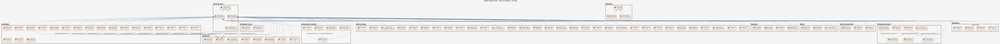</a>

#### Pakke: Administrative_områder

<a href="dgif-beredskap_feature_catalogue_Administrative_omr_der.png" title="Klikk for stor visning">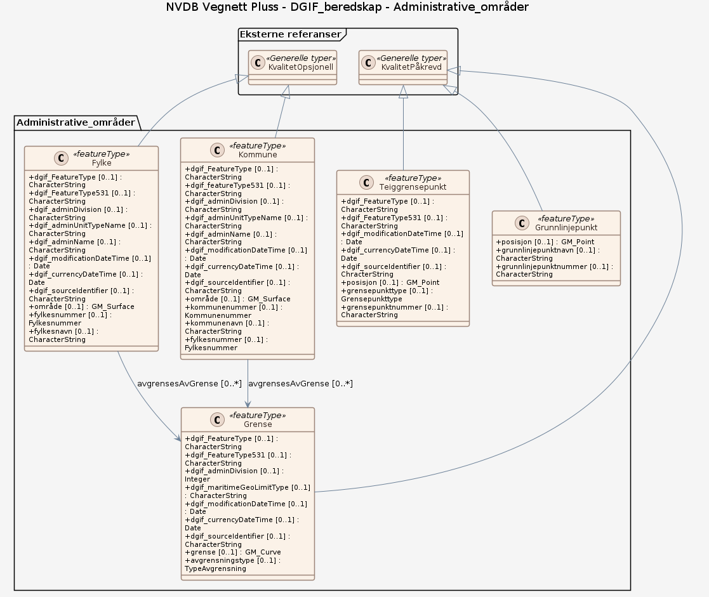</a>

#### Pakke: Arealdekke

<a href="dgif-beredskap_feature_catalogue_Arealdekke.png" title="Klikk for stor visning">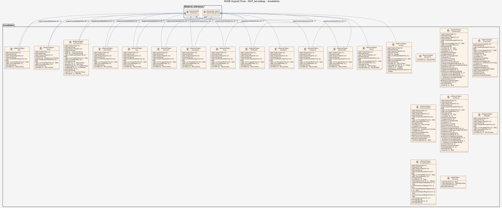</a>

#### Pakke: Arealdekke_øvrige

<a href="dgif-beredskap_feature_catalogue_Arealdekke__vrige.png" title="Klikk for stor visning">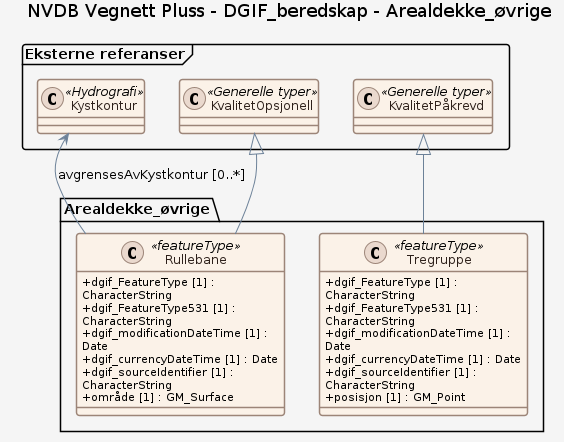</a>

#### Pakke: Byg_og_anlegg

<a href="dgif-beredskap_feature_catalogue_Byg_og_anlegg.png" title="Klikk for stor visning">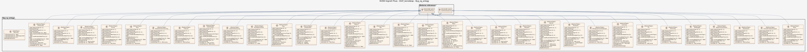</a>

#### Pakke: Bygninger

<a href="dgif-beredskap_feature_catalogue_Bygninger.png" title="Klikk for stor visning">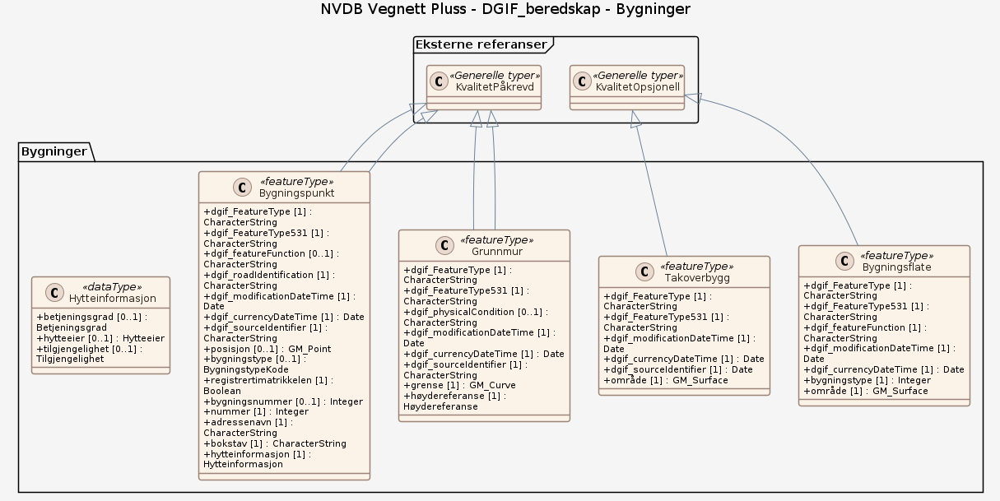</a>

#### Pakke: Generelle typer

<a href="dgif-beredskap_feature_catalogue_Generelle_typer.png" title="Klikk for stor visning">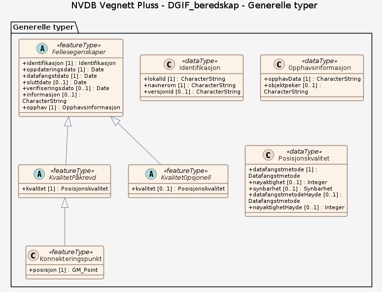</a>

#### Pakke: Hydrografi

<a href="dgif-beredskap_feature_catalogue_Hydrografi.png" title="Klikk for stor visning">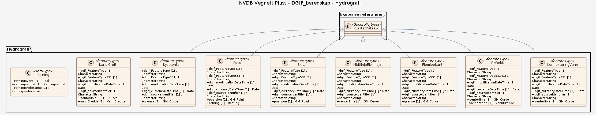</a>

#### Pakke: Høyde

<a href="dgif-beredskap_feature_catalogue_H_yde.png" title="Klikk for stor visning">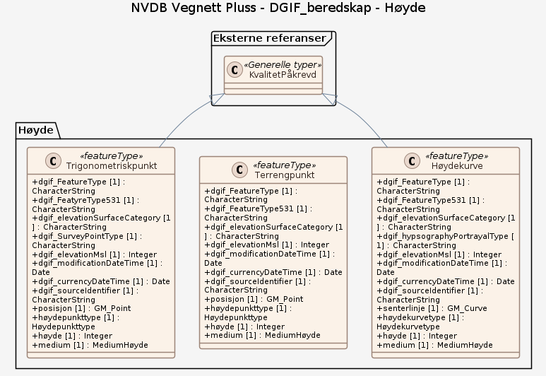</a>

#### Pakke: Interessepunkt (POI)

<a href="dgif-beredskap_feature_catalogue_Interessepunkt_POI.png" title="Klikk for stor visning">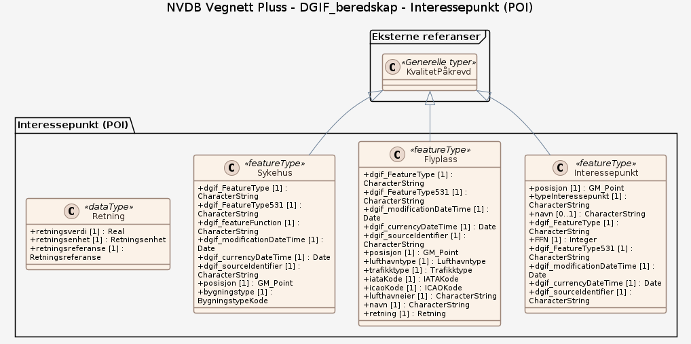</a>

#### Pakke: Restriksjonsområder

<a href="dgif-beredskap_feature_catalogue_Restriksjonsomr_der.png" title="Klikk for stor visning">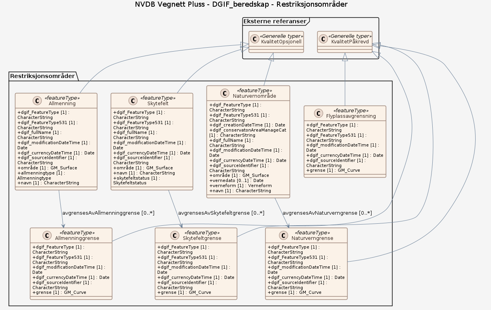</a>

#### Pakke: Samferdsel

<a href="dgif-beredskap_feature_catalogue_Samferdsel.png" title="Klikk for stor visning">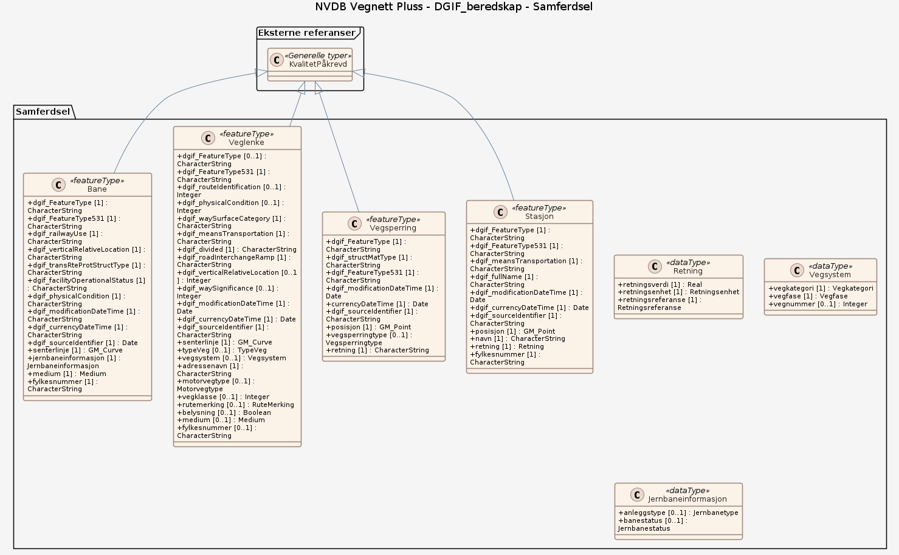</a>

#### Pakke: Stedsnavn

<a href="dgif-beredskap_feature_catalogue_Stedsnavn.png" title="Klikk for stor visning">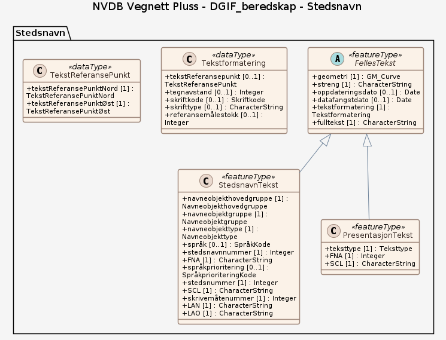</a>

#### Komplett diagram

<a href="dgif-beredskap_feature_catalogue.png" title="Klikk for stor visning">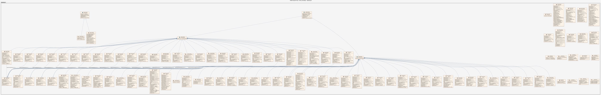</a>

#### Fellesegenskaper (abstrakt)

abstrakt objekttype som bærer sentrale egenskaper som er anbefalt for bruk i produktspesifikasjoner.

Egenskaper

<table class="feature-attribute-table">
  <colgroup>
    <col style="width: 35%;" />
    <col style="width: 65%;" />
  </colgroup>
  <tbody>
    <tr>
      <th scope="row">Navn:</th>
      <td><strong>identifikasjon</strong></td>
    </tr>
    <tr>
      <th scope="row">Definisjon:</th>
      <td>unik identifikasjon av et objekt</td>
    </tr>
    <tr>
      <th scope="row">Multiplisitet:</th>
      <td>1</td>
    </tr>
    <tr>
      <th scope="row">Type:</th>
      <td>Identifikasjon</td>
    </tr>
  </tbody>
</table>

<table class="feature-attribute-table">
  <colgroup>
    <col style="width: 35%;" />
    <col style="width: 65%;" />
  </colgroup>
  <tbody>
    <tr>
      <th scope="row">Navn:</th>
      <td><strong>identifikasjon.lokalId</strong></td>
    </tr>
    <tr>
      <th scope="row">Definisjon:</th>
      <td>lokal identifikator av et objekt  Merknad: Det er dataleverendørens ansvar å sørge for at den lokale identifikatoren er unik innenfor navnerommet.</td>
    </tr>
    <tr>
      <th scope="row">Multiplisitet:</th>
      <td>1</td>
    </tr>
    <tr>
      <th scope="row">Type:</th>
      <td>CharacterString</td>
    </tr>
  </tbody>
</table>

<table class="feature-attribute-table">
  <colgroup>
    <col style="width: 35%;" />
    <col style="width: 65%;" />
  </colgroup>
  <tbody>
    <tr>
      <th scope="row">Navn:</th>
      <td><strong>identifikasjon.navnerom</strong></td>
    </tr>
    <tr>
      <th scope="row">Definisjon:</th>
      <td>navnerom som unikt identifiserer datakilden til et objekt, anbefales å være en http-URI  Eksempel: <a href="http://data.geonorge.no/SentraltStedsnavnsregister/1.0">http://data.geonorge.no/SentraltStedsnavnsregister/1.0</a>  Merknad : Verdien for nanverom vil eies av den dataprodusent som har ansvar for de unike identifikatorene og må være registrert i data.geonorge.no eller data.norge.no</td>
    </tr>
    <tr>
      <th scope="row">Multiplisitet:</th>
      <td>1</td>
    </tr>
    <tr>
      <th scope="row">Type:</th>
      <td>CharacterString</td>
    </tr>
  </tbody>
</table>

<table class="feature-attribute-table">
  <colgroup>
    <col style="width: 35%;" />
    <col style="width: 65%;" />
  </colgroup>
  <tbody>
    <tr>
      <th scope="row">Navn:</th>
      <td><strong>identifikasjon.versjonId</strong></td>
    </tr>
    <tr>
      <th scope="row">Definisjon:</th>
      <td>identifikasjon av en spesiell versjon av et geografisk objekt (instans)</td>
    </tr>
    <tr>
      <th scope="row">Multiplisitet:</th>
      <td>0..1</td>
    </tr>
    <tr>
      <th scope="row">Type:</th>
      <td>CharacterString</td>
    </tr>
  </tbody>
</table>

<table class="feature-attribute-table">
  <colgroup>
    <col style="width: 35%;" />
    <col style="width: 65%;" />
  </colgroup>
  <tbody>
    <tr>
      <th scope="row">Navn:</th>
      <td><strong>oppdateringsdato</strong></td>
    </tr>
    <tr>
      <th scope="row">Definisjon:</th>
      <td>tidspunkt for siste endring på objektet</td>
    </tr>
    <tr>
      <th scope="row">Multiplisitet:</th>
      <td>1</td>
    </tr>
    <tr>
      <th scope="row">Type:</th>
      <td>DateTime</td>
    </tr>
  </tbody>
</table>

<table class="feature-attribute-table">
  <colgroup>
    <col style="width: 35%;" />
    <col style="width: 65%;" />
  </colgroup>
  <tbody>
    <tr>
      <th scope="row">Navn:</th>
      <td><strong>datafangstdato</strong></td>
    </tr>
    <tr>
      <th scope="row">Definisjon:</th>
      <td>dato når objektet siste gang ble registrert/observert/målt i terrenget</td>
    </tr>
    <tr>
      <th scope="row">Multiplisitet:</th>
      <td>1</td>
    </tr>
    <tr>
      <th scope="row">Type:</th>
      <td>Date</td>
    </tr>
  </tbody>
</table>

<table class="feature-attribute-table">
  <colgroup>
    <col style="width: 35%;" />
    <col style="width: 65%;" />
  </colgroup>
  <tbody>
    <tr>
      <th scope="row">Navn:</th>
      <td><strong>sluttdato</strong></td>
    </tr>
    <tr>
      <th scope="row">Definisjon:</th>
      <td>Tid for når denne versjonen av objektet var erstattet eller opphørt å eksistere.</td>
    </tr>
    <tr>
      <th scope="row">Multiplisitet:</th>
      <td>0..1</td>
    </tr>
    <tr>
      <th scope="row">Type:</th>
      <td>DateTime</td>
    </tr>
  </tbody>
</table>

<table class="feature-attribute-table">
  <colgroup>
    <col style="width: 35%;" />
    <col style="width: 65%;" />
  </colgroup>
  <tbody>
    <tr>
      <th scope="row">Navn:</th>
      <td><strong>verifiseringsdato</strong></td>
    </tr>
    <tr>
      <th scope="row">Definisjon:</th>
      <td>dato når dataene er fastslått å være i samsvar med virkeligheten.</td>
    </tr>
    <tr>
      <th scope="row">Multiplisitet:</th>
      <td>0..1</td>
    </tr>
    <tr>
      <th scope="row">Type:</th>
      <td>Date</td>
    </tr>
  </tbody>
</table>

<table class="feature-attribute-table">
  <colgroup>
    <col style="width: 35%;" />
    <col style="width: 65%;" />
  </colgroup>
  <tbody>
    <tr>
      <th scope="row">Navn:</th>
      <td><strong>informasjon</strong></td>
    </tr>
    <tr>
      <th scope="row">Definisjon:</th>
      <td>generell opplysning.</td>
    </tr>
    <tr>
      <th scope="row">Multiplisitet:</th>
      <td>0..1</td>
    </tr>
    <tr>
      <th scope="row">Type:</th>
      <td>CharacterString</td>
    </tr>
  </tbody>
</table>

<table class="feature-attribute-table">
  <colgroup>
    <col style="width: 35%;" />
    <col style="width: 65%;" />
  </colgroup>
  <tbody>
    <tr>
      <th scope="row">Navn:</th>
      <td><strong>opphav</strong></td>
    </tr>
    <tr>
      <th scope="row">Definisjon:</th>
      <td>referanse til opphavsmaterialet, kildematerialet, organisasjons/publiseringskilde  Merknad: Kan også beskrive navn på person og årsak til oppdatering</td>
    </tr>
    <tr>
      <th scope="row">Multiplisitet:</th>
      <td>1</td>
    </tr>
    <tr>
      <th scope="row">Type:</th>
      <td>Opphavsinformasjon</td>
    </tr>
  </tbody>
</table>

<table class="feature-attribute-table">
  <colgroup>
    <col style="width: 35%;" />
    <col style="width: 65%;" />
  </colgroup>
  <tbody>
    <tr>
      <th scope="row">Navn:</th>
      <td><strong>opphav.opphavData</strong></td>
    </tr>
    <tr>
      <th scope="row">Definisjon:</th>
      <td>kilde til kartdataobjekt  Eksempel: FKB-AR5, FKB-bygning eller N50 Kartdata</td>
    </tr>
    <tr>
      <th scope="row">Multiplisitet:</th>
      <td>1</td>
    </tr>
    <tr>
      <th scope="row">Type:</th>
      <td>CharacterString</td>
    </tr>
  </tbody>
</table>

<table class="feature-attribute-table">
  <colgroup>
    <col style="width: 35%;" />
    <col style="width: 65%;" />
  </colgroup>
  <tbody>
    <tr>
      <th scope="row">Navn:</th>
      <td><strong>opphav.objektpeker</strong></td>
    </tr>
    <tr>
      <th scope="row">Definisjon:</th>
      <td>arvet id fra opphavData</td>
    </tr>
    <tr>
      <th scope="row">Multiplisitet:</th>
      <td>0..1</td>
    </tr>
    <tr>
      <th scope="row">Type:</th>
      <td>CharacterString</td>
    </tr>
  </tbody>
</table>

#### KvalitetPåkrevd (abstrakt)

abstrakt objekttype med påkrevet kvalitetsangivelse

Egenskaper

<table class="feature-attribute-table">
  <colgroup>
    <col style="width: 35%;" />
    <col style="width: 65%;" />
  </colgroup>
  <tbody>
    <tr>
      <th scope="row">Navn:</th>
      <td><strong>kvalitet</strong></td>
    </tr>
    <tr>
      <th scope="row">Definisjon:</th>
      <td>beskrivelse av kvaliteten på stedfestingen  Merknad: Denne er identisk med ..KVALITET i tidligere versjoner av SOSI.</td>
    </tr>
    <tr>
      <th scope="row">Multiplisitet:</th>
      <td>1</td>
    </tr>
    <tr>
      <th scope="row">Type:</th>
      <td>Posisjonskvalitet</td>
    </tr>
  </tbody>
</table>

<table class="feature-attribute-table">
  <colgroup>
    <col style="width: 35%;" />
    <col style="width: 65%;" />
  </colgroup>
  <tbody>
    <tr>
      <th scope="row">Navn:</th>
      <td><strong>kvalitet.datafangstmetode</strong></td>
    </tr>
    <tr>
      <th scope="row">Definisjon:</th>
      <td>metode for datafangst. Egenskapen beskriver datafangstmetode for grunnrisskoordinater (x,y), eller for både grunnriss og høyde (x,y,z) dersom det ikke er oppgitt noen verdi for datafangstmetodeHøyde.</td>
    </tr>
    <tr>
      <th scope="row">Multiplisitet:</th>
      <td>1</td>
    </tr>
    <tr>
      <th scope="row">Type:</th>
      <td>Datafangstmetode</td>
    </tr>
    <tr>
      <th scope="row">Tillatte verdier:</th>
      <td>- Kodeliste: <a href="https://register.geonorge.no/sosi-kodelister/fkb/generell/5.0/datafangstmetode">https://register.geonorge.no/sosi-kodelister/fkb/generell/5.0/datafangstmetode</a></td>
    </tr>
  </tbody>
</table>

<table class="feature-attribute-table">
  <colgroup>
    <col style="width: 35%;" />
    <col style="width: 65%;" />
  </colgroup>
  <tbody>
    <tr>
      <th scope="row">Navn:</th>
      <td><strong>kvalitet.nøyaktighet</strong></td>
    </tr>
    <tr>
      <th scope="row">Definisjon:</th>
      <td>standardavviket til posisjoneringa av objektet oppgitt i cm  I de aller fleste sammenhenger benyttes en anslått eller forventet verdi for standardavvik, men dersom man har en beregnet verdi skal denne benyttes.  For objekter med punktgeometri benyttes verdi for punktstandardavvik. For objekter med kurvegeometri benyttes standardavviket for tverravviket fra kurva. For objekter med overflate- eller volumgeometri er forståelsen at standardavviket beregnes ut fra (3D) avvikene mellom sann posisjon og nærmeste punkt på overflata.  Merknad: Verdien er ment å beskrive nøyaktigheten til objektet sammenlignet med sann verdi. Standardavvik er i utgangspunktet et mål på det tilfeldige avviket og det innebærer at vi forutsetter at det systematiske avviket i liten grad påvirker nøyaktigheten til posisjoneringa. For fotogrammetriske data settes som hovedregel verdien lik kravet til standardavvik ved datafangst. Se standarden Geodatakvalitet for nærmere definisjon av standardavvik og hvordan dette defineres, beregnes og kontrolleres.</td>
    </tr>
    <tr>
      <th scope="row">Multiplisitet:</th>
      <td>0..1</td>
    </tr>
    <tr>
      <th scope="row">Type:</th>
      <td>Integer</td>
    </tr>
  </tbody>
</table>

<table class="feature-attribute-table">
  <colgroup>
    <col style="width: 35%;" />
    <col style="width: 65%;" />
  </colgroup>
  <tbody>
    <tr>
      <th scope="row">Navn:</th>
      <td><strong>kvalitet.synbarhet</strong></td>
    </tr>
    <tr>
      <th scope="row">Definisjon:</th>
      <td>beskrivelse av hvor godt objektene framgår i datagrunnlaget for posisjonering (f.eks. flybildene).</td>
    </tr>
    <tr>
      <th scope="row">Multiplisitet:</th>
      <td>0..1</td>
    </tr>
    <tr>
      <th scope="row">Type:</th>
      <td>Synbarhet</td>
    </tr>
    <tr>
      <th scope="row">Tillatte verdier:</th>
      <td>- Kodeliste: <a href="https://register.geonorge.no/sosi-kodelister/fkb/generell/5.0/synbarhet">https://register.geonorge.no/sosi-kodelister/fkb/generell/5.0/synbarhet</a></td>
    </tr>
  </tbody>
</table>

<table class="feature-attribute-table">
  <colgroup>
    <col style="width: 35%;" />
    <col style="width: 65%;" />
  </colgroup>
  <tbody>
    <tr>
      <th scope="row">Navn:</th>
      <td><strong>kvalitet.datafangstmetodeHøyde</strong></td>
    </tr>
    <tr>
      <th scope="row">Definisjon:</th>
      <td>metoden brukt for høyderegistrering av posisjon.  Det er bare nødvending å angi en verdi for egenskapen dersom datafangstmetode for høyde avviker fra datafangstmetode for grunnriss.</td>
    </tr>
    <tr>
      <th scope="row">Multiplisitet:</th>
      <td>0..1</td>
    </tr>
    <tr>
      <th scope="row">Type:</th>
      <td>Datafangstmetode</td>
    </tr>
    <tr>
      <th scope="row">Tillatte verdier:</th>
      <td>- Kodeliste: <a href="https://register.geonorge.no/sosi-kodelister/fkb/generell/5.0/datafangstmetode">https://register.geonorge.no/sosi-kodelister/fkb/generell/5.0/datafangstmetode</a></td>
    </tr>
  </tbody>
</table>

<table class="feature-attribute-table">
  <colgroup>
    <col style="width: 35%;" />
    <col style="width: 65%;" />
  </colgroup>
  <tbody>
    <tr>
      <th scope="row">Navn:</th>
      <td><strong>kvalitet.nøyaktighetHøyde</strong></td>
    </tr>
    <tr>
      <th scope="row">Definisjon:</th>
      <td>standardavviket til posisjoneringa av objektet oppgitt i cm  I de aller fleste sammenhenger benyttes en anslått eller forventet verdi for standardavviket, men dersom man faktisk har standardavviket til posisjoneringa av objektet oppgitt i cm  I de aller fleste sammenhenger benyttes en anslått eller forventet verdi for standardavvik, men dersom man har en beregnet verdi skal denne benyttes.  Merknad: Verdien er ment å beskrive nøyaktigheten til objektet sammenlignet med sann verdi. Standardavvik er i utgangspunktet et mål på det tilfeldige avviket og det innebærer at vi forutsetter at det systematiske avviket i liten grad påvirker nøyaktigheten til posisjoneringa. For fotogrammetriske data settes som hovedregel verdien lik kravet til standardavvik ved datafangst. Se standarden Geodatakvalitet for nærmere definisjon av standardavvik og hvordan dette defineres, beregnes og kontrolleres.</td>
    </tr>
    <tr>
      <th scope="row">Multiplisitet:</th>
      <td>0..1</td>
    </tr>
    <tr>
      <th scope="row">Type:</th>
      <td>Integer</td>
    </tr>
  </tbody>
</table>

Relasjoner

**Arv**
Fellesegenskaper

#### KvalitetOpsjonell (abstrakt)

abstrakt objekttype med valgfri kvalitetsangivelse

Egenskaper

<table class="feature-attribute-table">
  <colgroup>
    <col style="width: 35%;" />
    <col style="width: 65%;" />
  </colgroup>
  <tbody>
    <tr>
      <th scope="row">Navn:</th>
      <td><strong>kvalitet</strong></td>
    </tr>
    <tr>
      <th scope="row">Definisjon:</th>
      <td>beskrivelse av kvaliteten på stedfestingen  Merknad: Denne er identisk med ..KVALITET i tidligere versjoner av SOSI.</td>
    </tr>
    <tr>
      <th scope="row">Multiplisitet:</th>
      <td>0..1</td>
    </tr>
    <tr>
      <th scope="row">Type:</th>
      <td>Posisjonskvalitet</td>
    </tr>
  </tbody>
</table>

<table class="feature-attribute-table">
  <colgroup>
    <col style="width: 35%;" />
    <col style="width: 65%;" />
  </colgroup>
  <tbody>
    <tr>
      <th scope="row">Navn:</th>
      <td><strong>kvalitet.datafangstmetode</strong></td>
    </tr>
    <tr>
      <th scope="row">Definisjon:</th>
      <td>metode for datafangst. Egenskapen beskriver datafangstmetode for grunnrisskoordinater (x,y), eller for både grunnriss og høyde (x,y,z) dersom det ikke er oppgitt noen verdi for datafangstmetodeHøyde.</td>
    </tr>
    <tr>
      <th scope="row">Multiplisitet:</th>
      <td>1</td>
    </tr>
    <tr>
      <th scope="row">Type:</th>
      <td>Datafangstmetode</td>
    </tr>
    <tr>
      <th scope="row">Tillatte verdier:</th>
      <td>- Kodeliste: <a href="https://register.geonorge.no/sosi-kodelister/fkb/generell/5.0/datafangstmetode">https://register.geonorge.no/sosi-kodelister/fkb/generell/5.0/datafangstmetode</a></td>
    </tr>
  </tbody>
</table>

<table class="feature-attribute-table">
  <colgroup>
    <col style="width: 35%;" />
    <col style="width: 65%;" />
  </colgroup>
  <tbody>
    <tr>
      <th scope="row">Navn:</th>
      <td><strong>kvalitet.nøyaktighet</strong></td>
    </tr>
    <tr>
      <th scope="row">Definisjon:</th>
      <td>standardavviket til posisjoneringa av objektet oppgitt i cm  I de aller fleste sammenhenger benyttes en anslått eller forventet verdi for standardavvik, men dersom man har en beregnet verdi skal denne benyttes.  For objekter med punktgeometri benyttes verdi for punktstandardavvik. For objekter med kurvegeometri benyttes standardavviket for tverravviket fra kurva. For objekter med overflate- eller volumgeometri er forståelsen at standardavviket beregnes ut fra (3D) avvikene mellom sann posisjon og nærmeste punkt på overflata.  Merknad: Verdien er ment å beskrive nøyaktigheten til objektet sammenlignet med sann verdi. Standardavvik er i utgangspunktet et mål på det tilfeldige avviket og det innebærer at vi forutsetter at det systematiske avviket i liten grad påvirker nøyaktigheten til posisjoneringa. For fotogrammetriske data settes som hovedregel verdien lik kravet til standardavvik ved datafangst. Se standarden Geodatakvalitet for nærmere definisjon av standardavvik og hvordan dette defineres, beregnes og kontrolleres.</td>
    </tr>
    <tr>
      <th scope="row">Multiplisitet:</th>
      <td>0..1</td>
    </tr>
    <tr>
      <th scope="row">Type:</th>
      <td>Integer</td>
    </tr>
  </tbody>
</table>

<table class="feature-attribute-table">
  <colgroup>
    <col style="width: 35%;" />
    <col style="width: 65%;" />
  </colgroup>
  <tbody>
    <tr>
      <th scope="row">Navn:</th>
      <td><strong>kvalitet.synbarhet</strong></td>
    </tr>
    <tr>
      <th scope="row">Definisjon:</th>
      <td>beskrivelse av hvor godt objektene framgår i datagrunnlaget for posisjonering (f.eks. flybildene).</td>
    </tr>
    <tr>
      <th scope="row">Multiplisitet:</th>
      <td>0..1</td>
    </tr>
    <tr>
      <th scope="row">Type:</th>
      <td>Synbarhet</td>
    </tr>
    <tr>
      <th scope="row">Tillatte verdier:</th>
      <td>- Kodeliste: <a href="https://register.geonorge.no/sosi-kodelister/fkb/generell/5.0/synbarhet">https://register.geonorge.no/sosi-kodelister/fkb/generell/5.0/synbarhet</a></td>
    </tr>
  </tbody>
</table>

<table class="feature-attribute-table">
  <colgroup>
    <col style="width: 35%;" />
    <col style="width: 65%;" />
  </colgroup>
  <tbody>
    <tr>
      <th scope="row">Navn:</th>
      <td><strong>kvalitet.datafangstmetodeHøyde</strong></td>
    </tr>
    <tr>
      <th scope="row">Definisjon:</th>
      <td>metoden brukt for høyderegistrering av posisjon.  Det er bare nødvending å angi en verdi for egenskapen dersom datafangstmetode for høyde avviker fra datafangstmetode for grunnriss.</td>
    </tr>
    <tr>
      <th scope="row">Multiplisitet:</th>
      <td>0..1</td>
    </tr>
    <tr>
      <th scope="row">Type:</th>
      <td>Datafangstmetode</td>
    </tr>
    <tr>
      <th scope="row">Tillatte verdier:</th>
      <td>- Kodeliste: <a href="https://register.geonorge.no/sosi-kodelister/fkb/generell/5.0/datafangstmetode">https://register.geonorge.no/sosi-kodelister/fkb/generell/5.0/datafangstmetode</a></td>
    </tr>
  </tbody>
</table>

<table class="feature-attribute-table">
  <colgroup>
    <col style="width: 35%;" />
    <col style="width: 65%;" />
  </colgroup>
  <tbody>
    <tr>
      <th scope="row">Navn:</th>
      <td><strong>kvalitet.nøyaktighetHøyde</strong></td>
    </tr>
    <tr>
      <th scope="row">Definisjon:</th>
      <td>standardavviket til posisjoneringa av objektet oppgitt i cm  I de aller fleste sammenhenger benyttes en anslått eller forventet verdi for standardavviket, men dersom man faktisk har standardavviket til posisjoneringa av objektet oppgitt i cm  I de aller fleste sammenhenger benyttes en anslått eller forventet verdi for standardavvik, men dersom man har en beregnet verdi skal denne benyttes.  Merknad: Verdien er ment å beskrive nøyaktigheten til objektet sammenlignet med sann verdi. Standardavvik er i utgangspunktet et mål på det tilfeldige avviket og det innebærer at vi forutsetter at det systematiske avviket i liten grad påvirker nøyaktigheten til posisjoneringa. For fotogrammetriske data settes som hovedregel verdien lik kravet til standardavvik ved datafangst. Se standarden Geodatakvalitet for nærmere definisjon av standardavvik og hvordan dette defineres, beregnes og kontrolleres.</td>
    </tr>
    <tr>
      <th scope="row">Multiplisitet:</th>
      <td>0..1</td>
    </tr>
    <tr>
      <th scope="row">Type:</th>
      <td>Integer</td>
    </tr>
  </tbody>
</table>

Relasjoner

**Arv**
Fellesegenskaper

#### Konnekteringspunkt

punkter for temaene kraftlinjer, veger, stier, bygninger, jernbane, elver, innsjøkontur og enkelte midtlinjer for innsjøer og elver som krysser riksgrensen mellom Norge og Sverige.  Merknad:  Dataene for de respektive landene kan da settes sammen slik at man får et godt kartbilde. Det er de nasjonale kartverkene i Sverige og Norge som vedlikeholder datasettet. Kilde for endringer er fotogrammetrisk konstruksjon og digitalisering fra ortofoto.

Egenskaper

<table class="feature-attribute-table">
  <colgroup>
    <col style="width: 35%;" />
    <col style="width: 65%;" />
  </colgroup>
  <tbody>
    <tr>
      <th scope="row">Navn:</th>
      <td><strong>posisjon</strong></td>
    </tr>
    <tr>
      <th scope="row">Definisjon:</th>
      <td>konnekteringspunktets posisjon</td>
    </tr>
    <tr>
      <th scope="row">Multiplisitet:</th>
      <td>1</td>
    </tr>
    <tr>
      <th scope="row">Type:</th>
      <td>GM_Point</td>
    </tr>
  </tbody>
</table>

Relasjoner

**Arv**
KvalitetPåkrevd

#### Teiggrensepunkt

koordinatbestemt punkt som er påvist, beskrevet og/eller markert spesielt i den geografiske avgrensinga av teigen

Egenskaper

<table class="feature-attribute-table">
  <colgroup>
    <col style="width: 35%;" />
    <col style="width: 65%;" />
  </colgroup>
  <tbody>
    <tr>
      <th scope="row">Navn:</th>
      <td><strong>dgif_FeatureType</strong></td>
    </tr>
    <tr>
      <th scope="row">Definisjon:</th>
      <td>Alpha Code: A code consisting of the short name: upper camel case for feature types (e.g. GeneralBuilding) and lower camel case for attributes and values EXAMPLE: transportationSystemType.</td>
    </tr>
    <tr>
      <th scope="row">Multiplisitet:</th>
      <td>0..1</td>
    </tr>
    <tr>
      <th scope="row">Type:</th>
      <td>CharacterString</td>
    </tr>
  </tbody>
</table>

<table class="feature-attribute-table">
  <colgroup>
    <col style="width: 35%;" />
    <col style="width: 65%;" />
  </colgroup>
  <tbody>
    <tr>
      <th scope="row">Navn:</th>
      <td><strong>dgif_FeatureType531</strong></td>
    </tr>
    <tr>
      <th scope="row">Definisjon:</th>
      <td>531 Code: A code consisting of 5 characters (2 letters and 3 numbers) for feature types.</td>
    </tr>
    <tr>
      <th scope="row">Multiplisitet:</th>
      <td>0..1</td>
    </tr>
    <tr>
      <th scope="row">Type:</th>
      <td>CharacterString</td>
    </tr>
  </tbody>
</table>

<table class="feature-attribute-table">
  <colgroup>
    <col style="width: 35%;" />
    <col style="width: 65%;" />
  </colgroup>
  <tbody>
    <tr>
      <th scope="row">Navn:</th>
      <td><strong>dgif_modificationDateTime</strong></td>
    </tr>
    <tr>
      <th scope="row">Definisjon:</th>
      <td>The date and, optionally, time when a digital representation (for example: of a feature or a geographic name) was created or modified.</td>
    </tr>
    <tr>
      <th scope="row">Multiplisitet:</th>
      <td>0..1</td>
    </tr>
    <tr>
      <th scope="row">Type:</th>
      <td>Date</td>
    </tr>
  </tbody>
</table>

<table class="feature-attribute-table">
  <colgroup>
    <col style="width: 35%;" />
    <col style="width: 65%;" />
  </colgroup>
  <tbody>
    <tr>
      <th scope="row">Navn:</th>
      <td><strong>dgif_currencyDateTime</strong></td>
    </tr>
    <tr>
      <th scope="row">Definisjon:</th>
      <td>The date and, optionally, time assigned to a data set (for example: the digital representation of a single feature or a set of features) as a whole that provides an overall assessment of its currency.</td>
    </tr>
    <tr>
      <th scope="row">Multiplisitet:</th>
      <td>0..1</td>
    </tr>
    <tr>
      <th scope="row">Type:</th>
      <td>Date</td>
    </tr>
  </tbody>
</table>

<table class="feature-attribute-table">
  <colgroup>
    <col style="width: 35%;" />
    <col style="width: 65%;" />
  </colgroup>
  <tbody>
    <tr>
      <th scope="row">Navn:</th>
      <td><strong>dgif_sourceIdentifier</strong></td>
    </tr>
    <tr>
      <th scope="row">Definisjon:</th>
      <td>The identifier of the source data set that was used to define the digital representation of the feature or data set.</td>
    </tr>
    <tr>
      <th scope="row">Multiplisitet:</th>
      <td>0..1</td>
    </tr>
    <tr>
      <th scope="row">Type:</th>
      <td>ChracterString</td>
    </tr>
  </tbody>
</table>

<table class="feature-attribute-table">
  <colgroup>
    <col style="width: 35%;" />
    <col style="width: 65%;" />
  </colgroup>
  <tbody>
    <tr>
      <th scope="row">Navn:</th>
      <td><strong>posisjon</strong></td>
    </tr>
    <tr>
      <th scope="row">Definisjon:</th>
      <td>sted som objektet eksisterer på</td>
    </tr>
    <tr>
      <th scope="row">Multiplisitet:</th>
      <td>0..1</td>
    </tr>
    <tr>
      <th scope="row">Type:</th>
      <td>GM_Point</td>
    </tr>
  </tbody>
</table>

<table class="feature-attribute-table">
  <colgroup>
    <col style="width: 35%;" />
    <col style="width: 65%;" />
  </colgroup>
  <tbody>
    <tr>
      <th scope="row">Navn:</th>
      <td><strong>grensepunkttype</strong></td>
    </tr>
    <tr>
      <th scope="row">Definisjon:</th>
      <td>angivelse av hva slags grensemerke som er brukt i terrenget. Sier også om grensepunktet er merket i terrenget, eller om det bare er et registreringsteknisk punkt.</td>
    </tr>
    <tr>
      <th scope="row">Multiplisitet:</th>
      <td>0..1</td>
    </tr>
    <tr>
      <th scope="row">Type:</th>
      <td>Grensepunkttype</td>
    </tr>
    <tr>
      <th scope="row">Tillatte verdier:</th>
      <td>- Kodeliste: <a href="https://register.geonorge.no/sosi-kodelister/kartdata/grensepunkttype">https://register.geonorge.no/sosi-kodelister/kartdata/grensepunkttype</a></td>
    </tr>
  </tbody>
</table>

<table class="feature-attribute-table">
  <colgroup>
    <col style="width: 35%;" />
    <col style="width: 65%;" />
  </colgroup>
  <tbody>
    <tr>
      <th scope="row">Navn:</th>
      <td><strong>grensepunktnummer</strong></td>
    </tr>
    <tr>
      <th scope="row">Definisjon:</th>
      <td>Kommunens nummerering av grensepunkt</td>
    </tr>
    <tr>
      <th scope="row">Multiplisitet:</th>
      <td>0..1</td>
    </tr>
    <tr>
      <th scope="row">Type:</th>
      <td>CharacterString</td>
    </tr>
  </tbody>
</table>

Relasjoner

**Arv**
KvalitetPåkrevd

#### Fylke

administrativ inndeling av nasjonen på regionalt nivå  Merknad: Tilsvarer NUTS 3 på internasjonalt statistisk nivå

Egenskaper

<table class="feature-attribute-table">
  <colgroup>
    <col style="width: 35%;" />
    <col style="width: 65%;" />
  </colgroup>
  <tbody>
    <tr>
      <th scope="row">Navn:</th>
      <td><strong>dgif_FeatureType</strong></td>
    </tr>
    <tr>
      <th scope="row">Definisjon:</th>
      <td>Alpha Code: A code consisting of the short name: upper camel case for feature types (e.g. GeneralBuilding) and lower camel case for attributes and values EXAMPLE: transportationSystemType.</td>
    </tr>
    <tr>
      <th scope="row">Multiplisitet:</th>
      <td>0..1</td>
    </tr>
    <tr>
      <th scope="row">Type:</th>
      <td>CharacterString</td>
    </tr>
  </tbody>
</table>

<table class="feature-attribute-table">
  <colgroup>
    <col style="width: 35%;" />
    <col style="width: 65%;" />
  </colgroup>
  <tbody>
    <tr>
      <th scope="row">Navn:</th>
      <td><strong>dgif_FeatureType531</strong></td>
    </tr>
    <tr>
      <th scope="row">Definisjon:</th>
      <td>531 Code: A code consisting of 5 characters (2 letters and 3 numbers) for feature types.</td>
    </tr>
    <tr>
      <th scope="row">Multiplisitet:</th>
      <td>0..1</td>
    </tr>
    <tr>
      <th scope="row">Type:</th>
      <td>CharacterString</td>
    </tr>
  </tbody>
</table>

<table class="feature-attribute-table">
  <colgroup>
    <col style="width: 35%;" />
    <col style="width: 65%;" />
  </colgroup>
  <tbody>
    <tr>
      <th scope="row">Navn:</th>
      <td><strong>dgif_adminDivision</strong></td>
    </tr>
    <tr>
      <th scope="row">Definisjon:</th>
      <td>The nature of an administrative division as established by an international body (for example: the United Nations), a supranational body (for example: the European Union), a State (for example: France), or a similar entity (for example: the Vatican) or organization (for example: the International Hydrographic Organization).</td>
    </tr>
    <tr>
      <th scope="row">Multiplisitet:</th>
      <td>0..1</td>
    </tr>
    <tr>
      <th scope="row">Type:</th>
      <td>CharacterString</td>
    </tr>
  </tbody>
</table>

<table class="feature-attribute-table">
  <colgroup>
    <col style="width: 35%;" />
    <col style="width: 65%;" />
  </colgroup>
  <tbody>
    <tr>
      <th scope="row">Navn:</th>
      <td><strong>dgif_adminUnitTypeName</strong></td>
    </tr>
    <tr>
      <th scope="row">Definisjon:</th>
      <td>A name of a geopolitical entity or administrative division that may not have a formally standardized name (for example: in accordance with US Federal Information Processing Standards (FIPS) or the International Organization for Standards (ISO)).</td>
    </tr>
    <tr>
      <th scope="row">Multiplisitet:</th>
      <td>0..1</td>
    </tr>
    <tr>
      <th scope="row">Type:</th>
      <td>CharacterString</td>
    </tr>
  </tbody>
</table>

<table class="feature-attribute-table">
  <colgroup>
    <col style="width: 35%;" />
    <col style="width: 65%;" />
  </colgroup>
  <tbody>
    <tr>
      <th scope="row">Navn:</th>
      <td><strong>dgif_adminName</strong></td>
    </tr>
    <tr>
      <th scope="row">Definisjon:</th>
      <td>-- Definition -- A name of a geopolitical entity or administrative division that may not have a formally standardized name (for example: in accordance with US Federal Information Processing Standards (FIPS) or the International Organization for Standards (ISO)). -- Description -- It is usually a conventional 'generally known as' name in common use.</td>
    </tr>
    <tr>
      <th scope="row">Multiplisitet:</th>
      <td>0..1</td>
    </tr>
    <tr>
      <th scope="row">Type:</th>
      <td>CharacterString</td>
    </tr>
  </tbody>
</table>

<table class="feature-attribute-table">
  <colgroup>
    <col style="width: 35%;" />
    <col style="width: 65%;" />
  </colgroup>
  <tbody>
    <tr>
      <th scope="row">Navn:</th>
      <td><strong>dgif_modificationDateTime</strong></td>
    </tr>
    <tr>
      <th scope="row">Definisjon:</th>
      <td>The date and, optionally, time when a digital representation (for example: of a feature or a geographic name) was created or modified.</td>
    </tr>
    <tr>
      <th scope="row">Multiplisitet:</th>
      <td>0..1</td>
    </tr>
    <tr>
      <th scope="row">Type:</th>
      <td>Date</td>
    </tr>
  </tbody>
</table>

<table class="feature-attribute-table">
  <colgroup>
    <col style="width: 35%;" />
    <col style="width: 65%;" />
  </colgroup>
  <tbody>
    <tr>
      <th scope="row">Navn:</th>
      <td><strong>dgif_currencyDateTime</strong></td>
    </tr>
    <tr>
      <th scope="row">Definisjon:</th>
      <td>The date and, optionally, time assigned to a data set (for example: the digital representation of a single feature or a set of features) as a whole that provides an overall assessment of its currency.</td>
    </tr>
    <tr>
      <th scope="row">Multiplisitet:</th>
      <td>0..1</td>
    </tr>
    <tr>
      <th scope="row">Type:</th>
      <td>Date</td>
    </tr>
  </tbody>
</table>

<table class="feature-attribute-table">
  <colgroup>
    <col style="width: 35%;" />
    <col style="width: 65%;" />
  </colgroup>
  <tbody>
    <tr>
      <th scope="row">Navn:</th>
      <td><strong>dgif_sourceIdentifier</strong></td>
    </tr>
    <tr>
      <th scope="row">Definisjon:</th>
      <td>The identifier of the source data set that was used to define the digital representation of the feature or data set.</td>
    </tr>
    <tr>
      <th scope="row">Multiplisitet:</th>
      <td>0..1</td>
    </tr>
    <tr>
      <th scope="row">Type:</th>
      <td>CharacterString</td>
    </tr>
  </tbody>
</table>

<table class="feature-attribute-table">
  <colgroup>
    <col style="width: 35%;" />
    <col style="width: 65%;" />
  </colgroup>
  <tbody>
    <tr>
      <th scope="row">Navn:</th>
      <td><strong>område</strong></td>
    </tr>
    <tr>
      <th scope="row">Definisjon:</th>
      <td>den geografiske avgrensingen av stemmekretsen.</td>
    </tr>
    <tr>
      <th scope="row">Multiplisitet:</th>
      <td>0..1</td>
    </tr>
    <tr>
      <th scope="row">Type:</th>
      <td>GM_Surface</td>
    </tr>
  </tbody>
</table>

<table class="feature-attribute-table">
  <colgroup>
    <col style="width: 35%;" />
    <col style="width: 65%;" />
  </colgroup>
  <tbody>
    <tr>
      <th scope="row">Navn:</th>
      <td><strong>fylkesnummer</strong></td>
    </tr>
    <tr>
      <th scope="row">Definisjon:</th>
      <td>nummerering av fylker i henhold til Statistisk sentralbyrå sin offisielle liste  Merknad: Det presiseres at fylkesnummer alltid skal ha 2 sifre, dvs. eventuelt med ledende null. Fylkesnummer benyttes for kopling mot en rekke andre registre som også benytter 2 sifre.</td>
    </tr>
    <tr>
      <th scope="row">Multiplisitet:</th>
      <td>0..1</td>
    </tr>
    <tr>
      <th scope="row">Type:</th>
      <td>Fylkesnummer</td>
    </tr>
    <tr>
      <th scope="row">Tillatte verdier:</th>
      <td>- Kodeliste: <a href="https://register.geonorge.no/sosi-kodelister/inndelinger/inndelingsbase/fylkesnummer">https://register.geonorge.no/sosi-kodelister/inndelinger/inndelingsbase/fylkesnummer</a></td>
    </tr>
  </tbody>
</table>

<table class="feature-attribute-table">
  <colgroup>
    <col style="width: 35%;" />
    <col style="width: 65%;" />
  </colgroup>
  <tbody>
    <tr>
      <th scope="row">Navn:</th>
      <td><strong>fylkesnavn</strong></td>
    </tr>
    <tr>
      <th scope="row">Definisjon:</th>
      <td>Offisielt navn på et fylke. Merk: Hvis fylket har flere vedtatte parallellnavn, framstår disse i en sammenhengende tekststreng.</td>
    </tr>
    <tr>
      <th scope="row">Multiplisitet:</th>
      <td>0..1</td>
    </tr>
    <tr>
      <th scope="row">Type:</th>
      <td>CharacterString</td>
    </tr>
  </tbody>
</table>

Relasjoner

**Arv**
KvalitetOpsjonell

**Assosiasjoner**
Grense – rolle: avgrensesAvGrense – kardinalitet: 0..*

#### Kommune

inndeling i administrative og politiske enheter innenfor fylket  Merknad: Tilsvarer NUTS 5 og LAU 2 på internasjonalt statistisk nivå

Egenskaper

<table class="feature-attribute-table">
  <colgroup>
    <col style="width: 35%;" />
    <col style="width: 65%;" />
  </colgroup>
  <tbody>
    <tr>
      <th scope="row">Navn:</th>
      <td><strong>dgif_FeatureType</strong></td>
    </tr>
    <tr>
      <th scope="row">Definisjon:</th>
      <td>Alpha Code: A code consisting of the short name: upper camel case for feature types (e.g. GeneralBuilding) and lower camel case for attributes and values EXAMPLE: transportationSystemType.</td>
    </tr>
    <tr>
      <th scope="row">Multiplisitet:</th>
      <td>0..1</td>
    </tr>
    <tr>
      <th scope="row">Type:</th>
      <td>CharacterString</td>
    </tr>
  </tbody>
</table>

<table class="feature-attribute-table">
  <colgroup>
    <col style="width: 35%;" />
    <col style="width: 65%;" />
  </colgroup>
  <tbody>
    <tr>
      <th scope="row">Navn:</th>
      <td><strong>dgif_featureType531</strong></td>
    </tr>
    <tr>
      <th scope="row">Definisjon:</th>
      <td>531 Code: A code consisting of 5 characters (2 letters and 3 numbers) for feature types.</td>
    </tr>
    <tr>
      <th scope="row">Multiplisitet:</th>
      <td>0..1</td>
    </tr>
    <tr>
      <th scope="row">Type:</th>
      <td>CharacterString</td>
    </tr>
  </tbody>
</table>

<table class="feature-attribute-table">
  <colgroup>
    <col style="width: 35%;" />
    <col style="width: 65%;" />
  </colgroup>
  <tbody>
    <tr>
      <th scope="row">Navn:</th>
      <td><strong>dgif_adminDivision</strong></td>
    </tr>
    <tr>
      <th scope="row">Multiplisitet:</th>
      <td>0..1</td>
    </tr>
    <tr>
      <th scope="row">Type:</th>
      <td>CharacterString</td>
    </tr>
  </tbody>
</table>

<table class="feature-attribute-table">
  <colgroup>
    <col style="width: 35%;" />
    <col style="width: 65%;" />
  </colgroup>
  <tbody>
    <tr>
      <th scope="row">Navn:</th>
      <td><strong>dgif_adminUnitTypeName</strong></td>
    </tr>
    <tr>
      <th scope="row">Definisjon:</th>
      <td>The nature of an administrative division as established by an international body (for example: the United Nations), a supranational body (for example: the European Union), a State (for example: France), or a similar entity (for example: the Vatican) or organization (for example: the International Hydrographic Organization).</td>
    </tr>
    <tr>
      <th scope="row">Multiplisitet:</th>
      <td>0..1</td>
    </tr>
    <tr>
      <th scope="row">Type:</th>
      <td>CharacterString</td>
    </tr>
  </tbody>
</table>

<table class="feature-attribute-table">
  <colgroup>
    <col style="width: 35%;" />
    <col style="width: 65%;" />
  </colgroup>
  <tbody>
    <tr>
      <th scope="row">Navn:</th>
      <td><strong>dgif_adminName</strong></td>
    </tr>
    <tr>
      <th scope="row">Definisjon:</th>
      <td>-- Definition -- A name of a geopolitical entity or administrative division that may not have a formally standardized name (for example: in accordance with US Federal Information Processing Standards (FIPS) or the International Organization for Standards (ISO)). -- Description -- It is usually a conventional 'generally known as' name in common use.</td>
    </tr>
    <tr>
      <th scope="row">Multiplisitet:</th>
      <td>0..1</td>
    </tr>
    <tr>
      <th scope="row">Type:</th>
      <td>CharacterString</td>
    </tr>
  </tbody>
</table>

<table class="feature-attribute-table">
  <colgroup>
    <col style="width: 35%;" />
    <col style="width: 65%;" />
  </colgroup>
  <tbody>
    <tr>
      <th scope="row">Navn:</th>
      <td><strong>dgif_modificationDateTime</strong></td>
    </tr>
    <tr>
      <th scope="row">Definisjon:</th>
      <td>The date and, optionally, time when a digital representation (for example: of a feature or a geographic name) was created or modified.</td>
    </tr>
    <tr>
      <th scope="row">Multiplisitet:</th>
      <td>0..1</td>
    </tr>
    <tr>
      <th scope="row">Type:</th>
      <td>Date</td>
    </tr>
  </tbody>
</table>

<table class="feature-attribute-table">
  <colgroup>
    <col style="width: 35%;" />
    <col style="width: 65%;" />
  </colgroup>
  <tbody>
    <tr>
      <th scope="row">Navn:</th>
      <td><strong>dgif_currencyDateTime</strong></td>
    </tr>
    <tr>
      <th scope="row">Definisjon:</th>
      <td>The date and, optionally, time assigned to a data set (for example: the digital representation of a single feature or a set of features) as a whole that provides an overall assessment of its currency.</td>
    </tr>
    <tr>
      <th scope="row">Multiplisitet:</th>
      <td>0..1</td>
    </tr>
    <tr>
      <th scope="row">Type:</th>
      <td>Date</td>
    </tr>
  </tbody>
</table>

<table class="feature-attribute-table">
  <colgroup>
    <col style="width: 35%;" />
    <col style="width: 65%;" />
  </colgroup>
  <tbody>
    <tr>
      <th scope="row">Navn:</th>
      <td><strong>dgif_sourceIdentifier</strong></td>
    </tr>
    <tr>
      <th scope="row">Definisjon:</th>
      <td>The identifier of the source data set that was used to define the digital representation of the feature or data set.</td>
    </tr>
    <tr>
      <th scope="row">Multiplisitet:</th>
      <td>0..1</td>
    </tr>
    <tr>
      <th scope="row">Type:</th>
      <td>CharacterString</td>
    </tr>
  </tbody>
</table>

<table class="feature-attribute-table">
  <colgroup>
    <col style="width: 35%;" />
    <col style="width: 65%;" />
  </colgroup>
  <tbody>
    <tr>
      <th scope="row">Navn:</th>
      <td><strong>område</strong></td>
    </tr>
    <tr>
      <th scope="row">Definisjon:</th>
      <td>den geografiske avgrensingen av stemmekretsen.</td>
    </tr>
    <tr>
      <th scope="row">Multiplisitet:</th>
      <td>0..1</td>
    </tr>
    <tr>
      <th scope="row">Type:</th>
      <td>GM_Surface</td>
    </tr>
  </tbody>
</table>

<table class="feature-attribute-table">
  <colgroup>
    <col style="width: 35%;" />
    <col style="width: 65%;" />
  </colgroup>
  <tbody>
    <tr>
      <th scope="row">Navn:</th>
      <td><strong>kommunenummer</strong></td>
    </tr>
    <tr>
      <th scope="row">Definisjon:</th>
      <td>nummerering av kommuner i henhold til Statistisk sentralbyrå sin offisielle liste  Merknad: Det presiseres at kommune alltid skal ha 4 siffer, dvs. eventuelt med ledende null. Kommune benyttes for kopling mot en rekke andre registre som også benytter 4 siffer.</td>
    </tr>
    <tr>
      <th scope="row">Multiplisitet:</th>
      <td>0..1</td>
    </tr>
    <tr>
      <th scope="row">Type:</th>
      <td>Kommunenummer</td>
    </tr>
    <tr>
      <th scope="row">Tillatte verdier:</th>
      <td>- Kodeliste: <a href="https://register.geonorge.no/sosi-kodelister/inndelinger/inndelingsbase/kommunenummer">https://register.geonorge.no/sosi-kodelister/inndelinger/inndelingsbase/kommunenummer</a></td>
    </tr>
  </tbody>
</table>

<table class="feature-attribute-table">
  <colgroup>
    <col style="width: 35%;" />
    <col style="width: 65%;" />
  </colgroup>
  <tbody>
    <tr>
      <th scope="row">Navn:</th>
      <td><strong>kommunenavn</strong></td>
    </tr>
    <tr>
      <th scope="row">Definisjon:</th>
      <td>offisielt navn på kommunen</td>
    </tr>
    <tr>
      <th scope="row">Multiplisitet:</th>
      <td>0..1</td>
    </tr>
    <tr>
      <th scope="row">Type:</th>
      <td>CharacterString</td>
    </tr>
  </tbody>
</table>

<table class="feature-attribute-table">
  <colgroup>
    <col style="width: 35%;" />
    <col style="width: 65%;" />
  </colgroup>
  <tbody>
    <tr>
      <th scope="row">Navn:</th>
      <td><strong>fylkesnummer</strong></td>
    </tr>
    <tr>
      <th scope="row">Multiplisitet:</th>
      <td>0..1</td>
    </tr>
    <tr>
      <th scope="row">Type:</th>
      <td>Fylkesnummer</td>
    </tr>
    <tr>
      <th scope="row">Tillatte verdier:</th>
      <td>- Kodeliste: <a href="https://register.geonorge.no/sosi-kodelister/inndelinger/inndelingsbase/fylkesnummer">https://register.geonorge.no/sosi-kodelister/inndelinger/inndelingsbase/fylkesnummer</a></td>
    </tr>
  </tbody>
</table>

Relasjoner

**Arv**
KvalitetOpsjonell

**Assosiasjoner**
Grense – rolle: avgrensesAvGrense – kardinalitet: 0..*

#### Grense

Generell avgrensingslinje

Egenskaper

<table class="feature-attribute-table">
  <colgroup>
    <col style="width: 35%;" />
    <col style="width: 65%;" />
  </colgroup>
  <tbody>
    <tr>
      <th scope="row">Navn:</th>
      <td><strong>dgif_FeatureType</strong></td>
    </tr>
    <tr>
      <th scope="row">Definisjon:</th>
      <td>Alpha Code: A code consisting of the short name: upper camel case for feature types (e.g. GeneralBuilding) and lower camel case for attributes and values EXAMPLE: transportationSystemType.</td>
    </tr>
    <tr>
      <th scope="row">Multiplisitet:</th>
      <td>0..1</td>
    </tr>
    <tr>
      <th scope="row">Type:</th>
      <td>CharacterString</td>
    </tr>
  </tbody>
</table>

<table class="feature-attribute-table">
  <colgroup>
    <col style="width: 35%;" />
    <col style="width: 65%;" />
  </colgroup>
  <tbody>
    <tr>
      <th scope="row">Navn:</th>
      <td><strong>dgif_FeatureType531</strong></td>
    </tr>
    <tr>
      <th scope="row">Definisjon:</th>
      <td>531 Code: A code consisting of 5 characters (2 letters and 3 numbers) for feature types.</td>
    </tr>
    <tr>
      <th scope="row">Multiplisitet:</th>
      <td>0..1</td>
    </tr>
    <tr>
      <th scope="row">Type:</th>
      <td>CharacterString</td>
    </tr>
  </tbody>
</table>

<table class="feature-attribute-table">
  <colgroup>
    <col style="width: 35%;" />
    <col style="width: 65%;" />
  </colgroup>
  <tbody>
    <tr>
      <th scope="row">Navn:</th>
      <td><strong>dgif_adminDivision</strong></td>
    </tr>
    <tr>
      <th scope="row">Definisjon:</th>
      <td>The nature of an administrative division as established by an international body (for example: the United Nations), a supranational body (for example: the European Union), a State (for example: France), or a similar entity (for example: the Vatican) or organization (for example: the International Hydrographic Organization).</td>
    </tr>
    <tr>
      <th scope="row">Multiplisitet:</th>
      <td>0..1</td>
    </tr>
    <tr>
      <th scope="row">Type:</th>
      <td>Integer</td>
    </tr>
  </tbody>
</table>

<table class="feature-attribute-table">
  <colgroup>
    <col style="width: 35%;" />
    <col style="width: 65%;" />
  </colgroup>
  <tbody>
    <tr>
      <th scope="row">Navn:</th>
      <td><strong>dgif_maritimeGeoLimitType</strong></td>
    </tr>
    <tr>
      <th scope="row">Multiplisitet:</th>
      <td>0..1</td>
    </tr>
    <tr>
      <th scope="row">Type:</th>
      <td>CharacterString</td>
    </tr>
  </tbody>
</table>

<table class="feature-attribute-table">
  <colgroup>
    <col style="width: 35%;" />
    <col style="width: 65%;" />
  </colgroup>
  <tbody>
    <tr>
      <th scope="row">Navn:</th>
      <td><strong>dgif_modificationDateTime</strong></td>
    </tr>
    <tr>
      <th scope="row">Definisjon:</th>
      <td>The date and, optionally, time when a digital representation (for example: of a feature or a geographic name) was created or modified.</td>
    </tr>
    <tr>
      <th scope="row">Multiplisitet:</th>
      <td>0..1</td>
    </tr>
    <tr>
      <th scope="row">Type:</th>
      <td>Date</td>
    </tr>
  </tbody>
</table>

<table class="feature-attribute-table">
  <colgroup>
    <col style="width: 35%;" />
    <col style="width: 65%;" />
  </colgroup>
  <tbody>
    <tr>
      <th scope="row">Navn:</th>
      <td><strong>dgif_currencyDateTime</strong></td>
    </tr>
    <tr>
      <th scope="row">Definisjon:</th>
      <td>The date and, optionally, time assigned to a data set (for example: the digital representation of a single feature or a set of features) as a whole that provides an overall assessment of its currency.</td>
    </tr>
    <tr>
      <th scope="row">Multiplisitet:</th>
      <td>0..1</td>
    </tr>
    <tr>
      <th scope="row">Type:</th>
      <td>Date</td>
    </tr>
  </tbody>
</table>

<table class="feature-attribute-table">
  <colgroup>
    <col style="width: 35%;" />
    <col style="width: 65%;" />
  </colgroup>
  <tbody>
    <tr>
      <th scope="row">Navn:</th>
      <td><strong>dgif_sourceIdentifier</strong></td>
    </tr>
    <tr>
      <th scope="row">Definisjon:</th>
      <td>The identifier of the source data set that was used to define the digital representation of the feature or data set.</td>
    </tr>
    <tr>
      <th scope="row">Multiplisitet:</th>
      <td>0..1</td>
    </tr>
    <tr>
      <th scope="row">Type:</th>
      <td>CharacterString</td>
    </tr>
  </tbody>
</table>

<table class="feature-attribute-table">
  <colgroup>
    <col style="width: 35%;" />
    <col style="width: 65%;" />
  </colgroup>
  <tbody>
    <tr>
      <th scope="row">Navn:</th>
      <td><strong>grense</strong></td>
    </tr>
    <tr>
      <th scope="row">Definisjon:</th>
      <td>Geometri for avgrensingslinjer</td>
    </tr>
    <tr>
      <th scope="row">Multiplisitet:</th>
      <td>0..1</td>
    </tr>
    <tr>
      <th scope="row">Type:</th>
      <td>GM_Curve</td>
    </tr>
  </tbody>
</table>

<table class="feature-attribute-table">
  <colgroup>
    <col style="width: 35%;" />
    <col style="width: 65%;" />
  </colgroup>
  <tbody>
    <tr>
      <th scope="row">Navn:</th>
      <td><strong>avgrensningstype</strong></td>
    </tr>
    <tr>
      <th scope="row">Definisjon:</th>
      <td>angir type avgreisningslinje. Ulike objekter avgrenses av ulike typer grenser.</td>
    </tr>
    <tr>
      <th scope="row">Multiplisitet:</th>
      <td>0..1</td>
    </tr>
    <tr>
      <th scope="row">Type:</th>
      <td>TypeAvgrensning</td>
    </tr>
    <tr>
      <th scope="row">Tillatte verdier:</th>
      <td>- Kodeliste: <a href="https://register.geonorge.no/sosi-kodelister/topografisk-grunndatabase/type-avgrensning">https://register.geonorge.no/sosi-kodelister/topografisk-grunndatabase/type-avgrensning</a></td>
    </tr>
  </tbody>
</table>

Relasjoner

**Arv**
KvalitetPåkrevd

#### Grunnlinjepunkt

knekkpunkt på grunnlinjen

Egenskaper

<table class="feature-attribute-table">
  <colgroup>
    <col style="width: 35%;" />
    <col style="width: 65%;" />
  </colgroup>
  <tbody>
    <tr>
      <th scope="row">Navn:</th>
      <td><strong>posisjon</strong></td>
    </tr>
    <tr>
      <th scope="row">Definisjon:</th>
      <td>sted som objektet eksisterer på</td>
    </tr>
    <tr>
      <th scope="row">Multiplisitet:</th>
      <td>0..1</td>
    </tr>
    <tr>
      <th scope="row">Type:</th>
      <td>GM_Point</td>
    </tr>
  </tbody>
</table>

<table class="feature-attribute-table">
  <colgroup>
    <col style="width: 35%;" />
    <col style="width: 65%;" />
  </colgroup>
  <tbody>
    <tr>
      <th scope="row">Navn:</th>
      <td><strong>grunnlinjepunktnavn</strong></td>
    </tr>
    <tr>
      <th scope="row">Definisjon:</th>
      <td>angivelse av navn på grunnlinjen</td>
    </tr>
    <tr>
      <th scope="row">Multiplisitet:</th>
      <td>0..1</td>
    </tr>
    <tr>
      <th scope="row">Type:</th>
      <td>CharacterString</td>
    </tr>
  </tbody>
</table>

<table class="feature-attribute-table">
  <colgroup>
    <col style="width: 35%;" />
    <col style="width: 65%;" />
  </colgroup>
  <tbody>
    <tr>
      <th scope="row">Navn:</th>
      <td><strong>grunnlinjepunktnummer</strong></td>
    </tr>
    <tr>
      <th scope="row">Definisjon:</th>
      <td>angivelse av nummeret på grunnlinjen</td>
    </tr>
    <tr>
      <th scope="row">Multiplisitet:</th>
      <td>0..1</td>
    </tr>
    <tr>
      <th scope="row">Type:</th>
      <td>CharacterString</td>
    </tr>
  </tbody>
</table>

Relasjoner

**Arv**
KvalitetPåkrevd

#### IdrettsOmr

område hvor det utøves sport og idrett  *Kriterier:* Idrettsplass større enn 400 m² og bredere enn 5 meter skal med i N10 Beredskap. For motorsportanlegg se SpesiellDetalj.

Egenskaper

<table class="feature-attribute-table">
  <colgroup>
    <col style="width: 35%;" />
    <col style="width: 65%;" />
  </colgroup>
  <tbody>
    <tr>
      <th scope="row">Navn:</th>
      <td><strong>dgif_FeatureType</strong></td>
    </tr>
    <tr>
      <th scope="row">Definisjon:</th>
      <td>Alpha Code: A code consisting of the short name: upper camel case for feature types (e.g. GeneralBuilding) and lower camel case for attributes and values. EXAMPLE: transportationSystemType.</td>
    </tr>
    <tr>
      <th scope="row">Multiplisitet:</th>
      <td>1</td>
    </tr>
    <tr>
      <th scope="row">Type:</th>
      <td>CharacterString</td>
    </tr>
  </tbody>
</table>

<table class="feature-attribute-table">
  <colgroup>
    <col style="width: 35%;" />
    <col style="width: 65%;" />
  </colgroup>
  <tbody>
    <tr>
      <th scope="row">Navn:</th>
      <td><strong>dgif_FeatureType531</strong></td>
    </tr>
    <tr>
      <th scope="row">Definisjon:</th>
      <td>531 Code: A code consisting of 5 characters (2 letters and 3 numbers) for feature types.</td>
    </tr>
    <tr>
      <th scope="row">Multiplisitet:</th>
      <td>1</td>
    </tr>
    <tr>
      <th scope="row">Type:</th>
      <td>CharacterString</td>
    </tr>
  </tbody>
</table>

<table class="feature-attribute-table">
  <colgroup>
    <col style="width: 35%;" />
    <col style="width: 65%;" />
  </colgroup>
  <tbody>
    <tr>
      <th scope="row">Navn:</th>
      <td><strong>dgif_modificationDateTime</strong></td>
    </tr>
    <tr>
      <th scope="row">Definisjon:</th>
      <td>The date and, optionally, time when a digital representation (for example: of a feature or a geographic name) was created or modified.</td>
    </tr>
    <tr>
      <th scope="row">Multiplisitet:</th>
      <td>1</td>
    </tr>
    <tr>
      <th scope="row">Type:</th>
      <td>Date</td>
    </tr>
  </tbody>
</table>

<table class="feature-attribute-table">
  <colgroup>
    <col style="width: 35%;" />
    <col style="width: 65%;" />
  </colgroup>
  <tbody>
    <tr>
      <th scope="row">Navn:</th>
      <td><strong>dgif_currencyDateTime</strong></td>
    </tr>
    <tr>
      <th scope="row">Definisjon:</th>
      <td>The date and, optionally, time assigned to a data set (for example: the digital representation of a single feature or a set of features) as a whole that provides an overall assessment of its currency.</td>
    </tr>
    <tr>
      <th scope="row">Multiplisitet:</th>
      <td>1</td>
    </tr>
    <tr>
      <th scope="row">Type:</th>
      <td>Date</td>
    </tr>
  </tbody>
</table>

<table class="feature-attribute-table">
  <colgroup>
    <col style="width: 35%;" />
    <col style="width: 65%;" />
  </colgroup>
  <tbody>
    <tr>
      <th scope="row">Navn:</th>
      <td><strong>dgif_sourceIdentifier</strong></td>
    </tr>
    <tr>
      <th scope="row">Definisjon:</th>
      <td>The identifier of the source data set that was used to define the digital representation of the feature or data set.</td>
    </tr>
    <tr>
      <th scope="row">Multiplisitet:</th>
      <td>1</td>
    </tr>
    <tr>
      <th scope="row">Type:</th>
      <td>CharacterString</td>
    </tr>
  </tbody>
</table>

<table class="feature-attribute-table">
  <colgroup>
    <col style="width: 35%;" />
    <col style="width: 65%;" />
  </colgroup>
  <tbody>
    <tr>
      <th scope="row">Navn:</th>
      <td><strong>område</strong></td>
    </tr>
    <tr>
      <th scope="row">Definisjon:</th>
      <td>objektets utstrekning</td>
    </tr>
    <tr>
      <th scope="row">Multiplisitet:</th>
      <td>1</td>
    </tr>
    <tr>
      <th scope="row">Type:</th>
      <td>GM_Surface</td>
    </tr>
  </tbody>
</table>

Relasjoner

**Arv**
KvalitetOpsjonell

**Assosiasjoner**
Kystkontur – rolle: avgrensesAvKystkontur – kardinalitet: 0..*

#### Innsjø

en ferskvannsflate som ikke er renndende vann  *Kriterier:* Innsjøer og øyer over 100 m² og bredere enn 3 meter skal med i N10 Beredskap. Øyer i innsjø som er større enn 100 m² og bredere enn 3 meter skal med i N10 Beredskap. Innsjøer over 2 500 m² skal være påført løpenummer for innsjø (vatnLøpenummer). For alle oppdemte og regulerte innsjøer der reguleringen er i drift kodes innsjøen med egenskapen Regulert. Det skal tilstrebes at alle innsjøer skal ha egenskapen høyde. Høyden skal angis i hele meter.

Egenskaper

<table class="feature-attribute-table">
  <colgroup>
    <col style="width: 35%;" />
    <col style="width: 65%;" />
  </colgroup>
  <tbody>
    <tr>
      <th scope="row">Navn:</th>
      <td><strong>dgif_FeatureType</strong></td>
    </tr>
    <tr>
      <th scope="row">Definisjon:</th>
      <td>Alpha Code: A code consisting of the short name: upper camel case for feature types (e.g. GeneralBuilding) and lower camel case for attributes and values. EXAMPLE: transportationSystemType.</td>
    </tr>
    <tr>
      <th scope="row">Multiplisitet:</th>
      <td>1</td>
    </tr>
    <tr>
      <th scope="row">Type:</th>
      <td>CharacterString</td>
    </tr>
  </tbody>
</table>

<table class="feature-attribute-table">
  <colgroup>
    <col style="width: 35%;" />
    <col style="width: 65%;" />
  </colgroup>
  <tbody>
    <tr>
      <th scope="row">Navn:</th>
      <td><strong>dgif_FeatureType531</strong></td>
    </tr>
    <tr>
      <th scope="row">Definisjon:</th>
      <td>531 Code: A code consisting of 5 characters (2 letters and 3 numbers) for feature types.</td>
    </tr>
    <tr>
      <th scope="row">Multiplisitet:</th>
      <td>1</td>
    </tr>
    <tr>
      <th scope="row">Type:</th>
      <td>CharacterString</td>
    </tr>
  </tbody>
</table>

<table class="feature-attribute-table">
  <colgroup>
    <col style="width: 35%;" />
    <col style="width: 65%;" />
  </colgroup>
  <tbody>
    <tr>
      <th scope="row">Navn:</th>
      <td><strong>IWT</strong></td>
    </tr>
    <tr>
      <th scope="row">Definisjon:</th>
      <td>The type of an inland water based on its principal characteristics.</td>
    </tr>
    <tr>
      <th scope="row">Multiplisitet:</th>
      <td>1</td>
    </tr>
    <tr>
      <th scope="row">Type:</th>
      <td>Integer</td>
    </tr>
  </tbody>
</table>

<table class="feature-attribute-table">
  <colgroup>
    <col style="width: 35%;" />
    <col style="width: 65%;" />
  </colgroup>
  <tbody>
    <tr>
      <th scope="row">Navn:</th>
      <td><strong>dgif_modificationDateTime</strong></td>
    </tr>
    <tr>
      <th scope="row">Definisjon:</th>
      <td>The date and, optionally, time when a digital representation (for example: of a feature or a geographic name) was created or modified.</td>
    </tr>
    <tr>
      <th scope="row">Multiplisitet:</th>
      <td>1</td>
    </tr>
    <tr>
      <th scope="row">Type:</th>
      <td>Date</td>
    </tr>
  </tbody>
</table>

<table class="feature-attribute-table">
  <colgroup>
    <col style="width: 35%;" />
    <col style="width: 65%;" />
  </colgroup>
  <tbody>
    <tr>
      <th scope="row">Navn:</th>
      <td><strong>dgif_currencyDateTime</strong></td>
    </tr>
    <tr>
      <th scope="row">Definisjon:</th>
      <td>The date and, optionally, time assigned to a data set (for example: the digital representation of a single feature or a set of features) as a whole that provides an overall assessment of its currency.</td>
    </tr>
    <tr>
      <th scope="row">Multiplisitet:</th>
      <td>1</td>
    </tr>
    <tr>
      <th scope="row">Type:</th>
      <td>Date</td>
    </tr>
  </tbody>
</table>

<table class="feature-attribute-table">
  <colgroup>
    <col style="width: 35%;" />
    <col style="width: 65%;" />
  </colgroup>
  <tbody>
    <tr>
      <th scope="row">Navn:</th>
      <td><strong>dgif_sourceIdentifier</strong></td>
    </tr>
    <tr>
      <th scope="row">Definisjon:</th>
      <td>The identifier of the source data set that was used to define the digital representation of the feature or data set.</td>
    </tr>
    <tr>
      <th scope="row">Multiplisitet:</th>
      <td>1</td>
    </tr>
    <tr>
      <th scope="row">Type:</th>
      <td>CharacterString</td>
    </tr>
  </tbody>
</table>

<table class="feature-attribute-table">
  <colgroup>
    <col style="width: 35%;" />
    <col style="width: 65%;" />
  </colgroup>
  <tbody>
    <tr>
      <th scope="row">Navn:</th>
      <td><strong>område</strong></td>
    </tr>
    <tr>
      <th scope="row">Definisjon:</th>
      <td>objektets utstrekning</td>
    </tr>
    <tr>
      <th scope="row">Multiplisitet:</th>
      <td>1</td>
    </tr>
    <tr>
      <th scope="row">Type:</th>
      <td>GM_Surface</td>
    </tr>
  </tbody>
</table>

<table class="feature-attribute-table">
  <colgroup>
    <col style="width: 35%;" />
    <col style="width: 65%;" />
  </colgroup>
  <tbody>
    <tr>
      <th scope="row">Navn:</th>
      <td><strong>vatnLøpenummer</strong></td>
    </tr>
    <tr>
      <th scope="row">Definisjon:</th>
      <td>unik identifikasjon på innsjøer som fortløpende løpenummer i henhold til NVEs Innsjøregister</td>
    </tr>
    <tr>
      <th scope="row">Multiplisitet:</th>
      <td>0..1</td>
    </tr>
    <tr>
      <th scope="row">Type:</th>
      <td>Integer</td>
    </tr>
  </tbody>
</table>

<table class="feature-attribute-table">
  <colgroup>
    <col style="width: 35%;" />
    <col style="width: 65%;" />
  </colgroup>
  <tbody>
    <tr>
      <th scope="row">Navn:</th>
      <td><strong>høyde</strong></td>
    </tr>
    <tr>
      <th scope="row">Definisjon:</th>
      <td>registrert høyde for vannspeilet.</td>
    </tr>
    <tr>
      <th scope="row">Multiplisitet:</th>
      <td>0..1</td>
    </tr>
    <tr>
      <th scope="row">Type:</th>
      <td>Integer</td>
    </tr>
  </tbody>
</table>

<table class="feature-attribute-table">
  <colgroup>
    <col style="width: 35%;" />
    <col style="width: 65%;" />
  </colgroup>
  <tbody>
    <tr>
      <th scope="row">Navn:</th>
      <td><strong>regulert</strong></td>
    </tr>
    <tr>
      <th scope="row">Definisjon:</th>
      <td>angir om innsjø er oppdemt/regulert</td>
    </tr>
    <tr>
      <th scope="row">Multiplisitet:</th>
      <td>1</td>
    </tr>
    <tr>
      <th scope="row">Type:</th>
      <td>Boolean</td>
    </tr>
  </tbody>
</table>

<table class="feature-attribute-table">
  <colgroup>
    <col style="width: 35%;" />
    <col style="width: 65%;" />
  </colgroup>
  <tbody>
    <tr>
      <th scope="row">Navn:</th>
      <td><strong>lavesteRegulerteVannstand</strong></td>
    </tr>
    <tr>
      <th scope="row">Definisjon:</th>
      <td>laveste regulerte vannstand - LRV</td>
    </tr>
    <tr>
      <th scope="row">Multiplisitet:</th>
      <td>0..1</td>
    </tr>
    <tr>
      <th scope="row">Type:</th>
      <td>Integer</td>
    </tr>
  </tbody>
</table>

Relasjoner

**Arv**
KvalitetOpsjonell

#### Skog

Skog, delt inn i barskog, lauvskog og blandingsskog  *Kriterier:* Skogområder som er større enn 800 m² og bredere enn 10 meter skal med i N10 Beredskap. Skog som dekker hele øyer som er mindre enn minstemålet for skog, tas også med.

Egenskaper

<table class="feature-attribute-table">
  <colgroup>
    <col style="width: 35%;" />
    <col style="width: 65%;" />
  </colgroup>
  <tbody>
    <tr>
      <th scope="row">Navn:</th>
      <td><strong>dgif_FeatureType</strong></td>
    </tr>
    <tr>
      <th scope="row">Definisjon:</th>
      <td>Alpha Code: A code consisting of the short name: upper camel case for feature types (e.g. GeneralBuilding) and lower camel case for attributes and values. EXAMPLE: transportationSystemType.</td>
    </tr>
    <tr>
      <th scope="row">Multiplisitet:</th>
      <td>1</td>
    </tr>
    <tr>
      <th scope="row">Type:</th>
      <td>CharacterString</td>
    </tr>
  </tbody>
</table>

<table class="feature-attribute-table">
  <colgroup>
    <col style="width: 35%;" />
    <col style="width: 65%;" />
  </colgroup>
  <tbody>
    <tr>
      <th scope="row">Navn:</th>
      <td><strong>dgif_FeatureType531</strong></td>
    </tr>
    <tr>
      <th scope="row">Definisjon:</th>
      <td>531 Code: A code consisting of 5 characters (2 letters and 3 numbers) for feature types.</td>
    </tr>
    <tr>
      <th scope="row">Multiplisitet:</th>
      <td>1</td>
    </tr>
    <tr>
      <th scope="row">Type:</th>
      <td>CharacterString</td>
    </tr>
  </tbody>
</table>

<table class="feature-attribute-table">
  <colgroup>
    <col style="width: 35%;" />
    <col style="width: 65%;" />
  </colgroup>
  <tbody>
    <tr>
      <th scope="row">Navn:</th>
      <td><strong>treslag</strong></td>
    </tr>
    <tr>
      <th scope="row">Definisjon:</th>
      <td>inndeling etter fordeling av kronedekket mellom bartrær og lauvtrær</td>
    </tr>
    <tr>
      <th scope="row">Multiplisitet:</th>
      <td>1</td>
    </tr>
    <tr>
      <th scope="row">Type:</th>
      <td>ArealressursTreslag</td>
    </tr>
    <tr>
      <th scope="row">Tillatte verdier:</th>
      <td>- Kodeliste: <a href="https://register.geonorge.no/sosi-kodelister/fkb/ar5/5.0/arealressurstreslag">https://register.geonorge.no/sosi-kodelister/fkb/ar5/5.0/arealressurstreslag</a></td>
    </tr>
  </tbody>
</table>

<table class="feature-attribute-table">
  <colgroup>
    <col style="width: 35%;" />
    <col style="width: 65%;" />
  </colgroup>
  <tbody>
    <tr>
      <th scope="row">Navn:</th>
      <td><strong>dgif_modificationDateTime</strong></td>
    </tr>
    <tr>
      <th scope="row">Definisjon:</th>
      <td>The date and, optionally, time when a digital representation (for example: of a feature or a geographic name) was created or modified.</td>
    </tr>
    <tr>
      <th scope="row">Multiplisitet:</th>
      <td>1</td>
    </tr>
    <tr>
      <th scope="row">Type:</th>
      <td>Date</td>
    </tr>
  </tbody>
</table>

<table class="feature-attribute-table">
  <colgroup>
    <col style="width: 35%;" />
    <col style="width: 65%;" />
  </colgroup>
  <tbody>
    <tr>
      <th scope="row">Navn:</th>
      <td><strong>dgif_currencyDateTime</strong></td>
    </tr>
    <tr>
      <th scope="row">Definisjon:</th>
      <td>The date and, optionally, time assigned to a data set (for example: the digital representation of a single feature or a set of features) as a whole that provides an overall assessment of its currency.</td>
    </tr>
    <tr>
      <th scope="row">Multiplisitet:</th>
      <td>1</td>
    </tr>
    <tr>
      <th scope="row">Type:</th>
      <td>Date</td>
    </tr>
  </tbody>
</table>

<table class="feature-attribute-table">
  <colgroup>
    <col style="width: 35%;" />
    <col style="width: 65%;" />
  </colgroup>
  <tbody>
    <tr>
      <th scope="row">Navn:</th>
      <td><strong>dgif_sourceIdentifier</strong></td>
    </tr>
    <tr>
      <th scope="row">Definisjon:</th>
      <td>The identifier of the source data set that was used to define the digital representation of the feature or data set.</td>
    </tr>
    <tr>
      <th scope="row">Multiplisitet:</th>
      <td>1</td>
    </tr>
    <tr>
      <th scope="row">Type:</th>
      <td>CharacterString</td>
    </tr>
  </tbody>
</table>

<table class="feature-attribute-table">
  <colgroup>
    <col style="width: 35%;" />
    <col style="width: 65%;" />
  </colgroup>
  <tbody>
    <tr>
      <th scope="row">Navn:</th>
      <td><strong>område</strong></td>
    </tr>
    <tr>
      <th scope="row">Definisjon:</th>
      <td>objektets utstrekning</td>
    </tr>
    <tr>
      <th scope="row">Multiplisitet:</th>
      <td>1</td>
    </tr>
    <tr>
      <th scope="row">Type:</th>
      <td>GM_Surface</td>
    </tr>
  </tbody>
</table>

Relasjoner

**Arv**
KvalitetOpsjonell

**Assosiasjoner**
Kystkontur – rolle: avgrensesAvKystkontur – kardinalitet: 0..*

#### Elveflate

større vannvei for rennende vann representert ved flate  *Kriterier:* Elver bredere enn 3 meter og lengre enn 10 meter danner elveflater (flater med vannBredde 3 - 5). Øy i elv som er større enn 100 m² og bredere enn 5 meter skal med i N10 Beredskap.

Egenskaper

<table class="feature-attribute-table">
  <colgroup>
    <col style="width: 35%;" />
    <col style="width: 65%;" />
  </colgroup>
  <tbody>
    <tr>
      <th scope="row">Navn:</th>
      <td><strong>dgif_FeatureType</strong></td>
    </tr>
    <tr>
      <th scope="row">Definisjon:</th>
      <td>Alpha Code: A code consisting of the short name: upper camel case for feature types (e.g. GeneralBuilding) and lower camel case for attributes and values. EXAMPLE: transportationSystemType.</td>
    </tr>
    <tr>
      <th scope="row">Multiplisitet:</th>
      <td>1</td>
    </tr>
    <tr>
      <th scope="row">Type:</th>
      <td>CharacterString</td>
    </tr>
  </tbody>
</table>

<table class="feature-attribute-table">
  <colgroup>
    <col style="width: 35%;" />
    <col style="width: 65%;" />
  </colgroup>
  <tbody>
    <tr>
      <th scope="row">Navn:</th>
      <td><strong>dgif_FeatureType531</strong></td>
    </tr>
    <tr>
      <th scope="row">Definisjon:</th>
      <td>531 Code: A code consisting of 5 characters (2 letters and 3 numbers) for feature types.</td>
    </tr>
    <tr>
      <th scope="row">Multiplisitet:</th>
      <td>1</td>
    </tr>
    <tr>
      <th scope="row">Type:</th>
      <td>CharacterString</td>
    </tr>
  </tbody>
</table>

<table class="feature-attribute-table">
  <colgroup>
    <col style="width: 35%;" />
    <col style="width: 65%;" />
  </colgroup>
  <tbody>
    <tr>
      <th scope="row">Navn:</th>
      <td><strong>dgif_modificationDateTime</strong></td>
    </tr>
    <tr>
      <th scope="row">Definisjon:</th>
      <td>The date and, optionally, time when a digital representation (for example: of a feature or a geographic name) was created or modified.</td>
    </tr>
    <tr>
      <th scope="row">Multiplisitet:</th>
      <td>1</td>
    </tr>
    <tr>
      <th scope="row">Type:</th>
      <td>Date</td>
    </tr>
  </tbody>
</table>

<table class="feature-attribute-table">
  <colgroup>
    <col style="width: 35%;" />
    <col style="width: 65%;" />
  </colgroup>
  <tbody>
    <tr>
      <th scope="row">Navn:</th>
      <td><strong>dgif_currencyDateTime</strong></td>
    </tr>
    <tr>
      <th scope="row">Definisjon:</th>
      <td>The date and, optionally, time assigned to a data set (for example: the digital representation of a single feature or a set of features) as a whole that provides an overall assessment of its currency.</td>
    </tr>
    <tr>
      <th scope="row">Multiplisitet:</th>
      <td>1</td>
    </tr>
    <tr>
      <th scope="row">Type:</th>
      <td>Date</td>
    </tr>
  </tbody>
</table>

<table class="feature-attribute-table">
  <colgroup>
    <col style="width: 35%;" />
    <col style="width: 65%;" />
  </colgroup>
  <tbody>
    <tr>
      <th scope="row">Navn:</th>
      <td><strong>dgif_sourceIdentifier</strong></td>
    </tr>
    <tr>
      <th scope="row">Definisjon:</th>
      <td>The identifier of the source data set that was used to define the digital representation of the feature or data set.</td>
    </tr>
    <tr>
      <th scope="row">Multiplisitet:</th>
      <td>1</td>
    </tr>
    <tr>
      <th scope="row">Type:</th>
      <td>CharacterString</td>
    </tr>
  </tbody>
</table>

<table class="feature-attribute-table">
  <colgroup>
    <col style="width: 35%;" />
    <col style="width: 65%;" />
  </colgroup>
  <tbody>
    <tr>
      <th scope="row">Navn:</th>
      <td><strong>område</strong></td>
    </tr>
    <tr>
      <th scope="row">Definisjon:</th>
      <td>objektets utstrekning</td>
    </tr>
    <tr>
      <th scope="row">Multiplisitet:</th>
      <td>1</td>
    </tr>
    <tr>
      <th scope="row">Type:</th>
      <td>GM_Surface</td>
    </tr>
  </tbody>
</table>

Relasjoner

**Arv**
KvalitetOpsjonell

#### Gravplass

areal hvor gravlegging kan finne sted i en grav  innenfor gravfelt  *Kriterier:* Gravplass/kirkegård større enn 400 m² og bredere enn 5 meter tas med. Gravplassen skal registreres fullstendig. Interne veger, gangveger og tilhørende areal skal inngå i arealbruksflaten

Egenskaper

<table class="feature-attribute-table">
  <colgroup>
    <col style="width: 35%;" />
    <col style="width: 65%;" />
  </colgroup>
  <tbody>
    <tr>
      <th scope="row">Navn:</th>
      <td><strong>dgif_FeatureType</strong></td>
    </tr>
    <tr>
      <th scope="row">Definisjon:</th>
      <td>Alpha Code: A code consisting of the short name: upper camel case for feature types (e.g. GeneralBuilding) and lower camel case for attributes and values. EXAMPLE: transportationSystemType.</td>
    </tr>
    <tr>
      <th scope="row">Multiplisitet:</th>
      <td>1</td>
    </tr>
    <tr>
      <th scope="row">Type:</th>
      <td>CharacterString</td>
    </tr>
  </tbody>
</table>

<table class="feature-attribute-table">
  <colgroup>
    <col style="width: 35%;" />
    <col style="width: 65%;" />
  </colgroup>
  <tbody>
    <tr>
      <th scope="row">Navn:</th>
      <td><strong>dgif_FeatureType531</strong></td>
    </tr>
    <tr>
      <th scope="row">Definisjon:</th>
      <td>531 Code: A code consisting of 5 characters (2 letters and 3 numbers) for feature types.</td>
    </tr>
    <tr>
      <th scope="row">Multiplisitet:</th>
      <td>1</td>
    </tr>
    <tr>
      <th scope="row">Type:</th>
      <td>CharacterString</td>
    </tr>
  </tbody>
</table>

<table class="feature-attribute-table">
  <colgroup>
    <col style="width: 35%;" />
    <col style="width: 65%;" />
  </colgroup>
  <tbody>
    <tr>
      <th scope="row">Navn:</th>
      <td><strong>dgif_modificationDateTime</strong></td>
    </tr>
    <tr>
      <th scope="row">Definisjon:</th>
      <td>The date and, optionally, time when a digital representation (for example: of a feature or a geographic name) was created or modified.</td>
    </tr>
    <tr>
      <th scope="row">Multiplisitet:</th>
      <td>1</td>
    </tr>
    <tr>
      <th scope="row">Type:</th>
      <td>Date</td>
    </tr>
  </tbody>
</table>

<table class="feature-attribute-table">
  <colgroup>
    <col style="width: 35%;" />
    <col style="width: 65%;" />
  </colgroup>
  <tbody>
    <tr>
      <th scope="row">Navn:</th>
      <td><strong>dgif_currencyDateTime</strong></td>
    </tr>
    <tr>
      <th scope="row">Definisjon:</th>
      <td>The date and, optionally, time assigned to a data set (for example: the digital representation of a single feature or a set of features) as a whole that provides an overall assessment of its currency.</td>
    </tr>
    <tr>
      <th scope="row">Multiplisitet:</th>
      <td>1</td>
    </tr>
    <tr>
      <th scope="row">Type:</th>
      <td>Date</td>
    </tr>
  </tbody>
</table>

<table class="feature-attribute-table">
  <colgroup>
    <col style="width: 35%;" />
    <col style="width: 65%;" />
  </colgroup>
  <tbody>
    <tr>
      <th scope="row">Navn:</th>
      <td><strong>dgif_sourceIdentifier</strong></td>
    </tr>
    <tr>
      <th scope="row">Definisjon:</th>
      <td>The identifier of the source data set that was used to define the digital representation of the feature or data set.</td>
    </tr>
    <tr>
      <th scope="row">Multiplisitet:</th>
      <td>1</td>
    </tr>
    <tr>
      <th scope="row">Type:</th>
      <td>CharacterString</td>
    </tr>
  </tbody>
</table>

<table class="feature-attribute-table">
  <colgroup>
    <col style="width: 35%;" />
    <col style="width: 65%;" />
  </colgroup>
  <tbody>
    <tr>
      <th scope="row">Navn:</th>
      <td><strong>område</strong></td>
    </tr>
    <tr>
      <th scope="row">Definisjon:</th>
      <td>objektets utstrekning</td>
    </tr>
    <tr>
      <th scope="row">Multiplisitet:</th>
      <td>1</td>
    </tr>
    <tr>
      <th scope="row">Type:</th>
      <td>GM_Surface</td>
    </tr>
  </tbody>
</table>

Relasjoner

**Arv**
KvalitetOpsjonell

**Assosiasjoner**
Kystkontur – rolle: avgrensesAvKystkontur – kardinalitet: 0..*

#### LufthavnOmr

land- eller sjøområde (med bygninger, installasjoner og utstyr) som helt eller delvis brukes for luftfartøyers avgang, landing og annen manøvrering på bakken  *Kriterier:* Alle lufthavner som er større enn 20 000 m² og bredere enn 10 meter skal med i N10 Beredskap og avlegges som flate. I tillegg tas objekttypen Rullebane med som flate, og Lufthavn som punkt. Det er lufthavnpunktet som skal ha den utdypende informasjonen om lufthavnen. Lufthavnpunktet på lufthavnene avsettes tilnærmet på midten av rullebanen og roteres i rullebanens retning. Alle helikopterplasser skal med i Topografisk grunndatabase, selv om de ligger på eller like ved bygninger.

Egenskaper

<table class="feature-attribute-table">
  <colgroup>
    <col style="width: 35%;" />
    <col style="width: 65%;" />
  </colgroup>
  <tbody>
    <tr>
      <th scope="row">Navn:</th>
      <td><strong>dgif_FeatureType</strong></td>
    </tr>
    <tr>
      <th scope="row">Definisjon:</th>
      <td>Alpha Code: A code consisting of the short name: upper camel case for feature types (e.g. GeneralBuilding) and lower camel case for attributes and values. EXAMPLE: transportationSystemType.</td>
    </tr>
    <tr>
      <th scope="row">Multiplisitet:</th>
      <td>1</td>
    </tr>
    <tr>
      <th scope="row">Type:</th>
      <td>CharacterString</td>
    </tr>
  </tbody>
</table>

<table class="feature-attribute-table">
  <colgroup>
    <col style="width: 35%;" />
    <col style="width: 65%;" />
  </colgroup>
  <tbody>
    <tr>
      <th scope="row">Navn:</th>
      <td><strong>dgif_FeatureType531</strong></td>
    </tr>
    <tr>
      <th scope="row">Definisjon:</th>
      <td>531 Code: A code consisting of 5 characters (2 letters and 3 numbers) for feature types.</td>
    </tr>
    <tr>
      <th scope="row">Multiplisitet:</th>
      <td>1</td>
    </tr>
    <tr>
      <th scope="row">Type:</th>
      <td>CharacterString</td>
    </tr>
  </tbody>
</table>

<table class="feature-attribute-table">
  <colgroup>
    <col style="width: 35%;" />
    <col style="width: 65%;" />
  </colgroup>
  <tbody>
    <tr>
      <th scope="row">Navn:</th>
      <td><strong>NA8</strong></td>
    </tr>
    <tr>
      <th scope="row">Definisjon:</th>
      <td>The primary official name of an aerodrome as designated by an appropriate authority.</td>
    </tr>
    <tr>
      <th scope="row">Multiplisitet:</th>
      <td>1</td>
    </tr>
    <tr>
      <th scope="row">Type:</th>
      <td>CharacterString</td>
    </tr>
  </tbody>
</table>

<table class="feature-attribute-table">
  <colgroup>
    <col style="width: 35%;" />
    <col style="width: 65%;" />
  </colgroup>
  <tbody>
    <tr>
      <th scope="row">Navn:</th>
      <td><strong>OOP</strong></td>
    </tr>
    <tr>
      <th scope="row">Definisjon:</th>
      <td>The name or similar designation of the owner or operator of a facility (for example: a warehouse, a store, or an aircraft hangar).</td>
    </tr>
    <tr>
      <th scope="row">Multiplisitet:</th>
      <td>1</td>
    </tr>
    <tr>
      <th scope="row">Type:</th>
      <td>CharacterString</td>
    </tr>
  </tbody>
</table>

<table class="feature-attribute-table">
  <colgroup>
    <col style="width: 35%;" />
    <col style="width: 65%;" />
  </colgroup>
  <tbody>
    <tr>
      <th scope="row">Navn:</th>
      <td><strong>dgif_modificationDateTime</strong></td>
    </tr>
    <tr>
      <th scope="row">Definisjon:</th>
      <td>The date and, optionally, time when a digital representation (for example: of a feature or a geographic name) was created or modified.</td>
    </tr>
    <tr>
      <th scope="row">Multiplisitet:</th>
      <td>1</td>
    </tr>
    <tr>
      <th scope="row">Type:</th>
      <td>Date</td>
    </tr>
  </tbody>
</table>

<table class="feature-attribute-table">
  <colgroup>
    <col style="width: 35%;" />
    <col style="width: 65%;" />
  </colgroup>
  <tbody>
    <tr>
      <th scope="row">Navn:</th>
      <td><strong>dgif_currencyDateTime</strong></td>
    </tr>
    <tr>
      <th scope="row">Definisjon:</th>
      <td>The date and, optionally, time assigned to a data set (for example: the digital representation of a single feature or a set of features) as a whole that provides an overall assessment of its currency.</td>
    </tr>
    <tr>
      <th scope="row">Multiplisitet:</th>
      <td>1</td>
    </tr>
    <tr>
      <th scope="row">Type:</th>
      <td>Date</td>
    </tr>
  </tbody>
</table>

<table class="feature-attribute-table">
  <colgroup>
    <col style="width: 35%;" />
    <col style="width: 65%;" />
  </colgroup>
  <tbody>
    <tr>
      <th scope="row">Navn:</th>
      <td><strong>dgif_sourceIdentifier</strong></td>
    </tr>
    <tr>
      <th scope="row">Definisjon:</th>
      <td>The identifier of the source data set that was used to define the digital representation of the feature or data set.</td>
    </tr>
    <tr>
      <th scope="row">Multiplisitet:</th>
      <td>1</td>
    </tr>
    <tr>
      <th scope="row">Type:</th>
      <td>CharacterString</td>
    </tr>
  </tbody>
</table>

<table class="feature-attribute-table">
  <colgroup>
    <col style="width: 35%;" />
    <col style="width: 65%;" />
  </colgroup>
  <tbody>
    <tr>
      <th scope="row">Navn:</th>
      <td><strong>område</strong></td>
    </tr>
    <tr>
      <th scope="row">Definisjon:</th>
      <td>objektets utstrekning</td>
    </tr>
    <tr>
      <th scope="row">Multiplisitet:</th>
      <td>0..1</td>
    </tr>
    <tr>
      <th scope="row">Type:</th>
      <td>GM_Surface</td>
    </tr>
  </tbody>
</table>

<table class="feature-attribute-table">
  <colgroup>
    <col style="width: 35%;" />
    <col style="width: 65%;" />
  </colgroup>
  <tbody>
    <tr>
      <th scope="row">Navn:</th>
      <td><strong>posisjon</strong></td>
    </tr>
    <tr>
      <th scope="row">Definisjon:</th>
      <td>sted som objektet eksisterer på</td>
    </tr>
    <tr>
      <th scope="row">Multiplisitet:</th>
      <td>0..1</td>
    </tr>
    <tr>
      <th scope="row">Type:</th>
      <td>GM_Point</td>
    </tr>
  </tbody>
</table>

<table class="feature-attribute-table">
  <colgroup>
    <col style="width: 35%;" />
    <col style="width: 65%;" />
  </colgroup>
  <tbody>
    <tr>
      <th scope="row">Navn:</th>
      <td><strong>lufthavntype</strong></td>
    </tr>
    <tr>
      <th scope="row">Definisjon:</th>
      <td>angivelse av type lufthavn</td>
    </tr>
    <tr>
      <th scope="row">Multiplisitet:</th>
      <td>0..1</td>
    </tr>
    <tr>
      <th scope="row">Type:</th>
      <td>Lufthavntype</td>
    </tr>
    <tr>
      <th scope="row">Tillatte verdier:</th>
      <td>- Kodeliste: <a href="https://register.geonorge.no/sosi-kodelister/kartdata/lufthavntype">https://register.geonorge.no/sosi-kodelister/kartdata/lufthavntype</a></td>
    </tr>
  </tbody>
</table>

<table class="feature-attribute-table">
  <colgroup>
    <col style="width: 35%;" />
    <col style="width: 65%;" />
  </colgroup>
  <tbody>
    <tr>
      <th scope="row">Navn:</th>
      <td><strong>trafikktype</strong></td>
    </tr>
    <tr>
      <th scope="row">Definisjon:</th>
      <td>beskrivelse av rutetrafikk</td>
    </tr>
    <tr>
      <th scope="row">Multiplisitet:</th>
      <td>0..1</td>
    </tr>
    <tr>
      <th scope="row">Type:</th>
      <td>Trafikktype</td>
    </tr>
    <tr>
      <th scope="row">Tillatte verdier:</th>
      <td>- Kodeliste: <a href="https://register.geonorge.no/sosi-kodelister/kartdata/trafikktype">https://register.geonorge.no/sosi-kodelister/kartdata/trafikktype</a></td>
    </tr>
  </tbody>
</table>

<table class="feature-attribute-table">
  <colgroup>
    <col style="width: 35%;" />
    <col style="width: 65%;" />
  </colgroup>
  <tbody>
    <tr>
      <th scope="row">Navn:</th>
      <td><strong>lufthavneier</strong></td>
    </tr>
    <tr>
      <th scope="row">Definisjon:</th>
      <td>eier av lufthavn</td>
    </tr>
    <tr>
      <th scope="row">Multiplisitet:</th>
      <td>0..1</td>
    </tr>
    <tr>
      <th scope="row">Type:</th>
      <td>CharacterString</td>
    </tr>
  </tbody>
</table>

<table class="feature-attribute-table">
  <colgroup>
    <col style="width: 35%;" />
    <col style="width: 65%;" />
  </colgroup>
  <tbody>
    <tr>
      <th scope="row">Navn:</th>
      <td><strong>navn</strong></td>
    </tr>
    <tr>
      <th scope="row">Definisjon:</th>
      <td>navn på flyplass  Merknad: Benyttes spesielt for de flyplasser som ikke har IATA eller ICAO kode</td>
    </tr>
    <tr>
      <th scope="row">Multiplisitet:</th>
      <td>0..1</td>
    </tr>
    <tr>
      <th scope="row">Type:</th>
      <td>CharacterString</td>
    </tr>
  </tbody>
</table>

<table class="feature-attribute-table">
  <colgroup>
    <col style="width: 35%;" />
    <col style="width: 65%;" />
  </colgroup>
  <tbody>
    <tr>
      <th scope="row">Navn:</th>
      <td><strong>retning</strong></td>
    </tr>
    <tr>
      <th scope="row">Definisjon:</th>
      <td>linjestykke i planet med retning</td>
    </tr>
    <tr>
      <th scope="row">Multiplisitet:</th>
      <td>0..1</td>
    </tr>
    <tr>
      <th scope="row">Type:</th>
      <td>Retning</td>
    </tr>
  </tbody>
</table>

<table class="feature-attribute-table">
  <colgroup>
    <col style="width: 35%;" />
    <col style="width: 65%;" />
  </colgroup>
  <tbody>
    <tr>
      <th scope="row">Navn:</th>
      <td><strong>retning.retningsverdi</strong></td>
    </tr>
    <tr>
      <th scope="row">Definisjon:</th>
      <td>generelt element med angivelse av retning</td>
    </tr>
    <tr>
      <th scope="row">Multiplisitet:</th>
      <td>1</td>
    </tr>
    <tr>
      <th scope="row">Type:</th>
      <td>Real</td>
    </tr>
  </tbody>
</table>

<table class="feature-attribute-table">
  <colgroup>
    <col style="width: 35%;" />
    <col style="width: 65%;" />
  </colgroup>
  <tbody>
    <tr>
      <th scope="row">Navn:</th>
      <td><strong>retning.retningsenhet</strong></td>
    </tr>
    <tr>
      <th scope="row">Definisjon:</th>
      <td>enhet for retning</td>
    </tr>
    <tr>
      <th scope="row">Multiplisitet:</th>
      <td>1</td>
    </tr>
    <tr>
      <th scope="row">Type:</th>
      <td>Retningsenhet</td>
    </tr>
    <tr>
      <th scope="row">Tillatte verdier:</th>
      <td>- Kodeliste: <a href="https://register.geonorge.no/sosi-kodelister/kartdata/retningsenhet">https://register.geonorge.no/sosi-kodelister/kartdata/retningsenhet</a></td>
    </tr>
  </tbody>
</table>

<table class="feature-attribute-table">
  <colgroup>
    <col style="width: 35%;" />
    <col style="width: 65%;" />
  </colgroup>
  <tbody>
    <tr>
      <th scope="row">Navn:</th>
      <td><strong>retning.retningsreferanse</strong></td>
    </tr>
    <tr>
      <th scope="row">Definisjon:</th>
      <td>referansesystem for retning</td>
    </tr>
    <tr>
      <th scope="row">Multiplisitet:</th>
      <td>1</td>
    </tr>
    <tr>
      <th scope="row">Type:</th>
      <td>Retningsreferanse</td>
    </tr>
    <tr>
      <th scope="row">Tillatte verdier:</th>
      <td>- Kodeliste: <a href="https://register.geonorge.no/sosi-kodelister/kartdata/retningsreferanse">https://register.geonorge.no/sosi-kodelister/kartdata/retningsreferanse</a></td>
    </tr>
  </tbody>
</table>

Relasjoner

**Arv**
KvalitetOpsjonell

**Assosiasjoner**
Kystkontur – rolle: avgrensesAvKystkontur – kardinalitet: 0..*

#### Bergverk

Objekt som er avgrenset som grustak eller steintipp i FKB-arealbruk, eller steinbrudd eller steintipp i N50-arealdekke. I tillegg kommer områder planlagt til råstoffutvinning i kommuneplan, eller registrert som mineralressurs hos NGU, dersom andre kartlag kan bekrefte at området er opparbeida.

Egenskaper

<table class="feature-attribute-table">
  <colgroup>
    <col style="width: 35%;" />
    <col style="width: 65%;" />
  </colgroup>
  <tbody>
    <tr>
      <th scope="row">Navn:</th>
      <td><strong>område</strong></td>
    </tr>
    <tr>
      <th scope="row">Definisjon:</th>
      <td>objektets utstrekning</td>
    </tr>
    <tr>
      <th scope="row">Multiplisitet:</th>
      <td>1</td>
    </tr>
    <tr>
      <th scope="row">Type:</th>
      <td>GM_Surface</td>
    </tr>
  </tbody>
</table>

#### Alpinbakke

nedfart for ski med permanent karakter  *Kriterier:* Alle alpinbakker skal med i N10 Beredskap. Alpinbakke skal registreres fullstedig, avgrensingen skal være i samsvar med utstrekningen av Skitrekk/Stolheis og preparerte løyper.

Egenskaper

<table class="feature-attribute-table">
  <colgroup>
    <col style="width: 35%;" />
    <col style="width: 65%;" />
  </colgroup>
  <tbody>
    <tr>
      <th scope="row">Navn:</th>
      <td><strong>dgif_FeatureType</strong></td>
    </tr>
    <tr>
      <th scope="row">Definisjon:</th>
      <td>Alpha Code: A code consisting of the short name: upper camel case for feature types (e.g. GeneralBuilding) and lower camel case for attributes and values. EXAMPLE: transportationSystemType.</td>
    </tr>
    <tr>
      <th scope="row">Multiplisitet:</th>
      <td>1</td>
    </tr>
    <tr>
      <th scope="row">Type:</th>
      <td>CharacterString</td>
    </tr>
  </tbody>
</table>

<table class="feature-attribute-table">
  <colgroup>
    <col style="width: 35%;" />
    <col style="width: 65%;" />
  </colgroup>
  <tbody>
    <tr>
      <th scope="row">Navn:</th>
      <td><strong>dgif_FeatureType531</strong></td>
    </tr>
    <tr>
      <th scope="row">Definisjon:</th>
      <td>531 Code: A code consisting of 5 characters (2 letters and 3 numbers) for feature types.</td>
    </tr>
    <tr>
      <th scope="row">Multiplisitet:</th>
      <td>1</td>
    </tr>
    <tr>
      <th scope="row">Type:</th>
      <td>CharacterString</td>
    </tr>
  </tbody>
</table>

<table class="feature-attribute-table">
  <colgroup>
    <col style="width: 35%;" />
    <col style="width: 65%;" />
  </colgroup>
  <tbody>
    <tr>
      <th scope="row">Navn:</th>
      <td><strong>dgif_modificationDateTime</strong></td>
    </tr>
    <tr>
      <th scope="row">Definisjon:</th>
      <td>The date and, optionally, time when a digital representation (for example: of a feature or a geographic name) was created or modified.</td>
    </tr>
    <tr>
      <th scope="row">Multiplisitet:</th>
      <td>1</td>
    </tr>
    <tr>
      <th scope="row">Type:</th>
      <td>Date</td>
    </tr>
  </tbody>
</table>

<table class="feature-attribute-table">
  <colgroup>
    <col style="width: 35%;" />
    <col style="width: 65%;" />
  </colgroup>
  <tbody>
    <tr>
      <th scope="row">Navn:</th>
      <td><strong>dgif_currencyDateTime</strong></td>
    </tr>
    <tr>
      <th scope="row">Definisjon:</th>
      <td>The date and, optionally, time assigned to a data set (for example: the digital representation of a single feature or a set of features) as a whole that provides an overall assessment of its currency.</td>
    </tr>
    <tr>
      <th scope="row">Multiplisitet:</th>
      <td>1</td>
    </tr>
    <tr>
      <th scope="row">Type:</th>
      <td>Date</td>
    </tr>
  </tbody>
</table>

<table class="feature-attribute-table">
  <colgroup>
    <col style="width: 35%;" />
    <col style="width: 65%;" />
  </colgroup>
  <tbody>
    <tr>
      <th scope="row">Navn:</th>
      <td><strong>dgif_sourceIdentifier</strong></td>
    </tr>
    <tr>
      <th scope="row">Definisjon:</th>
      <td>The identifier of the source data set that was used to define the digital representation of the feature or data set.</td>
    </tr>
    <tr>
      <th scope="row">Multiplisitet:</th>
      <td>1</td>
    </tr>
    <tr>
      <th scope="row">Type:</th>
      <td>CharacterString</td>
    </tr>
  </tbody>
</table>

<table class="feature-attribute-table">
  <colgroup>
    <col style="width: 35%;" />
    <col style="width: 65%;" />
  </colgroup>
  <tbody>
    <tr>
      <th scope="row">Navn:</th>
      <td><strong>område</strong></td>
    </tr>
    <tr>
      <th scope="row">Definisjon:</th>
      <td>objektets utstrekning</td>
    </tr>
    <tr>
      <th scope="row">Multiplisitet:</th>
      <td>1</td>
    </tr>
    <tr>
      <th scope="row">Type:</th>
      <td>GM_Surface</td>
    </tr>
  </tbody>
</table>

Relasjoner

**Arv**
KvalitetOpsjonell

**Assosiasjoner**
Kystkontur – rolle: avgrensesAvKystkontur – kardinalitet: 0..*

#### Industri

område, bebygd eller ubebygd, benyttet til industri- og næringsformål  Merknad: Omfatter også anlegg for vannforsyning, avfallshåndtering og rensing, samt kraftstasjon, transformatorstasjon o.l. I N10 Beredskap inkluderes næringsområder/næringsparker der det drives ulike typer næringsvirksomhet, f.eks kontorlokaler, produksjonsbedrifter eller lager. Handel-/forretningsvirksomhet kan også forekomme i industriområder.  *Kriterier:* Industriområder som er større enn 3000 m² og bredere enn 20 meter skal med i N10 Beredskap. Industriområder under minstemålet innlemmes i tettbebyggelsen der disse grenser til hverandre.

Egenskaper

<table class="feature-attribute-table">
  <colgroup>
    <col style="width: 35%;" />
    <col style="width: 65%;" />
  </colgroup>
  <tbody>
    <tr>
      <th scope="row">Navn:</th>
      <td><strong>dgif_FeatureType</strong></td>
    </tr>
    <tr>
      <th scope="row">Definisjon:</th>
      <td>Alpha Code: A code consisting of the short name: upper camel case for feature types (e.g. GeneralBuilding) and lower camel case for attributes and values. EXAMPLE: transportationSystemType.</td>
    </tr>
    <tr>
      <th scope="row">Multiplisitet:</th>
      <td>1</td>
    </tr>
    <tr>
      <th scope="row">Type:</th>
      <td>CharacterString</td>
    </tr>
  </tbody>
</table>

<table class="feature-attribute-table">
  <colgroup>
    <col style="width: 35%;" />
    <col style="width: 65%;" />
  </colgroup>
  <tbody>
    <tr>
      <th scope="row">Navn:</th>
      <td><strong>dgif_FeatureType531</strong></td>
    </tr>
    <tr>
      <th scope="row">Definisjon:</th>
      <td>531 Code: A code consisting of 5 characters (2 letters and 3 numbers) for feature types.</td>
    </tr>
    <tr>
      <th scope="row">Multiplisitet:</th>
      <td>1</td>
    </tr>
    <tr>
      <th scope="row">Type:</th>
      <td>CharacterString</td>
    </tr>
  </tbody>
</table>

<table class="feature-attribute-table">
  <colgroup>
    <col style="width: 35%;" />
    <col style="width: 65%;" />
  </colgroup>
  <tbody>
    <tr>
      <th scope="row">Navn:</th>
      <td><strong>dgif_modificationDateTime</strong></td>
    </tr>
    <tr>
      <th scope="row">Definisjon:</th>
      <td>The date and, optionally, time when a digital representation (for example: of a feature or a geographic name) was created or modified.</td>
    </tr>
    <tr>
      <th scope="row">Multiplisitet:</th>
      <td>1</td>
    </tr>
    <tr>
      <th scope="row">Type:</th>
      <td>Date</td>
    </tr>
  </tbody>
</table>

<table class="feature-attribute-table">
  <colgroup>
    <col style="width: 35%;" />
    <col style="width: 65%;" />
  </colgroup>
  <tbody>
    <tr>
      <th scope="row">Navn:</th>
      <td><strong>dgif_currencyDateTime</strong></td>
    </tr>
    <tr>
      <th scope="row">Definisjon:</th>
      <td>The date and, optionally, time assigned to a data set (for example: the digital representation of a single feature or a set of features) as a whole that provides an overall assessment of its currency.</td>
    </tr>
    <tr>
      <th scope="row">Multiplisitet:</th>
      <td>1</td>
    </tr>
    <tr>
      <th scope="row">Type:</th>
      <td>Date</td>
    </tr>
  </tbody>
</table>

<table class="feature-attribute-table">
  <colgroup>
    <col style="width: 35%;" />
    <col style="width: 65%;" />
  </colgroup>
  <tbody>
    <tr>
      <th scope="row">Navn:</th>
      <td><strong>dgif_sourceIdentifier</strong></td>
    </tr>
    <tr>
      <th scope="row">Definisjon:</th>
      <td>The identifier of the source data set that was used to define the digital representation of the feature or data set.</td>
    </tr>
    <tr>
      <th scope="row">Multiplisitet:</th>
      <td>1</td>
    </tr>
    <tr>
      <th scope="row">Type:</th>
      <td>CharacterString</td>
    </tr>
  </tbody>
</table>

<table class="feature-attribute-table">
  <colgroup>
    <col style="width: 35%;" />
    <col style="width: 65%;" />
  </colgroup>
  <tbody>
    <tr>
      <th scope="row">Navn:</th>
      <td><strong>område</strong></td>
    </tr>
    <tr>
      <th scope="row">Definisjon:</th>
      <td>objektets utstrekning</td>
    </tr>
    <tr>
      <th scope="row">Multiplisitet:</th>
      <td>1</td>
    </tr>
    <tr>
      <th scope="row">Type:</th>
      <td>GM_Surface</td>
    </tr>
  </tbody>
</table>

Relasjoner

**Arv**
KvalitetOpsjonell

**Assosiasjoner**
Kystkontur – rolle: avgrensesAvKystkontur – kardinalitet: 0..*

#### Golfbane

område for golfspilling  *Kriterier:* Alle baneanlegg med minst 6 hull skal med i N10 Beredskap. Mindre skogflater innenfor flaten kan avsettes som tregrupper. Golfbanen skal registreres fullstendig. Interne veger og tilhørende areal skal inngå i arealbruksflaten, ikke bare spilleflaten på de forskjellige hullene

Egenskaper

<table class="feature-attribute-table">
  <colgroup>
    <col style="width: 35%;" />
    <col style="width: 65%;" />
  </colgroup>
  <tbody>
    <tr>
      <th scope="row">Navn:</th>
      <td><strong>dgif_FeatureType</strong></td>
    </tr>
    <tr>
      <th scope="row">Definisjon:</th>
      <td>Alpha Code: A code consisting of the short name: upper camel case for feature types (e.g. GeneralBuilding) and lower camel case for attributes and values. EXAMPLE: transportationSystemType.</td>
    </tr>
    <tr>
      <th scope="row">Multiplisitet:</th>
      <td>1</td>
    </tr>
    <tr>
      <th scope="row">Type:</th>
      <td>CharacterString</td>
    </tr>
  </tbody>
</table>

<table class="feature-attribute-table">
  <colgroup>
    <col style="width: 35%;" />
    <col style="width: 65%;" />
  </colgroup>
  <tbody>
    <tr>
      <th scope="row">Navn:</th>
      <td><strong>dgif_FeatureType531</strong></td>
    </tr>
    <tr>
      <th scope="row">Definisjon:</th>
      <td>531 Code: A code consisting of 5 characters (2 letters and 3 numbers) for feature types.</td>
    </tr>
    <tr>
      <th scope="row">Multiplisitet:</th>
      <td>1</td>
    </tr>
    <tr>
      <th scope="row">Type:</th>
      <td>CharacterString</td>
    </tr>
  </tbody>
</table>

<table class="feature-attribute-table">
  <colgroup>
    <col style="width: 35%;" />
    <col style="width: 65%;" />
  </colgroup>
  <tbody>
    <tr>
      <th scope="row">Navn:</th>
      <td><strong>dgif_modificationDateTime</strong></td>
    </tr>
    <tr>
      <th scope="row">Definisjon:</th>
      <td>The date and, optionally, time when a digital representation (for example: of a feature or a geographic name) was created or modified.</td>
    </tr>
    <tr>
      <th scope="row">Multiplisitet:</th>
      <td>1</td>
    </tr>
    <tr>
      <th scope="row">Type:</th>
      <td>Date</td>
    </tr>
  </tbody>
</table>

<table class="feature-attribute-table">
  <colgroup>
    <col style="width: 35%;" />
    <col style="width: 65%;" />
  </colgroup>
  <tbody>
    <tr>
      <th scope="row">Navn:</th>
      <td><strong>dgif_currencyDateTime</strong></td>
    </tr>
    <tr>
      <th scope="row">Definisjon:</th>
      <td>The date and, optionally, time assigned to a data set (for example: the digital representation of a single feature or a set of features) as a whole that provides an overall assessment of its currency.</td>
    </tr>
    <tr>
      <th scope="row">Multiplisitet:</th>
      <td>1</td>
    </tr>
    <tr>
      <th scope="row">Type:</th>
      <td>Date</td>
    </tr>
  </tbody>
</table>

<table class="feature-attribute-table">
  <colgroup>
    <col style="width: 35%;" />
    <col style="width: 65%;" />
  </colgroup>
  <tbody>
    <tr>
      <th scope="row">Navn:</th>
      <td><strong>dgif_sourceIdentifier</strong></td>
    </tr>
    <tr>
      <th scope="row">Definisjon:</th>
      <td>The identifier of the source data set that was used to define the digital representation of the feature or data set.</td>
    </tr>
    <tr>
      <th scope="row">Multiplisitet:</th>
      <td>1</td>
    </tr>
    <tr>
      <th scope="row">Type:</th>
      <td>CharacterString</td>
    </tr>
  </tbody>
</table>

<table class="feature-attribute-table">
  <colgroup>
    <col style="width: 35%;" />
    <col style="width: 65%;" />
  </colgroup>
  <tbody>
    <tr>
      <th scope="row">Navn:</th>
      <td><strong>område</strong></td>
    </tr>
    <tr>
      <th scope="row">Definisjon:</th>
      <td>objektets utstrekning</td>
    </tr>
    <tr>
      <th scope="row">Multiplisitet:</th>
      <td>1</td>
    </tr>
    <tr>
      <th scope="row">Type:</th>
      <td>GM_Surface</td>
    </tr>
  </tbody>
</table>

Relasjoner

**Arv**
KvalitetOpsjonell

**Assosiasjoner**
Kystkontur – rolle: avgrensesAvKystkontur – kardinalitet: 0..*

#### SnøIsbre

grense mellom snø eller isbre og barmark der det er usikkert om det er isbre eller snø  Merknad: Masse av is og tettpakket snø som vesentlig ligger på land, der isen er i bevegelse, i motsetning til snømassen som ligger i ro. Isbre og snøfonn er slått sammen i definisjonen fordi det ofte kan være vanskelig å skille mellom dem.  *Kriterier:* Breer som er større enn 6 000 m² og bredere enn 20 meter skal med i N10 Beredskap. Mindre isfrie områder beholdes dersom de er større enn 2 000 m² og bredere en 20 meter. Ett unntak fra regelen: Dersom terrengpunkt ligger på isfritt terreng, skal dette vises.

Egenskaper

<table class="feature-attribute-table">
  <colgroup>
    <col style="width: 35%;" />
    <col style="width: 65%;" />
  </colgroup>
  <tbody>
    <tr>
      <th scope="row">Navn:</th>
      <td><strong>dgif_FeatureType</strong></td>
    </tr>
    <tr>
      <th scope="row">Definisjon:</th>
      <td>Alpha Code: A code consisting of the short name: upper camel case for feature types (e.g. GeneralBuilding) and lower camel case for attributes and values. EXAMPLE: transportationSystemType.</td>
    </tr>
    <tr>
      <th scope="row">Multiplisitet:</th>
      <td>1</td>
    </tr>
    <tr>
      <th scope="row">Type:</th>
      <td>CharacterString</td>
    </tr>
  </tbody>
</table>

<table class="feature-attribute-table">
  <colgroup>
    <col style="width: 35%;" />
    <col style="width: 65%;" />
  </colgroup>
  <tbody>
    <tr>
      <th scope="row">Navn:</th>
      <td><strong>dgif_FeatureType531</strong></td>
    </tr>
    <tr>
      <th scope="row">Definisjon:</th>
      <td>531 Code: A code consisting of 5 characters (2 letters and 3 numbers) for feature types.</td>
    </tr>
    <tr>
      <th scope="row">Multiplisitet:</th>
      <td>1</td>
    </tr>
    <tr>
      <th scope="row">Type:</th>
      <td>CharacterString</td>
    </tr>
  </tbody>
</table>

<table class="feature-attribute-table">
  <colgroup>
    <col style="width: 35%;" />
    <col style="width: 65%;" />
  </colgroup>
  <tbody>
    <tr>
      <th scope="row">Navn:</th>
      <td><strong>dgif_modificationDateTime</strong></td>
    </tr>
    <tr>
      <th scope="row">Definisjon:</th>
      <td>The date and, optionally, time when a digital representation (for example: of a feature or a geographic name) was created or modified.</td>
    </tr>
    <tr>
      <th scope="row">Multiplisitet:</th>
      <td>1</td>
    </tr>
    <tr>
      <th scope="row">Type:</th>
      <td>Date</td>
    </tr>
  </tbody>
</table>

<table class="feature-attribute-table">
  <colgroup>
    <col style="width: 35%;" />
    <col style="width: 65%;" />
  </colgroup>
  <tbody>
    <tr>
      <th scope="row">Navn:</th>
      <td><strong>dgif_currencyDateTime</strong></td>
    </tr>
    <tr>
      <th scope="row">Definisjon:</th>
      <td>The date and, optionally, time assigned to a data set (for example: the digital representation of a single feature or a set of features) as a whole that provides an overall assessment of its currency.</td>
    </tr>
    <tr>
      <th scope="row">Multiplisitet:</th>
      <td>1</td>
    </tr>
    <tr>
      <th scope="row">Type:</th>
      <td>Date</td>
    </tr>
  </tbody>
</table>

<table class="feature-attribute-table">
  <colgroup>
    <col style="width: 35%;" />
    <col style="width: 65%;" />
  </colgroup>
  <tbody>
    <tr>
      <th scope="row">Navn:</th>
      <td><strong>dgif_sourceIdentifier</strong></td>
    </tr>
    <tr>
      <th scope="row">Definisjon:</th>
      <td>The identifier of the source data set that was used to define the digital representation of the feature or data set.</td>
    </tr>
    <tr>
      <th scope="row">Multiplisitet:</th>
      <td>1</td>
    </tr>
    <tr>
      <th scope="row">Type:</th>
      <td>CharacterString</td>
    </tr>
  </tbody>
</table>

<table class="feature-attribute-table">
  <colgroup>
    <col style="width: 35%;" />
    <col style="width: 65%;" />
  </colgroup>
  <tbody>
    <tr>
      <th scope="row">Navn:</th>
      <td><strong>område</strong></td>
    </tr>
    <tr>
      <th scope="row">Definisjon:</th>
      <td>objektets utstrekning</td>
    </tr>
    <tr>
      <th scope="row">Multiplisitet:</th>
      <td>1</td>
    </tr>
    <tr>
      <th scope="row">Type:</th>
      <td>GM_Surface</td>
    </tr>
  </tbody>
</table>

Relasjoner

**Arv**
KvalitetOpsjonell

**Assosiasjoner**
Kystkontur – rolle: avgrensesAvKystkontur – kardinalitet: 0..*

#### Samferdsel

et sammenhengende areal som er tilordnet de samme egenskapsverdiene i henhold til et Arealressursklassifikasjonssystem   -- Definition -- a continuous area which has been assigned the same attribute values in accordance with an area resource classification system

Egenskaper

<table class="feature-attribute-table">
  <colgroup>
    <col style="width: 35%;" />
    <col style="width: 65%;" />
  </colgroup>
  <tbody>
    <tr>
      <th scope="row">Navn:</th>
      <td><strong>dgif_FeatureType</strong></td>
    </tr>
    <tr>
      <th scope="row">Definisjon:</th>
      <td>Alpha Code: A code consisting of the short name: upper camel case for feature types (e.g. GeneralBuilding) and lower camel case for attributes and values. EXAMPLE: transportationSystemType.</td>
    </tr>
    <tr>
      <th scope="row">Multiplisitet:</th>
      <td>1</td>
    </tr>
    <tr>
      <th scope="row">Type:</th>
      <td>CharacterString</td>
    </tr>
  </tbody>
</table>

<table class="feature-attribute-table">
  <colgroup>
    <col style="width: 35%;" />
    <col style="width: 65%;" />
  </colgroup>
  <tbody>
    <tr>
      <th scope="row">Navn:</th>
      <td><strong>dgif_FeatureType531</strong></td>
    </tr>
    <tr>
      <th scope="row">Definisjon:</th>
      <td>531 Code: A code consisting of 5 characters (2 letters and 3 numbers) for feature types.</td>
    </tr>
    <tr>
      <th scope="row">Multiplisitet:</th>
      <td>1</td>
    </tr>
    <tr>
      <th scope="row">Type:</th>
      <td>CharacterString</td>
    </tr>
  </tbody>
</table>

<table class="feature-attribute-table">
  <colgroup>
    <col style="width: 35%;" />
    <col style="width: 65%;" />
  </colgroup>
  <tbody>
    <tr>
      <th scope="row">Navn:</th>
      <td><strong>dgif_modificationDateTime</strong></td>
    </tr>
    <tr>
      <th scope="row">Definisjon:</th>
      <td>The date and, optionally, time when a digital representation (for example: of a feature or a geographic name) was created or modified.</td>
    </tr>
    <tr>
      <th scope="row">Multiplisitet:</th>
      <td>1</td>
    </tr>
    <tr>
      <th scope="row">Type:</th>
      <td>Date</td>
    </tr>
  </tbody>
</table>

<table class="feature-attribute-table">
  <colgroup>
    <col style="width: 35%;" />
    <col style="width: 65%;" />
  </colgroup>
  <tbody>
    <tr>
      <th scope="row">Navn:</th>
      <td><strong>dgif_currencyDateTime</strong></td>
    </tr>
    <tr>
      <th scope="row">Definisjon:</th>
      <td>The date and, optionally, time assigned to a data set (for example: the digital representation of a single feature or a set of features) as a whole that provides an overall assessment of its currency.</td>
    </tr>
    <tr>
      <th scope="row">Multiplisitet:</th>
      <td>1</td>
    </tr>
    <tr>
      <th scope="row">Type:</th>
      <td>Date</td>
    </tr>
  </tbody>
</table>

<table class="feature-attribute-table">
  <colgroup>
    <col style="width: 35%;" />
    <col style="width: 65%;" />
  </colgroup>
  <tbody>
    <tr>
      <th scope="row">Navn:</th>
      <td><strong>dgif_sourceIdentifier</strong></td>
    </tr>
    <tr>
      <th scope="row">Definisjon:</th>
      <td>The identifier of the source data set that was used to define the digital representation of the feature or data set.</td>
    </tr>
    <tr>
      <th scope="row">Multiplisitet:</th>
      <td>1</td>
    </tr>
    <tr>
      <th scope="row">Type:</th>
      <td>CharacterString</td>
    </tr>
  </tbody>
</table>

<table class="feature-attribute-table">
  <colgroup>
    <col style="width: 35%;" />
    <col style="width: 65%;" />
  </colgroup>
  <tbody>
    <tr>
      <th scope="row">Navn:</th>
      <td><strong>område</strong></td>
    </tr>
    <tr>
      <th scope="row">Definisjon:</th>
      <td>objektets utstrekning  -- Definition -- area over which an object extends</td>
    </tr>
    <tr>
      <th scope="row">Multiplisitet:</th>
      <td>0..1</td>
    </tr>
    <tr>
      <th scope="row">Type:</th>
      <td>Flate</td>
    </tr>
  </tbody>
</table>

<table class="feature-attribute-table">
  <colgroup>
    <col style="width: 35%;" />
    <col style="width: 65%;" />
  </colgroup>
  <tbody>
    <tr>
      <th scope="row">Navn:</th>
      <td><strong>posisjon</strong></td>
    </tr>
    <tr>
      <th scope="row">Definisjon:</th>
      <td>sted som objektet eksisterer på  -- Definition -- location where the object exists</td>
    </tr>
    <tr>
      <th scope="row">Multiplisitet:</th>
      <td>0..1</td>
    </tr>
    <tr>
      <th scope="row">Type:</th>
      <td>Punkt</td>
    </tr>
  </tbody>
</table>

<table class="feature-attribute-table">
  <colgroup>
    <col style="width: 35%;" />
    <col style="width: 65%;" />
  </colgroup>
  <tbody>
    <tr>
      <th scope="row">Navn:</th>
      <td><strong>arealtype</strong></td>
    </tr>
    <tr>
      <th scope="row">Definisjon:</th>
      <td>hovedinndeling etter kriterier for vegetasjon, naturlig drenering og kulturpåvirkning  -- Definition -- main categorization according to criteria for vegetation, natural drainage and cultural impact</td>
    </tr>
    <tr>
      <th scope="row">Multiplisitet:</th>
      <td>0..1</td>
    </tr>
    <tr>
      <th scope="row">Type:</th>
      <td>ArealressursArealtype</td>
    </tr>
  </tbody>
</table>

<table class="feature-attribute-table">
  <colgroup>
    <col style="width: 35%;" />
    <col style="width: 65%;" />
  </colgroup>
  <tbody>
    <tr>
      <th scope="row">Navn:</th>
      <td><strong>skogbonitet</strong></td>
    </tr>
    <tr>
      <th scope="row">Definisjon:</th>
      <td>inndeling etter arealets evne til å produsere trevirke  -- Definition -- categorization according to the ability of the area to produce wood</td>
    </tr>
    <tr>
      <th scope="row">Multiplisitet:</th>
      <td>0..1</td>
    </tr>
    <tr>
      <th scope="row">Type:</th>
      <td>ArealressursSkogbonitet</td>
    </tr>
  </tbody>
</table>

<table class="feature-attribute-table">
  <colgroup>
    <col style="width: 35%;" />
    <col style="width: 65%;" />
  </colgroup>
  <tbody>
    <tr>
      <th scope="row">Navn:</th>
      <td><strong>treslag</strong></td>
    </tr>
    <tr>
      <th scope="row">Definisjon:</th>
      <td>inndeling etter fordeling av kronedekket mellom bartrær og lauvtrær  -- Definition -- categorization according to the distribution of crown cover between coniferous and deciduous trees</td>
    </tr>
    <tr>
      <th scope="row">Multiplisitet:</th>
      <td>0..1</td>
    </tr>
    <tr>
      <th scope="row">Type:</th>
      <td>ArealressursTreslag</td>
    </tr>
    <tr>
      <th scope="row">Tillatte verdier:</th>
      <td>- Kodeliste: <a href="https://register.geonorge.no/sosi-kodelister/fkb/ar5/5.0/arealressurstreslag">https://register.geonorge.no/sosi-kodelister/fkb/ar5/5.0/arealressurstreslag</a></td>
    </tr>
  </tbody>
</table>

<table class="feature-attribute-table">
  <colgroup>
    <col style="width: 35%;" />
    <col style="width: 65%;" />
  </colgroup>
  <tbody>
    <tr>
      <th scope="row">Navn:</th>
      <td><strong>grunnforhold</strong></td>
    </tr>
    <tr>
      <th scope="row">Definisjon:</th>
      <td>inndeling etter tjukkelse, type og fordeling av jorddekket  -- Definition -- categorization according to thickness, type and distribution of soil cover</td>
    </tr>
    <tr>
      <th scope="row">Multiplisitet:</th>
      <td>0..1</td>
    </tr>
    <tr>
      <th scope="row">Type:</th>
      <td>ArealressursGrunnforhold</td>
    </tr>
  </tbody>
</table>

<table class="feature-attribute-table">
  <colgroup>
    <col style="width: 35%;" />
    <col style="width: 65%;" />
  </colgroup>
  <tbody>
    <tr>
      <th scope="row">Navn:</th>
      <td><strong>naturgrunnlagForJordbruk</strong></td>
    </tr>
    <tr>
      <th scope="row">Definisjon:</th>
      <td>informasjon om de naturlige forutsetningene for jordbruk  -- Definition -- information concerning the natural conditions for agriculture</td>
    </tr>
    <tr>
      <th scope="row">Multiplisitet:</th>
      <td>0..1</td>
    </tr>
    <tr>
      <th scope="row">Type:</th>
      <td>ArealressursNaturgrunnlagForJordbruk</td>
    </tr>
  </tbody>
</table>

<table class="feature-attribute-table">
  <colgroup>
    <col style="width: 35%;" />
    <col style="width: 65%;" />
  </colgroup>
  <tbody>
    <tr>
      <th scope="row">Navn:</th>
      <td><strong>dyrkbarjord</strong></td>
    </tr>
    <tr>
      <th scope="row">Definisjon:</th>
      <td>informasjon om dyrkingsjord på snaumark, myr og skog  -- Definition -- information concerning arable land on bare land, marsh and forest</td>
    </tr>
    <tr>
      <th scope="row">Multiplisitet:</th>
      <td>0..1</td>
    </tr>
    <tr>
      <th scope="row">Type:</th>
      <td>ArealressursDyrkbarjord</td>
    </tr>
  </tbody>
</table>

<table class="feature-attribute-table">
  <colgroup>
    <col style="width: 35%;" />
    <col style="width: 65%;" />
  </colgroup>
  <tbody>
    <tr>
      <th scope="row">Navn:</th>
      <td><strong>vegetasjonsdekke</strong></td>
    </tr>
    <tr>
      <th scope="row">Definisjon:</th>
      <td>informasjon om vegetasjonsdekkets frodighet på snaumark  -- Definition -- information concerning the lushness of the vegetation cover on bare land</td>
    </tr>
    <tr>
      <th scope="row">Multiplisitet:</th>
      <td>0..1</td>
    </tr>
    <tr>
      <th scope="row">Type:</th>
      <td>ArealressursVegetasjonsdekke</td>
    </tr>
  </tbody>
</table>

<table class="feature-attribute-table">
  <colgroup>
    <col style="width: 35%;" />
    <col style="width: 65%;" />
  </colgroup>
  <tbody>
    <tr>
      <th scope="row">Navn:</th>
      <td><strong>arealressursGruppertEnkel</strong></td>
    </tr>
    <tr>
      <th scope="row">Definisjon:</th>
      <td>sterkt forenkla inndeling til bruk i temakart (bl.a. Landbruksregisteret)  -- Definition -- highly simplified categorization for use in thematic maps (The Agricultural Register, etc.)</td>
    </tr>
    <tr>
      <th scope="row">Multiplisitet:</th>
      <td>0..1</td>
    </tr>
    <tr>
      <th scope="row">Type:</th>
      <td>ArealressursGruppertEnkel</td>
    </tr>
  </tbody>
</table>

<table class="feature-attribute-table">
  <colgroup>
    <col style="width: 35%;" />
    <col style="width: 65%;" />
  </colgroup>
  <tbody>
    <tr>
      <th scope="row">Navn:</th>
      <td><strong>arealressursGruppertVanlig</strong></td>
    </tr>
    <tr>
      <th scope="row">Definisjon:</th>
      <td>forenkla inndeling til bruk i temakart (bl.a. Jordregister)  -- Definition -- simplified categorization for use in thematic maps ( land register, etc.)</td>
    </tr>
    <tr>
      <th scope="row">Multiplisitet:</th>
      <td>0..1</td>
    </tr>
    <tr>
      <th scope="row">Type:</th>
      <td>ArealressursGruppertVanlig</td>
    </tr>
  </tbody>
</table>

<table class="feature-attribute-table">
  <colgroup>
    <col style="width: 35%;" />
    <col style="width: 65%;" />
  </colgroup>
  <tbody>
    <tr>
      <th scope="row">Navn:</th>
      <td><strong>kartstandard</strong></td>
    </tr>
    <tr>
      <th scope="row">Definisjon:</th>
      <td>informasjon om hvilket klassifikasjonssystem som er brukt  -- Definition -- information concerning which classification system has been used</td>
    </tr>
    <tr>
      <th scope="row">Multiplisitet:</th>
      <td>0..1</td>
    </tr>
    <tr>
      <th scope="row">Type:</th>
      <td>ArealressursKartstandard</td>
    </tr>
  </tbody>
</table>

<table class="feature-attribute-table">
  <colgroup>
    <col style="width: 35%;" />
    <col style="width: 65%;" />
  </colgroup>
  <tbody>
    <tr>
      <th scope="row">Navn:</th>
      <td><strong>kartbladindeks</strong></td>
    </tr>
    <tr>
      <th scope="row">Definisjon:</th>
      <td>offisiell kartbladreferanse</td>
    </tr>
    <tr>
      <th scope="row">Multiplisitet:</th>
      <td>0..1</td>
    </tr>
    <tr>
      <th scope="row">Type:</th>
      <td>CharacterString</td>
    </tr>
  </tbody>
</table>

<table class="feature-attribute-table">
  <colgroup>
    <col style="width: 35%;" />
    <col style="width: 65%;" />
  </colgroup>
  <tbody>
    <tr>
      <th scope="row">Navn:</th>
      <td><strong>areal</strong></td>
    </tr>
    <tr>
      <th scope="row">Definisjon:</th>
      <td>beregnet areal for området oppgitt i kvadratmeter  -- Definition -- estimated acreage for the area stated in square metres</td>
    </tr>
    <tr>
      <th scope="row">Multiplisitet:</th>
      <td>0..1</td>
    </tr>
    <tr>
      <th scope="row">Type:</th>
      <td>Real</td>
    </tr>
  </tbody>
</table>

#### Hav

havområde som avgrenses av Kystkontur *Kriterier:* Alle øyer som er større enn 100 m² og bredere enn 5 meter skal med i N10 Beredskap. Øyer under minstemålet kodes som skjær.

Egenskaper

<table class="feature-attribute-table">
  <colgroup>
    <col style="width: 35%;" />
    <col style="width: 65%;" />
  </colgroup>
  <tbody>
    <tr>
      <th scope="row">Navn:</th>
      <td><strong>dgif_FeatureType</strong></td>
    </tr>
    <tr>
      <th scope="row">Definisjon:</th>
      <td>Alpha Code: A code consisting of the short name: upper camel case for feature types (e.g. GeneralBuilding) and lower camel case for attributes and values. EXAMPLE: transportationSystemType.</td>
    </tr>
    <tr>
      <th scope="row">Multiplisitet:</th>
      <td>1</td>
    </tr>
    <tr>
      <th scope="row">Type:</th>
      <td>CharacterString</td>
    </tr>
  </tbody>
</table>

<table class="feature-attribute-table">
  <colgroup>
    <col style="width: 35%;" />
    <col style="width: 65%;" />
  </colgroup>
  <tbody>
    <tr>
      <th scope="row">Navn:</th>
      <td><strong>dgif_FeatureType531</strong></td>
    </tr>
    <tr>
      <th scope="row">Definisjon:</th>
      <td>531 Code: A code consisting of 5 characters (2 letters and 3 numbers) for feature types.</td>
    </tr>
    <tr>
      <th scope="row">Multiplisitet:</th>
      <td>1</td>
    </tr>
    <tr>
      <th scope="row">Type:</th>
      <td>CharacterString</td>
    </tr>
  </tbody>
</table>

<table class="feature-attribute-table">
  <colgroup>
    <col style="width: 35%;" />
    <col style="width: 65%;" />
  </colgroup>
  <tbody>
    <tr>
      <th scope="row">Navn:</th>
      <td><strong>dgif_modificationDateTime</strong></td>
    </tr>
    <tr>
      <th scope="row">Definisjon:</th>
      <td>The date and, optionally, time when a digital representation (for example: of a feature or a geographic name) was created or modified.</td>
    </tr>
    <tr>
      <th scope="row">Multiplisitet:</th>
      <td>1</td>
    </tr>
    <tr>
      <th scope="row">Type:</th>
      <td>Date</td>
    </tr>
  </tbody>
</table>

<table class="feature-attribute-table">
  <colgroup>
    <col style="width: 35%;" />
    <col style="width: 65%;" />
  </colgroup>
  <tbody>
    <tr>
      <th scope="row">Navn:</th>
      <td><strong>dgif_currencyDateTime</strong></td>
    </tr>
    <tr>
      <th scope="row">Definisjon:</th>
      <td>The date and, optionally, time assigned to a data set (for example: the digital representation of a single feature or a set of features) as a whole that provides an overall assessment of its currency.</td>
    </tr>
    <tr>
      <th scope="row">Multiplisitet:</th>
      <td>1</td>
    </tr>
    <tr>
      <th scope="row">Type:</th>
      <td>Date</td>
    </tr>
  </tbody>
</table>

<table class="feature-attribute-table">
  <colgroup>
    <col style="width: 35%;" />
    <col style="width: 65%;" />
  </colgroup>
  <tbody>
    <tr>
      <th scope="row">Navn:</th>
      <td><strong>dgif_sourceIdentifier</strong></td>
    </tr>
    <tr>
      <th scope="row">Definisjon:</th>
      <td>The identifier of the source data set that was used to define the digital representation of the feature or data set.</td>
    </tr>
    <tr>
      <th scope="row">Multiplisitet:</th>
      <td>1</td>
    </tr>
    <tr>
      <th scope="row">Type:</th>
      <td>CharacterString</td>
    </tr>
  </tbody>
</table>

<table class="feature-attribute-table">
  <colgroup>
    <col style="width: 35%;" />
    <col style="width: 65%;" />
  </colgroup>
  <tbody>
    <tr>
      <th scope="row">Navn:</th>
      <td><strong>område</strong></td>
    </tr>
    <tr>
      <th scope="row">Definisjon:</th>
      <td>objektets utstrekning</td>
    </tr>
    <tr>
      <th scope="row">Multiplisitet:</th>
      <td>1</td>
    </tr>
    <tr>
      <th scope="row">Type:</th>
      <td>GM_Surface</td>
    </tr>
  </tbody>
</table>

Relasjoner

**Arv**
KvalitetOpsjonell

**Assosiasjoner**
Kystkontur – rolle: avgrensesAvKystkontur – kardinalitet: 0..*

#### Snaumark

et sammenhengende areal som er tilordnet de samme egenskapsverdiene i henhold til et Arealressursklassifikasjonssystem   -- Definition -- a continuous area which has been assigned the same attribute values in accordance with an area resource classification system

Egenskaper

<table class="feature-attribute-table">
  <colgroup>
    <col style="width: 35%;" />
    <col style="width: 65%;" />
  </colgroup>
  <tbody>
    <tr>
      <th scope="row">Navn:</th>
      <td><strong>dgif_FeatureType531</strong></td>
    </tr>
    <tr>
      <th scope="row">Definisjon:</th>
      <td>531 Code: A code consisting of 5 characters (2 letters and 3 numbers) for feature types.</td>
    </tr>
    <tr>
      <th scope="row">Multiplisitet:</th>
      <td>1</td>
    </tr>
    <tr>
      <th scope="row">Type:</th>
      <td>CharacterString</td>
    </tr>
  </tbody>
</table>

<table class="feature-attribute-table">
  <colgroup>
    <col style="width: 35%;" />
    <col style="width: 65%;" />
  </colgroup>
  <tbody>
    <tr>
      <th scope="row">Navn:</th>
      <td><strong>dgif_modificationDateTime</strong></td>
    </tr>
    <tr>
      <th scope="row">Definisjon:</th>
      <td>The date and, optionally, time when a digital representation (for example: of a feature or a geographic name) was created or modified.</td>
    </tr>
    <tr>
      <th scope="row">Multiplisitet:</th>
      <td>1</td>
    </tr>
    <tr>
      <th scope="row">Type:</th>
      <td>Date</td>
    </tr>
  </tbody>
</table>

<table class="feature-attribute-table">
  <colgroup>
    <col style="width: 35%;" />
    <col style="width: 65%;" />
  </colgroup>
  <tbody>
    <tr>
      <th scope="row">Navn:</th>
      <td><strong>dgif_currencyDateTime</strong></td>
    </tr>
    <tr>
      <th scope="row">Definisjon:</th>
      <td>The date and, optionally, time assigned to a data set (for example: the digital representation of a single feature or a set of features) as a whole that provides an overall assessment of its currency.</td>
    </tr>
    <tr>
      <th scope="row">Multiplisitet:</th>
      <td>1</td>
    </tr>
    <tr>
      <th scope="row">Type:</th>
      <td>Date</td>
    </tr>
  </tbody>
</table>

<table class="feature-attribute-table">
  <colgroup>
    <col style="width: 35%;" />
    <col style="width: 65%;" />
  </colgroup>
  <tbody>
    <tr>
      <th scope="row">Navn:</th>
      <td><strong>dgif_sourceIdentifier</strong></td>
    </tr>
    <tr>
      <th scope="row">Definisjon:</th>
      <td>The identifier of the source data set that was used to define the digital representation of the feature or data set.</td>
    </tr>
    <tr>
      <th scope="row">Multiplisitet:</th>
      <td>1</td>
    </tr>
    <tr>
      <th scope="row">Type:</th>
      <td>CharacterString</td>
    </tr>
  </tbody>
</table>

<table class="feature-attribute-table">
  <colgroup>
    <col style="width: 35%;" />
    <col style="width: 65%;" />
  </colgroup>
  <tbody>
    <tr>
      <th scope="row">Navn:</th>
      <td><strong>område</strong></td>
    </tr>
    <tr>
      <th scope="row">Definisjon:</th>
      <td>objektets utstrekning  -- Definition -- area over which an object extends</td>
    </tr>
    <tr>
      <th scope="row">Multiplisitet:</th>
      <td>1</td>
    </tr>
    <tr>
      <th scope="row">Type:</th>
      <td>Flate</td>
    </tr>
  </tbody>
</table>

<table class="feature-attribute-table">
  <colgroup>
    <col style="width: 35%;" />
    <col style="width: 65%;" />
  </colgroup>
  <tbody>
    <tr>
      <th scope="row">Navn:</th>
      <td><strong>arealtype</strong></td>
    </tr>
    <tr>
      <th scope="row">Definisjon:</th>
      <td>hovedinndeling etter kriterier for vegetasjon, naturlig drenering og kulturpåvirkning  -- Definition -- main categorization according to criteria for vegetation, natural drainage and cultural impact</td>
    </tr>
    <tr>
      <th scope="row">Multiplisitet:</th>
      <td>1</td>
    </tr>
    <tr>
      <th scope="row">Type:</th>
      <td>ArealressursArealtype</td>
    </tr>
  </tbody>
</table>

<table class="feature-attribute-table">
  <colgroup>
    <col style="width: 35%;" />
    <col style="width: 65%;" />
  </colgroup>
  <tbody>
    <tr>
      <th scope="row">Navn:</th>
      <td><strong>skogbonitet</strong></td>
    </tr>
    <tr>
      <th scope="row">Definisjon:</th>
      <td>inndeling etter arealets evne til å produsere trevirke  -- Definition -- categorization according to the ability of the area to produce wood</td>
    </tr>
    <tr>
      <th scope="row">Multiplisitet:</th>
      <td>1</td>
    </tr>
    <tr>
      <th scope="row">Type:</th>
      <td>ArealressursSkogbonitet</td>
    </tr>
  </tbody>
</table>

<table class="feature-attribute-table">
  <colgroup>
    <col style="width: 35%;" />
    <col style="width: 65%;" />
  </colgroup>
  <tbody>
    <tr>
      <th scope="row">Navn:</th>
      <td><strong>treslag</strong></td>
    </tr>
    <tr>
      <th scope="row">Definisjon:</th>
      <td>inndeling etter fordeling av kronedekket mellom bartrær og lauvtrær  -- Definition -- categorization according to the distribution of crown cover between coniferous and deciduous trees</td>
    </tr>
    <tr>
      <th scope="row">Multiplisitet:</th>
      <td>1</td>
    </tr>
    <tr>
      <th scope="row">Type:</th>
      <td>ArealressursTreslag</td>
    </tr>
    <tr>
      <th scope="row">Tillatte verdier:</th>
      <td>- Kodeliste: <a href="https://register.geonorge.no/sosi-kodelister/fkb/ar5/5.0/arealressurstreslag">https://register.geonorge.no/sosi-kodelister/fkb/ar5/5.0/arealressurstreslag</a></td>
    </tr>
  </tbody>
</table>

<table class="feature-attribute-table">
  <colgroup>
    <col style="width: 35%;" />
    <col style="width: 65%;" />
  </colgroup>
  <tbody>
    <tr>
      <th scope="row">Navn:</th>
      <td><strong>jordbruk</strong></td>
    </tr>
    <tr>
      <th scope="row">Definisjon:</th>
      <td>Temaet ’Jordbruk’ dekker samme geografiske område som klasse 20 (Jordbruk) i temaet ’Arealtype’. Temaet er basert på AR5. Egenskapsverdiene er numeriske.</td>
    </tr>
    <tr>
      <th scope="row">Multiplisitet:</th>
      <td>1</td>
    </tr>
    <tr>
      <th scope="row">Type:</th>
      <td>ArealressursJordbruk</td>
    </tr>
  </tbody>
</table>

<table class="feature-attribute-table">
  <colgroup>
    <col style="width: 35%;" />
    <col style="width: 65%;" />
  </colgroup>
  <tbody>
    <tr>
      <th scope="row">Navn:</th>
      <td><strong>vegetasjonsdekke</strong></td>
    </tr>
    <tr>
      <th scope="row">Definisjon:</th>
      <td>informasjon om vegetasjonsdekkets frodighet på snaumark  -- Definition -- information concerning the lushness of the vegetation cover on bare land</td>
    </tr>
    <tr>
      <th scope="row">Multiplisitet:</th>
      <td>1</td>
    </tr>
    <tr>
      <th scope="row">Type:</th>
      <td>ArealressursVegetasjonsdekke</td>
    </tr>
  </tbody>
</table>

<table class="feature-attribute-table">
  <colgroup>
    <col style="width: 35%;" />
    <col style="width: 65%;" />
  </colgroup>
  <tbody>
    <tr>
      <th scope="row">Navn:</th>
      <td><strong>dgif_FeatureType</strong></td>
    </tr>
    <tr>
      <th scope="row">Definisjon:</th>
      <td>Alpha Code: A code consisting of the short name: upper camel case for feature types (e.g. GeneralBuilding) and lower camel case for attributes and values. EXAMPLE: transportationSystemType.</td>
    </tr>
    <tr>
      <th scope="row">Multiplisitet:</th>
      <td>1</td>
    </tr>
    <tr>
      <th scope="row">Type:</th>
      <td>CharacterString</td>
    </tr>
  </tbody>
</table>

<table class="feature-attribute-table">
  <colgroup>
    <col style="width: 35%;" />
    <col style="width: 65%;" />
  </colgroup>
  <tbody>
    <tr>
      <th scope="row">Navn:</th>
      <td><strong>kartstandard</strong></td>
    </tr>
    <tr>
      <th scope="row">Definisjon:</th>
      <td>informasjon om hvilket klassifikasjonssystem som er brukt  -- Definition -- information concerning which classification system has been used</td>
    </tr>
    <tr>
      <th scope="row">Multiplisitet:</th>
      <td>1</td>
    </tr>
    <tr>
      <th scope="row">Type:</th>
      <td>ArealressursKartstandard</td>
    </tr>
  </tbody>
</table>

#### Kanal

større menneskeskapt vannvei for rennende vann representert ved flate  *Kriterier:* Alle kanal bredere enn 3 meter (vannBredde 3-5) skal med i N10 Beredskap

Egenskaper

<table class="feature-attribute-table">
  <colgroup>
    <col style="width: 35%;" />
    <col style="width: 65%;" />
  </colgroup>
  <tbody>
    <tr>
      <th scope="row">Navn:</th>
      <td><strong>dgif_FeatureType</strong></td>
    </tr>
    <tr>
      <th scope="row">Definisjon:</th>
      <td>Alpha Code: A code consisting of the short name: upper camel case for feature types (e.g. GeneralBuilding) and lower camel case for attributes and values. EXAMPLE: transportationSystemType.</td>
    </tr>
    <tr>
      <th scope="row">Multiplisitet:</th>
      <td>1</td>
    </tr>
    <tr>
      <th scope="row">Type:</th>
      <td>CharacterString</td>
    </tr>
  </tbody>
</table>

<table class="feature-attribute-table">
  <colgroup>
    <col style="width: 35%;" />
    <col style="width: 65%;" />
  </colgroup>
  <tbody>
    <tr>
      <th scope="row">Navn:</th>
      <td><strong>dgif_FeatureType531</strong></td>
    </tr>
    <tr>
      <th scope="row">Definisjon:</th>
      <td>531 Code: A code consisting of 5 characters (2 letters and 3 numbers) for feature types.</td>
    </tr>
    <tr>
      <th scope="row">Multiplisitet:</th>
      <td>1</td>
    </tr>
    <tr>
      <th scope="row">Type:</th>
      <td>CharacterString</td>
    </tr>
  </tbody>
</table>

<table class="feature-attribute-table">
  <colgroup>
    <col style="width: 35%;" />
    <col style="width: 65%;" />
  </colgroup>
  <tbody>
    <tr>
      <th scope="row">Navn:</th>
      <td><strong>dgif_modificationDateTime</strong></td>
    </tr>
    <tr>
      <th scope="row">Definisjon:</th>
      <td>The date and, optionally, time when a digital representation (for example: of a feature or a geographic name) was created or modified.</td>
    </tr>
    <tr>
      <th scope="row">Multiplisitet:</th>
      <td>1</td>
    </tr>
    <tr>
      <th scope="row">Type:</th>
      <td>Date</td>
    </tr>
  </tbody>
</table>

<table class="feature-attribute-table">
  <colgroup>
    <col style="width: 35%;" />
    <col style="width: 65%;" />
  </colgroup>
  <tbody>
    <tr>
      <th scope="row">Navn:</th>
      <td><strong>dgif_currencyDateTime</strong></td>
    </tr>
    <tr>
      <th scope="row">Definisjon:</th>
      <td>The date and, optionally, time assigned to a data set (for example: the digital representation of a single feature or a set of features) as a whole that provides an overall assessment of its currency.</td>
    </tr>
    <tr>
      <th scope="row">Multiplisitet:</th>
      <td>1</td>
    </tr>
    <tr>
      <th scope="row">Type:</th>
      <td>Date</td>
    </tr>
  </tbody>
</table>

<table class="feature-attribute-table">
  <colgroup>
    <col style="width: 35%;" />
    <col style="width: 65%;" />
  </colgroup>
  <tbody>
    <tr>
      <th scope="row">Navn:</th>
      <td><strong>dgif_sourceIdentifier</strong></td>
    </tr>
    <tr>
      <th scope="row">Definisjon:</th>
      <td>The identifier of the source data set that was used to define the digital representation of the feature or data set.</td>
    </tr>
    <tr>
      <th scope="row">Multiplisitet:</th>
      <td>1</td>
    </tr>
    <tr>
      <th scope="row">Type:</th>
      <td>CharacterString</td>
    </tr>
  </tbody>
</table>

<table class="feature-attribute-table">
  <colgroup>
    <col style="width: 35%;" />
    <col style="width: 65%;" />
  </colgroup>
  <tbody>
    <tr>
      <th scope="row">Navn:</th>
      <td><strong>område</strong></td>
    </tr>
    <tr>
      <th scope="row">Definisjon:</th>
      <td>objektets utstrekning</td>
    </tr>
    <tr>
      <th scope="row">Multiplisitet:</th>
      <td>1</td>
    </tr>
    <tr>
      <th scope="row">Type:</th>
      <td>GM_Surface</td>
    </tr>
  </tbody>
</table>

<table class="feature-attribute-table">
  <colgroup>
    <col style="width: 35%;" />
    <col style="width: 65%;" />
  </colgroup>
  <tbody>
    <tr>
      <th scope="row">Navn:</th>
      <td><strong>vannBredde</strong></td>
    </tr>
    <tr>
      <th scope="row">Definisjon:</th>
      <td>grov klassifisering av vassdrag etter gjennomsnittlig bredde over lengre strekninger</td>
    </tr>
    <tr>
      <th scope="row">Multiplisitet:</th>
      <td>1</td>
    </tr>
    <tr>
      <th scope="row">Type:</th>
      <td>VannBredde</td>
    </tr>
    <tr>
      <th scope="row">Tillatte verdier:</th>
      <td>- Kodeliste: <a href="https://register.geonorge.no/sosi-kodelister/fkb/vann/5.0/vannbredde">https://register.geonorge.no/sosi-kodelister/fkb/vann/5.0/vannbredde</a></td>
    </tr>
  </tbody>
</table>

Relasjoner

**Arv**
KvalitetOpsjonell

#### Myr

område med myrvegitasjon  *Kriterier:* Myr som er større enn 2000 m² og bredere enn 10 meter skal med i N10 Beredskap

Egenskaper

<table class="feature-attribute-table">
  <colgroup>
    <col style="width: 35%;" />
    <col style="width: 65%;" />
  </colgroup>
  <tbody>
    <tr>
      <th scope="row">Navn:</th>
      <td><strong>dgif_FeatureType</strong></td>
    </tr>
    <tr>
      <th scope="row">Definisjon:</th>
      <td>Alpha Code: A code consisting of the short name: upper camel case for feature types (e.g. GeneralBuilding) and lower camel case for attributes and values. EXAMPLE: transportationSystemType.</td>
    </tr>
    <tr>
      <th scope="row">Multiplisitet:</th>
      <td>1</td>
    </tr>
    <tr>
      <th scope="row">Type:</th>
      <td>CharacterString</td>
    </tr>
  </tbody>
</table>

<table class="feature-attribute-table">
  <colgroup>
    <col style="width: 35%;" />
    <col style="width: 65%;" />
  </colgroup>
  <tbody>
    <tr>
      <th scope="row">Navn:</th>
      <td><strong>dgif_FeatureType531</strong></td>
    </tr>
    <tr>
      <th scope="row">Definisjon:</th>
      <td>531 Code: A code consisting of 5 characters (2 letters and 3 numbers) for feature types.</td>
    </tr>
    <tr>
      <th scope="row">Multiplisitet:</th>
      <td>1</td>
    </tr>
    <tr>
      <th scope="row">Type:</th>
      <td>CharacterString</td>
    </tr>
  </tbody>
</table>

<table class="feature-attribute-table">
  <colgroup>
    <col style="width: 35%;" />
    <col style="width: 65%;" />
  </colgroup>
  <tbody>
    <tr>
      <th scope="row">Navn:</th>
      <td><strong>dgif_modificationDateTime</strong></td>
    </tr>
    <tr>
      <th scope="row">Definisjon:</th>
      <td>The date and, optionally, time when a digital representation (for example: of a feature or a geographic name) was created or modified.</td>
    </tr>
    <tr>
      <th scope="row">Multiplisitet:</th>
      <td>1</td>
    </tr>
    <tr>
      <th scope="row">Type:</th>
      <td>Date</td>
    </tr>
  </tbody>
</table>

<table class="feature-attribute-table">
  <colgroup>
    <col style="width: 35%;" />
    <col style="width: 65%;" />
  </colgroup>
  <tbody>
    <tr>
      <th scope="row">Navn:</th>
      <td><strong>dgif_currencyDateTime</strong></td>
    </tr>
    <tr>
      <th scope="row">Definisjon:</th>
      <td>The date and, optionally, time assigned to a data set (for example: the digital representation of a single feature or a set of features) as a whole that provides an overall assessment of its currency.</td>
    </tr>
    <tr>
      <th scope="row">Multiplisitet:</th>
      <td>1</td>
    </tr>
    <tr>
      <th scope="row">Type:</th>
      <td>Date</td>
    </tr>
  </tbody>
</table>

<table class="feature-attribute-table">
  <colgroup>
    <col style="width: 35%;" />
    <col style="width: 65%;" />
  </colgroup>
  <tbody>
    <tr>
      <th scope="row">Navn:</th>
      <td><strong>dgif_sourceIdentifier</strong></td>
    </tr>
    <tr>
      <th scope="row">Definisjon:</th>
      <td>The identifier of the source data set that was used to define the digital representation of the feature or data set.</td>
    </tr>
    <tr>
      <th scope="row">Multiplisitet:</th>
      <td>1</td>
    </tr>
    <tr>
      <th scope="row">Type:</th>
      <td>CharacterString</td>
    </tr>
  </tbody>
</table>

<table class="feature-attribute-table">
  <colgroup>
    <col style="width: 35%;" />
    <col style="width: 65%;" />
  </colgroup>
  <tbody>
    <tr>
      <th scope="row">Navn:</th>
      <td><strong>område</strong></td>
    </tr>
    <tr>
      <th scope="row">Definisjon:</th>
      <td>objektets utstrekning</td>
    </tr>
    <tr>
      <th scope="row">Multiplisitet:</th>
      <td>1</td>
    </tr>
    <tr>
      <th scope="row">Type:</th>
      <td>GM_Surface</td>
    </tr>
  </tbody>
</table>

Relasjoner

**Arv**
KvalitetOpsjonell

**Assosiasjoner**
Kystkontur – rolle: avgrensesAvKystkontur – kardinalitet: 0..*

#### Innmarksbeite

et sammenhengende areal som er tilordnet de samme egenskapsverdiene i henhold til et Arealressursklassifikasjonssystem

Egenskaper

<table class="feature-attribute-table">
  <colgroup>
    <col style="width: 35%;" />
    <col style="width: 65%;" />
  </colgroup>
  <tbody>
    <tr>
      <th scope="row">Navn:</th>
      <td><strong>dgif_FeatureType</strong></td>
    </tr>
    <tr>
      <th scope="row">Definisjon:</th>
      <td>Alpha Code: A code consisting of the short name: upper camel case for feature types (e.g. GeneralBuilding) and lower camel case for attributes and values. EXAMPLE: transportationSystemType.</td>
    </tr>
    <tr>
      <th scope="row">Multiplisitet:</th>
      <td>1</td>
    </tr>
    <tr>
      <th scope="row">Type:</th>
      <td>CharacterString</td>
    </tr>
  </tbody>
</table>

<table class="feature-attribute-table">
  <colgroup>
    <col style="width: 35%;" />
    <col style="width: 65%;" />
  </colgroup>
  <tbody>
    <tr>
      <th scope="row">Navn:</th>
      <td><strong>dgif_FeatureType531</strong></td>
    </tr>
    <tr>
      <th scope="row">Definisjon:</th>
      <td>531 Code: A code consisting of 5 characters (2 letters and 3 numbers) for feature types.</td>
    </tr>
    <tr>
      <th scope="row">Multiplisitet:</th>
      <td>1</td>
    </tr>
    <tr>
      <th scope="row">Type:</th>
      <td>CharacterString</td>
    </tr>
  </tbody>
</table>

<table class="feature-attribute-table">
  <colgroup>
    <col style="width: 35%;" />
    <col style="width: 65%;" />
  </colgroup>
  <tbody>
    <tr>
      <th scope="row">Navn:</th>
      <td><strong>dgif_modificationDateTime</strong></td>
    </tr>
    <tr>
      <th scope="row">Definisjon:</th>
      <td>The date and, optionally, time when a digital representation (for example: of a feature or a geographic name) was created or modified.</td>
    </tr>
    <tr>
      <th scope="row">Multiplisitet:</th>
      <td>1</td>
    </tr>
    <tr>
      <th scope="row">Type:</th>
      <td>Date</td>
    </tr>
  </tbody>
</table>

<table class="feature-attribute-table">
  <colgroup>
    <col style="width: 35%;" />
    <col style="width: 65%;" />
  </colgroup>
  <tbody>
    <tr>
      <th scope="row">Navn:</th>
      <td><strong>dgif_currencyDateTime</strong></td>
    </tr>
    <tr>
      <th scope="row">Definisjon:</th>
      <td>The date and, optionally, time assigned to a data set (for example: the digital representation of a single feature or a set of features) as a whole that provides an overall assessment of its currency.</td>
    </tr>
    <tr>
      <th scope="row">Multiplisitet:</th>
      <td>1</td>
    </tr>
    <tr>
      <th scope="row">Type:</th>
      <td>Date</td>
    </tr>
  </tbody>
</table>

<table class="feature-attribute-table">
  <colgroup>
    <col style="width: 35%;" />
    <col style="width: 65%;" />
  </colgroup>
  <tbody>
    <tr>
      <th scope="row">Navn:</th>
      <td><strong>dgif_sourceIdentifier</strong></td>
    </tr>
    <tr>
      <th scope="row">Definisjon:</th>
      <td>The identifier of the source data set that was used to define the digital representation of the feature or data set.</td>
    </tr>
    <tr>
      <th scope="row">Multiplisitet:</th>
      <td>1</td>
    </tr>
    <tr>
      <th scope="row">Type:</th>
      <td>CharacterString</td>
    </tr>
  </tbody>
</table>

<table class="feature-attribute-table">
  <colgroup>
    <col style="width: 35%;" />
    <col style="width: 65%;" />
  </colgroup>
  <tbody>
    <tr>
      <th scope="row">Navn:</th>
      <td><strong>område</strong></td>
    </tr>
    <tr>
      <th scope="row">Definisjon:</th>
      <td>objektets utstrekning</td>
    </tr>
    <tr>
      <th scope="row">Multiplisitet:</th>
      <td>1</td>
    </tr>
    <tr>
      <th scope="row">Type:</th>
      <td>GM_Surface</td>
    </tr>
  </tbody>
</table>

<table class="feature-attribute-table">
  <colgroup>
    <col style="width: 35%;" />
    <col style="width: 65%;" />
  </colgroup>
  <tbody>
    <tr>
      <th scope="row">Navn:</th>
      <td><strong>arealtype</strong></td>
    </tr>
    <tr>
      <th scope="row">Definisjon:</th>
      <td>hovedinndeling etter kriterier for vegetasjon, naturlig drenering og kulturpåvirkning</td>
    </tr>
    <tr>
      <th scope="row">Multiplisitet:</th>
      <td>1</td>
    </tr>
    <tr>
      <th scope="row">Type:</th>
      <td>ArealressursArealtype</td>
    </tr>
    <tr>
      <th scope="row">Tillatte verdier:</th>
      <td>- Kodeliste: <a href="https://register.geonorge.no/sosi-kodelister/fkb/ar5/5.0/arealressursarealtype">https://register.geonorge.no/sosi-kodelister/fkb/ar5/5.0/arealressursarealtype</a></td>
    </tr>
  </tbody>
</table>

<table class="feature-attribute-table">
  <colgroup>
    <col style="width: 35%;" />
    <col style="width: 65%;" />
  </colgroup>
  <tbody>
    <tr>
      <th scope="row">Navn:</th>
      <td><strong>treslag</strong></td>
    </tr>
    <tr>
      <th scope="row">Definisjon:</th>
      <td>inndeling etter fordeling av kronedekket mellom bartrær og lauvtrær</td>
    </tr>
    <tr>
      <th scope="row">Multiplisitet:</th>
      <td>1</td>
    </tr>
    <tr>
      <th scope="row">Type:</th>
      <td>ArealressursTreslag</td>
    </tr>
    <tr>
      <th scope="row">Tillatte verdier:</th>
      <td>- Kodeliste: <a href="https://register.geonorge.no/sosi-kodelister/fkb/ar5/5.0/arealressurstreslag">https://register.geonorge.no/sosi-kodelister/fkb/ar5/5.0/arealressurstreslag</a></td>
    </tr>
  </tbody>
</table>

<table class="feature-attribute-table">
  <colgroup>
    <col style="width: 35%;" />
    <col style="width: 65%;" />
  </colgroup>
  <tbody>
    <tr>
      <th scope="row">Navn:</th>
      <td><strong>skogbonitet</strong></td>
    </tr>
    <tr>
      <th scope="row">Definisjon:</th>
      <td>inndeling etter arealets evne til å produsere trevirke</td>
    </tr>
    <tr>
      <th scope="row">Multiplisitet:</th>
      <td>1</td>
    </tr>
    <tr>
      <th scope="row">Type:</th>
      <td>ArealressursSkogbonitet</td>
    </tr>
    <tr>
      <th scope="row">Tillatte verdier:</th>
      <td>- Kodeliste: <a href="https://register.geonorge.no/sosi-kodelister/fkb/ar5/5.0/arealressursskogbonitet">https://register.geonorge.no/sosi-kodelister/fkb/ar5/5.0/arealressursskogbonitet</a></td>
    </tr>
  </tbody>
</table>

<table class="feature-attribute-table">
  <colgroup>
    <col style="width: 35%;" />
    <col style="width: 65%;" />
  </colgroup>
  <tbody>
    <tr>
      <th scope="row">Navn:</th>
      <td><strong>grunnforhold</strong></td>
    </tr>
    <tr>
      <th scope="row">Definisjon:</th>
      <td>inndeling etter tjukkelse, type og fordeling av jorddekket</td>
    </tr>
    <tr>
      <th scope="row">Multiplisitet:</th>
      <td>1</td>
    </tr>
    <tr>
      <th scope="row">Type:</th>
      <td>ArealressursGrunnforhold</td>
    </tr>
    <tr>
      <th scope="row">Tillatte verdier:</th>
      <td>- Kodeliste: <a href="https://register.geonorge.no/sosi-kodelister/fkb/ar5/5.0/arealressursgrunnforhold">https://register.geonorge.no/sosi-kodelister/fkb/ar5/5.0/arealressursgrunnforhold</a></td>
    </tr>
  </tbody>
</table>

<table class="feature-attribute-table">
  <colgroup>
    <col style="width: 35%;" />
    <col style="width: 65%;" />
  </colgroup>
  <tbody>
    <tr>
      <th scope="row">Navn:</th>
      <td><strong>klassifiseringsmetode</strong></td>
    </tr>
    <tr>
      <th scope="row">Definisjon:</th>
      <td>metode for klassifisering av areal</td>
    </tr>
    <tr>
      <th scope="row">Multiplisitet:</th>
      <td>1</td>
    </tr>
    <tr>
      <th scope="row">Type:</th>
      <td>Klassifiseringsmetode</td>
    </tr>
    <tr>
      <th scope="row">Tillatte verdier:</th>
      <td>- Kodeliste: <a href="https://register.geonorge.no/sosi-kodelister/fkb/ar5/5.0/klassifiseringsmetode">https://register.geonorge.no/sosi-kodelister/fkb/ar5/5.0/klassifiseringsmetode</a></td>
    </tr>
  </tbody>
</table>

<table class="feature-attribute-table">
  <colgroup>
    <col style="width: 35%;" />
    <col style="width: 65%;" />
  </colgroup>
  <tbody>
    <tr>
      <th scope="row">Navn:</th>
      <td><strong>verifiseringsdato</strong></td>
    </tr>
    <tr>
      <th scope="row">Definisjon:</th>
      <td>dato når dataene er fastslått å være i samsvar med virkeligheten.</td>
    </tr>
    <tr>
      <th scope="row">Multiplisitet:</th>
      <td>1</td>
    </tr>
    <tr>
      <th scope="row">Type:</th>
      <td>Date</td>
    </tr>
  </tbody>
</table>

#### Park

grøntområde i by- eller tettbygd område, opparbeidet og vedlikeholdt med plenareal, beplantninger, vannpartier og lignende  *Kriterier:* Områder større enn 400 m² og bredere enn 5 meter skal med i N10 Beredskap. Fornøyelsesparker inngår ikke i denne kategorien.

Egenskaper

<table class="feature-attribute-table">
  <colgroup>
    <col style="width: 35%;" />
    <col style="width: 65%;" />
  </colgroup>
  <tbody>
    <tr>
      <th scope="row">Navn:</th>
      <td><strong>dgif_FeatureType</strong></td>
    </tr>
    <tr>
      <th scope="row">Definisjon:</th>
      <td>Alpha Code: A code consisting of the short name: upper camel case for feature types (e.g. GeneralBuilding) and lower camel case for attributes and values. EXAMPLE: transportationSystemType.</td>
    </tr>
    <tr>
      <th scope="row">Multiplisitet:</th>
      <td>1</td>
    </tr>
    <tr>
      <th scope="row">Type:</th>
      <td>CharacterString</td>
    </tr>
  </tbody>
</table>

<table class="feature-attribute-table">
  <colgroup>
    <col style="width: 35%;" />
    <col style="width: 65%;" />
  </colgroup>
  <tbody>
    <tr>
      <th scope="row">Navn:</th>
      <td><strong>dgif_FeatureType531</strong></td>
    </tr>
    <tr>
      <th scope="row">Definisjon:</th>
      <td>531 Code: A code consisting of 5 characters (2 letters and 3 numbers) for feature types.</td>
    </tr>
    <tr>
      <th scope="row">Multiplisitet:</th>
      <td>1</td>
    </tr>
    <tr>
      <th scope="row">Type:</th>
      <td>CharacterString</td>
    </tr>
  </tbody>
</table>

<table class="feature-attribute-table">
  <colgroup>
    <col style="width: 35%;" />
    <col style="width: 65%;" />
  </colgroup>
  <tbody>
    <tr>
      <th scope="row">Navn:</th>
      <td><strong>dgif_modificationDateTime</strong></td>
    </tr>
    <tr>
      <th scope="row">Definisjon:</th>
      <td>The date and, optionally, time when a digital representation (for example: of a feature or a geographic name) was created or modified.</td>
    </tr>
    <tr>
      <th scope="row">Multiplisitet:</th>
      <td>1</td>
    </tr>
    <tr>
      <th scope="row">Type:</th>
      <td>Date</td>
    </tr>
  </tbody>
</table>

<table class="feature-attribute-table">
  <colgroup>
    <col style="width: 35%;" />
    <col style="width: 65%;" />
  </colgroup>
  <tbody>
    <tr>
      <th scope="row">Navn:</th>
      <td><strong>dgif_currencyDateTime</strong></td>
    </tr>
    <tr>
      <th scope="row">Definisjon:</th>
      <td>The date and, optionally, time assigned to a data set (for example: the digital representation of a single feature or a set of features) as a whole that provides an overall assessment of its currency.</td>
    </tr>
    <tr>
      <th scope="row">Multiplisitet:</th>
      <td>1</td>
    </tr>
    <tr>
      <th scope="row">Type:</th>
      <td>Date</td>
    </tr>
  </tbody>
</table>

<table class="feature-attribute-table">
  <colgroup>
    <col style="width: 35%;" />
    <col style="width: 65%;" />
  </colgroup>
  <tbody>
    <tr>
      <th scope="row">Navn:</th>
      <td><strong>dgif_sourceIdentifier</strong></td>
    </tr>
    <tr>
      <th scope="row">Definisjon:</th>
      <td>The identifier of the source data set that was used to define the digital representation of the feature or data set.</td>
    </tr>
    <tr>
      <th scope="row">Multiplisitet:</th>
      <td>1</td>
    </tr>
    <tr>
      <th scope="row">Type:</th>
      <td>CharacterString</td>
    </tr>
  </tbody>
</table>

<table class="feature-attribute-table">
  <colgroup>
    <col style="width: 35%;" />
    <col style="width: 65%;" />
  </colgroup>
  <tbody>
    <tr>
      <th scope="row">Navn:</th>
      <td><strong>område</strong></td>
    </tr>
    <tr>
      <th scope="row">Definisjon:</th>
      <td>objektets utstrekning</td>
    </tr>
    <tr>
      <th scope="row">Multiplisitet:</th>
      <td>1</td>
    </tr>
    <tr>
      <th scope="row">Type:</th>
      <td>GM_Surface</td>
    </tr>
  </tbody>
</table>

Relasjoner

**Arv**
KvalitetOpsjonell

**Assosiasjoner**
Kystkontur – rolle: avgrensesAvKystkontur – kardinalitet: 0..*

#### Jordbruk

et sammenhengende areal som er tilordnet de samme egenskapsverdiene i henhold til et Arealressursklassifikasjonssystem   -- Definition -- a continuous area which has been assigned the same attribute values in accordance with an area resource classification system

Egenskaper

<table class="feature-attribute-table">
  <colgroup>
    <col style="width: 35%;" />
    <col style="width: 65%;" />
  </colgroup>
  <tbody>
    <tr>
      <th scope="row">Navn:</th>
      <td><strong>dgif_FeatureType</strong></td>
    </tr>
    <tr>
      <th scope="row">Definisjon:</th>
      <td>Alpha Code: A code consisting of the short name: upper camel case for feature types (e.g. GeneralBuilding) and lower camel case for attributes and values. EXAMPLE: transportationSystemType.</td>
    </tr>
    <tr>
      <th scope="row">Multiplisitet:</th>
      <td>1</td>
    </tr>
    <tr>
      <th scope="row">Type:</th>
      <td>CharacterString</td>
    </tr>
  </tbody>
</table>

<table class="feature-attribute-table">
  <colgroup>
    <col style="width: 35%;" />
    <col style="width: 65%;" />
  </colgroup>
  <tbody>
    <tr>
      <th scope="row">Navn:</th>
      <td><strong>dgif_FeatureType531</strong></td>
    </tr>
    <tr>
      <th scope="row">Definisjon:</th>
      <td>531 Code: A code consisting of 5 characters (2 letters and 3 numbers) for feature types.</td>
    </tr>
    <tr>
      <th scope="row">Multiplisitet:</th>
      <td>1</td>
    </tr>
    <tr>
      <th scope="row">Type:</th>
      <td>CharacterString</td>
    </tr>
  </tbody>
</table>

<table class="feature-attribute-table">
  <colgroup>
    <col style="width: 35%;" />
    <col style="width: 65%;" />
  </colgroup>
  <tbody>
    <tr>
      <th scope="row">Navn:</th>
      <td><strong>dgif_modificationDateTime</strong></td>
    </tr>
    <tr>
      <th scope="row">Definisjon:</th>
      <td>The date and, optionally, time when a digital representation (for example: of a feature or a geographic name) was created or modified.</td>
    </tr>
    <tr>
      <th scope="row">Multiplisitet:</th>
      <td>1</td>
    </tr>
    <tr>
      <th scope="row">Type:</th>
      <td>Date</td>
    </tr>
  </tbody>
</table>

<table class="feature-attribute-table">
  <colgroup>
    <col style="width: 35%;" />
    <col style="width: 65%;" />
  </colgroup>
  <tbody>
    <tr>
      <th scope="row">Navn:</th>
      <td><strong>dgif_currencyDateTime</strong></td>
    </tr>
    <tr>
      <th scope="row">Definisjon:</th>
      <td>The date and, optionally, time assigned to a data set (for example: the digital representation of a single feature or a set of features) as a whole that provides an overall assessment of its currency.</td>
    </tr>
    <tr>
      <th scope="row">Multiplisitet:</th>
      <td>1</td>
    </tr>
    <tr>
      <th scope="row">Type:</th>
      <td>Date</td>
    </tr>
  </tbody>
</table>

<table class="feature-attribute-table">
  <colgroup>
    <col style="width: 35%;" />
    <col style="width: 65%;" />
  </colgroup>
  <tbody>
    <tr>
      <th scope="row">Navn:</th>
      <td><strong>dgif_sourceIdentifier</strong></td>
    </tr>
    <tr>
      <th scope="row">Definisjon:</th>
      <td>The identifier of the source data set that was used to define the digital representation of the feature or data set.</td>
    </tr>
    <tr>
      <th scope="row">Multiplisitet:</th>
      <td>1</td>
    </tr>
    <tr>
      <th scope="row">Type:</th>
      <td>CharacterString</td>
    </tr>
  </tbody>
</table>

<table class="feature-attribute-table">
  <colgroup>
    <col style="width: 35%;" />
    <col style="width: 65%;" />
  </colgroup>
  <tbody>
    <tr>
      <th scope="row">Navn:</th>
      <td><strong>område</strong></td>
    </tr>
    <tr>
      <th scope="row">Definisjon:</th>
      <td>objektets utstrekning  -- Definition -- area over which an object extends</td>
    </tr>
    <tr>
      <th scope="row">Multiplisitet:</th>
      <td>0..1</td>
    </tr>
    <tr>
      <th scope="row">Type:</th>
      <td>Flate</td>
    </tr>
  </tbody>
</table>

<table class="feature-attribute-table">
  <colgroup>
    <col style="width: 35%;" />
    <col style="width: 65%;" />
  </colgroup>
  <tbody>
    <tr>
      <th scope="row">Navn:</th>
      <td><strong>arealtype</strong></td>
    </tr>
    <tr>
      <th scope="row">Definisjon:</th>
      <td>hovedinndeling etter kriterier for vegetasjon, naturlig drenering og kulturpåvirkning  -- Definition -- main categorization according to criteria for vegetation, natural drainage and cultural impact</td>
    </tr>
    <tr>
      <th scope="row">Multiplisitet:</th>
      <td>0..1</td>
    </tr>
    <tr>
      <th scope="row">Type:</th>
      <td>ArealressursArealtype</td>
    </tr>
  </tbody>
</table>

<table class="feature-attribute-table">
  <colgroup>
    <col style="width: 35%;" />
    <col style="width: 65%;" />
  </colgroup>
  <tbody>
    <tr>
      <th scope="row">Navn:</th>
      <td><strong>skogbonitet</strong></td>
    </tr>
    <tr>
      <th scope="row">Definisjon:</th>
      <td>inndeling etter arealets evne til å produsere trevirke  -- Definition -- categorization according to the ability of the area to produce wood</td>
    </tr>
    <tr>
      <th scope="row">Multiplisitet:</th>
      <td>0..1</td>
    </tr>
    <tr>
      <th scope="row">Type:</th>
      <td>ArealressursSkogbonitet</td>
    </tr>
  </tbody>
</table>

<table class="feature-attribute-table">
  <colgroup>
    <col style="width: 35%;" />
    <col style="width: 65%;" />
  </colgroup>
  <tbody>
    <tr>
      <th scope="row">Navn:</th>
      <td><strong>treslag</strong></td>
    </tr>
    <tr>
      <th scope="row">Definisjon:</th>
      <td>inndeling etter fordeling av kronedekket mellom bartrær og lauvtrær  -- Definition -- categorization according to the distribution of crown cover between coniferous and deciduous trees</td>
    </tr>
    <tr>
      <th scope="row">Multiplisitet:</th>
      <td>0..1</td>
    </tr>
    <tr>
      <th scope="row">Type:</th>
      <td>ArealressursTreslag</td>
    </tr>
    <tr>
      <th scope="row">Tillatte verdier:</th>
      <td>- Kodeliste: <a href="https://register.geonorge.no/sosi-kodelister/fkb/ar5/5.0/arealressurstreslag">https://register.geonorge.no/sosi-kodelister/fkb/ar5/5.0/arealressurstreslag</a></td>
    </tr>
  </tbody>
</table>

<table class="feature-attribute-table">
  <colgroup>
    <col style="width: 35%;" />
    <col style="width: 65%;" />
  </colgroup>
  <tbody>
    <tr>
      <th scope="row">Navn:</th>
      <td><strong>grunnforhold</strong></td>
    </tr>
    <tr>
      <th scope="row">Definisjon:</th>
      <td>inndeling etter tjukkelse, type og fordeling av jorddekket  -- Definition -- categorization according to thickness, type and distribution of soil cover</td>
    </tr>
    <tr>
      <th scope="row">Multiplisitet:</th>
      <td>0..1</td>
    </tr>
    <tr>
      <th scope="row">Type:</th>
      <td>ArealressursGrunnforhold</td>
    </tr>
  </tbody>
</table>

<table class="feature-attribute-table">
  <colgroup>
    <col style="width: 35%;" />
    <col style="width: 65%;" />
  </colgroup>
  <tbody>
    <tr>
      <th scope="row">Navn:</th>
      <td><strong>naturgrunnlagForJordbruk</strong></td>
    </tr>
    <tr>
      <th scope="row">Definisjon:</th>
      <td>informasjon om de naturlige forutsetningene for jordbruk  -- Definition -- information concerning the natural conditions for agriculture</td>
    </tr>
    <tr>
      <th scope="row">Multiplisitet:</th>
      <td>0..1</td>
    </tr>
    <tr>
      <th scope="row">Type:</th>
      <td>ArealressursNaturgrunnlagForJordbruk</td>
    </tr>
  </tbody>
</table>

<table class="feature-attribute-table">
  <colgroup>
    <col style="width: 35%;" />
    <col style="width: 65%;" />
  </colgroup>
  <tbody>
    <tr>
      <th scope="row">Navn:</th>
      <td><strong>dyrkbarjord</strong></td>
    </tr>
    <tr>
      <th scope="row">Definisjon:</th>
      <td>informasjon om dyrkingsjord på snaumark, myr og skog  -- Definition -- information concerning arable land on bare land, marsh and forest</td>
    </tr>
    <tr>
      <th scope="row">Multiplisitet:</th>
      <td>0..1</td>
    </tr>
    <tr>
      <th scope="row">Type:</th>
      <td>ArealressursDyrkbarjord</td>
    </tr>
  </tbody>
</table>

<table class="feature-attribute-table">
  <colgroup>
    <col style="width: 35%;" />
    <col style="width: 65%;" />
  </colgroup>
  <tbody>
    <tr>
      <th scope="row">Navn:</th>
      <td><strong>vegetasjonsdekke</strong></td>
    </tr>
    <tr>
      <th scope="row">Definisjon:</th>
      <td>informasjon om vegetasjonsdekkets frodighet på snaumark  -- Definition -- information concerning the lushness of the vegetation cover on bare land</td>
    </tr>
    <tr>
      <th scope="row">Multiplisitet:</th>
      <td>0..1</td>
    </tr>
    <tr>
      <th scope="row">Type:</th>
      <td>ArealressursVegetasjonsdekke</td>
    </tr>
  </tbody>
</table>

<table class="feature-attribute-table">
  <colgroup>
    <col style="width: 35%;" />
    <col style="width: 65%;" />
  </colgroup>
  <tbody>
    <tr>
      <th scope="row">Navn:</th>
      <td><strong>arealressursGruppertEnkel</strong></td>
    </tr>
    <tr>
      <th scope="row">Definisjon:</th>
      <td>sterkt forenkla inndeling til bruk i temakart (bl.a. Landbruksregisteret)  -- Definition -- highly simplified categorization for use in thematic maps (The Agricultural Register, etc.)</td>
    </tr>
    <tr>
      <th scope="row">Multiplisitet:</th>
      <td>0..1</td>
    </tr>
    <tr>
      <th scope="row">Type:</th>
      <td>ArealressursGruppertEnkel</td>
    </tr>
  </tbody>
</table>

<table class="feature-attribute-table">
  <colgroup>
    <col style="width: 35%;" />
    <col style="width: 65%;" />
  </colgroup>
  <tbody>
    <tr>
      <th scope="row">Navn:</th>
      <td><strong>arealressursGruppertVanlig</strong></td>
    </tr>
    <tr>
      <th scope="row">Definisjon:</th>
      <td>forenkla inndeling til bruk i temakart (bl.a. Jordregister)  -- Definition -- simplified categorization for use in thematic maps ( land register, etc.)</td>
    </tr>
    <tr>
      <th scope="row">Multiplisitet:</th>
      <td>0..1</td>
    </tr>
    <tr>
      <th scope="row">Type:</th>
      <td>ArealressursGruppertVanlig</td>
    </tr>
  </tbody>
</table>

<table class="feature-attribute-table">
  <colgroup>
    <col style="width: 35%;" />
    <col style="width: 65%;" />
  </colgroup>
  <tbody>
    <tr>
      <th scope="row">Navn:</th>
      <td><strong>kartstandard</strong></td>
    </tr>
    <tr>
      <th scope="row">Definisjon:</th>
      <td>informasjon om hvilket klassifikasjonssystem som er brukt  -- Definition -- information concerning which classification system has been used</td>
    </tr>
    <tr>
      <th scope="row">Multiplisitet:</th>
      <td>0..1</td>
    </tr>
    <tr>
      <th scope="row">Type:</th>
      <td>ArealressursKartstandard</td>
    </tr>
  </tbody>
</table>

<table class="feature-attribute-table">
  <colgroup>
    <col style="width: 35%;" />
    <col style="width: 65%;" />
  </colgroup>
  <tbody>
    <tr>
      <th scope="row">Navn:</th>
      <td><strong>kartbladindeks</strong></td>
    </tr>
    <tr>
      <th scope="row">Definisjon:</th>
      <td>offisiell kartbladreferanse</td>
    </tr>
    <tr>
      <th scope="row">Multiplisitet:</th>
      <td>0..1</td>
    </tr>
    <tr>
      <th scope="row">Type:</th>
      <td>CharacterString</td>
    </tr>
  </tbody>
</table>

<table class="feature-attribute-table">
  <colgroup>
    <col style="width: 35%;" />
    <col style="width: 65%;" />
  </colgroup>
  <tbody>
    <tr>
      <th scope="row">Navn:</th>
      <td><strong>areal</strong></td>
    </tr>
    <tr>
      <th scope="row">Definisjon:</th>
      <td>beregnet areal for området oppgitt i kvadratmeter  -- Definition -- estimated acreage for the area stated in square metres</td>
    </tr>
    <tr>
      <th scope="row">Multiplisitet:</th>
      <td>0..1</td>
    </tr>
    <tr>
      <th scope="row">Type:</th>
      <td>Real</td>
    </tr>
  </tbody>
</table>

#### Bebygd

areal som blant annet avgrenser markslagsregistreringer   -- Definition -- area which delimits soil type registrations, etc.

Egenskaper

<table class="feature-attribute-table">
  <colgroup>
    <col style="width: 35%;" />
    <col style="width: 65%;" />
  </colgroup>
  <tbody>
    <tr>
      <th scope="row">Navn:</th>
      <td><strong>dgif_FeatureType</strong></td>
    </tr>
    <tr>
      <th scope="row">Definisjon:</th>
      <td>Alpha Code: A code consisting of the short name: upper camel case for feature types (e.g. GeneralBuilding) and lower camel case for attributes and values. EXAMPLE: transportationSystemType.</td>
    </tr>
    <tr>
      <th scope="row">Multiplisitet:</th>
      <td>1</td>
    </tr>
    <tr>
      <th scope="row">Type:</th>
      <td>CharacterString</td>
    </tr>
  </tbody>
</table>

<table class="feature-attribute-table">
  <colgroup>
    <col style="width: 35%;" />
    <col style="width: 65%;" />
  </colgroup>
  <tbody>
    <tr>
      <th scope="row">Navn:</th>
      <td><strong>dgif_FeatureType531</strong></td>
    </tr>
    <tr>
      <th scope="row">Definisjon:</th>
      <td>531 Code: A code consisting of 5 characters (2 letters and 3 numbers) for feature types.</td>
    </tr>
    <tr>
      <th scope="row">Multiplisitet:</th>
      <td>1</td>
    </tr>
    <tr>
      <th scope="row">Type:</th>
      <td>CharacterString</td>
    </tr>
  </tbody>
</table>

<table class="feature-attribute-table">
  <colgroup>
    <col style="width: 35%;" />
    <col style="width: 65%;" />
  </colgroup>
  <tbody>
    <tr>
      <th scope="row">Navn:</th>
      <td><strong>dgif_modificationDateTime</strong></td>
    </tr>
    <tr>
      <th scope="row">Definisjon:</th>
      <td>The date and, optionally, time when a digital representation (for example: of a feature or a geographic name) was created or modified.</td>
    </tr>
    <tr>
      <th scope="row">Multiplisitet:</th>
      <td>1</td>
    </tr>
    <tr>
      <th scope="row">Type:</th>
      <td>Date</td>
    </tr>
  </tbody>
</table>

<table class="feature-attribute-table">
  <colgroup>
    <col style="width: 35%;" />
    <col style="width: 65%;" />
  </colgroup>
  <tbody>
    <tr>
      <th scope="row">Navn:</th>
      <td><strong>dgif_currencyDateTime</strong></td>
    </tr>
    <tr>
      <th scope="row">Definisjon:</th>
      <td>The date and, optionally, time assigned to a data set (for example: the digital representation of a single feature or a set of features) as a whole that provides an overall assessment of its currency.</td>
    </tr>
    <tr>
      <th scope="row">Multiplisitet:</th>
      <td>1</td>
    </tr>
    <tr>
      <th scope="row">Type:</th>
      <td>Date</td>
    </tr>
  </tbody>
</table>

<table class="feature-attribute-table">
  <colgroup>
    <col style="width: 35%;" />
    <col style="width: 65%;" />
  </colgroup>
  <tbody>
    <tr>
      <th scope="row">Navn:</th>
      <td><strong>dgif_sourceIdentifier</strong></td>
    </tr>
    <tr>
      <th scope="row">Definisjon:</th>
      <td>The identifier of the source data set that was used to define the digital representation of the feature or data set.</td>
    </tr>
    <tr>
      <th scope="row">Multiplisitet:</th>
      <td>1</td>
    </tr>
    <tr>
      <th scope="row">Type:</th>
      <td>CharacterString</td>
    </tr>
  </tbody>
</table>

<table class="feature-attribute-table">
  <colgroup>
    <col style="width: 35%;" />
    <col style="width: 65%;" />
  </colgroup>
  <tbody>
    <tr>
      <th scope="row">Navn:</th>
      <td><strong>område</strong></td>
    </tr>
    <tr>
      <th scope="row">Definisjon:</th>
      <td>objektets utstrekning  -- Definition -- area over which an object extends</td>
    </tr>
    <tr>
      <th scope="row">Multiplisitet:</th>
      <td>0..1</td>
    </tr>
    <tr>
      <th scope="row">Type:</th>
      <td>GM_Surface</td>
    </tr>
  </tbody>
</table>

#### InnsjøRegulert

en ferskvannsflate som ikke er renndende vann   -- Definition -- Freshwater surface which is not running water.

Egenskaper

<table class="feature-attribute-table">
  <colgroup>
    <col style="width: 35%;" />
    <col style="width: 65%;" />
  </colgroup>
  <tbody>
    <tr>
      <th scope="row">Navn:</th>
      <td><strong>dgif_FeatureType</strong></td>
    </tr>
    <tr>
      <th scope="row">Definisjon:</th>
      <td>Alpha Code: A code consisting of the short name: upper camel case for feature types (e.g. GeneralBuilding) and lower camel case for attributes and values. EXAMPLE: transportationSystemType.</td>
    </tr>
    <tr>
      <th scope="row">Multiplisitet:</th>
      <td>1</td>
    </tr>
    <tr>
      <th scope="row">Type:</th>
      <td>CharacterString</td>
    </tr>
  </tbody>
</table>

<table class="feature-attribute-table">
  <colgroup>
    <col style="width: 35%;" />
    <col style="width: 65%;" />
  </colgroup>
  <tbody>
    <tr>
      <th scope="row">Navn:</th>
      <td><strong>dgif_FeatureType531</strong></td>
    </tr>
    <tr>
      <th scope="row">Definisjon:</th>
      <td>531 Code: A code consisting of 5 characters (2 letters and 3 numbers) for feature types.</td>
    </tr>
    <tr>
      <th scope="row">Multiplisitet:</th>
      <td>1</td>
    </tr>
    <tr>
      <th scope="row">Type:</th>
      <td>CharacterString</td>
    </tr>
  </tbody>
</table>

<table class="feature-attribute-table">
  <colgroup>
    <col style="width: 35%;" />
    <col style="width: 65%;" />
  </colgroup>
  <tbody>
    <tr>
      <th scope="row">Navn:</th>
      <td><strong>dgif_modificationDateTime</strong></td>
    </tr>
    <tr>
      <th scope="row">Definisjon:</th>
      <td>The date and, optionally, time when a digital representation (for example: of a feature or a geographic name) was created or modified.</td>
    </tr>
    <tr>
      <th scope="row">Multiplisitet:</th>
      <td>1</td>
    </tr>
    <tr>
      <th scope="row">Type:</th>
      <td>Date</td>
    </tr>
  </tbody>
</table>

<table class="feature-attribute-table">
  <colgroup>
    <col style="width: 35%;" />
    <col style="width: 65%;" />
  </colgroup>
  <tbody>
    <tr>
      <th scope="row">Navn:</th>
      <td><strong>dgif_currencyDateTime</strong></td>
    </tr>
    <tr>
      <th scope="row">Definisjon:</th>
      <td>The date and, optionally, time assigned to a data set (for example: the digital representation of a single feature or a set of features) as a whole that provides an overall assessment of its currency.</td>
    </tr>
    <tr>
      <th scope="row">Multiplisitet:</th>
      <td>1</td>
    </tr>
    <tr>
      <th scope="row">Type:</th>
      <td>Date</td>
    </tr>
  </tbody>
</table>

<table class="feature-attribute-table">
  <colgroup>
    <col style="width: 35%;" />
    <col style="width: 65%;" />
  </colgroup>
  <tbody>
    <tr>
      <th scope="row">Navn:</th>
      <td><strong>dgif_sourceIdentifier</strong></td>
    </tr>
    <tr>
      <th scope="row">Definisjon:</th>
      <td>The identifier of the source data set that was used to define the digital representation of the feature or data set.</td>
    </tr>
    <tr>
      <th scope="row">Multiplisitet:</th>
      <td>1</td>
    </tr>
    <tr>
      <th scope="row">Type:</th>
      <td>CharacterString</td>
    </tr>
  </tbody>
</table>

<table class="feature-attribute-table">
  <colgroup>
    <col style="width: 35%;" />
    <col style="width: 65%;" />
  </colgroup>
  <tbody>
    <tr>
      <th scope="row">Navn:</th>
      <td><strong>område</strong></td>
    </tr>
    <tr>
      <th scope="row">Definisjon:</th>
      <td>objektets utstrekning  -- Definition -- area over which an object extends</td>
    </tr>
    <tr>
      <th scope="row">Multiplisitet:</th>
      <td>0..1</td>
    </tr>
    <tr>
      <th scope="row">Type:</th>
      <td>Flate</td>
    </tr>
  </tbody>
</table>

<table class="feature-attribute-table">
  <colgroup>
    <col style="width: 35%;" />
    <col style="width: 65%;" />
  </colgroup>
  <tbody>
    <tr>
      <th scope="row">Navn:</th>
      <td><strong>vatnLøpenummer</strong></td>
    </tr>
    <tr>
      <th scope="row">Definisjon:</th>
      <td>unik identifikasjon på innsjøer som fortløpende løpenummer i henhold til NVEs Innsjøregister  -- Definition -- unique identification of lakes as consecutive serial number in accordance with the lake register of the NVE (The Norwegian Water Resources and Energy Administration)</td>
    </tr>
    <tr>
      <th scope="row">Multiplisitet:</th>
      <td>0..1</td>
    </tr>
    <tr>
      <th scope="row">Type:</th>
      <td>Integer</td>
    </tr>
  </tbody>
</table>

<table class="feature-attribute-table">
  <colgroup>
    <col style="width: 35%;" />
    <col style="width: 65%;" />
  </colgroup>
  <tbody>
    <tr>
      <th scope="row">Navn:</th>
      <td><strong>vannstandHøyesteRegulert</strong></td>
    </tr>
    <tr>
      <th scope="row">Definisjon:</th>
      <td>høyeste regulerte vannstand  -- Definition -- highest regulated water level</td>
    </tr>
    <tr>
      <th scope="row">Multiplisitet:</th>
      <td>0..1</td>
    </tr>
    <tr>
      <th scope="row">Type:</th>
      <td>Real</td>
    </tr>
  </tbody>
</table>

<table class="feature-attribute-table">
  <colgroup>
    <col style="width: 35%;" />
    <col style="width: 65%;" />
  </colgroup>
  <tbody>
    <tr>
      <th scope="row">Navn:</th>
      <td><strong>vannstandLavestRegulert</strong></td>
    </tr>
    <tr>
      <th scope="row">Definisjon:</th>
      <td>laveste regulerte vannstand  -- Definition -- lowest regulated water level</td>
    </tr>
    <tr>
      <th scope="row">Multiplisitet:</th>
      <td>0..1</td>
    </tr>
    <tr>
      <th scope="row">Type:</th>
      <td>Real</td>
    </tr>
  </tbody>
</table>

<table class="feature-attribute-table">
  <colgroup>
    <col style="width: 35%;" />
    <col style="width: 65%;" />
  </colgroup>
  <tbody>
    <tr>
      <th scope="row">Navn:</th>
      <td><strong>vannstandRegHøyestRegistrerte</strong></td>
    </tr>
    <tr>
      <th scope="row">Definisjon:</th>
      <td>høyeste registrerte vannstand i regulerte vann  -- Definition -- highest water level registered in regulated lake/reservoir</td>
    </tr>
    <tr>
      <th scope="row">Multiplisitet:</th>
      <td>0..1</td>
    </tr>
    <tr>
      <th scope="row">Type:</th>
      <td>Real</td>
    </tr>
  </tbody>
</table>

<table class="feature-attribute-table">
  <colgroup>
    <col style="width: 35%;" />
    <col style="width: 65%;" />
  </colgroup>
  <tbody>
    <tr>
      <th scope="row">Navn:</th>
      <td><strong>vannstandHøyestRegistrert</strong></td>
    </tr>
    <tr>
      <th scope="row">Definisjon:</th>
      <td>høyeste registrerte vannstand i uregulert vann  -- Definition -- highest water level registered in unregulated lake</td>
    </tr>
    <tr>
      <th scope="row">Multiplisitet:</th>
      <td>0..1</td>
    </tr>
    <tr>
      <th scope="row">Type:</th>
      <td>Real</td>
    </tr>
  </tbody>
</table>

<table class="feature-attribute-table">
  <colgroup>
    <col style="width: 35%;" />
    <col style="width: 65%;" />
  </colgroup>
  <tbody>
    <tr>
      <th scope="row">Navn:</th>
      <td><strong>vannstandLavestRegistrert</strong></td>
    </tr>
    <tr>
      <th scope="row">Definisjon:</th>
      <td>laveste registrerte vannstand i uregulert vann, gitt i meter  -- Definition -- lowest water level registered in unregulated lake, given in metres</td>
    </tr>
    <tr>
      <th scope="row">Multiplisitet:</th>
      <td>0..1</td>
    </tr>
    <tr>
      <th scope="row">Type:</th>
      <td>Real</td>
    </tr>
  </tbody>
</table>

<table class="feature-attribute-table">
  <colgroup>
    <col style="width: 35%;" />
    <col style="width: 65%;" />
  </colgroup>
  <tbody>
    <tr>
      <th scope="row">Navn:</th>
      <td><strong>vassdragsnummer</strong></td>
    </tr>
    <tr>
      <th scope="row">Multiplisitet:</th>
      <td>0..1</td>
    </tr>
    <tr>
      <th scope="row">Type:</th>
      <td>CharacterString</td>
    </tr>
  </tbody>
</table>

<table class="feature-attribute-table">
  <colgroup>
    <col style="width: 35%;" />
    <col style="width: 65%;" />
  </colgroup>
  <tbody>
    <tr>
      <th scope="row">Navn:</th>
      <td><strong>arealNedbørfelt</strong></td>
    </tr>
    <tr>
      <th scope="row">Definisjon:</th>
      <td>areal av det nedbørfelt som drenerer til et punkt eller linje  -- Definition -- area of the ??watershed/catchment basin which drains towards a point or line</td>
    </tr>
    <tr>
      <th scope="row">Multiplisitet:</th>
      <td>0..1</td>
    </tr>
    <tr>
      <th scope="row">Type:</th>
      <td>CharacterString</td>
    </tr>
  </tbody>
</table>

#### Rullebane

avgrenset, rektangulært område på en flyplass på land innrettet for landing og avgang med luftfartøyer  *Kriterier:* Alle rullebaner skal med i N10 Beredskap

Egenskaper

<table class="feature-attribute-table">
  <colgroup>
    <col style="width: 35%;" />
    <col style="width: 65%;" />
  </colgroup>
  <tbody>
    <tr>
      <th scope="row">Navn:</th>
      <td><strong>dgif_FeatureType</strong></td>
    </tr>
    <tr>
      <th scope="row">Definisjon:</th>
      <td>Alpha Code: A code consisting of the short name: upper camel case for feature types (e.g. GeneralBuilding) and lower camel case for attributes and values. EXAMPLE: transportationSystemType.</td>
    </tr>
    <tr>
      <th scope="row">Multiplisitet:</th>
      <td>1</td>
    </tr>
    <tr>
      <th scope="row">Type:</th>
      <td>CharacterString</td>
    </tr>
  </tbody>
</table>

<table class="feature-attribute-table">
  <colgroup>
    <col style="width: 35%;" />
    <col style="width: 65%;" />
  </colgroup>
  <tbody>
    <tr>
      <th scope="row">Navn:</th>
      <td><strong>dgif_FeatureType531</strong></td>
    </tr>
    <tr>
      <th scope="row">Definisjon:</th>
      <td>531 Code: A code consisting of 5 characters (2 letters and 3 numbers) for feature types.</td>
    </tr>
    <tr>
      <th scope="row">Multiplisitet:</th>
      <td>1</td>
    </tr>
    <tr>
      <th scope="row">Type:</th>
      <td>CharacterString</td>
    </tr>
  </tbody>
</table>

<table class="feature-attribute-table">
  <colgroup>
    <col style="width: 35%;" />
    <col style="width: 65%;" />
  </colgroup>
  <tbody>
    <tr>
      <th scope="row">Navn:</th>
      <td><strong>dgif_modificationDateTime</strong></td>
    </tr>
    <tr>
      <th scope="row">Definisjon:</th>
      <td>The date and, optionally, time when a digital representation (for example: of a feature or a geographic name) was created or modified.</td>
    </tr>
    <tr>
      <th scope="row">Multiplisitet:</th>
      <td>1</td>
    </tr>
    <tr>
      <th scope="row">Type:</th>
      <td>Date</td>
    </tr>
  </tbody>
</table>

<table class="feature-attribute-table">
  <colgroup>
    <col style="width: 35%;" />
    <col style="width: 65%;" />
  </colgroup>
  <tbody>
    <tr>
      <th scope="row">Navn:</th>
      <td><strong>dgif_currencyDateTime</strong></td>
    </tr>
    <tr>
      <th scope="row">Definisjon:</th>
      <td>The date and, optionally, time assigned to a data set (for example: the digital representation of a single feature or a set of features) as a whole that provides an overall assessment of its currency.</td>
    </tr>
    <tr>
      <th scope="row">Multiplisitet:</th>
      <td>1</td>
    </tr>
    <tr>
      <th scope="row">Type:</th>
      <td>Date</td>
    </tr>
  </tbody>
</table>

<table class="feature-attribute-table">
  <colgroup>
    <col style="width: 35%;" />
    <col style="width: 65%;" />
  </colgroup>
  <tbody>
    <tr>
      <th scope="row">Navn:</th>
      <td><strong>dgif_sourceIdentifier</strong></td>
    </tr>
    <tr>
      <th scope="row">Definisjon:</th>
      <td>The identifier of the source data set that was used to define the digital representation of the feature or data set.</td>
    </tr>
    <tr>
      <th scope="row">Multiplisitet:</th>
      <td>1</td>
    </tr>
    <tr>
      <th scope="row">Type:</th>
      <td>CharacterString</td>
    </tr>
  </tbody>
</table>

<table class="feature-attribute-table">
  <colgroup>
    <col style="width: 35%;" />
    <col style="width: 65%;" />
  </colgroup>
  <tbody>
    <tr>
      <th scope="row">Navn:</th>
      <td><strong>område</strong></td>
    </tr>
    <tr>
      <th scope="row">Definisjon:</th>
      <td>objektets utstrekning</td>
    </tr>
    <tr>
      <th scope="row">Multiplisitet:</th>
      <td>1</td>
    </tr>
    <tr>
      <th scope="row">Type:</th>
      <td>GM_Surface</td>
    </tr>
  </tbody>
</table>

Relasjoner

**Arv**
KvalitetOpsjonell

**Assosiasjoner**
Kystkontur – rolle: avgrensesAvKystkontur – kardinalitet: 0..*

#### Tregruppe

enkeltstående tre eller trær i små grupper  *Kriterier:* Skogflater under minstemålet for skog kan omgjøres til tregrupper. Avstanden mellom tregrupper, og fra tregrupper til arealflater som skog og innsjø, skal være minimum 30 meter. Der tregruppen er i konflikt med gjeldene tema utelates tregruppen. Dette inkluderer veg, traktorveg, sti, kraftlinjer, navn, høydepunkt, bygningspunkt og grunnriss. Skog som dekker hele øyer som er mindre enn minstemålet avlegges likevel som skog.

Egenskaper

<table class="feature-attribute-table">
  <colgroup>
    <col style="width: 35%;" />
    <col style="width: 65%;" />
  </colgroup>
  <tbody>
    <tr>
      <th scope="row">Navn:</th>
      <td><strong>dgif_FeatureType</strong></td>
    </tr>
    <tr>
      <th scope="row">Definisjon:</th>
      <td>Alpha Code: A code consisting of the short name: upper camel case for feature types (e.g. GeneralBuilding) and lower camel case for attributes and values. EXAMPLE: transportationSystemType.</td>
    </tr>
    <tr>
      <th scope="row">Multiplisitet:</th>
      <td>1</td>
    </tr>
    <tr>
      <th scope="row">Type:</th>
      <td>CharacterString</td>
    </tr>
  </tbody>
</table>

<table class="feature-attribute-table">
  <colgroup>
    <col style="width: 35%;" />
    <col style="width: 65%;" />
  </colgroup>
  <tbody>
    <tr>
      <th scope="row">Navn:</th>
      <td><strong>dgif_FeatureType531</strong></td>
    </tr>
    <tr>
      <th scope="row">Definisjon:</th>
      <td>531 Code: A code consisting of 5 characters (2 letters and 3 numbers) for feature types.</td>
    </tr>
    <tr>
      <th scope="row">Multiplisitet:</th>
      <td>1</td>
    </tr>
    <tr>
      <th scope="row">Type:</th>
      <td>CharacterString</td>
    </tr>
  </tbody>
</table>

<table class="feature-attribute-table">
  <colgroup>
    <col style="width: 35%;" />
    <col style="width: 65%;" />
  </colgroup>
  <tbody>
    <tr>
      <th scope="row">Navn:</th>
      <td><strong>dgif_modificationDateTime</strong></td>
    </tr>
    <tr>
      <th scope="row">Definisjon:</th>
      <td>The date and, optionally, time when a digital representation (for example: of a feature or a geographic name) was created or modified.</td>
    </tr>
    <tr>
      <th scope="row">Multiplisitet:</th>
      <td>1</td>
    </tr>
    <tr>
      <th scope="row">Type:</th>
      <td>Date</td>
    </tr>
  </tbody>
</table>

<table class="feature-attribute-table">
  <colgroup>
    <col style="width: 35%;" />
    <col style="width: 65%;" />
  </colgroup>
  <tbody>
    <tr>
      <th scope="row">Navn:</th>
      <td><strong>dgif_currencyDateTime</strong></td>
    </tr>
    <tr>
      <th scope="row">Definisjon:</th>
      <td>The date and, optionally, time assigned to a data set (for example: the digital representation of a single feature or a set of features) as a whole that provides an overall assessment of its currency.</td>
    </tr>
    <tr>
      <th scope="row">Multiplisitet:</th>
      <td>1</td>
    </tr>
    <tr>
      <th scope="row">Type:</th>
      <td>Date</td>
    </tr>
  </tbody>
</table>

<table class="feature-attribute-table">
  <colgroup>
    <col style="width: 35%;" />
    <col style="width: 65%;" />
  </colgroup>
  <tbody>
    <tr>
      <th scope="row">Navn:</th>
      <td><strong>dgif_sourceIdentifier</strong></td>
    </tr>
    <tr>
      <th scope="row">Definisjon:</th>
      <td>The identifier of the source data set that was used to define the digital representation of the feature or data set.</td>
    </tr>
    <tr>
      <th scope="row">Multiplisitet:</th>
      <td>1</td>
    </tr>
    <tr>
      <th scope="row">Type:</th>
      <td>CharacterString</td>
    </tr>
  </tbody>
</table>

<table class="feature-attribute-table">
  <colgroup>
    <col style="width: 35%;" />
    <col style="width: 65%;" />
  </colgroup>
  <tbody>
    <tr>
      <th scope="row">Navn:</th>
      <td><strong>posisjon</strong></td>
    </tr>
    <tr>
      <th scope="row">Definisjon:</th>
      <td>sted som objektet eksisterer på</td>
    </tr>
    <tr>
      <th scope="row">Multiplisitet:</th>
      <td>1</td>
    </tr>
    <tr>
      <th scope="row">Type:</th>
      <td>GM_Point</td>
    </tr>
  </tbody>
</table>

Relasjoner

**Arv**
KvalitetPåkrevd

#### KonnekteringVann

kunstig objekt hvor senterlinjen representerer en fiktiv linje som skjøter sammen lenker der det er hull i beskrivelsen av vannforløp  *Kriterier:* Benyttes for å lage sammenhengende vannregistrering i områder der geometrien ikke er sammenhengende. Kan brukes for å knytte sammen bekkeforløp over dyrket mark, myrområder og liknende.  Merknad: KonnekteringVann er kun til analyseformål og bør ikke brukes i kartsammenheng.

Egenskaper

<table class="feature-attribute-table">
  <colgroup>
    <col style="width: 35%;" />
    <col style="width: 65%;" />
  </colgroup>
  <tbody>
    <tr>
      <th scope="row">Navn:</th>
      <td><strong>dgif_FeatureType</strong></td>
    </tr>
    <tr>
      <th scope="row">Definisjon:</th>
      <td>Alpha Code: A code consisting of the short name: upper camel case for feature types (e.g. GeneralBuilding) and lower camel case for attributes and values. EXAMPLE: transportationSystemType.</td>
    </tr>
    <tr>
      <th scope="row">Multiplisitet:</th>
      <td>1</td>
    </tr>
    <tr>
      <th scope="row">Type:</th>
      <td>CharacterString</td>
    </tr>
  </tbody>
</table>

<table class="feature-attribute-table">
  <colgroup>
    <col style="width: 35%;" />
    <col style="width: 65%;" />
  </colgroup>
  <tbody>
    <tr>
      <th scope="row">Navn:</th>
      <td><strong>dgif_FeatureType531</strong></td>
    </tr>
    <tr>
      <th scope="row">Definisjon:</th>
      <td>531 Code: A code consisting of 5 characters (2 letters and 3 numbers) for feature types.</td>
    </tr>
    <tr>
      <th scope="row">Multiplisitet:</th>
      <td>1</td>
    </tr>
    <tr>
      <th scope="row">Type:</th>
      <td>CharacterString</td>
    </tr>
  </tbody>
</table>

<table class="feature-attribute-table">
  <colgroup>
    <col style="width: 35%;" />
    <col style="width: 65%;" />
  </colgroup>
  <tbody>
    <tr>
      <th scope="row">Navn:</th>
      <td><strong>dgif_modificationDateTime</strong></td>
    </tr>
    <tr>
      <th scope="row">Definisjon:</th>
      <td>The date and, optionally, time when a digital representation (for example: of a feature or a geographic name) was created or modified.</td>
    </tr>
    <tr>
      <th scope="row">Multiplisitet:</th>
      <td>1</td>
    </tr>
    <tr>
      <th scope="row">Type:</th>
      <td>Date</td>
    </tr>
  </tbody>
</table>

<table class="feature-attribute-table">
  <colgroup>
    <col style="width: 35%;" />
    <col style="width: 65%;" />
  </colgroup>
  <tbody>
    <tr>
      <th scope="row">Navn:</th>
      <td><strong>dgif_currencyDateTime</strong></td>
    </tr>
    <tr>
      <th scope="row">Definisjon:</th>
      <td>The date and, optionally, time assigned to a data set (for example: the digital representation of a single feature or a set of features) as a whole that provides an overall assessment of its currency.</td>
    </tr>
    <tr>
      <th scope="row">Multiplisitet:</th>
      <td>1</td>
    </tr>
    <tr>
      <th scope="row">Type:</th>
      <td>Date</td>
    </tr>
  </tbody>
</table>

<table class="feature-attribute-table">
  <colgroup>
    <col style="width: 35%;" />
    <col style="width: 65%;" />
  </colgroup>
  <tbody>
    <tr>
      <th scope="row">Navn:</th>
      <td><strong>dgif_sourceIdentifier</strong></td>
    </tr>
    <tr>
      <th scope="row">Definisjon:</th>
      <td>The identifier of the source data set that was used to define the digital representation of the feature or data set.</td>
    </tr>
    <tr>
      <th scope="row">Multiplisitet:</th>
      <td>1</td>
    </tr>
    <tr>
      <th scope="row">Type:</th>
      <td>CharacterString</td>
    </tr>
  </tbody>
</table>

<table class="feature-attribute-table">
  <colgroup>
    <col style="width: 35%;" />
    <col style="width: 65%;" />
  </colgroup>
  <tbody>
    <tr>
      <th scope="row">Navn:</th>
      <td><strong>senterlinje</strong></td>
    </tr>
    <tr>
      <th scope="row">Definisjon:</th>
      <td>fiktiv linje som skjøter sammen lenker der det er hull i beskrivelsen av vannforløp</td>
    </tr>
    <tr>
      <th scope="row">Multiplisitet:</th>
      <td>1</td>
    </tr>
    <tr>
      <th scope="row">Type:</th>
      <td>GM_Curve</td>
    </tr>
  </tbody>
</table>

Relasjoner

**Arv**
KvalitetPåkrevd

#### ElvBekk

mindre vannvei for rennende vann representert ved senterlinje  *Kriterier:* Naturlig rennende vann med bredde opptil 3 meter registreres som midtlinje (vannBredde 1-2). Er vannbredden over 3 meter brukes Elvekant og Elv.  Merknad: Det skal etableres nodepunkt mellom ElvBekk (midtlinje) og andre tilstøtende vannobjekter. Der det er naturlig skal det lages nodepunkt i 3D.

Egenskaper

<table class="feature-attribute-table">
  <colgroup>
    <col style="width: 35%;" />
    <col style="width: 65%;" />
  </colgroup>
  <tbody>
    <tr>
      <th scope="row">Navn:</th>
      <td><strong>dgif_FeatureType</strong></td>
    </tr>
    <tr>
      <th scope="row">Definisjon:</th>
      <td>Alpha Code: A code consisting of the short name: upper camel case for feature types (e.g. GeneralBuilding) and lower camel case for attributes and values. EXAMPLE: transportationSystemType.</td>
    </tr>
    <tr>
      <th scope="row">Multiplisitet:</th>
      <td>1</td>
    </tr>
    <tr>
      <th scope="row">Type:</th>
      <td>CharacterString</td>
    </tr>
  </tbody>
</table>

<table class="feature-attribute-table">
  <colgroup>
    <col style="width: 35%;" />
    <col style="width: 65%;" />
  </colgroup>
  <tbody>
    <tr>
      <th scope="row">Navn:</th>
      <td><strong>dgif_FeatureType531</strong></td>
    </tr>
    <tr>
      <th scope="row">Definisjon:</th>
      <td>531 Code: A code consisting of 5 characters (2 letters and 3 numbers) for feature types.</td>
    </tr>
    <tr>
      <th scope="row">Multiplisitet:</th>
      <td>1</td>
    </tr>
    <tr>
      <th scope="row">Type:</th>
      <td>CharacterString</td>
    </tr>
  </tbody>
</table>

<table class="feature-attribute-table">
  <colgroup>
    <col style="width: 35%;" />
    <col style="width: 65%;" />
  </colgroup>
  <tbody>
    <tr>
      <th scope="row">Navn:</th>
      <td><strong>dgif_modificationDateTime</strong></td>
    </tr>
    <tr>
      <th scope="row">Definisjon:</th>
      <td>The date and, optionally, time when a digital representation (for example: of a feature or a geographic name) was created or modified.</td>
    </tr>
    <tr>
      <th scope="row">Multiplisitet:</th>
      <td>1</td>
    </tr>
    <tr>
      <th scope="row">Type:</th>
      <td>Date</td>
    </tr>
  </tbody>
</table>

<table class="feature-attribute-table">
  <colgroup>
    <col style="width: 35%;" />
    <col style="width: 65%;" />
  </colgroup>
  <tbody>
    <tr>
      <th scope="row">Navn:</th>
      <td><strong>dgif_currencyDateTime</strong></td>
    </tr>
    <tr>
      <th scope="row">Definisjon:</th>
      <td>The date and, optionally, time assigned to a data set (for example: the digital representation of a single feature or a set of features) as a whole that provides an overall assessment of its currency.</td>
    </tr>
    <tr>
      <th scope="row">Multiplisitet:</th>
      <td>1</td>
    </tr>
    <tr>
      <th scope="row">Type:</th>
      <td>Date</td>
    </tr>
  </tbody>
</table>

<table class="feature-attribute-table">
  <colgroup>
    <col style="width: 35%;" />
    <col style="width: 65%;" />
  </colgroup>
  <tbody>
    <tr>
      <th scope="row">Navn:</th>
      <td><strong>dgif_sourceIdentifier</strong></td>
    </tr>
    <tr>
      <th scope="row">Definisjon:</th>
      <td>The identifier of the source data set that was used to define the digital representation of the feature or data set.</td>
    </tr>
    <tr>
      <th scope="row">Multiplisitet:</th>
      <td>1</td>
    </tr>
    <tr>
      <th scope="row">Type:</th>
      <td>CharacterString</td>
    </tr>
  </tbody>
</table>

<table class="feature-attribute-table">
  <colgroup>
    <col style="width: 35%;" />
    <col style="width: 65%;" />
  </colgroup>
  <tbody>
    <tr>
      <th scope="row">Navn:</th>
      <td><strong>senterlinje</strong></td>
    </tr>
    <tr>
      <th scope="row">Definisjon:</th>
      <td>forløp som følger objektets sentrale del</td>
    </tr>
    <tr>
      <th scope="row">Multiplisitet:</th>
      <td>1</td>
    </tr>
    <tr>
      <th scope="row">Type:</th>
      <td>GM_Curve</td>
    </tr>
  </tbody>
</table>

<table class="feature-attribute-table">
  <colgroup>
    <col style="width: 35%;" />
    <col style="width: 65%;" />
  </colgroup>
  <tbody>
    <tr>
      <th scope="row">Navn:</th>
      <td><strong>vannbredde</strong></td>
    </tr>
    <tr>
      <th scope="row">Definisjon:</th>
      <td>grov klassifikasjon av vassdrag etter gjennomsnittelig bredde over lengre strekninger</td>
    </tr>
    <tr>
      <th scope="row">Multiplisitet:</th>
      <td>1</td>
    </tr>
    <tr>
      <th scope="row">Type:</th>
      <td>VannBredde</td>
    </tr>
    <tr>
      <th scope="row">Tillatte verdier:</th>
      <td>- Kodeliste: <a href="https://register.geonorge.no/sosi-kodelister/kartdata/vannbredde">https://register.geonorge.no/sosi-kodelister/kartdata/vannbredde</a></td>
    </tr>
  </tbody>
</table>

Relasjoner

**Arv**
KvalitetPåkrevd

#### Flomløpkant

begrensningslinje for store markerte elveløp hvor det pga regulering eller andre årsaker bare det en sjelden gang er vannføring  *Kriterier:* Benyttes kun på elveløp bredere enn 5 meter. Smalere flomløp enn 5 meter framstilles som elvbekk.  Merknad: Flomløp finnes fortrinnsvis i regulerte vassdrag.

Egenskaper

<table class="feature-attribute-table">
  <colgroup>
    <col style="width: 35%;" />
    <col style="width: 65%;" />
  </colgroup>
  <tbody>
    <tr>
      <th scope="row">Navn:</th>
      <td><strong>dgif_FeatureType</strong></td>
    </tr>
    <tr>
      <th scope="row">Definisjon:</th>
      <td>Alpha Code: A code consisting of the short name: upper camel case for feature types (e.g. GeneralBuilding) and lower camel case for attributes and values. EXAMPLE: transportationSystemType.</td>
    </tr>
    <tr>
      <th scope="row">Multiplisitet:</th>
      <td>1</td>
    </tr>
    <tr>
      <th scope="row">Type:</th>
      <td>CharacterString</td>
    </tr>
  </tbody>
</table>

<table class="feature-attribute-table">
  <colgroup>
    <col style="width: 35%;" />
    <col style="width: 65%;" />
  </colgroup>
  <tbody>
    <tr>
      <th scope="row">Navn:</th>
      <td><strong>dgif_FeatureType531</strong></td>
    </tr>
    <tr>
      <th scope="row">Definisjon:</th>
      <td>531 Code: A code consisting of 5 characters (2 letters and 3 numbers) for feature types.</td>
    </tr>
    <tr>
      <th scope="row">Multiplisitet:</th>
      <td>1</td>
    </tr>
    <tr>
      <th scope="row">Type:</th>
      <td>CharacterString</td>
    </tr>
  </tbody>
</table>

<table class="feature-attribute-table">
  <colgroup>
    <col style="width: 35%;" />
    <col style="width: 65%;" />
  </colgroup>
  <tbody>
    <tr>
      <th scope="row">Navn:</th>
      <td><strong>dgif_modificationDateTime</strong></td>
    </tr>
    <tr>
      <th scope="row">Definisjon:</th>
      <td>The date and, optionally, time when a digital representation (for example: of a feature or a geographic name) was created or modified.</td>
    </tr>
    <tr>
      <th scope="row">Multiplisitet:</th>
      <td>1</td>
    </tr>
    <tr>
      <th scope="row">Type:</th>
      <td>Date</td>
    </tr>
  </tbody>
</table>

<table class="feature-attribute-table">
  <colgroup>
    <col style="width: 35%;" />
    <col style="width: 65%;" />
  </colgroup>
  <tbody>
    <tr>
      <th scope="row">Navn:</th>
      <td><strong>dgif_currencyDateTime</strong></td>
    </tr>
    <tr>
      <th scope="row">Definisjon:</th>
      <td>The date and, optionally, time assigned to a data set (for example: the digital representation of a single feature or a set of features) as a whole that provides an overall assessment of its currency.</td>
    </tr>
    <tr>
      <th scope="row">Multiplisitet:</th>
      <td>1</td>
    </tr>
    <tr>
      <th scope="row">Type:</th>
      <td>Date</td>
    </tr>
  </tbody>
</table>

<table class="feature-attribute-table">
  <colgroup>
    <col style="width: 35%;" />
    <col style="width: 65%;" />
  </colgroup>
  <tbody>
    <tr>
      <th scope="row">Navn:</th>
      <td><strong>dgif_sourceIdentifier</strong></td>
    </tr>
    <tr>
      <th scope="row">Definisjon:</th>
      <td>The identifier of the source data set that was used to define the digital representation of the feature or data set.</td>
    </tr>
    <tr>
      <th scope="row">Multiplisitet:</th>
      <td>1</td>
    </tr>
    <tr>
      <th scope="row">Type:</th>
      <td>CharacterString</td>
    </tr>
  </tbody>
</table>

<table class="feature-attribute-table">
  <colgroup>
    <col style="width: 35%;" />
    <col style="width: 65%;" />
  </colgroup>
  <tbody>
    <tr>
      <th scope="row">Navn:</th>
      <td><strong>grense</strong></td>
    </tr>
    <tr>
      <th scope="row">Definisjon:</th>
      <td>forløp som følger overgang mellom ulike fenomener</td>
    </tr>
    <tr>
      <th scope="row">Multiplisitet:</th>
      <td>1</td>
    </tr>
    <tr>
      <th scope="row">Type:</th>
      <td>GM_Curve</td>
    </tr>
  </tbody>
</table>

Relasjoner

**Arv**
KvalitetPåkrevd

#### MidtlinjeElvInnsjø

kunstig objekt hvor senterlinjen er en fiktiv linje som skjøter sammen en-strekselver gjennom en innsjø, - eller elveflate  *Kriterier:* Det skal etableres midtlinjer for alle elver og innsjøflatene som er en del av elvenettverket i N10 Beredskap

Egenskaper

<table class="feature-attribute-table">
  <colgroup>
    <col style="width: 35%;" />
    <col style="width: 65%;" />
  </colgroup>
  <tbody>
    <tr>
      <th scope="row">Navn:</th>
      <td><strong>dgif_FeatureType</strong></td>
    </tr>
    <tr>
      <th scope="row">Definisjon:</th>
      <td>Alpha Code: A code consisting of the short name: upper camel case for feature types (e.g. GeneralBuilding) and lower camel case for attributes and values. EXAMPLE: transportationSystemType.</td>
    </tr>
    <tr>
      <th scope="row">Multiplisitet:</th>
      <td>1</td>
    </tr>
    <tr>
      <th scope="row">Type:</th>
      <td>CharacterString</td>
    </tr>
  </tbody>
</table>

<table class="feature-attribute-table">
  <colgroup>
    <col style="width: 35%;" />
    <col style="width: 65%;" />
  </colgroup>
  <tbody>
    <tr>
      <th scope="row">Navn:</th>
      <td><strong>dgif_FeatureType531</strong></td>
    </tr>
    <tr>
      <th scope="row">Definisjon:</th>
      <td>531 Code: A code consisting of 5 characters (2 letters and 3 numbers) for feature types.</td>
    </tr>
    <tr>
      <th scope="row">Multiplisitet:</th>
      <td>1</td>
    </tr>
    <tr>
      <th scope="row">Type:</th>
      <td>CharacterString</td>
    </tr>
  </tbody>
</table>

<table class="feature-attribute-table">
  <colgroup>
    <col style="width: 35%;" />
    <col style="width: 65%;" />
  </colgroup>
  <tbody>
    <tr>
      <th scope="row">Navn:</th>
      <td><strong>dgif_modificationDateTime</strong></td>
    </tr>
    <tr>
      <th scope="row">Definisjon:</th>
      <td>The date and, optionally, time when a digital representation (for example: of a feature or a geographic name) was created or modified.</td>
    </tr>
    <tr>
      <th scope="row">Multiplisitet:</th>
      <td>1</td>
    </tr>
    <tr>
      <th scope="row">Type:</th>
      <td>Date</td>
    </tr>
  </tbody>
</table>

<table class="feature-attribute-table">
  <colgroup>
    <col style="width: 35%;" />
    <col style="width: 65%;" />
  </colgroup>
  <tbody>
    <tr>
      <th scope="row">Navn:</th>
      <td><strong>dgif_currencyDateTime</strong></td>
    </tr>
    <tr>
      <th scope="row">Definisjon:</th>
      <td>The date and, optionally, time assigned to a data set (for example: the digital representation of a single feature or a set of features) as a whole that provides an overall assessment of its currency.</td>
    </tr>
    <tr>
      <th scope="row">Multiplisitet:</th>
      <td>1</td>
    </tr>
    <tr>
      <th scope="row">Type:</th>
      <td>Date</td>
    </tr>
  </tbody>
</table>

<table class="feature-attribute-table">
  <colgroup>
    <col style="width: 35%;" />
    <col style="width: 65%;" />
  </colgroup>
  <tbody>
    <tr>
      <th scope="row">Navn:</th>
      <td><strong>dgif_sourceIdentifier</strong></td>
    </tr>
    <tr>
      <th scope="row">Definisjon:</th>
      <td>The identifier of the source data set that was used to define the digital representation of the feature or data set.</td>
    </tr>
    <tr>
      <th scope="row">Multiplisitet:</th>
      <td>1</td>
    </tr>
    <tr>
      <th scope="row">Type:</th>
      <td>CharacterString</td>
    </tr>
  </tbody>
</table>

<table class="feature-attribute-table">
  <colgroup>
    <col style="width: 35%;" />
    <col style="width: 65%;" />
  </colgroup>
  <tbody>
    <tr>
      <th scope="row">Navn:</th>
      <td><strong>senterlinje</strong></td>
    </tr>
    <tr>
      <th scope="row">Definisjon:</th>
      <td>Fiktiv senterlinje i innsjø</td>
    </tr>
    <tr>
      <th scope="row">Multiplisitet:</th>
      <td>1</td>
    </tr>
    <tr>
      <th scope="row">Type:</th>
      <td>GM_Curve</td>
    </tr>
  </tbody>
</table>

Relasjoner

**Arv**
KvalitetPåkrevd

#### Skjær

generalisert punktobjekt for små øyer eller landareal  *Kriterier:* Alle øyer under 100 m² og smalere enn 3 meter skal med som skjær. Kun skjær som har høyde lik eller høyere enn den lokale MHV-verdien skal registreres.

Egenskaper

<table class="feature-attribute-table">
  <colgroup>
    <col style="width: 35%;" />
    <col style="width: 65%;" />
  </colgroup>
  <tbody>
    <tr>
      <th scope="row">Navn:</th>
      <td><strong>dgif_FeatureType</strong></td>
    </tr>
    <tr>
      <th scope="row">Definisjon:</th>
      <td>Alpha Code: A code consisting of the short name: upper camel case for feature types (e.g. GeneralBuilding) and lower camel case for attributes and values. EXAMPLE: transportationSystemType.</td>
    </tr>
    <tr>
      <th scope="row">Multiplisitet:</th>
      <td>1</td>
    </tr>
    <tr>
      <th scope="row">Type:</th>
      <td>CharacterString</td>
    </tr>
  </tbody>
</table>

<table class="feature-attribute-table">
  <colgroup>
    <col style="width: 35%;" />
    <col style="width: 65%;" />
  </colgroup>
  <tbody>
    <tr>
      <th scope="row">Navn:</th>
      <td><strong>dgif_FeatureType531</strong></td>
    </tr>
    <tr>
      <th scope="row">Definisjon:</th>
      <td>531 Code: A code consisting of 5 characters (2 letters and 3 numbers) for feature types.</td>
    </tr>
    <tr>
      <th scope="row">Multiplisitet:</th>
      <td>1</td>
    </tr>
    <tr>
      <th scope="row">Type:</th>
      <td>CharacterString</td>
    </tr>
  </tbody>
</table>

<table class="feature-attribute-table">
  <colgroup>
    <col style="width: 35%;" />
    <col style="width: 65%;" />
  </colgroup>
  <tbody>
    <tr>
      <th scope="row">Navn:</th>
      <td><strong>dgif_modificationDateTime</strong></td>
    </tr>
    <tr>
      <th scope="row">Definisjon:</th>
      <td>The date and, optionally, time when a digital representation (for example: of a feature or a geographic name) was created or modified.</td>
    </tr>
    <tr>
      <th scope="row">Multiplisitet:</th>
      <td>1</td>
    </tr>
    <tr>
      <th scope="row">Type:</th>
      <td>Date</td>
    </tr>
  </tbody>
</table>

<table class="feature-attribute-table">
  <colgroup>
    <col style="width: 35%;" />
    <col style="width: 65%;" />
  </colgroup>
  <tbody>
    <tr>
      <th scope="row">Navn:</th>
      <td><strong>dgif_currencyDateTime</strong></td>
    </tr>
    <tr>
      <th scope="row">Definisjon:</th>
      <td>The date and, optionally, time assigned to a data set (for example: the digital representation of a single feature or a set of features) as a whole that provides an overall assessment of its currency.</td>
    </tr>
    <tr>
      <th scope="row">Multiplisitet:</th>
      <td>1</td>
    </tr>
    <tr>
      <th scope="row">Type:</th>
      <td>Date</td>
    </tr>
  </tbody>
</table>

<table class="feature-attribute-table">
  <colgroup>
    <col style="width: 35%;" />
    <col style="width: 65%;" />
  </colgroup>
  <tbody>
    <tr>
      <th scope="row">Navn:</th>
      <td><strong>dgif_sourceIdentifier</strong></td>
    </tr>
    <tr>
      <th scope="row">Definisjon:</th>
      <td>The identifier of the source data set that was used to define the digital representation of the feature or data set.</td>
    </tr>
    <tr>
      <th scope="row">Multiplisitet:</th>
      <td>1</td>
    </tr>
    <tr>
      <th scope="row">Type:</th>
      <td>CharacterString</td>
    </tr>
  </tbody>
</table>

<table class="feature-attribute-table">
  <colgroup>
    <col style="width: 35%;" />
    <col style="width: 65%;" />
  </colgroup>
  <tbody>
    <tr>
      <th scope="row">Navn:</th>
      <td><strong>posisjon</strong></td>
    </tr>
    <tr>
      <th scope="row">Definisjon:</th>
      <td>sted som objektet eksisterer på</td>
    </tr>
    <tr>
      <th scope="row">Multiplisitet:</th>
      <td>1</td>
    </tr>
    <tr>
      <th scope="row">Type:</th>
      <td>GM_Point</td>
    </tr>
  </tbody>
</table>

Relasjoner

**Arv**
KvalitetPåkrevd

#### Foss

vann i tilnærmet fritt fall  *Kriterier:* Større fosser av nasjonal- eller turistinteresse skal med i N10 Beredskap. Det skal etterstrebes at alle fosser er navnsatt.  Merknad: Foss representeres med et punkt på toppen av fossen. Der elva er et kurveobjekt knyttes punktsymbolet til kurven, og roteres slik at det står vinkelrett på elva. Er elva avlagt som flate legges punktet midt i elva og punktsymbolet roteres slik at dette står vinkelrett på elva.

Egenskaper

<table class="feature-attribute-table">
  <colgroup>
    <col style="width: 35%;" />
    <col style="width: 65%;" />
  </colgroup>
  <tbody>
    <tr>
      <th scope="row">Navn:</th>
      <td><strong>dgif_FeatureType</strong></td>
    </tr>
    <tr>
      <th scope="row">Definisjon:</th>
      <td>Alpha Code: A code consisting of the short name: upper camel case for feature types (e.g. GeneralBuilding) and lower camel case for attributes and values. EXAMPLE: transportationSystemType.</td>
    </tr>
    <tr>
      <th scope="row">Multiplisitet:</th>
      <td>1</td>
    </tr>
    <tr>
      <th scope="row">Type:</th>
      <td>CharacterString</td>
    </tr>
  </tbody>
</table>

<table class="feature-attribute-table">
  <colgroup>
    <col style="width: 35%;" />
    <col style="width: 65%;" />
  </colgroup>
  <tbody>
    <tr>
      <th scope="row">Navn:</th>
      <td><strong>dgif_FeatureType531</strong></td>
    </tr>
    <tr>
      <th scope="row">Definisjon:</th>
      <td>531 Code: A code consisting of 5 characters (2 letters and 3 numbers) for feature types.</td>
    </tr>
    <tr>
      <th scope="row">Multiplisitet:</th>
      <td>1</td>
    </tr>
    <tr>
      <th scope="row">Type:</th>
      <td>CharacterString</td>
    </tr>
  </tbody>
</table>

<table class="feature-attribute-table">
  <colgroup>
    <col style="width: 35%;" />
    <col style="width: 65%;" />
  </colgroup>
  <tbody>
    <tr>
      <th scope="row">Navn:</th>
      <td><strong>dgif_modificationDateTime</strong></td>
    </tr>
    <tr>
      <th scope="row">Definisjon:</th>
      <td>The date and, optionally, time when a digital representation (for example: of a feature or a geographic name) was created or modified.</td>
    </tr>
    <tr>
      <th scope="row">Multiplisitet:</th>
      <td>1</td>
    </tr>
    <tr>
      <th scope="row">Type:</th>
      <td>Date</td>
    </tr>
  </tbody>
</table>

<table class="feature-attribute-table">
  <colgroup>
    <col style="width: 35%;" />
    <col style="width: 65%;" />
  </colgroup>
  <tbody>
    <tr>
      <th scope="row">Navn:</th>
      <td><strong>dgif_currencyDateTime</strong></td>
    </tr>
    <tr>
      <th scope="row">Definisjon:</th>
      <td>The date and, optionally, time assigned to a data set (for example: the digital representation of a single feature or a set of features) as a whole that provides an overall assessment of its currency.</td>
    </tr>
    <tr>
      <th scope="row">Multiplisitet:</th>
      <td>1</td>
    </tr>
    <tr>
      <th scope="row">Type:</th>
      <td>Date</td>
    </tr>
  </tbody>
</table>

<table class="feature-attribute-table">
  <colgroup>
    <col style="width: 35%;" />
    <col style="width: 65%;" />
  </colgroup>
  <tbody>
    <tr>
      <th scope="row">Navn:</th>
      <td><strong>dgif_sourceIdentifier</strong></td>
    </tr>
    <tr>
      <th scope="row">Definisjon:</th>
      <td>The identifier of the source data set that was used to define the digital representation of the feature or data set.</td>
    </tr>
    <tr>
      <th scope="row">Multiplisitet:</th>
      <td>1</td>
    </tr>
    <tr>
      <th scope="row">Type:</th>
      <td>CharacterString</td>
    </tr>
  </tbody>
</table>

<table class="feature-attribute-table">
  <colgroup>
    <col style="width: 35%;" />
    <col style="width: 65%;" />
  </colgroup>
  <tbody>
    <tr>
      <th scope="row">Navn:</th>
      <td><strong>posisjon</strong></td>
    </tr>
    <tr>
      <th scope="row">Definisjon:</th>
      <td>sted som objektet eksisterer på</td>
    </tr>
    <tr>
      <th scope="row">Multiplisitet:</th>
      <td>1</td>
    </tr>
    <tr>
      <th scope="row">Type:</th>
      <td>GM_Point</td>
    </tr>
  </tbody>
</table>

<table class="feature-attribute-table">
  <colgroup>
    <col style="width: 35%;" />
    <col style="width: 65%;" />
  </colgroup>
  <tbody>
    <tr>
      <th scope="row">Navn:</th>
      <td><strong>retning</strong></td>
    </tr>
    <tr>
      <th scope="row">Definisjon:</th>
      <td>linjestykke i planet med retning</td>
    </tr>
    <tr>
      <th scope="row">Multiplisitet:</th>
      <td>1</td>
    </tr>
    <tr>
      <th scope="row">Type:</th>
      <td>Retning</td>
    </tr>
  </tbody>
</table>

<table class="feature-attribute-table">
  <colgroup>
    <col style="width: 35%;" />
    <col style="width: 65%;" />
  </colgroup>
  <tbody>
    <tr>
      <th scope="row">Navn:</th>
      <td><strong>retning.retningsverdi</strong></td>
    </tr>
    <tr>
      <th scope="row">Definisjon:</th>
      <td>generelt element med angivelse av retning</td>
    </tr>
    <tr>
      <th scope="row">Multiplisitet:</th>
      <td>1</td>
    </tr>
    <tr>
      <th scope="row">Type:</th>
      <td>Real</td>
    </tr>
  </tbody>
</table>

<table class="feature-attribute-table">
  <colgroup>
    <col style="width: 35%;" />
    <col style="width: 65%;" />
  </colgroup>
  <tbody>
    <tr>
      <th scope="row">Navn:</th>
      <td><strong>retning.retningsenhet</strong></td>
    </tr>
    <tr>
      <th scope="row">Definisjon:</th>
      <td>enhet for retning</td>
    </tr>
    <tr>
      <th scope="row">Multiplisitet:</th>
      <td>1</td>
    </tr>
    <tr>
      <th scope="row">Type:</th>
      <td>Retningsenhet</td>
    </tr>
    <tr>
      <th scope="row">Tillatte verdier:</th>
      <td>- Kodeliste: <a href="https://register.geonorge.no/sosi-kodelister/kartdata/retningsenhet">https://register.geonorge.no/sosi-kodelister/kartdata/retningsenhet</a></td>
    </tr>
  </tbody>
</table>

<table class="feature-attribute-table">
  <colgroup>
    <col style="width: 35%;" />
    <col style="width: 65%;" />
  </colgroup>
  <tbody>
    <tr>
      <th scope="row">Navn:</th>
      <td><strong>retning.retningsreferanse</strong></td>
    </tr>
    <tr>
      <th scope="row">Definisjon:</th>
      <td>referansesystem for retning</td>
    </tr>
    <tr>
      <th scope="row">Multiplisitet:</th>
      <td>1</td>
    </tr>
    <tr>
      <th scope="row">Type:</th>
      <td>Retningsreferanse</td>
    </tr>
    <tr>
      <th scope="row">Tillatte verdier:</th>
      <td>- Kodeliste: <a href="https://register.geonorge.no/sosi-kodelister/kartdata/retningsreferanse">https://register.geonorge.no/sosi-kodelister/kartdata/retningsreferanse</a></td>
    </tr>
  </tbody>
</table>

Relasjoner

**Arv**
KvalitetPåkrevd

#### Kystkontur

grense mellom land og sjø, definert som midlere høyvannslinje  Merknad: Tilsvarer COALNE i S-57  *Kriterier:* Kystkonturen skal være registrert fullstendig og sammenhengende.

Egenskaper

<table class="feature-attribute-table">
  <colgroup>
    <col style="width: 35%;" />
    <col style="width: 65%;" />
  </colgroup>
  <tbody>
    <tr>
      <th scope="row">Navn:</th>
      <td><strong>dgif_FeatureType</strong></td>
    </tr>
    <tr>
      <th scope="row">Definisjon:</th>
      <td>Alpha Code: A code consisting of the short name: upper camel case for feature types (e.g. GeneralBuilding) and lower camel case for attributes and values. EXAMPLE: transportationSystemType.</td>
    </tr>
    <tr>
      <th scope="row">Multiplisitet:</th>
      <td>1</td>
    </tr>
    <tr>
      <th scope="row">Type:</th>
      <td>CharacterString</td>
    </tr>
  </tbody>
</table>

<table class="feature-attribute-table">
  <colgroup>
    <col style="width: 35%;" />
    <col style="width: 65%;" />
  </colgroup>
  <tbody>
    <tr>
      <th scope="row">Navn:</th>
      <td><strong>dgif_FeatureType531</strong></td>
    </tr>
    <tr>
      <th scope="row">Definisjon:</th>
      <td>531 Code: A code consisting of 5 characters (2 letters and 3 numbers) for feature types.</td>
    </tr>
    <tr>
      <th scope="row">Multiplisitet:</th>
      <td>1</td>
    </tr>
    <tr>
      <th scope="row">Type:</th>
      <td>CharacterString</td>
    </tr>
  </tbody>
</table>

<table class="feature-attribute-table">
  <colgroup>
    <col style="width: 35%;" />
    <col style="width: 65%;" />
  </colgroup>
  <tbody>
    <tr>
      <th scope="row">Navn:</th>
      <td><strong>dgif_modificationDateTime</strong></td>
    </tr>
    <tr>
      <th scope="row">Definisjon:</th>
      <td>The date and, optionally, time when a digital representation (for example: of a feature or a geographic name) was created or modified.</td>
    </tr>
    <tr>
      <th scope="row">Multiplisitet:</th>
      <td>1</td>
    </tr>
    <tr>
      <th scope="row">Type:</th>
      <td>Date</td>
    </tr>
  </tbody>
</table>

<table class="feature-attribute-table">
  <colgroup>
    <col style="width: 35%;" />
    <col style="width: 65%;" />
  </colgroup>
  <tbody>
    <tr>
      <th scope="row">Navn:</th>
      <td><strong>dgif_currencyDateTime</strong></td>
    </tr>
    <tr>
      <th scope="row">Definisjon:</th>
      <td>The date and, optionally, time assigned to a data set (for example: the digital representation of a single feature or a set of features) as a whole that provides an overall assessment of its currency.</td>
    </tr>
    <tr>
      <th scope="row">Multiplisitet:</th>
      <td>1</td>
    </tr>
    <tr>
      <th scope="row">Type:</th>
      <td>Date</td>
    </tr>
  </tbody>
</table>

<table class="feature-attribute-table">
  <colgroup>
    <col style="width: 35%;" />
    <col style="width: 65%;" />
  </colgroup>
  <tbody>
    <tr>
      <th scope="row">Navn:</th>
      <td><strong>dgif_sourceIdentifier</strong></td>
    </tr>
    <tr>
      <th scope="row">Definisjon:</th>
      <td>The identifier of the source data set that was used to define the digital representation of the feature or data set.</td>
    </tr>
    <tr>
      <th scope="row">Multiplisitet:</th>
      <td>1</td>
    </tr>
    <tr>
      <th scope="row">Type:</th>
      <td>CharacterString</td>
    </tr>
  </tbody>
</table>

<table class="feature-attribute-table">
  <colgroup>
    <col style="width: 35%;" />
    <col style="width: 65%;" />
  </colgroup>
  <tbody>
    <tr>
      <th scope="row">Navn:</th>
      <td><strong>grense</strong></td>
    </tr>
    <tr>
      <th scope="row">Definisjon:</th>
      <td>forløp som følger overgang mellom ulike fenomener</td>
    </tr>
    <tr>
      <th scope="row">Multiplisitet:</th>
      <td>1</td>
    </tr>
    <tr>
      <th scope="row">Type:</th>
      <td>GM_Curve</td>
    </tr>
  </tbody>
</table>

Relasjoner

**Arv**
KvalitetPåkrevd

#### KanalGrøft

rennende vann der forløpet er menneskeskapt   -- Definition -- Running water where the water course is made by humans.

Egenskaper

<table class="feature-attribute-table">
  <colgroup>
    <col style="width: 35%;" />
    <col style="width: 65%;" />
  </colgroup>
  <tbody>
    <tr>
      <th scope="row">Navn:</th>
      <td><strong>dgif_FeatureType</strong></td>
    </tr>
    <tr>
      <th scope="row">Definisjon:</th>
      <td>Alpha Code: A code consisting of the short name: upper camel case for feature types (e.g. GeneralBuilding) and lower camel case for attributes and values. EXAMPLE: transportationSystemType.</td>
    </tr>
    <tr>
      <th scope="row">Multiplisitet:</th>
      <td>1</td>
    </tr>
    <tr>
      <th scope="row">Type:</th>
      <td>CharacterString</td>
    </tr>
  </tbody>
</table>

<table class="feature-attribute-table">
  <colgroup>
    <col style="width: 35%;" />
    <col style="width: 65%;" />
  </colgroup>
  <tbody>
    <tr>
      <th scope="row">Navn:</th>
      <td><strong>dgif_FeatureType531</strong></td>
    </tr>
    <tr>
      <th scope="row">Definisjon:</th>
      <td>531 Code: A code consisting of 5 characters (2 letters and 3 numbers) for feature types.</td>
    </tr>
    <tr>
      <th scope="row">Multiplisitet:</th>
      <td>1</td>
    </tr>
    <tr>
      <th scope="row">Type:</th>
      <td>CharacterString</td>
    </tr>
  </tbody>
</table>

<table class="feature-attribute-table">
  <colgroup>
    <col style="width: 35%;" />
    <col style="width: 65%;" />
  </colgroup>
  <tbody>
    <tr>
      <th scope="row">Navn:</th>
      <td><strong>dgif_modificationDateTime</strong></td>
    </tr>
    <tr>
      <th scope="row">Definisjon:</th>
      <td>The date and, optionally, time when a digital representation (for example: of a feature or a geographic name) was created or modified.</td>
    </tr>
    <tr>
      <th scope="row">Multiplisitet:</th>
      <td>1</td>
    </tr>
    <tr>
      <th scope="row">Type:</th>
      <td>Date</td>
    </tr>
  </tbody>
</table>

<table class="feature-attribute-table">
  <colgroup>
    <col style="width: 35%;" />
    <col style="width: 65%;" />
  </colgroup>
  <tbody>
    <tr>
      <th scope="row">Navn:</th>
      <td><strong>dgif_sourceIdentifier</strong></td>
    </tr>
    <tr>
      <th scope="row">Definisjon:</th>
      <td>The identifier of the source data set that was used to define the digital representation of the feature or data set.</td>
    </tr>
    <tr>
      <th scope="row">Multiplisitet:</th>
      <td>1</td>
    </tr>
    <tr>
      <th scope="row">Type:</th>
      <td>CharacterString</td>
    </tr>
  </tbody>
</table>

<table class="feature-attribute-table">
  <colgroup>
    <col style="width: 35%;" />
    <col style="width: 65%;" />
  </colgroup>
  <tbody>
    <tr>
      <th scope="row">Navn:</th>
      <td><strong>senterlinje</strong></td>
    </tr>
    <tr>
      <th scope="row">Definisjon:</th>
      <td>forløp som følger objektets sentrale del  -- Definition -- cource follwed by the central part of the object</td>
    </tr>
    <tr>
      <th scope="row">Multiplisitet:</th>
      <td>0..1</td>
    </tr>
    <tr>
      <th scope="row">Type:</th>
      <td>Kurve</td>
    </tr>
  </tbody>
</table>

<table class="feature-attribute-table">
  <colgroup>
    <col style="width: 35%;" />
    <col style="width: 65%;" />
  </colgroup>
  <tbody>
    <tr>
      <th scope="row">Navn:</th>
      <td><strong>vannBredde</strong></td>
    </tr>
    <tr>
      <th scope="row">Definisjon:</th>
      <td>gir informasjon om hvordan elv/bekk og kanal/grøft grovt er klassifisert etter bredde  -- Definition -- gives information about how a river/brook and a channel/trench are classified according to width</td>
    </tr>
    <tr>
      <th scope="row">Multiplisitet:</th>
      <td>1</td>
    </tr>
    <tr>
      <th scope="row">Type:</th>
      <td>VannBredde</td>
    </tr>
    <tr>
      <th scope="row">Tillatte verdier:</th>
      <td>- Kodeliste: <a href="https://register.geonorge.no/sosi-kodelister/kartdata/vannbredde">https://register.geonorge.no/sosi-kodelister/kartdata/vannbredde</a></td>
    </tr>
  </tbody>
</table>

#### Takoverbygg

byggverk med ingen eller få vegger, og som ikke er registrert som bygning i matrikkelen Eksempel:  'carport' eller tak over bensinpumper  *Kriterier:* Alle flater over 200 m² skal med i N10 Beredskap.

Egenskaper

<table class="feature-attribute-table">
  <colgroup>
    <col style="width: 35%;" />
    <col style="width: 65%;" />
  </colgroup>
  <tbody>
    <tr>
      <th scope="row">Navn:</th>
      <td><strong>dgif_FeatureType</strong></td>
    </tr>
    <tr>
      <th scope="row">Definisjon:</th>
      <td>Alpha Code: A code consisting of the short name: upper camel case for feature types (e.g. GeneralBuilding) and lower camel case for attributes and values EXAMPLE: transportationSystemType.</td>
    </tr>
    <tr>
      <th scope="row">Multiplisitet:</th>
      <td>1</td>
    </tr>
    <tr>
      <th scope="row">Type:</th>
      <td>CharacterString</td>
    </tr>
  </tbody>
</table>

<table class="feature-attribute-table">
  <colgroup>
    <col style="width: 35%;" />
    <col style="width: 65%;" />
  </colgroup>
  <tbody>
    <tr>
      <th scope="row">Navn:</th>
      <td><strong>dgif_FeatureType531</strong></td>
    </tr>
    <tr>
      <th scope="row">Definisjon:</th>
      <td>531 Code: A code consisting of 5 characters (2 letters and 3 numbers) for feature types.</td>
    </tr>
    <tr>
      <th scope="row">Multiplisitet:</th>
      <td>1</td>
    </tr>
    <tr>
      <th scope="row">Type:</th>
      <td>CharacterString</td>
    </tr>
  </tbody>
</table>

<table class="feature-attribute-table">
  <colgroup>
    <col style="width: 35%;" />
    <col style="width: 65%;" />
  </colgroup>
  <tbody>
    <tr>
      <th scope="row">Navn:</th>
      <td><strong>dgif_modificationDateTime</strong></td>
    </tr>
    <tr>
      <th scope="row">Multiplisitet:</th>
      <td>1</td>
    </tr>
    <tr>
      <th scope="row">Type:</th>
      <td>Date</td>
    </tr>
  </tbody>
</table>

<table class="feature-attribute-table">
  <colgroup>
    <col style="width: 35%;" />
    <col style="width: 65%;" />
  </colgroup>
  <tbody>
    <tr>
      <th scope="row">Navn:</th>
      <td><strong>dgif_currencyDateTime</strong></td>
    </tr>
    <tr>
      <th scope="row">Multiplisitet:</th>
      <td>1</td>
    </tr>
    <tr>
      <th scope="row">Type:</th>
      <td>Date</td>
    </tr>
  </tbody>
</table>

<table class="feature-attribute-table">
  <colgroup>
    <col style="width: 35%;" />
    <col style="width: 65%;" />
  </colgroup>
  <tbody>
    <tr>
      <th scope="row">Navn:</th>
      <td><strong>dgif_sourceIdentifier</strong></td>
    </tr>
    <tr>
      <th scope="row">Multiplisitet:</th>
      <td>1</td>
    </tr>
    <tr>
      <th scope="row">Type:</th>
      <td>Date</td>
    </tr>
  </tbody>
</table>

<table class="feature-attribute-table">
  <colgroup>
    <col style="width: 35%;" />
    <col style="width: 65%;" />
  </colgroup>
  <tbody>
    <tr>
      <th scope="row">Navn:</th>
      <td><strong>område</strong></td>
    </tr>
    <tr>
      <th scope="row">Definisjon:</th>
      <td>objektets utstrekning</td>
    </tr>
    <tr>
      <th scope="row">Multiplisitet:</th>
      <td>1</td>
    </tr>
    <tr>
      <th scope="row">Type:</th>
      <td>GM_Surface</td>
    </tr>
  </tbody>
</table>

Relasjoner

**Arv**
KvalitetOpsjonell

#### Grunnmur

bygningens ytteravgrensning langs grunnmur  *Kriterier:* Bygningens ytteravgrensning langs grunnmur. Benyttes hovedsaklig for bygning under oppføring. For bygninger som revet/nedbrent benyttes objekttype ruin. Grunnmur større enn 50 m² og med minste bredde 5 meter registreres som flateobjekt.

Egenskaper

<table class="feature-attribute-table">
  <colgroup>
    <col style="width: 35%;" />
    <col style="width: 65%;" />
  </colgroup>
  <tbody>
    <tr>
      <th scope="row">Navn:</th>
      <td><strong>dgif_FeatureType</strong></td>
    </tr>
    <tr>
      <th scope="row">Definisjon:</th>
      <td>Alpha Code: A code consisting of the short name: upper camel case for feature types (e.g. GeneralBuilding) and lower camel case for attributes and values EXAMPLE: transportationSystemType.</td>
    </tr>
    <tr>
      <th scope="row">Multiplisitet:</th>
      <td>1</td>
    </tr>
    <tr>
      <th scope="row">Type:</th>
      <td>CharacterString</td>
    </tr>
  </tbody>
</table>

<table class="feature-attribute-table">
  <colgroup>
    <col style="width: 35%;" />
    <col style="width: 65%;" />
  </colgroup>
  <tbody>
    <tr>
      <th scope="row">Navn:</th>
      <td><strong>dgif_FeatureType531</strong></td>
    </tr>
    <tr>
      <th scope="row">Definisjon:</th>
      <td>531 Code: A code consisting of 5 characters (2 letters and 3 numbers) for feature types.</td>
    </tr>
    <tr>
      <th scope="row">Multiplisitet:</th>
      <td>1</td>
    </tr>
    <tr>
      <th scope="row">Type:</th>
      <td>CharacterString</td>
    </tr>
  </tbody>
</table>

<table class="feature-attribute-table">
  <colgroup>
    <col style="width: 35%;" />
    <col style="width: 65%;" />
  </colgroup>
  <tbody>
    <tr>
      <th scope="row">Navn:</th>
      <td><strong>dgif_physicalCondition</strong></td>
    </tr>
    <tr>
      <th scope="row">Definisjon:</th>
      <td>Physical Condition: The physical condition of a man-made structure, as a whole, including the inside and/or outside of the structure and any contained and/or associated equipment.</td>
    </tr>
    <tr>
      <th scope="row">Multiplisitet:</th>
      <td>0..1</td>
    </tr>
    <tr>
      <th scope="row">Type:</th>
      <td>CharacterString</td>
    </tr>
  </tbody>
</table>

<table class="feature-attribute-table">
  <colgroup>
    <col style="width: 35%;" />
    <col style="width: 65%;" />
  </colgroup>
  <tbody>
    <tr>
      <th scope="row">Navn:</th>
      <td><strong>dgif_modificationDateTime</strong></td>
    </tr>
    <tr>
      <th scope="row">Definisjon:</th>
      <td>The date and, optionally, time when a digital representation (for example: of a feature or a geographic name) was created or modified.</td>
    </tr>
    <tr>
      <th scope="row">Multiplisitet:</th>
      <td>1</td>
    </tr>
    <tr>
      <th scope="row">Type:</th>
      <td>Date</td>
    </tr>
  </tbody>
</table>

<table class="feature-attribute-table">
  <colgroup>
    <col style="width: 35%;" />
    <col style="width: 65%;" />
  </colgroup>
  <tbody>
    <tr>
      <th scope="row">Navn:</th>
      <td><strong>dgif_currencyDateTime</strong></td>
    </tr>
    <tr>
      <th scope="row">Definisjon:</th>
      <td>The date and, optionally, time assigned to a data set (for example: the digital representation of a single feature or a set of features) as a whole that provides an overall assessment of its currency.</td>
    </tr>
    <tr>
      <th scope="row">Multiplisitet:</th>
      <td>1</td>
    </tr>
    <tr>
      <th scope="row">Type:</th>
      <td>Date</td>
    </tr>
  </tbody>
</table>

<table class="feature-attribute-table">
  <colgroup>
    <col style="width: 35%;" />
    <col style="width: 65%;" />
  </colgroup>
  <tbody>
    <tr>
      <th scope="row">Navn:</th>
      <td><strong>dgif_sourceIdentifier</strong></td>
    </tr>
    <tr>
      <th scope="row">Definisjon:</th>
      <td>The identifier of the source data set that was used to define the digital representation of the feature or data set.</td>
    </tr>
    <tr>
      <th scope="row">Multiplisitet:</th>
      <td>1</td>
    </tr>
    <tr>
      <th scope="row">Type:</th>
      <td>CharacterString</td>
    </tr>
  </tbody>
</table>

<table class="feature-attribute-table">
  <colgroup>
    <col style="width: 35%;" />
    <col style="width: 65%;" />
  </colgroup>
  <tbody>
    <tr>
      <th scope="row">Navn:</th>
      <td><strong>grense</strong></td>
    </tr>
    <tr>
      <th scope="row">Definisjon:</th>
      <td>forløp som følger overgang mellom ulike fenomener</td>
    </tr>
    <tr>
      <th scope="row">Multiplisitet:</th>
      <td>1</td>
    </tr>
    <tr>
      <th scope="row">Type:</th>
      <td>GM_Curve</td>
    </tr>
  </tbody>
</table>

<table class="feature-attribute-table">
  <colgroup>
    <col style="width: 35%;" />
    <col style="width: 65%;" />
  </colgroup>
  <tbody>
    <tr>
      <th scope="row">Navn:</th>
      <td><strong>høydereferanse</strong></td>
    </tr>
    <tr>
      <th scope="row">Definisjon:</th>
      <td>koordinatregistering utført på topp eller bunn av et objekt</td>
    </tr>
    <tr>
      <th scope="row">Multiplisitet:</th>
      <td>1</td>
    </tr>
    <tr>
      <th scope="row">Type:</th>
      <td>Høydereferanse</td>
    </tr>
    <tr>
      <th scope="row">Tillatte verdier:</th>
      <td>- Kodeliste: <a href="https://register.geonorge.no/sosi-kodelister/fkb/generell/5.0/hoydereferanse">https://register.geonorge.no/sosi-kodelister/fkb/generell/5.0/hoydereferanse</a></td>
    </tr>
  </tbody>
</table>

Relasjoner

**Arv**
KvalitetPåkrevd, KvalitetPåkrevd

#### Bygningsflate

Egenskaper

<table class="feature-attribute-table">
  <colgroup>
    <col style="width: 35%;" />
    <col style="width: 65%;" />
  </colgroup>
  <tbody>
    <tr>
      <th scope="row">Navn:</th>
      <td><strong>dgif_FeatureType</strong></td>
    </tr>
    <tr>
      <th scope="row">Definisjon:</th>
      <td>Alpha Code: A code consisting of the short name: upper camel case for feature types (e.g. GeneralBuilding) and lower camel case for attributes and values EXAMPLE: transportationSystemType.</td>
    </tr>
    <tr>
      <th scope="row">Multiplisitet:</th>
      <td>1</td>
    </tr>
    <tr>
      <th scope="row">Type:</th>
      <td>CharacterString</td>
    </tr>
  </tbody>
</table>

<table class="feature-attribute-table">
  <colgroup>
    <col style="width: 35%;" />
    <col style="width: 65%;" />
  </colgroup>
  <tbody>
    <tr>
      <th scope="row">Navn:</th>
      <td><strong>dgif_FeatureType531</strong></td>
    </tr>
    <tr>
      <th scope="row">Definisjon:</th>
      <td>531 Code: A code consisting of 5 characters (2 letters and 3 numbers) for feature types.</td>
    </tr>
    <tr>
      <th scope="row">Multiplisitet:</th>
      <td>1</td>
    </tr>
    <tr>
      <th scope="row">Type:</th>
      <td>CharacterString</td>
    </tr>
  </tbody>
</table>

<table class="feature-attribute-table">
  <colgroup>
    <col style="width: 35%;" />
    <col style="width: 65%;" />
  </colgroup>
  <tbody>
    <tr>
      <th scope="row">Navn:</th>
      <td><strong>dgif_featureFunction</strong></td>
    </tr>
    <tr>
      <th scope="row">Definisjon:</th>
      <td>The purpose(s) of, or intended role(s) served by, the feature.</td>
    </tr>
    <tr>
      <th scope="row">Multiplisitet:</th>
      <td>1</td>
    </tr>
    <tr>
      <th scope="row">Type:</th>
      <td>CharacterString</td>
    </tr>
  </tbody>
</table>

<table class="feature-attribute-table">
  <colgroup>
    <col style="width: 35%;" />
    <col style="width: 65%;" />
  </colgroup>
  <tbody>
    <tr>
      <th scope="row">Navn:</th>
      <td><strong>dgif_modificationDateTime</strong></td>
    </tr>
    <tr>
      <th scope="row">Multiplisitet:</th>
      <td>1</td>
    </tr>
    <tr>
      <th scope="row">Type:</th>
      <td>Date</td>
    </tr>
  </tbody>
</table>

<table class="feature-attribute-table">
  <colgroup>
    <col style="width: 35%;" />
    <col style="width: 65%;" />
  </colgroup>
  <tbody>
    <tr>
      <th scope="row">Navn:</th>
      <td><strong>dgif_currencyDateTime</strong></td>
    </tr>
    <tr>
      <th scope="row">Multiplisitet:</th>
      <td>1</td>
    </tr>
    <tr>
      <th scope="row">Type:</th>
      <td>Date</td>
    </tr>
  </tbody>
</table>

<table class="feature-attribute-table">
  <colgroup>
    <col style="width: 35%;" />
    <col style="width: 65%;" />
  </colgroup>
  <tbody>
    <tr>
      <th scope="row">Navn:</th>
      <td><strong>bygningstype</strong></td>
    </tr>
    <tr>
      <th scope="row">Multiplisitet:</th>
      <td>1</td>
    </tr>
    <tr>
      <th scope="row">Type:</th>
      <td>Integer</td>
    </tr>
  </tbody>
</table>

<table class="feature-attribute-table">
  <colgroup>
    <col style="width: 35%;" />
    <col style="width: 65%;" />
  </colgroup>
  <tbody>
    <tr>
      <th scope="row">Navn:</th>
      <td><strong>område</strong></td>
    </tr>
    <tr>
      <th scope="row">Multiplisitet:</th>
      <td>1</td>
    </tr>
    <tr>
      <th scope="row">Type:</th>
      <td>GM_Surface</td>
    </tr>
  </tbody>
</table>

Relasjoner

**Arv**
KvalitetOpsjonell

#### Bygningspunkt

bygning som er registrert i Matrikkelen samt et utvalg av bygninger fra FKB AnnenBygning  *Kriterier:* Bygninger større enn 50 m² og med minste bredde 5 meter registreres som flateobjekt, øvrige som punkt.I bygninger med atrium («hull») må atriet være større enn 50 m² for at dette skal med. Er det mindre, inngår atriet i den omkringliggende bygningsflaten.  I tillegg til bygningsflaten, vil enkelte bygninger angis med symbol.

Egenskaper

<table class="feature-attribute-table">
  <colgroup>
    <col style="width: 35%;" />
    <col style="width: 65%;" />
  </colgroup>
  <tbody>
    <tr>
      <th scope="row">Navn:</th>
      <td><strong>dgif_FeatureType</strong></td>
    </tr>
    <tr>
      <th scope="row">Definisjon:</th>
      <td>Alpha Code: A code consisting of the short name: upper camel case for feature types (e.g. GeneralBuilding) and lower camel case for attributes and values EXAMPLE: transportationSystemType.</td>
    </tr>
    <tr>
      <th scope="row">Multiplisitet:</th>
      <td>1</td>
    </tr>
    <tr>
      <th scope="row">Type:</th>
      <td>CharacterString</td>
    </tr>
  </tbody>
</table>

<table class="feature-attribute-table">
  <colgroup>
    <col style="width: 35%;" />
    <col style="width: 65%;" />
  </colgroup>
  <tbody>
    <tr>
      <th scope="row">Navn:</th>
      <td><strong>dgif_FeatureType531</strong></td>
    </tr>
    <tr>
      <th scope="row">Definisjon:</th>
      <td>531 Code: A code consisting of 5 characters (2 letters and 3 numbers) for feature types.</td>
    </tr>
    <tr>
      <th scope="row">Multiplisitet:</th>
      <td>1</td>
    </tr>
    <tr>
      <th scope="row">Type:</th>
      <td>CharacterString</td>
    </tr>
  </tbody>
</table>

<table class="feature-attribute-table">
  <colgroup>
    <col style="width: 35%;" />
    <col style="width: 65%;" />
  </colgroup>
  <tbody>
    <tr>
      <th scope="row">Navn:</th>
      <td><strong>dgif_featureFunction</strong></td>
    </tr>
    <tr>
      <th scope="row">Definisjon:</th>
      <td>Feature Function. The purpose(s) of, or intended role(s) served by, the feature.</td>
    </tr>
    <tr>
      <th scope="row">Multiplisitet:</th>
      <td>0..1</td>
    </tr>
    <tr>
      <th scope="row">Type:</th>
      <td>CharacterString</td>
    </tr>
  </tbody>
</table>

<table class="feature-attribute-table">
  <colgroup>
    <col style="width: 35%;" />
    <col style="width: 65%;" />
  </colgroup>
  <tbody>
    <tr>
      <th scope="row">Navn:</th>
      <td><strong>dgif_roadIdentification</strong></td>
    </tr>
    <tr>
      <th scope="row">Definisjon:</th>
      <td>Displays the name of the road.</td>
    </tr>
    <tr>
      <th scope="row">Multiplisitet:</th>
      <td>1</td>
    </tr>
    <tr>
      <th scope="row">Type:</th>
      <td>CharacterString</td>
    </tr>
  </tbody>
</table>

<table class="feature-attribute-table">
  <colgroup>
    <col style="width: 35%;" />
    <col style="width: 65%;" />
  </colgroup>
  <tbody>
    <tr>
      <th scope="row">Navn:</th>
      <td><strong>dgif_modificationDateTime</strong></td>
    </tr>
    <tr>
      <th scope="row">Multiplisitet:</th>
      <td>1</td>
    </tr>
    <tr>
      <th scope="row">Type:</th>
      <td>Date</td>
    </tr>
  </tbody>
</table>

<table class="feature-attribute-table">
  <colgroup>
    <col style="width: 35%;" />
    <col style="width: 65%;" />
  </colgroup>
  <tbody>
    <tr>
      <th scope="row">Navn:</th>
      <td><strong>dgif_currencyDateTime</strong></td>
    </tr>
    <tr>
      <th scope="row">Multiplisitet:</th>
      <td>1</td>
    </tr>
    <tr>
      <th scope="row">Type:</th>
      <td>Date</td>
    </tr>
  </tbody>
</table>

<table class="feature-attribute-table">
  <colgroup>
    <col style="width: 35%;" />
    <col style="width: 65%;" />
  </colgroup>
  <tbody>
    <tr>
      <th scope="row">Navn:</th>
      <td><strong>dgif_sourceIdentifier</strong></td>
    </tr>
    <tr>
      <th scope="row">Multiplisitet:</th>
      <td>1</td>
    </tr>
    <tr>
      <th scope="row">Type:</th>
      <td>CharacterString</td>
    </tr>
  </tbody>
</table>

<table class="feature-attribute-table">
  <colgroup>
    <col style="width: 35%;" />
    <col style="width: 65%;" />
  </colgroup>
  <tbody>
    <tr>
      <th scope="row">Navn:</th>
      <td><strong>posisjon</strong></td>
    </tr>
    <tr>
      <th scope="row">Definisjon:</th>
      <td>sted som objektet eksisterer på</td>
    </tr>
    <tr>
      <th scope="row">Multiplisitet:</th>
      <td>0..1</td>
    </tr>
    <tr>
      <th scope="row">Type:</th>
      <td>GM_Point</td>
    </tr>
  </tbody>
</table>

<table class="feature-attribute-table">
  <colgroup>
    <col style="width: 35%;" />
    <col style="width: 65%;" />
  </colgroup>
  <tbody>
    <tr>
      <th scope="row">Navn:</th>
      <td><strong>bygningstype</strong></td>
    </tr>
    <tr>
      <th scope="row">Definisjon:</th>
      <td>bygningstype sier hva bygningen er brukt til</td>
    </tr>
    <tr>
      <th scope="row">Multiplisitet:</th>
      <td>0..1</td>
    </tr>
    <tr>
      <th scope="row">Type:</th>
      <td>BygningstypeKode</td>
    </tr>
    <tr>
      <th scope="row">Tillatte verdier:</th>
      <td>- Kodeliste: <a href="https://register.geonorge.no/sosi-kodelister/kartdata/bygningstypekode">https://register.geonorge.no/sosi-kodelister/kartdata/bygningstypekode</a></td>
    </tr>
  </tbody>
</table>

<table class="feature-attribute-table">
  <colgroup>
    <col style="width: 35%;" />
    <col style="width: 65%;" />
  </colgroup>
  <tbody>
    <tr>
      <th scope="row">Navn:</th>
      <td><strong>registrertimatrikkelen</strong></td>
    </tr>
    <tr>
      <th scope="row">Definisjon:</th>
      <td>boolsk egenskap som forteller om bygningen er registrert i matrikkelen eller ikke</td>
    </tr>
    <tr>
      <th scope="row">Multiplisitet:</th>
      <td>1</td>
    </tr>
    <tr>
      <th scope="row">Type:</th>
      <td>Boolean</td>
    </tr>
  </tbody>
</table>

<table class="feature-attribute-table">
  <colgroup>
    <col style="width: 35%;" />
    <col style="width: 65%;" />
  </colgroup>
  <tbody>
    <tr>
      <th scope="row">Navn:</th>
      <td><strong>bygningsnummer</strong></td>
    </tr>
    <tr>
      <th scope="row">Definisjon:</th>
      <td>Hentes fra matrikkel  En entydig identifikasjon av bygningen. Bygningsnumrene er unike på landsbasis, og tildeles automatisk.</td>
    </tr>
    <tr>
      <th scope="row">Multiplisitet:</th>
      <td>0..1</td>
    </tr>
    <tr>
      <th scope="row">Type:</th>
      <td>Integer</td>
    </tr>
  </tbody>
</table>

<table class="feature-attribute-table">
  <colgroup>
    <col style="width: 35%;" />
    <col style="width: 65%;" />
  </colgroup>
  <tbody>
    <tr>
      <th scope="row">Navn:</th>
      <td><strong>nummer</strong></td>
    </tr>
    <tr>
      <th scope="row">Multiplisitet:</th>
      <td>1</td>
    </tr>
    <tr>
      <th scope="row">Type:</th>
      <td>Integer</td>
    </tr>
  </tbody>
</table>

<table class="feature-attribute-table">
  <colgroup>
    <col style="width: 35%;" />
    <col style="width: 65%;" />
  </colgroup>
  <tbody>
    <tr>
      <th scope="row">Navn:</th>
      <td><strong>adressenavn</strong></td>
    </tr>
    <tr>
      <th scope="row">Multiplisitet:</th>
      <td>1</td>
    </tr>
    <tr>
      <th scope="row">Type:</th>
      <td>CharacterString</td>
    </tr>
  </tbody>
</table>

<table class="feature-attribute-table">
  <colgroup>
    <col style="width: 35%;" />
    <col style="width: 65%;" />
  </colgroup>
  <tbody>
    <tr>
      <th scope="row">Navn:</th>
      <td><strong>bokstav</strong></td>
    </tr>
    <tr>
      <th scope="row">Multiplisitet:</th>
      <td>1</td>
    </tr>
    <tr>
      <th scope="row">Type:</th>
      <td>CharacterString</td>
    </tr>
  </tbody>
</table>

<table class="feature-attribute-table">
  <colgroup>
    <col style="width: 35%;" />
    <col style="width: 65%;" />
  </colgroup>
  <tbody>
    <tr>
      <th scope="row">Navn:</th>
      <td><strong>hytteinformasjon</strong></td>
    </tr>
    <tr>
      <th scope="row">Multiplisitet:</th>
      <td>1</td>
    </tr>
    <tr>
      <th scope="row">Type:</th>
      <td>Hytteinformasjon</td>
    </tr>
  </tbody>
</table>

<table class="feature-attribute-table">
  <colgroup>
    <col style="width: 35%;" />
    <col style="width: 65%;" />
  </colgroup>
  <tbody>
    <tr>
      <th scope="row">Navn:</th>
      <td><strong>hytteinformasjon.betjeningsgrad</strong></td>
    </tr>
    <tr>
      <th scope="row">Definisjon:</th>
      <td>beskrivelse av hvilke servicefunksjoner som er tilgengelige  -- Definition -- description of which service functions are available</td>
    </tr>
    <tr>
      <th scope="row">Multiplisitet:</th>
      <td>0..1</td>
    </tr>
    <tr>
      <th scope="row">Type:</th>
      <td>Betjeningsgrad</td>
    </tr>
    <tr>
      <th scope="row">Tillatte verdier:</th>
      <td>- Kodeliste: <a href="https://register.geonorge.no/sosi-kodelister/kartdata/betjeningsgrad">https://register.geonorge.no/sosi-kodelister/kartdata/betjeningsgrad</a></td>
    </tr>
  </tbody>
</table>

<table class="feature-attribute-table">
  <colgroup>
    <col style="width: 35%;" />
    <col style="width: 65%;" />
  </colgroup>
  <tbody>
    <tr>
      <th scope="row">Navn:</th>
      <td><strong>hytteinformasjon.hytteeier</strong></td>
    </tr>
    <tr>
      <th scope="row">Definisjon:</th>
      <td>eieren av en hytte  -- Definition -- the owner of a cabin</td>
    </tr>
    <tr>
      <th scope="row">Multiplisitet:</th>
      <td>0..1</td>
    </tr>
    <tr>
      <th scope="row">Type:</th>
      <td>Hytteeier</td>
    </tr>
    <tr>
      <th scope="row">Tillatte verdier:</th>
      <td>- Kodeliste: <a href="https://register.geonorge.no/sosi-kodelister/kartdata/hytteeier">https://register.geonorge.no/sosi-kodelister/kartdata/hytteeier</a></td>
    </tr>
  </tbody>
</table>

<table class="feature-attribute-table">
  <colgroup>
    <col style="width: 35%;" />
    <col style="width: 65%;" />
  </colgroup>
  <tbody>
    <tr>
      <th scope="row">Navn:</th>
      <td><strong>hytteinformasjon.tilgjengelighet</strong></td>
    </tr>
    <tr>
      <th scope="row">Definisjon:</th>
      <td>beskriver om hytta er låst eller ulåst</td>
    </tr>
    <tr>
      <th scope="row">Multiplisitet:</th>
      <td>0..1</td>
    </tr>
    <tr>
      <th scope="row">Type:</th>
      <td>Tilgjengelighet</td>
    </tr>
    <tr>
      <th scope="row">Tillatte verdier:</th>
      <td>- Kodeliste: <a href="https://register.geonorge.no/sosi-kodelister/kartdata/tilgjengelighet">https://register.geonorge.no/sosi-kodelister/kartdata/tilgjengelighet</a></td>
    </tr>
  </tbody>
</table>

Relasjoner

**Arv**
KvalitetPåkrevd, KvalitetPåkrevd

#### Molo

kunstig eller naturlig oppbygning som demper eller tilintetgjør bølgebevegelser i sjøen

Egenskaper

<table class="feature-attribute-table">
  <colgroup>
    <col style="width: 35%;" />
    <col style="width: 65%;" />
  </colgroup>
  <tbody>
    <tr>
      <th scope="row">Navn:</th>
      <td><strong>dgif_FeatureType</strong></td>
    </tr>
    <tr>
      <th scope="row">Definisjon:</th>
      <td>Alpha Code: A code consisting of the short name: upper camel case for feature types (e.g. GeneralBuilding) and lower camel case for attributes and values EXAMPLE: transportationSystemType.</td>
    </tr>
    <tr>
      <th scope="row">Multiplisitet:</th>
      <td>0..1</td>
    </tr>
    <tr>
      <th scope="row">Type:</th>
      <td>CharacterString</td>
    </tr>
  </tbody>
</table>

<table class="feature-attribute-table">
  <colgroup>
    <col style="width: 35%;" />
    <col style="width: 65%;" />
  </colgroup>
  <tbody>
    <tr>
      <th scope="row">Navn:</th>
      <td><strong>dgif_FeatureType531</strong></td>
    </tr>
    <tr>
      <th scope="row">Definisjon:</th>
      <td>531 Code: A code consisting of 5 characters (2 letters and 3 numbers) for feature types.</td>
    </tr>
    <tr>
      <th scope="row">Multiplisitet:</th>
      <td>0..1</td>
    </tr>
    <tr>
      <th scope="row">Type:</th>
      <td>CharacterString</td>
    </tr>
  </tbody>
</table>

<table class="feature-attribute-table">
  <colgroup>
    <col style="width: 35%;" />
    <col style="width: 65%;" />
  </colgroup>
  <tbody>
    <tr>
      <th scope="row">Navn:</th>
      <td><strong>dgif_shorelineConstructionType</strong></td>
    </tr>
    <tr>
      <th scope="row">Definisjon:</th>
      <td>Shoreline Construction Type. The type of a shoreline construction (for example: a pier, a wharf, or a quay).</td>
    </tr>
    <tr>
      <th scope="row">Multiplisitet:</th>
      <td>0..1</td>
    </tr>
    <tr>
      <th scope="row">Type:</th>
      <td>CharacterString</td>
    </tr>
  </tbody>
</table>

<table class="feature-attribute-table">
  <colgroup>
    <col style="width: 35%;" />
    <col style="width: 65%;" />
  </colgroup>
  <tbody>
    <tr>
      <th scope="row">Navn:</th>
      <td><strong>dgif_modificationDateTime</strong></td>
    </tr>
    <tr>
      <th scope="row">Definisjon:</th>
      <td>The date and, optionally, time when a digital representation (for example: of a feature or a geographic name) was created or modified.</td>
    </tr>
    <tr>
      <th scope="row">Multiplisitet:</th>
      <td>1</td>
    </tr>
    <tr>
      <th scope="row">Type:</th>
      <td>Date</td>
    </tr>
  </tbody>
</table>

<table class="feature-attribute-table">
  <colgroup>
    <col style="width: 35%;" />
    <col style="width: 65%;" />
  </colgroup>
  <tbody>
    <tr>
      <th scope="row">Navn:</th>
      <td><strong>dgif_currencyDateTime</strong></td>
    </tr>
    <tr>
      <th scope="row">Definisjon:</th>
      <td>The date and, optionally, time assigned to a data set (for example: the digital representation of a single feature or a set of features) as a whole that provides an overall assessment of its currency.</td>
    </tr>
    <tr>
      <th scope="row">Multiplisitet:</th>
      <td>1</td>
    </tr>
    <tr>
      <th scope="row">Type:</th>
      <td>Date</td>
    </tr>
  </tbody>
</table>

<table class="feature-attribute-table">
  <colgroup>
    <col style="width: 35%;" />
    <col style="width: 65%;" />
  </colgroup>
  <tbody>
    <tr>
      <th scope="row">Navn:</th>
      <td><strong>dgif_sourceIdentifier</strong></td>
    </tr>
    <tr>
      <th scope="row">Definisjon:</th>
      <td>The identifier of the source data set that was used to define the digital representation of the feature or data set.</td>
    </tr>
    <tr>
      <th scope="row">Multiplisitet:</th>
      <td>1</td>
    </tr>
    <tr>
      <th scope="row">Type:</th>
      <td>CharacterString</td>
    </tr>
  </tbody>
</table>

<table class="feature-attribute-table">
  <colgroup>
    <col style="width: 35%;" />
    <col style="width: 65%;" />
  </colgroup>
  <tbody>
    <tr>
      <th scope="row">Navn:</th>
      <td><strong>område</strong></td>
    </tr>
    <tr>
      <th scope="row">Definisjon:</th>
      <td>objektets utstrekning</td>
    </tr>
    <tr>
      <th scope="row">Multiplisitet:</th>
      <td>1</td>
    </tr>
    <tr>
      <th scope="row">Type:</th>
      <td>GM_Surface</td>
    </tr>
  </tbody>
</table>

Relasjoner

**Arv**
KvalitetOpsjonell

#### Pir

markert utstikkende brygge, normalt med vann under, i sjø  *Kriterier:* Alle objekter i samsvar med definisjonen lengre enn 25 meter skal med i N10 Beredskap.

Egenskaper

<table class="feature-attribute-table">
  <colgroup>
    <col style="width: 35%;" />
    <col style="width: 65%;" />
  </colgroup>
  <tbody>
    <tr>
      <th scope="row">Navn:</th>
      <td><strong>dgif_FeatureType</strong></td>
    </tr>
    <tr>
      <th scope="row">Definisjon:</th>
      <td>Alpha Code: A code consisting of the short name: upper camel case for feature types (e.g. GeneralBuilding) and lower camel case for attributes and values EXAMPLE: transportationSystemType.</td>
    </tr>
    <tr>
      <th scope="row">Multiplisitet:</th>
      <td>1</td>
    </tr>
    <tr>
      <th scope="row">Type:</th>
      <td>CharacterString</td>
    </tr>
  </tbody>
</table>

<table class="feature-attribute-table">
  <colgroup>
    <col style="width: 35%;" />
    <col style="width: 65%;" />
  </colgroup>
  <tbody>
    <tr>
      <th scope="row">Navn:</th>
      <td><strong>dgif_FeatureType531</strong></td>
    </tr>
    <tr>
      <th scope="row">Definisjon:</th>
      <td>531 Code: A code consisting of 5 characters (2 letters and 3 numbers) for feature types.</td>
    </tr>
    <tr>
      <th scope="row">Multiplisitet:</th>
      <td>1</td>
    </tr>
    <tr>
      <th scope="row">Type:</th>
      <td>CharacterString</td>
    </tr>
  </tbody>
</table>

<table class="feature-attribute-table">
  <colgroup>
    <col style="width: 35%;" />
    <col style="width: 65%;" />
  </colgroup>
  <tbody>
    <tr>
      <th scope="row">Navn:</th>
      <td><strong>dgif_shorelineConstructionType</strong></td>
    </tr>
    <tr>
      <th scope="row">Definisjon:</th>
      <td>Shoreline Construction Type. The type of a shoreline construction (for example: a pier, a wharf, or a quay).</td>
    </tr>
    <tr>
      <th scope="row">Multiplisitet:</th>
      <td>0..1</td>
    </tr>
    <tr>
      <th scope="row">Type:</th>
      <td>CharacterString</td>
    </tr>
  </tbody>
</table>

<table class="feature-attribute-table">
  <colgroup>
    <col style="width: 35%;" />
    <col style="width: 65%;" />
  </colgroup>
  <tbody>
    <tr>
      <th scope="row">Navn:</th>
      <td><strong>dgif_modificationDateTime</strong></td>
    </tr>
    <tr>
      <th scope="row">Definisjon:</th>
      <td>The date and, optionally, time when a digital representation (for example: of a feature or a geographic name) was created or modified.</td>
    </tr>
    <tr>
      <th scope="row">Multiplisitet:</th>
      <td>1</td>
    </tr>
    <tr>
      <th scope="row">Type:</th>
      <td>Date</td>
    </tr>
  </tbody>
</table>

<table class="feature-attribute-table">
  <colgroup>
    <col style="width: 35%;" />
    <col style="width: 65%;" />
  </colgroup>
  <tbody>
    <tr>
      <th scope="row">Navn:</th>
      <td><strong>dgif_currencyDateTime</strong></td>
    </tr>
    <tr>
      <th scope="row">Definisjon:</th>
      <td>The date and, optionally, time assigned to a data set (for example: the digital representation of a single feature or a set of features) as a whole that provides an overall assessment of its currency.</td>
    </tr>
    <tr>
      <th scope="row">Multiplisitet:</th>
      <td>1</td>
    </tr>
    <tr>
      <th scope="row">Type:</th>
      <td>Date</td>
    </tr>
  </tbody>
</table>

<table class="feature-attribute-table">
  <colgroup>
    <col style="width: 35%;" />
    <col style="width: 65%;" />
  </colgroup>
  <tbody>
    <tr>
      <th scope="row">Navn:</th>
      <td><strong>dgif_sourceIdentifier</strong></td>
    </tr>
    <tr>
      <th scope="row">Definisjon:</th>
      <td>The identifier of the source data set that was used to define the digital representation of the feature or data set.</td>
    </tr>
    <tr>
      <th scope="row">Multiplisitet:</th>
      <td>1</td>
    </tr>
    <tr>
      <th scope="row">Type:</th>
      <td>CharacterString</td>
    </tr>
  </tbody>
</table>

<table class="feature-attribute-table">
  <colgroup>
    <col style="width: 35%;" />
    <col style="width: 65%;" />
  </colgroup>
  <tbody>
    <tr>
      <th scope="row">Navn:</th>
      <td><strong>senterlinje</strong></td>
    </tr>
    <tr>
      <th scope="row">Definisjon:</th>
      <td>forløp som følger objektets sentrale del</td>
    </tr>
    <tr>
      <th scope="row">Multiplisitet:</th>
      <td>1</td>
    </tr>
    <tr>
      <th scope="row">Type:</th>
      <td>GM_Curve</td>
    </tr>
  </tbody>
</table>

Relasjoner

**Arv**
KvalitetPåkrevd

#### Transformatorstasjon

område for omforming og fordeling av elektrisk energi.  Oftest et tydelig avgrenset/inngjerdet område med mange kabler inn og ut.

Egenskaper

<table class="feature-attribute-table">
  <colgroup>
    <col style="width: 35%;" />
    <col style="width: 65%;" />
  </colgroup>
  <tbody>
    <tr>
      <th scope="row">Navn:</th>
      <td><strong>dgif_FeatureType</strong></td>
    </tr>
    <tr>
      <th scope="row">Definisjon:</th>
      <td>Alpha Code: A code consisting of the short name: upper camel case for feature types (e.g. GeneralBuilding) and lower camel case for attributes and values EXAMPLE: transportationSystemType.</td>
    </tr>
    <tr>
      <th scope="row">Multiplisitet:</th>
      <td>0..1</td>
    </tr>
    <tr>
      <th scope="row">Type:</th>
      <td>CharacterString</td>
    </tr>
  </tbody>
</table>

<table class="feature-attribute-table">
  <colgroup>
    <col style="width: 35%;" />
    <col style="width: 65%;" />
  </colgroup>
  <tbody>
    <tr>
      <th scope="row">Navn:</th>
      <td><strong>dgif_FeatureType531</strong></td>
    </tr>
    <tr>
      <th scope="row">Definisjon:</th>
      <td>531 Code: A code consisting of 5 characters (2 letters and 3 numbers) for feature types.</td>
    </tr>
    <tr>
      <th scope="row">Multiplisitet:</th>
      <td>0..1</td>
    </tr>
    <tr>
      <th scope="row">Type:</th>
      <td>CharacterString</td>
    </tr>
  </tbody>
</table>

<table class="feature-attribute-table">
  <colgroup>
    <col style="width: 35%;" />
    <col style="width: 65%;" />
  </colgroup>
  <tbody>
    <tr>
      <th scope="row">Navn:</th>
      <td><strong>dgif_modificationDateTime</strong></td>
    </tr>
    <tr>
      <th scope="row">Definisjon:</th>
      <td>The date and, optionally, time when a digital representation (for example: of a feature or a geographic name) was created or modified.</td>
    </tr>
    <tr>
      <th scope="row">Multiplisitet:</th>
      <td>1</td>
    </tr>
    <tr>
      <th scope="row">Type:</th>
      <td>Date</td>
    </tr>
  </tbody>
</table>

<table class="feature-attribute-table">
  <colgroup>
    <col style="width: 35%;" />
    <col style="width: 65%;" />
  </colgroup>
  <tbody>
    <tr>
      <th scope="row">Navn:</th>
      <td><strong>dgif_currencyDateTime</strong></td>
    </tr>
    <tr>
      <th scope="row">Definisjon:</th>
      <td>The date and, optionally, time assigned to a data set (for example: the digital representation of a single feature or a set of features) as a whole that provides an overall assessment of its currency.</td>
    </tr>
    <tr>
      <th scope="row">Multiplisitet:</th>
      <td>1</td>
    </tr>
    <tr>
      <th scope="row">Type:</th>
      <td>Date</td>
    </tr>
  </tbody>
</table>

<table class="feature-attribute-table">
  <colgroup>
    <col style="width: 35%;" />
    <col style="width: 65%;" />
  </colgroup>
  <tbody>
    <tr>
      <th scope="row">Navn:</th>
      <td><strong>dgif_sourceIdentifier</strong></td>
    </tr>
    <tr>
      <th scope="row">Definisjon:</th>
      <td>The identifier of the source data set that was used to define the digital representation of the feature or data set.</td>
    </tr>
    <tr>
      <th scope="row">Multiplisitet:</th>
      <td>1</td>
    </tr>
    <tr>
      <th scope="row">Type:</th>
      <td>CharacterString</td>
    </tr>
  </tbody>
</table>

<table class="feature-attribute-table">
  <colgroup>
    <col style="width: 35%;" />
    <col style="width: 65%;" />
  </colgroup>
  <tbody>
    <tr>
      <th scope="row">Navn:</th>
      <td><strong>område</strong></td>
    </tr>
    <tr>
      <th scope="row">Definisjon:</th>
      <td>objektets utstrekning</td>
    </tr>
    <tr>
      <th scope="row">Multiplisitet:</th>
      <td>1</td>
    </tr>
    <tr>
      <th scope="row">Type:</th>
      <td>GM_Surface</td>
    </tr>
  </tbody>
</table>

Relasjoner

**Arv**
KvalitetOpsjonell

#### Ledning

linje som fører elektrisk kraft over store avstander og der det er usikkert om det er lav- eller høyspentlinje  Merknad: Kan benyttes dersom ..MEDIUM L og ..LEDNING * 3 8

Egenskaper

<table class="feature-attribute-table">
  <colgroup>
    <col style="width: 35%;" />
    <col style="width: 65%;" />
  </colgroup>
  <tbody>
    <tr>
      <th scope="row">Navn:</th>
      <td><strong>dgif_FeatureType</strong></td>
    </tr>
    <tr>
      <th scope="row">Definisjon:</th>
      <td>Alpha Code: A code consisting of the short name: upper camel case for feature types (e.g. GeneralBuilding) and lower camel case for attributes and values EXAMPLE: transportationSystemType.</td>
    </tr>
    <tr>
      <th scope="row">Multiplisitet:</th>
      <td>0..1</td>
    </tr>
    <tr>
      <th scope="row">Type:</th>
      <td>CharacterString</td>
    </tr>
  </tbody>
</table>

<table class="feature-attribute-table">
  <colgroup>
    <col style="width: 35%;" />
    <col style="width: 65%;" />
  </colgroup>
  <tbody>
    <tr>
      <th scope="row">Navn:</th>
      <td><strong>dgif_FeatureType531</strong></td>
    </tr>
    <tr>
      <th scope="row">Definisjon:</th>
      <td>531 Code: A code consisting of 5 characters (2 letters and 3 numbers) for feature types.</td>
    </tr>
    <tr>
      <th scope="row">Multiplisitet:</th>
      <td>0..1</td>
    </tr>
    <tr>
      <th scope="row">Type:</th>
      <td>CharacterString</td>
    </tr>
  </tbody>
</table>

<table class="feature-attribute-table">
  <colgroup>
    <col style="width: 35%;" />
    <col style="width: 65%;" />
  </colgroup>
  <tbody>
    <tr>
      <th scope="row">Navn:</th>
      <td><strong>dgif_cableType</strong></td>
    </tr>
    <tr>
      <th scope="row">Definisjon:</th>
      <td>The type of a cable based on its use.</td>
    </tr>
    <tr>
      <th scope="row">Multiplisitet:</th>
      <td>0..1</td>
    </tr>
    <tr>
      <th scope="row">Type:</th>
      <td>CharacterString</td>
    </tr>
  </tbody>
</table>

<table class="feature-attribute-table">
  <colgroup>
    <col style="width: 35%;" />
    <col style="width: 65%;" />
  </colgroup>
  <tbody>
    <tr>
      <th scope="row">Navn:</th>
      <td><strong>dgif_modificationDateTime</strong></td>
    </tr>
    <tr>
      <th scope="row">Definisjon:</th>
      <td>The date and, optionally, time when a digital representation (for example: of a feature or a geographic name) was created or modified.</td>
    </tr>
    <tr>
      <th scope="row">Multiplisitet:</th>
      <td>1</td>
    </tr>
    <tr>
      <th scope="row">Type:</th>
      <td>Date</td>
    </tr>
  </tbody>
</table>

<table class="feature-attribute-table">
  <colgroup>
    <col style="width: 35%;" />
    <col style="width: 65%;" />
  </colgroup>
  <tbody>
    <tr>
      <th scope="row">Navn:</th>
      <td><strong>dgif_currencyDateTime</strong></td>
    </tr>
    <tr>
      <th scope="row">Definisjon:</th>
      <td>The date and, optionally, time assigned to a data set (for example: the digital representation of a single feature or a set of features) as a whole that provides an overall assessment of its currency.</td>
    </tr>
    <tr>
      <th scope="row">Multiplisitet:</th>
      <td>1</td>
    </tr>
    <tr>
      <th scope="row">Type:</th>
      <td>Date</td>
    </tr>
  </tbody>
</table>

<table class="feature-attribute-table">
  <colgroup>
    <col style="width: 35%;" />
    <col style="width: 65%;" />
  </colgroup>
  <tbody>
    <tr>
      <th scope="row">Navn:</th>
      <td><strong>dgif_sourceIdentifier</strong></td>
    </tr>
    <tr>
      <th scope="row">Definisjon:</th>
      <td>The identifier of the source data set that was used to define the digital representation of the feature or data set.</td>
    </tr>
    <tr>
      <th scope="row">Multiplisitet:</th>
      <td>1</td>
    </tr>
    <tr>
      <th scope="row">Type:</th>
      <td>CharacterString</td>
    </tr>
  </tbody>
</table>

<table class="feature-attribute-table">
  <colgroup>
    <col style="width: 35%;" />
    <col style="width: 65%;" />
  </colgroup>
  <tbody>
    <tr>
      <th scope="row">Navn:</th>
      <td><strong>senterlinje</strong></td>
    </tr>
    <tr>
      <th scope="row">Definisjon:</th>
      <td>forløp som følger objektets sentrale del</td>
    </tr>
    <tr>
      <th scope="row">Multiplisitet:</th>
      <td>1</td>
    </tr>
    <tr>
      <th scope="row">Type:</th>
      <td>GM_Curve</td>
    </tr>
  </tbody>
</table>

<table class="feature-attribute-table">
  <colgroup>
    <col style="width: 35%;" />
    <col style="width: 65%;" />
  </colgroup>
  <tbody>
    <tr>
      <th scope="row">Navn:</th>
      <td><strong>eier</strong></td>
    </tr>
    <tr>
      <th scope="row">Definisjon:</th>
      <td>eier av ledningsnettet</td>
    </tr>
    <tr>
      <th scope="row">Multiplisitet:</th>
      <td>0..1</td>
    </tr>
    <tr>
      <th scope="row">Type:</th>
      <td>CharacterString</td>
    </tr>
  </tbody>
</table>

<table class="feature-attribute-table">
  <colgroup>
    <col style="width: 35%;" />
    <col style="width: 65%;" />
  </colgroup>
  <tbody>
    <tr>
      <th scope="row">Navn:</th>
      <td><strong>ledningstrase</strong></td>
    </tr>
    <tr>
      <th scope="row">Definisjon:</th>
      <td>angivelse av antall kraftlinjer</td>
    </tr>
    <tr>
      <th scope="row">Multiplisitet:</th>
      <td>1</td>
    </tr>
    <tr>
      <th scope="row">Type:</th>
      <td>FlerLinjer</td>
    </tr>
    <tr>
      <th scope="row">Tillatte verdier:</th>
      <td>- Kodeliste: <a href="https://register.geonorge.no/sosi-kodelister/kartdata/flerlinjer">https://register.geonorge.no/sosi-kodelister/kartdata/flerlinjer</a></td>
    </tr>
  </tbody>
</table>

<table class="feature-attribute-table">
  <colgroup>
    <col style="width: 35%;" />
    <col style="width: 65%;" />
  </colgroup>
  <tbody>
    <tr>
      <th scope="row">Navn:</th>
      <td><strong>hovedbruk</strong></td>
    </tr>
    <tr>
      <th scope="row">Definisjon:</th>
      <td>hovedbruken for objektet  Merknad FKB: Hovedregelen er at eieres hovedbruk av objektet bestemmer angitt bruksområde.</td>
    </tr>
    <tr>
      <th scope="row">Multiplisitet:</th>
      <td>1</td>
    </tr>
    <tr>
      <th scope="row">Type:</th>
      <td>Ledningsnettverkstype</td>
    </tr>
    <tr>
      <th scope="row">Tillatte verdier:</th>
      <td>- Kodeliste: <a href="https://register.geonorge.no/sosi-kodelister/fkb/ledning/5.0/ledningsnettverkstype">https://register.geonorge.no/sosi-kodelister/fkb/ledning/5.0/ledningsnettverkstype</a></td>
    </tr>
  </tbody>
</table>

Relasjoner

**Arv**
KvalitetPåkrevd

#### Navigasjonsinstallasjon

objekt som hjelper sjøfarende å navigere på sjøen  *Kriterier:* Alle fyr og fyrlykter registrert av Kystverket (ekskludert HIB (Hurtigbåtmerke med indirekte belysning), skal med i topografisk grunndatabase. Fyr er en innretning med lys som skal vise skip og båter hvor det er trygt å ferdes på havet, langs kysten og inn til havn når det er mørkt. Fyrlykt har mindre rekkevidde enn fyr, men skal også med i N10 Beredskap.

Egenskaper

<table class="feature-attribute-table">
  <colgroup>
    <col style="width: 35%;" />
    <col style="width: 65%;" />
  </colgroup>
  <tbody>
    <tr>
      <th scope="row">Navn:</th>
      <td><strong>dgif_FeatureType</strong></td>
    </tr>
    <tr>
      <th scope="row">Definisjon:</th>
      <td>Alpha Code: A code consisting of the short name: upper camel case for feature types (e.g. GeneralBuilding) and lower camel case for attributes and values EXAMPLE: transportationSystemType.</td>
    </tr>
    <tr>
      <th scope="row">Multiplisitet:</th>
      <td>0..1</td>
    </tr>
    <tr>
      <th scope="row">Type:</th>
      <td>CharacterString</td>
    </tr>
  </tbody>
</table>

<table class="feature-attribute-table">
  <colgroup>
    <col style="width: 35%;" />
    <col style="width: 65%;" />
  </colgroup>
  <tbody>
    <tr>
      <th scope="row">Navn:</th>
      <td><strong>dgif_FeatureType531</strong></td>
    </tr>
    <tr>
      <th scope="row">Definisjon:</th>
      <td>531 Code: A code consisting of 5 characters (2 letters and 3 numbers) for feature types.</td>
    </tr>
    <tr>
      <th scope="row">Multiplisitet:</th>
      <td>0..1</td>
    </tr>
    <tr>
      <th scope="row">Type:</th>
      <td>CharacterString</td>
    </tr>
  </tbody>
</table>

<table class="feature-attribute-table">
  <colgroup>
    <col style="width: 35%;" />
    <col style="width: 65%;" />
  </colgroup>
  <tbody>
    <tr>
      <th scope="row">Navn:</th>
      <td><strong>dgif_modificationDateTime</strong></td>
    </tr>
    <tr>
      <th scope="row">Definisjon:</th>
      <td>The date and, optionally, time when a digital representation (for example: of a feature or a geographic name) was created or modified.</td>
    </tr>
    <tr>
      <th scope="row">Multiplisitet:</th>
      <td>1</td>
    </tr>
    <tr>
      <th scope="row">Type:</th>
      <td>Date</td>
    </tr>
  </tbody>
</table>

<table class="feature-attribute-table">
  <colgroup>
    <col style="width: 35%;" />
    <col style="width: 65%;" />
  </colgroup>
  <tbody>
    <tr>
      <th scope="row">Navn:</th>
      <td><strong>dgif_currencyDateTime</strong></td>
    </tr>
    <tr>
      <th scope="row">Definisjon:</th>
      <td>The date and, optionally, time assigned to a data set (for example: the digital representation of a single feature or a set of features) as a whole that provides an overall assessment of its currency.</td>
    </tr>
    <tr>
      <th scope="row">Multiplisitet:</th>
      <td>1</td>
    </tr>
    <tr>
      <th scope="row">Type:</th>
      <td>Date</td>
    </tr>
  </tbody>
</table>

<table class="feature-attribute-table">
  <colgroup>
    <col style="width: 35%;" />
    <col style="width: 65%;" />
  </colgroup>
  <tbody>
    <tr>
      <th scope="row">Navn:</th>
      <td><strong>dgif_sourceIdentifier</strong></td>
    </tr>
    <tr>
      <th scope="row">Definisjon:</th>
      <td>The identifier of the source data set that was used to define the digital representation of the feature or data set.</td>
    </tr>
    <tr>
      <th scope="row">Multiplisitet:</th>
      <td>1</td>
    </tr>
    <tr>
      <th scope="row">Type:</th>
      <td>CharacterString</td>
    </tr>
  </tbody>
</table>

<table class="feature-attribute-table">
  <colgroup>
    <col style="width: 35%;" />
    <col style="width: 65%;" />
  </colgroup>
  <tbody>
    <tr>
      <th scope="row">Navn:</th>
      <td><strong>posisjon</strong></td>
    </tr>
    <tr>
      <th scope="row">Definisjon:</th>
      <td>sted som objektet eksisterer på</td>
    </tr>
    <tr>
      <th scope="row">Multiplisitet:</th>
      <td>1</td>
    </tr>
    <tr>
      <th scope="row">Type:</th>
      <td>GM_Point</td>
    </tr>
  </tbody>
</table>

Relasjoner

**Arv**
KvalitetPåkrevd

#### Skytebane

Egenskaper

<table class="feature-attribute-table">
  <colgroup>
    <col style="width: 35%;" />
    <col style="width: 65%;" />
  </colgroup>
  <tbody>
    <tr>
      <th scope="row">Navn:</th>
      <td><strong>dgif_FeatureType</strong></td>
    </tr>
    <tr>
      <th scope="row">Definisjon:</th>
      <td>Alpha Code: A code consisting of the short name: upper camel case for feature types (e.g. GeneralBuilding) and lower camel case for attributes and values EXAMPLE: transportationSystemType.</td>
    </tr>
    <tr>
      <th scope="row">Multiplisitet:</th>
      <td>1</td>
    </tr>
    <tr>
      <th scope="row">Type:</th>
      <td>CharacterString</td>
    </tr>
  </tbody>
</table>

<table class="feature-attribute-table">
  <colgroup>
    <col style="width: 35%;" />
    <col style="width: 65%;" />
  </colgroup>
  <tbody>
    <tr>
      <th scope="row">Navn:</th>
      <td><strong>dgif_FeatureType531</strong></td>
    </tr>
    <tr>
      <th scope="row">Definisjon:</th>
      <td>531 Code: A code consisting of 5 characters (2 letters and 3 numbers) for feature types.</td>
    </tr>
    <tr>
      <th scope="row">Multiplisitet:</th>
      <td>1</td>
    </tr>
    <tr>
      <th scope="row">Type:</th>
      <td>CharacterString</td>
    </tr>
  </tbody>
</table>

<table class="feature-attribute-table">
  <colgroup>
    <col style="width: 35%;" />
    <col style="width: 65%;" />
  </colgroup>
  <tbody>
    <tr>
      <th scope="row">Navn:</th>
      <td><strong>dgif_modificationDateTime</strong></td>
    </tr>
    <tr>
      <th scope="row">Definisjon:</th>
      <td>The date and, optionally, time when a digital representation (for example: of a feature or a geographic name) was created or modified.</td>
    </tr>
    <tr>
      <th scope="row">Multiplisitet:</th>
      <td>1</td>
    </tr>
    <tr>
      <th scope="row">Type:</th>
      <td>Date</td>
    </tr>
  </tbody>
</table>

<table class="feature-attribute-table">
  <colgroup>
    <col style="width: 35%;" />
    <col style="width: 65%;" />
  </colgroup>
  <tbody>
    <tr>
      <th scope="row">Navn:</th>
      <td><strong>dgif_currencyDateTime</strong></td>
    </tr>
    <tr>
      <th scope="row">Definisjon:</th>
      <td>The date and, optionally, time assigned to a data set (for example: the digital representation of a single feature or a set of features) as a whole that provides an overall assessment of its currency.</td>
    </tr>
    <tr>
      <th scope="row">Multiplisitet:</th>
      <td>1</td>
    </tr>
    <tr>
      <th scope="row">Type:</th>
      <td>Date</td>
    </tr>
  </tbody>
</table>

<table class="feature-attribute-table">
  <colgroup>
    <col style="width: 35%;" />
    <col style="width: 65%;" />
  </colgroup>
  <tbody>
    <tr>
      <th scope="row">Navn:</th>
      <td><strong>dgif_sourceIdentifier</strong></td>
    </tr>
    <tr>
      <th scope="row">Definisjon:</th>
      <td>The identifier of the source data set that was used to define the digital representation of the feature or data set</td>
    </tr>
    <tr>
      <th scope="row">Multiplisitet:</th>
      <td>1</td>
    </tr>
    <tr>
      <th scope="row">Type:</th>
      <td>CharacterString</td>
    </tr>
  </tbody>
</table>

<table class="feature-attribute-table">
  <colgroup>
    <col style="width: 35%;" />
    <col style="width: 65%;" />
  </colgroup>
  <tbody>
    <tr>
      <th scope="row">Navn:</th>
      <td><strong>område</strong></td>
    </tr>
    <tr>
      <th scope="row">Definisjon:</th>
      <td>objektets utstrekning</td>
    </tr>
    <tr>
      <th scope="row">Multiplisitet:</th>
      <td>1</td>
    </tr>
    <tr>
      <th scope="row">Type:</th>
      <td>GM_Surface</td>
    </tr>
  </tbody>
</table>

Relasjoner

**Arv**
KvalitetOpsjonell

#### Taubane

innretning hvor tau eller vaiere bærer og eller trekker last over en strekning  *Kriterier:* Alle Taubaner lenger enn 50 meter skal med i N10 Beredskap.

Egenskaper

<table class="feature-attribute-table">
  <colgroup>
    <col style="width: 35%;" />
    <col style="width: 65%;" />
  </colgroup>
  <tbody>
    <tr>
      <th scope="row">Navn:</th>
      <td><strong>dgif_FeatureType</strong></td>
    </tr>
    <tr>
      <th scope="row">Definisjon:</th>
      <td>Alpha Code: A code consisting of the short name: upper camel case for feature types (e.g. GeneralBuilding) and lower camel case for attributes and values EXAMPLE: transportationSystemType.</td>
    </tr>
    <tr>
      <th scope="row">Multiplisitet:</th>
      <td>0..1</td>
    </tr>
    <tr>
      <th scope="row">Type:</th>
      <td>CharacterString</td>
    </tr>
  </tbody>
</table>

<table class="feature-attribute-table">
  <colgroup>
    <col style="width: 35%;" />
    <col style="width: 65%;" />
  </colgroup>
  <tbody>
    <tr>
      <th scope="row">Navn:</th>
      <td><strong>dgif_FeatureType531</strong></td>
    </tr>
    <tr>
      <th scope="row">Definisjon:</th>
      <td>531 Code: A code consisting of 5 characters (2 letters and 3 numbers) for feature types.</td>
    </tr>
    <tr>
      <th scope="row">Multiplisitet:</th>
      <td>0..1</td>
    </tr>
    <tr>
      <th scope="row">Type:</th>
      <td>CharacterString</td>
    </tr>
  </tbody>
</table>

<table class="feature-attribute-table">
  <colgroup>
    <col style="width: 35%;" />
    <col style="width: 65%;" />
  </colgroup>
  <tbody>
    <tr>
      <th scope="row">Navn:</th>
      <td><strong>dgif_cablewayType</strong></td>
    </tr>
    <tr>
      <th scope="row">Definisjon:</th>
      <td>Cableway Type. The type of a cableway based on structure and/or function.</td>
    </tr>
    <tr>
      <th scope="row">Multiplisitet:</th>
      <td>0..1</td>
    </tr>
    <tr>
      <th scope="row">Type:</th>
      <td>CharacterString</td>
    </tr>
  </tbody>
</table>

<table class="feature-attribute-table">
  <colgroup>
    <col style="width: 35%;" />
    <col style="width: 65%;" />
  </colgroup>
  <tbody>
    <tr>
      <th scope="row">Navn:</th>
      <td><strong>dgif_modificationDateTime</strong></td>
    </tr>
    <tr>
      <th scope="row">Definisjon:</th>
      <td>The date and, optionally, time when a digital representation (for example: of a feature or a geographic name) was created or modified.</td>
    </tr>
    <tr>
      <th scope="row">Multiplisitet:</th>
      <td>1</td>
    </tr>
    <tr>
      <th scope="row">Type:</th>
      <td>Date</td>
    </tr>
  </tbody>
</table>

<table class="feature-attribute-table">
  <colgroup>
    <col style="width: 35%;" />
    <col style="width: 65%;" />
  </colgroup>
  <tbody>
    <tr>
      <th scope="row">Navn:</th>
      <td><strong>dgif_currencyDateTime</strong></td>
    </tr>
    <tr>
      <th scope="row">Definisjon:</th>
      <td>The date and, optionally, time assigned to a data set (for example: the digital representation of a single feature or a set of features) as a whole that provides an overall assessment of its currency.</td>
    </tr>
    <tr>
      <th scope="row">Multiplisitet:</th>
      <td>1</td>
    </tr>
    <tr>
      <th scope="row">Type:</th>
      <td>Date</td>
    </tr>
  </tbody>
</table>

<table class="feature-attribute-table">
  <colgroup>
    <col style="width: 35%;" />
    <col style="width: 65%;" />
  </colgroup>
  <tbody>
    <tr>
      <th scope="row">Navn:</th>
      <td><strong>dgif_sourceIdentifier</strong></td>
    </tr>
    <tr>
      <th scope="row">Definisjon:</th>
      <td>The identifier of the source data set that was used to define the digital representation of the feature or data set.</td>
    </tr>
    <tr>
      <th scope="row">Multiplisitet:</th>
      <td>1</td>
    </tr>
    <tr>
      <th scope="row">Type:</th>
      <td>CharacterString</td>
    </tr>
  </tbody>
</table>

<table class="feature-attribute-table">
  <colgroup>
    <col style="width: 35%;" />
    <col style="width: 65%;" />
  </colgroup>
  <tbody>
    <tr>
      <th scope="row">Navn:</th>
      <td><strong>senterlinje</strong></td>
    </tr>
    <tr>
      <th scope="row">Definisjon:</th>
      <td>forløp som følger objektets sentrale del</td>
    </tr>
    <tr>
      <th scope="row">Multiplisitet:</th>
      <td>1</td>
    </tr>
    <tr>
      <th scope="row">Type:</th>
      <td>GM_Curve</td>
    </tr>
  </tbody>
</table>

<table class="feature-attribute-table">
  <colgroup>
    <col style="width: 35%;" />
    <col style="width: 65%;" />
  </colgroup>
  <tbody>
    <tr>
      <th scope="row">Navn:</th>
      <td><strong>taubanetype</strong></td>
    </tr>
    <tr>
      <th scope="row">Definisjon:</th>
      <td>hva slags type taubane</td>
    </tr>
    <tr>
      <th scope="row">Multiplisitet:</th>
      <td>1</td>
    </tr>
    <tr>
      <th scope="row">Type:</th>
      <td>Taubanetype</td>
    </tr>
    <tr>
      <th scope="row">Tillatte verdier:</th>
      <td>- Kodeliste: <a href="https://register.geonorge.no/sosi-kodelister/fkb/bygnanlegg/5.0/taubanetype">https://register.geonorge.no/sosi-kodelister/fkb/bygnanlegg/5.0/taubanetype</a></td>
    </tr>
  </tbody>
</table>

<table class="feature-attribute-table">
  <colgroup>
    <col style="width: 35%;" />
    <col style="width: 65%;" />
  </colgroup>
  <tbody>
    <tr>
      <th scope="row">Navn:</th>
      <td><strong>høydereferanse</strong></td>
    </tr>
    <tr>
      <th scope="row">Definisjon:</th>
      <td>angivelse av om registreringen er utført på topp eller bunn av et element</td>
    </tr>
    <tr>
      <th scope="row">Multiplisitet:</th>
      <td>1</td>
    </tr>
    <tr>
      <th scope="row">Type:</th>
      <td>Høydereferanse</td>
    </tr>
    <tr>
      <th scope="row">Tillatte verdier:</th>
      <td>- Kodeliste: <a href="https://register.geonorge.no/sosi-kodelister/fkb/generell/5.0/hoydereferanse">https://register.geonorge.no/sosi-kodelister/fkb/generell/5.0/hoydereferanse</a></td>
    </tr>
  </tbody>
</table>

Relasjoner

**Arv**
KvalitetPåkrevd

#### Gjerde

oppsatt stengsel som hindrer passering. Står ofte i grensa mellom eiendommer  *Kriterier:* Alle objekter i samsvar med definisjonen som er lengre enn 25 meter skal med i N10 Beredskap  Fence: A man-made barrier of relatively light structure used as an enclosure or boundary. Similar structures that are constructed of heavy materials (for example: stone, rock or masonry) are classified as walls.

Egenskaper

<table class="feature-attribute-table">
  <colgroup>
    <col style="width: 35%;" />
    <col style="width: 65%;" />
  </colgroup>
  <tbody>
    <tr>
      <th scope="row">Navn:</th>
      <td><strong>dgif_FeatureType</strong></td>
    </tr>
    <tr>
      <th scope="row">Definisjon:</th>
      <td>Alpha Code: A code consisting of the short name: upper camel case for feature types (e.g. GeneralBuilding) and lower camel case for attributes and values EXAMPLE: transportationSystemType.</td>
    </tr>
    <tr>
      <th scope="row">Multiplisitet:</th>
      <td>0..1</td>
    </tr>
    <tr>
      <th scope="row">Type:</th>
      <td>CharacterString</td>
    </tr>
  </tbody>
</table>

<table class="feature-attribute-table">
  <colgroup>
    <col style="width: 35%;" />
    <col style="width: 65%;" />
  </colgroup>
  <tbody>
    <tr>
      <th scope="row">Navn:</th>
      <td><strong>dgif_FeatureType531</strong></td>
    </tr>
    <tr>
      <th scope="row">Definisjon:</th>
      <td>531 Code: A code consisting of 5 characters (2 letters and 3 numbers) for feature types.</td>
    </tr>
    <tr>
      <th scope="row">Multiplisitet:</th>
      <td>0..1</td>
    </tr>
    <tr>
      <th scope="row">Type:</th>
      <td>CharacterString</td>
    </tr>
  </tbody>
</table>

<table class="feature-attribute-table">
  <colgroup>
    <col style="width: 35%;" />
    <col style="width: 65%;" />
  </colgroup>
  <tbody>
    <tr>
      <th scope="row">Navn:</th>
      <td><strong>dgif_fenceFunction</strong></td>
    </tr>
    <tr>
      <th scope="row">Multiplisitet:</th>
      <td>0..1</td>
    </tr>
    <tr>
      <th scope="row">Type:</th>
      <td>CharacterString</td>
    </tr>
  </tbody>
</table>

<table class="feature-attribute-table">
  <colgroup>
    <col style="width: 35%;" />
    <col style="width: 65%;" />
  </colgroup>
  <tbody>
    <tr>
      <th scope="row">Navn:</th>
      <td><strong>dgif_fenceType</strong></td>
    </tr>
    <tr>
      <th scope="row">Multiplisitet:</th>
      <td>0..1</td>
    </tr>
    <tr>
      <th scope="row">Type:</th>
      <td>CharacterString</td>
    </tr>
  </tbody>
</table>

<table class="feature-attribute-table">
  <colgroup>
    <col style="width: 35%;" />
    <col style="width: 65%;" />
  </colgroup>
  <tbody>
    <tr>
      <th scope="row">Navn:</th>
      <td><strong>dgif_structMatType</strong></td>
    </tr>
    <tr>
      <th scope="row">Definisjon:</th>
      <td>Structural Material Type. The primary type(s) of material composing a feature, exclusive of the surface.</td>
    </tr>
    <tr>
      <th scope="row">Multiplisitet:</th>
      <td>0..1</td>
    </tr>
    <tr>
      <th scope="row">Type:</th>
      <td>Integer</td>
    </tr>
  </tbody>
</table>

<table class="feature-attribute-table">
  <colgroup>
    <col style="width: 35%;" />
    <col style="width: 65%;" />
  </colgroup>
  <tbody>
    <tr>
      <th scope="row">Navn:</th>
      <td><strong>dgif_modificationDateTime</strong></td>
    </tr>
    <tr>
      <th scope="row">Definisjon:</th>
      <td>The date and, optionally, time when a digital representation (for example: of a feature or a geographic name) was created or modified.</td>
    </tr>
    <tr>
      <th scope="row">Multiplisitet:</th>
      <td>1</td>
    </tr>
    <tr>
      <th scope="row">Type:</th>
      <td>Date</td>
    </tr>
  </tbody>
</table>

<table class="feature-attribute-table">
  <colgroup>
    <col style="width: 35%;" />
    <col style="width: 65%;" />
  </colgroup>
  <tbody>
    <tr>
      <th scope="row">Navn:</th>
      <td><strong>dgif_currencyDateTime</strong></td>
    </tr>
    <tr>
      <th scope="row">Definisjon:</th>
      <td>The date and, optionally, time assigned to a data set (for example: the digital representation of a single feature or a set of features) as a whole that provides an overall assessment of its currency.</td>
    </tr>
    <tr>
      <th scope="row">Multiplisitet:</th>
      <td>1</td>
    </tr>
    <tr>
      <th scope="row">Type:</th>
      <td>Date</td>
    </tr>
  </tbody>
</table>

<table class="feature-attribute-table">
  <colgroup>
    <col style="width: 35%;" />
    <col style="width: 65%;" />
  </colgroup>
  <tbody>
    <tr>
      <th scope="row">Navn:</th>
      <td><strong>dgif_sourceIdentifier</strong></td>
    </tr>
    <tr>
      <th scope="row">Definisjon:</th>
      <td>The identifier of the source data set that was used to define the digital representation of the feature or data set.</td>
    </tr>
    <tr>
      <th scope="row">Multiplisitet:</th>
      <td>1</td>
    </tr>
    <tr>
      <th scope="row">Type:</th>
      <td>CharacterString</td>
    </tr>
  </tbody>
</table>

<table class="feature-attribute-table">
  <colgroup>
    <col style="width: 35%;" />
    <col style="width: 65%;" />
  </colgroup>
  <tbody>
    <tr>
      <th scope="row">Navn:</th>
      <td><strong>senterlinje</strong></td>
    </tr>
    <tr>
      <th scope="row">Definisjon:</th>
      <td>forløp som følger objektets sentrale del</td>
    </tr>
    <tr>
      <th scope="row">Multiplisitet:</th>
      <td>1</td>
    </tr>
    <tr>
      <th scope="row">Type:</th>
      <td>GM_Curve</td>
    </tr>
  </tbody>
</table>

<table class="feature-attribute-table">
  <colgroup>
    <col style="width: 35%;" />
    <col style="width: 65%;" />
  </colgroup>
  <tbody>
    <tr>
      <th scope="row">Navn:</th>
      <td><strong>gjerdetype</strong></td>
    </tr>
    <tr>
      <th scope="row">Definisjon:</th>
      <td>Type gjerde</td>
    </tr>
    <tr>
      <th scope="row">Multiplisitet:</th>
      <td>1</td>
    </tr>
    <tr>
      <th scope="row">Type:</th>
      <td>Gjerdetype</td>
    </tr>
    <tr>
      <th scope="row">Tillatte verdier:</th>
      <td>- Kodeliste: <a href="https://register.geonorge.no/sosi-kodelister/topografisk-grunndatabase/gjerdetype">https://register.geonorge.no/sosi-kodelister/topografisk-grunndatabase/gjerdetype</a></td>
    </tr>
  </tbody>
</table>

<table class="feature-attribute-table">
  <colgroup>
    <col style="width: 35%;" />
    <col style="width: 65%;" />
  </colgroup>
  <tbody>
    <tr>
      <th scope="row">Navn:</th>
      <td><strong>høydereferanse</strong></td>
    </tr>
    <tr>
      <th scope="row">Definisjon:</th>
      <td>angivelse av om registreringen er utført på topp eller bunn av et element- f.eks. en skråning- mur osv.</td>
    </tr>
    <tr>
      <th scope="row">Multiplisitet:</th>
      <td>1</td>
    </tr>
    <tr>
      <th scope="row">Type:</th>
      <td>Høydereferanse</td>
    </tr>
    <tr>
      <th scope="row">Tillatte verdier:</th>
      <td>- Kodeliste: <a href="https://register.geonorge.no/sosi-kodelister/fkb/generell/5.0/hoydereferanse">https://register.geonorge.no/sosi-kodelister/fkb/generell/5.0/hoydereferanse</a></td>
    </tr>
  </tbody>
</table>

Relasjoner

**Arv**
KvalitetPåkrevd

#### Rørgate

rør som leder vann frem til foredlingsanlegg  merknad rør som leder vann frem til foredlingsanlegg, kraftverk, annet vassdrag, fjernvarmeanlegg, tømmerrenne, osv. Skal ligge på og/eller over bakken og være godt synlig i terrenget.  *Kriterier:* Objekter som tilfredsstiller definisjonen og som er lengre enn 25 meter skal med i N10 Beredskap. Rørgate som inngår i tettbebyggelse og bymessig bebyggelse tas ikke med som selvstendige objekter. Rørgate skal unntaksvis tas med i industriområde.

Egenskaper

<table class="feature-attribute-table">
  <colgroup>
    <col style="width: 35%;" />
    <col style="width: 65%;" />
  </colgroup>
  <tbody>
    <tr>
      <th scope="row">Navn:</th>
      <td><strong>dgif_FeatureType</strong></td>
    </tr>
    <tr>
      <th scope="row">Definisjon:</th>
      <td>Alpha Code: A code consisting of the short name: upper camel case for feature types (e.g. GeneralBuilding) and lower camel case for attributes and values EXAMPLE: transportationSystemType.</td>
    </tr>
    <tr>
      <th scope="row">Multiplisitet:</th>
      <td>0..1</td>
    </tr>
    <tr>
      <th scope="row">Type:</th>
      <td>CharacterString</td>
    </tr>
  </tbody>
</table>

<table class="feature-attribute-table">
  <colgroup>
    <col style="width: 35%;" />
    <col style="width: 65%;" />
  </colgroup>
  <tbody>
    <tr>
      <th scope="row">Navn:</th>
      <td><strong>dgif_FeatureType531</strong></td>
    </tr>
    <tr>
      <th scope="row">Definisjon:</th>
      <td>531 Code: A code consisting of 5 characters (2 letters and 3 numbers) for feature types.</td>
    </tr>
    <tr>
      <th scope="row">Multiplisitet:</th>
      <td>0..1</td>
    </tr>
    <tr>
      <th scope="row">Type:</th>
      <td>CharacterString</td>
    </tr>
  </tbody>
</table>

<table class="feature-attribute-table">
  <colgroup>
    <col style="width: 35%;" />
    <col style="width: 65%;" />
  </colgroup>
  <tbody>
    <tr>
      <th scope="row">Navn:</th>
      <td><strong>dgif_verticalRelativeLocation</strong></td>
    </tr>
    <tr>
      <th scope="row">Definisjon:</th>
      <td>Vertical Relative Location. The relationship between the feature and the underlying ground (terrain) or waterbody bottom.</td>
    </tr>
    <tr>
      <th scope="row">Multiplisitet:</th>
      <td>0..1</td>
    </tr>
    <tr>
      <th scope="row">Type:</th>
      <td>CharacterString</td>
    </tr>
  </tbody>
</table>

<table class="feature-attribute-table">
  <colgroup>
    <col style="width: 35%;" />
    <col style="width: 65%;" />
  </colgroup>
  <tbody>
    <tr>
      <th scope="row">Navn:</th>
      <td><strong>dgif_modificationDateTime</strong></td>
    </tr>
    <tr>
      <th scope="row">Definisjon:</th>
      <td>The date and, optionally, time when a digital representation (for example: of a feature or a geographic name) was created or modified.</td>
    </tr>
    <tr>
      <th scope="row">Multiplisitet:</th>
      <td>1</td>
    </tr>
    <tr>
      <th scope="row">Type:</th>
      <td>Date</td>
    </tr>
  </tbody>
</table>

<table class="feature-attribute-table">
  <colgroup>
    <col style="width: 35%;" />
    <col style="width: 65%;" />
  </colgroup>
  <tbody>
    <tr>
      <th scope="row">Navn:</th>
      <td><strong>dgif_currencyDateTime</strong></td>
    </tr>
    <tr>
      <th scope="row">Definisjon:</th>
      <td>The date and, optionally, time assigned to a data set (for example: the digital representation of a single feature or a set of features) as a whole that provides an overall assessment of its currency.</td>
    </tr>
    <tr>
      <th scope="row">Multiplisitet:</th>
      <td>1</td>
    </tr>
    <tr>
      <th scope="row">Type:</th>
      <td>Date</td>
    </tr>
  </tbody>
</table>

<table class="feature-attribute-table">
  <colgroup>
    <col style="width: 35%;" />
    <col style="width: 65%;" />
  </colgroup>
  <tbody>
    <tr>
      <th scope="row">Navn:</th>
      <td><strong>dgif_sourceIdentifier</strong></td>
    </tr>
    <tr>
      <th scope="row">Multiplisitet:</th>
      <td>1</td>
    </tr>
    <tr>
      <th scope="row">Type:</th>
      <td>CharacterString</td>
    </tr>
  </tbody>
</table>

<table class="feature-attribute-table">
  <colgroup>
    <col style="width: 35%;" />
    <col style="width: 65%;" />
  </colgroup>
  <tbody>
    <tr>
      <th scope="row">Navn:</th>
      <td><strong>senterlinje</strong></td>
    </tr>
    <tr>
      <th scope="row">Definisjon:</th>
      <td>forløp som følger objektets sentrale del</td>
    </tr>
    <tr>
      <th scope="row">Multiplisitet:</th>
      <td>1</td>
    </tr>
    <tr>
      <th scope="row">Type:</th>
      <td>GM_Curve</td>
    </tr>
  </tbody>
</table>

Relasjoner

**Arv**
KvalitetPåkrevd

#### Oppdrettslokalitet

fast anlegg for oppdrett av fisk i vann  *Kriterier:* alle oppdrettslokaliteter skal med i N10 Beredskap.

Egenskaper

<table class="feature-attribute-table">
  <colgroup>
    <col style="width: 35%;" />
    <col style="width: 65%;" />
  </colgroup>
  <tbody>
    <tr>
      <th scope="row">Navn:</th>
      <td><strong>dgif_FeatureType</strong></td>
    </tr>
    <tr>
      <th scope="row">Definisjon:</th>
      <td>Alpha Code: A code consisting of the short name: upper camel case for feature types (e.g. GeneralBuilding) and lower camel case for attributes and values EXAMPLE: transportationSystemType.</td>
    </tr>
    <tr>
      <th scope="row">Multiplisitet:</th>
      <td>0..1</td>
    </tr>
    <tr>
      <th scope="row">Type:</th>
      <td>CharacterString</td>
    </tr>
  </tbody>
</table>

<table class="feature-attribute-table">
  <colgroup>
    <col style="width: 35%;" />
    <col style="width: 65%;" />
  </colgroup>
  <tbody>
    <tr>
      <th scope="row">Navn:</th>
      <td><strong>dgif_FeatureType531</strong></td>
    </tr>
    <tr>
      <th scope="row">Definisjon:</th>
      <td>531 Code: A code consisting of 5 characters (2 letters and 3 numbers) for feature types.</td>
    </tr>
    <tr>
      <th scope="row">Multiplisitet:</th>
      <td>0..1</td>
    </tr>
    <tr>
      <th scope="row">Type:</th>
      <td>CharacterString</td>
    </tr>
  </tbody>
</table>

<table class="feature-attribute-table">
  <colgroup>
    <col style="width: 35%;" />
    <col style="width: 65%;" />
  </colgroup>
  <tbody>
    <tr>
      <th scope="row">Navn:</th>
      <td><strong>dgif_aquacultureFacilityType</strong></td>
    </tr>
    <tr>
      <th scope="row">Multiplisitet:</th>
      <td>0..1</td>
    </tr>
    <tr>
      <th scope="row">Type:</th>
      <td>CharacterString</td>
    </tr>
  </tbody>
</table>

<table class="feature-attribute-table">
  <colgroup>
    <col style="width: 35%;" />
    <col style="width: 65%;" />
  </colgroup>
  <tbody>
    <tr>
      <th scope="row">Navn:</th>
      <td><strong>dgif_modificationDateTime</strong></td>
    </tr>
    <tr>
      <th scope="row">Definisjon:</th>
      <td>The date and, optionally, time when a digital representation (for example: of a feature or a geographic name) was created or modified.</td>
    </tr>
    <tr>
      <th scope="row">Multiplisitet:</th>
      <td>1</td>
    </tr>
    <tr>
      <th scope="row">Type:</th>
      <td>Date</td>
    </tr>
  </tbody>
</table>

<table class="feature-attribute-table">
  <colgroup>
    <col style="width: 35%;" />
    <col style="width: 65%;" />
  </colgroup>
  <tbody>
    <tr>
      <th scope="row">Navn:</th>
      <td><strong>dgif_currencyDateTime</strong></td>
    </tr>
    <tr>
      <th scope="row">Definisjon:</th>
      <td>The date and, optionally, time assigned to a data set (for example: the digital representation of a single feature or a set of features) as a whole that provides an overall assessment of its currency.</td>
    </tr>
    <tr>
      <th scope="row">Multiplisitet:</th>
      <td>1</td>
    </tr>
    <tr>
      <th scope="row">Type:</th>
      <td>Date</td>
    </tr>
  </tbody>
</table>

<table class="feature-attribute-table">
  <colgroup>
    <col style="width: 35%;" />
    <col style="width: 65%;" />
  </colgroup>
  <tbody>
    <tr>
      <th scope="row">Navn:</th>
      <td><strong>dgif_sourceIdentifier</strong></td>
    </tr>
    <tr>
      <th scope="row">Definisjon:</th>
      <td>The identifier of the source data set that was used to define the digital representation of the feature or data set.</td>
    </tr>
    <tr>
      <th scope="row">Multiplisitet:</th>
      <td>1</td>
    </tr>
    <tr>
      <th scope="row">Type:</th>
      <td>CharacterString</td>
    </tr>
  </tbody>
</table>

<table class="feature-attribute-table">
  <colgroup>
    <col style="width: 35%;" />
    <col style="width: 65%;" />
  </colgroup>
  <tbody>
    <tr>
      <th scope="row">Navn:</th>
      <td><strong>område</strong></td>
    </tr>
    <tr>
      <th scope="row">Definisjon:</th>
      <td>objektets utstrekning</td>
    </tr>
    <tr>
      <th scope="row">Multiplisitet:</th>
      <td>1</td>
    </tr>
    <tr>
      <th scope="row">Type:</th>
      <td>GM_Surface</td>
    </tr>
  </tbody>
</table>

Relasjoner

**Arv**
KvalitetOpsjonell

#### Tank

lukkede kar for oppbevaring av gass eller væsker som ikke er registrert som bygning  *Kriterier:* Alle objekter større enn 100 m² avlegges som flate, mindre enn 100 m² som punkt. Tank vist som punkt tas ikke med i bymessig bebyggelse, tettbebyggelse og industriområde. Tank som flate kan derimot tas med i industriområde.

Egenskaper

<table class="feature-attribute-table">
  <colgroup>
    <col style="width: 35%;" />
    <col style="width: 65%;" />
  </colgroup>
  <tbody>
    <tr>
      <th scope="row">Navn:</th>
      <td><strong>dgif_FeatureType</strong></td>
    </tr>
    <tr>
      <th scope="row">Definisjon:</th>
      <td>Alpha Code: A code consisting of the short name: upper camel case for feature types (e.g. GeneralBuilding) and lower camel case for attributes and values EXAMPLE: transportationSystemType.</td>
    </tr>
    <tr>
      <th scope="row">Multiplisitet:</th>
      <td>0..1</td>
    </tr>
    <tr>
      <th scope="row">Type:</th>
      <td>CharacterString</td>
    </tr>
  </tbody>
</table>

<table class="feature-attribute-table">
  <colgroup>
    <col style="width: 35%;" />
    <col style="width: 65%;" />
  </colgroup>
  <tbody>
    <tr>
      <th scope="row">Navn:</th>
      <td><strong>dgif_FeatureType531</strong></td>
    </tr>
    <tr>
      <th scope="row">Definisjon:</th>
      <td>531 Code: A code consisting of 5 characters (2 letters and 3 numbers) for feature types.</td>
    </tr>
    <tr>
      <th scope="row">Multiplisitet:</th>
      <td>0..1</td>
    </tr>
    <tr>
      <th scope="row">Type:</th>
      <td>CharacterString</td>
    </tr>
  </tbody>
</table>

<table class="feature-attribute-table">
  <colgroup>
    <col style="width: 35%;" />
    <col style="width: 65%;" />
  </colgroup>
  <tbody>
    <tr>
      <th scope="row">Navn:</th>
      <td><strong>dgif_modificationDateTime</strong></td>
    </tr>
    <tr>
      <th scope="row">Definisjon:</th>
      <td>The date and, optionally, time when a digital representation (for example: of a feature or a geographic name) was created or modified.</td>
    </tr>
    <tr>
      <th scope="row">Multiplisitet:</th>
      <td>1</td>
    </tr>
    <tr>
      <th scope="row">Type:</th>
      <td>Date</td>
    </tr>
  </tbody>
</table>

<table class="feature-attribute-table">
  <colgroup>
    <col style="width: 35%;" />
    <col style="width: 65%;" />
  </colgroup>
  <tbody>
    <tr>
      <th scope="row">Navn:</th>
      <td><strong>dgif_currencyDateTime</strong></td>
    </tr>
    <tr>
      <th scope="row">Definisjon:</th>
      <td>The date and, optionally, time assigned to a data set (for example: the digital representation of a single feature or a set of features) as a whole that provides an overall assessment of its currency.</td>
    </tr>
    <tr>
      <th scope="row">Multiplisitet:</th>
      <td>1</td>
    </tr>
    <tr>
      <th scope="row">Type:</th>
      <td>Date</td>
    </tr>
  </tbody>
</table>

<table class="feature-attribute-table">
  <colgroup>
    <col style="width: 35%;" />
    <col style="width: 65%;" />
  </colgroup>
  <tbody>
    <tr>
      <th scope="row">Navn:</th>
      <td><strong>dgif_sourceIdentifier</strong></td>
    </tr>
    <tr>
      <th scope="row">Definisjon:</th>
      <td>The identifier of the source data set that was used to define the digital representation of the feature or data set.</td>
    </tr>
    <tr>
      <th scope="row">Multiplisitet:</th>
      <td>1</td>
    </tr>
    <tr>
      <th scope="row">Type:</th>
      <td>CharacterString</td>
    </tr>
  </tbody>
</table>

<table class="feature-attribute-table">
  <colgroup>
    <col style="width: 35%;" />
    <col style="width: 65%;" />
  </colgroup>
  <tbody>
    <tr>
      <th scope="row">Navn:</th>
      <td><strong>område</strong></td>
    </tr>
    <tr>
      <th scope="row">Definisjon:</th>
      <td>objektets utstrekning</td>
    </tr>
    <tr>
      <th scope="row">Multiplisitet:</th>
      <td>0..1</td>
    </tr>
    <tr>
      <th scope="row">Type:</th>
      <td>GM_Surface</td>
    </tr>
  </tbody>
</table>

<table class="feature-attribute-table">
  <colgroup>
    <col style="width: 35%;" />
    <col style="width: 65%;" />
  </colgroup>
  <tbody>
    <tr>
      <th scope="row">Navn:</th>
      <td><strong>posisjon</strong></td>
    </tr>
    <tr>
      <th scope="row">Definisjon:</th>
      <td>sted som objektet eksisterer på</td>
    </tr>
    <tr>
      <th scope="row">Multiplisitet:</th>
      <td>0..1</td>
    </tr>
    <tr>
      <th scope="row">Type:</th>
      <td>GM_Point</td>
    </tr>
  </tbody>
</table>

Relasjoner

**Arv**
KvalitetPåkrevd

#### Lysløype

løypetrasé som har belysning  *Kriterier:* Lysløyper i samsvar med definisjonen skal med i N10 Beredskap.

Egenskaper

<table class="feature-attribute-table">
  <colgroup>
    <col style="width: 35%;" />
    <col style="width: 65%;" />
  </colgroup>
  <tbody>
    <tr>
      <th scope="row">Navn:</th>
      <td><strong>dgif_FeatureType</strong></td>
    </tr>
    <tr>
      <th scope="row">Multiplisitet:</th>
      <td>0..1</td>
    </tr>
    <tr>
      <th scope="row">Type:</th>
      <td>CharacterString</td>
    </tr>
  </tbody>
</table>

<table class="feature-attribute-table">
  <colgroup>
    <col style="width: 35%;" />
    <col style="width: 65%;" />
  </colgroup>
  <tbody>
    <tr>
      <th scope="row">Navn:</th>
      <td><strong>dgif_FeatureType531</strong></td>
    </tr>
    <tr>
      <th scope="row">Multiplisitet:</th>
      <td>0..1</td>
    </tr>
    <tr>
      <th scope="row">Type:</th>
      <td>CharacterString</td>
    </tr>
  </tbody>
</table>

<table class="feature-attribute-table">
  <colgroup>
    <col style="width: 35%;" />
    <col style="width: 65%;" />
  </colgroup>
  <tbody>
    <tr>
      <th scope="row">Navn:</th>
      <td><strong>dgif_modificationDateTime</strong></td>
    </tr>
    <tr>
      <th scope="row">Definisjon:</th>
      <td>The date and, optionally, time when a digital representation (for example: of a feature or a geographic name) was created or modified.</td>
    </tr>
    <tr>
      <th scope="row">Multiplisitet:</th>
      <td>1</td>
    </tr>
    <tr>
      <th scope="row">Type:</th>
      <td>Date</td>
    </tr>
  </tbody>
</table>

<table class="feature-attribute-table">
  <colgroup>
    <col style="width: 35%;" />
    <col style="width: 65%;" />
  </colgroup>
  <tbody>
    <tr>
      <th scope="row">Navn:</th>
      <td><strong>dgif_currencyDateTime</strong></td>
    </tr>
    <tr>
      <th scope="row">Definisjon:</th>
      <td>The date and, optionally, time assigned to a data set (for example: the digital representation of a single feature or a set of features) as a whole that provides an overall assessment of its currency.</td>
    </tr>
    <tr>
      <th scope="row">Multiplisitet:</th>
      <td>1</td>
    </tr>
    <tr>
      <th scope="row">Type:</th>
      <td>Date</td>
    </tr>
  </tbody>
</table>

<table class="feature-attribute-table">
  <colgroup>
    <col style="width: 35%;" />
    <col style="width: 65%;" />
  </colgroup>
  <tbody>
    <tr>
      <th scope="row">Navn:</th>
      <td><strong>dgif_sourceIdentifier</strong></td>
    </tr>
    <tr>
      <th scope="row">Definisjon:</th>
      <td>The identifier of the source data set that was used to define the digital representation of the feature or data set.</td>
    </tr>
    <tr>
      <th scope="row">Multiplisitet:</th>
      <td>1</td>
    </tr>
    <tr>
      <th scope="row">Type:</th>
      <td>CharacterString</td>
    </tr>
  </tbody>
</table>

<table class="feature-attribute-table">
  <colgroup>
    <col style="width: 35%;" />
    <col style="width: 65%;" />
  </colgroup>
  <tbody>
    <tr>
      <th scope="row">Navn:</th>
      <td><strong>senterlinje</strong></td>
    </tr>
    <tr>
      <th scope="row">Definisjon:</th>
      <td>forløp som følger objektets sentrale del</td>
    </tr>
    <tr>
      <th scope="row">Multiplisitet:</th>
      <td>1</td>
    </tr>
    <tr>
      <th scope="row">Type:</th>
      <td>GM_Curve</td>
    </tr>
  </tbody>
</table>

Relasjoner

**Arv**
KvalitetPåkrevd

#### KaiBrygge

platformkonstruksjon langs land eller fra land og ut i vannet, brukt som fortøyningssted for større eller mindre fartøyer. Merknad: KaiBrygge kan være bygget over vann slik at vannkonturen registeres under konstruksjonen

Egenskaper

<table class="feature-attribute-table">
  <colgroup>
    <col style="width: 35%;" />
    <col style="width: 65%;" />
  </colgroup>
  <tbody>
    <tr>
      <th scope="row">Navn:</th>
      <td><strong>dgif_FeatureType</strong></td>
    </tr>
    <tr>
      <th scope="row">Definisjon:</th>
      <td>Alpha Code: A code consisting of the short name: upper camel case for feature types (e.g. GeneralBuilding) and lower camel case for attributes and values EXAMPLE: transportationSystemType.</td>
    </tr>
    <tr>
      <th scope="row">Multiplisitet:</th>
      <td>0..1</td>
    </tr>
    <tr>
      <th scope="row">Type:</th>
      <td>CharacterString</td>
    </tr>
  </tbody>
</table>

<table class="feature-attribute-table">
  <colgroup>
    <col style="width: 35%;" />
    <col style="width: 65%;" />
  </colgroup>
  <tbody>
    <tr>
      <th scope="row">Navn:</th>
      <td><strong>dgif_FeatureType531</strong></td>
    </tr>
    <tr>
      <th scope="row">Definisjon:</th>
      <td>531 Code: A code consisting of 5 characters (2 letters and 3 numbers) for feature types.</td>
    </tr>
    <tr>
      <th scope="row">Multiplisitet:</th>
      <td>0..1</td>
    </tr>
    <tr>
      <th scope="row">Type:</th>
      <td>CharacterString</td>
    </tr>
  </tbody>
</table>

<table class="feature-attribute-table">
  <colgroup>
    <col style="width: 35%;" />
    <col style="width: 65%;" />
  </colgroup>
  <tbody>
    <tr>
      <th scope="row">Navn:</th>
      <td><strong>dgif_shorelineConstructionType</strong></td>
    </tr>
    <tr>
      <th scope="row">Definisjon:</th>
      <td>Shoreline Construction Type. The type of a shoreline construction (for example: a pier, a wharf, or a quay).</td>
    </tr>
    <tr>
      <th scope="row">Multiplisitet:</th>
      <td>0..1</td>
    </tr>
    <tr>
      <th scope="row">Type:</th>
      <td>CharacterString</td>
    </tr>
  </tbody>
</table>

<table class="feature-attribute-table">
  <colgroup>
    <col style="width: 35%;" />
    <col style="width: 65%;" />
  </colgroup>
  <tbody>
    <tr>
      <th scope="row">Navn:</th>
      <td><strong>dgif_modificationDateTime</strong></td>
    </tr>
    <tr>
      <th scope="row">Definisjon:</th>
      <td>The date and, optionally, time when a digital representation (for example: of a feature or a geographic name) was created or modified.</td>
    </tr>
    <tr>
      <th scope="row">Multiplisitet:</th>
      <td>1</td>
    </tr>
    <tr>
      <th scope="row">Type:</th>
      <td>Date</td>
    </tr>
  </tbody>
</table>

<table class="feature-attribute-table">
  <colgroup>
    <col style="width: 35%;" />
    <col style="width: 65%;" />
  </colgroup>
  <tbody>
    <tr>
      <th scope="row">Navn:</th>
      <td><strong>dgif_currencyDateTime</strong></td>
    </tr>
    <tr>
      <th scope="row">Definisjon:</th>
      <td>The date and, optionally, time assigned to a data set (for example: the digital representation of a single feature or a set of features) as a whole that provides an overall assessment of its currency.</td>
    </tr>
    <tr>
      <th scope="row">Multiplisitet:</th>
      <td>1</td>
    </tr>
    <tr>
      <th scope="row">Type:</th>
      <td>Date</td>
    </tr>
  </tbody>
</table>

<table class="feature-attribute-table">
  <colgroup>
    <col style="width: 35%;" />
    <col style="width: 65%;" />
  </colgroup>
  <tbody>
    <tr>
      <th scope="row">Navn:</th>
      <td><strong>dgif_sourceIdentifier</strong></td>
    </tr>
    <tr>
      <th scope="row">Definisjon:</th>
      <td>The identifier of the source data set that was used to define the digital representation of the feature or data set.</td>
    </tr>
    <tr>
      <th scope="row">Multiplisitet:</th>
      <td>1</td>
    </tr>
    <tr>
      <th scope="row">Type:</th>
      <td>CharacterString</td>
    </tr>
  </tbody>
</table>

<table class="feature-attribute-table">
  <colgroup>
    <col style="width: 35%;" />
    <col style="width: 65%;" />
  </colgroup>
  <tbody>
    <tr>
      <th scope="row">Navn:</th>
      <td><strong>område</strong></td>
    </tr>
    <tr>
      <th scope="row">Definisjon:</th>
      <td>objektets utstrekning</td>
    </tr>
    <tr>
      <th scope="row">Multiplisitet:</th>
      <td>1</td>
    </tr>
    <tr>
      <th scope="row">Type:</th>
      <td>GM_Surface</td>
    </tr>
  </tbody>
</table>

Relasjoner

**Arv**
KvalitetOpsjonell

#### Mast

En mast defineres som en konstruksjon som hovedsakelig er utformet for å bære ledningsnett eller tekniske komponenter over bakkenivå.  (For N10 velges masttype Ledningsmast) Pylon - AT042 -  A pylon or pole used to support one or more cables.

Egenskaper

<table class="feature-attribute-table">
  <colgroup>
    <col style="width: 35%;" />
    <col style="width: 65%;" />
  </colgroup>
  <tbody>
    <tr>
      <th scope="row">Navn:</th>
      <td><strong>dgif_FeatureType</strong></td>
    </tr>
    <tr>
      <th scope="row">Definisjon:</th>
      <td>Alpha Code: A code consisting of the short name: upper camel case for feature types (e.g. GeneralBuilding) and lower camel case for attributes and values EXAMPLE: transportationSystemType.</td>
    </tr>
    <tr>
      <th scope="row">Multiplisitet:</th>
      <td>0..1</td>
    </tr>
    <tr>
      <th scope="row">Type:</th>
      <td>CharacterString</td>
    </tr>
  </tbody>
</table>

<table class="feature-attribute-table">
  <colgroup>
    <col style="width: 35%;" />
    <col style="width: 65%;" />
  </colgroup>
  <tbody>
    <tr>
      <th scope="row">Navn:</th>
      <td><strong>dgif_FeatureType531</strong></td>
    </tr>
    <tr>
      <th scope="row">Definisjon:</th>
      <td>531 Code: A code consisting of 5 characters (2 letters and 3 numbers) for feature types.</td>
    </tr>
    <tr>
      <th scope="row">Multiplisitet:</th>
      <td>0..1</td>
    </tr>
    <tr>
      <th scope="row">Type:</th>
      <td>CharacterString</td>
    </tr>
  </tbody>
</table>

<table class="feature-attribute-table">
  <colgroup>
    <col style="width: 35%;" />
    <col style="width: 65%;" />
  </colgroup>
  <tbody>
    <tr>
      <th scope="row">Navn:</th>
      <td><strong>dgif_maximumObstacleHeight</strong></td>
    </tr>
    <tr>
      <th scope="row">Definisjon:</th>
      <td>The maximum distance from the bottom to the top of a terrain (or waterbody floor) obstacle.</td>
    </tr>
    <tr>
      <th scope="row">Multiplisitet:</th>
      <td>1</td>
    </tr>
    <tr>
      <th scope="row">Type:</th>
      <td>Real</td>
    </tr>
  </tbody>
</table>

<table class="feature-attribute-table">
  <colgroup>
    <col style="width: 35%;" />
    <col style="width: 65%;" />
  </colgroup>
  <tbody>
    <tr>
      <th scope="row">Navn:</th>
      <td><strong>dgif_modificationDateTime</strong></td>
    </tr>
    <tr>
      <th scope="row">Definisjon:</th>
      <td>The date and, optionally, time when a digital representation (for example: of a feature or a geographic name) was created or modified.</td>
    </tr>
    <tr>
      <th scope="row">Multiplisitet:</th>
      <td>1</td>
    </tr>
    <tr>
      <th scope="row">Type:</th>
      <td>Date</td>
    </tr>
  </tbody>
</table>

<table class="feature-attribute-table">
  <colgroup>
    <col style="width: 35%;" />
    <col style="width: 65%;" />
  </colgroup>
  <tbody>
    <tr>
      <th scope="row">Navn:</th>
      <td><strong>dgif_currencyDateTime</strong></td>
    </tr>
    <tr>
      <th scope="row">Definisjon:</th>
      <td>The date and, optionally, time assigned to a data set (for example: the digital representation of a single feature or a set of features) as a whole that provides an overall assessment of its currency.</td>
    </tr>
    <tr>
      <th scope="row">Multiplisitet:</th>
      <td>1</td>
    </tr>
    <tr>
      <th scope="row">Type:</th>
      <td>Date</td>
    </tr>
  </tbody>
</table>

<table class="feature-attribute-table">
  <colgroup>
    <col style="width: 35%;" />
    <col style="width: 65%;" />
  </colgroup>
  <tbody>
    <tr>
      <th scope="row">Navn:</th>
      <td><strong>dgif_sourceIdentifier</strong></td>
    </tr>
    <tr>
      <th scope="row">Definisjon:</th>
      <td>The identifier of the source data set that was used to define the digital representation of the feature or data set.</td>
    </tr>
    <tr>
      <th scope="row">Multiplisitet:</th>
      <td>1</td>
    </tr>
    <tr>
      <th scope="row">Type:</th>
      <td>CharacterString</td>
    </tr>
  </tbody>
</table>

<table class="feature-attribute-table">
  <colgroup>
    <col style="width: 35%;" />
    <col style="width: 65%;" />
  </colgroup>
  <tbody>
    <tr>
      <th scope="row">Navn:</th>
      <td><strong>posisjon</strong></td>
    </tr>
    <tr>
      <th scope="row">Definisjon:</th>
      <td>sted som objektet eksisterer på</td>
    </tr>
    <tr>
      <th scope="row">Multiplisitet:</th>
      <td>1</td>
    </tr>
    <tr>
      <th scope="row">Type:</th>
      <td>GM_Point</td>
    </tr>
  </tbody>
</table>

<table class="feature-attribute-table">
  <colgroup>
    <col style="width: 35%;" />
    <col style="width: 65%;" />
  </colgroup>
  <tbody>
    <tr>
      <th scope="row">Navn:</th>
      <td><strong>belysning</strong></td>
    </tr>
    <tr>
      <th scope="row">Definisjon:</th>
      <td>angir om det er montert ett eller flere lysarmaturer i masta</td>
    </tr>
    <tr>
      <th scope="row">Multiplisitet:</th>
      <td>0..1</td>
    </tr>
    <tr>
      <th scope="row">Type:</th>
      <td>Boolean</td>
    </tr>
  </tbody>
</table>

<table class="feature-attribute-table">
  <colgroup>
    <col style="width: 35%;" />
    <col style="width: 65%;" />
  </colgroup>
  <tbody>
    <tr>
      <th scope="row">Navn:</th>
      <td><strong>konstruksjon</strong></td>
    </tr>
    <tr>
      <th scope="row">Definisjon:</th>
      <td>hvordan masta er utformet</td>
    </tr>
    <tr>
      <th scope="row">Multiplisitet:</th>
      <td>0..1</td>
    </tr>
    <tr>
      <th scope="row">Type:</th>
      <td>Mastekonstruksjon</td>
    </tr>
    <tr>
      <th scope="row">Tillatte verdier:</th>
      <td>- Kodeliste: <a href="https://register.geonorge.no/sosi-kodelister/fkb/ledning/5.0/mastekonstruksjon">https://register.geonorge.no/sosi-kodelister/fkb/ledning/5.0/mastekonstruksjon</a></td>
    </tr>
  </tbody>
</table>

<table class="feature-attribute-table">
  <colgroup>
    <col style="width: 35%;" />
    <col style="width: 65%;" />
  </colgroup>
  <tbody>
    <tr>
      <th scope="row">Navn:</th>
      <td><strong>linjebredde</strong></td>
    </tr>
    <tr>
      <th scope="row">Definisjon:</th>
      <td>største avstanden mellom ytterfasene (ledningene) i ei mast  Enhet: meter</td>
    </tr>
    <tr>
      <th scope="row">Multiplisitet:</th>
      <td>0..1</td>
    </tr>
    <tr>
      <th scope="row">Type:</th>
      <td>Real</td>
    </tr>
  </tbody>
</table>

<table class="feature-attribute-table">
  <colgroup>
    <col style="width: 35%;" />
    <col style="width: 65%;" />
  </colgroup>
  <tbody>
    <tr>
      <th scope="row">Navn:</th>
      <td><strong>masttype</strong></td>
    </tr>
    <tr>
      <th scope="row">Multiplisitet:</th>
      <td>0..1</td>
    </tr>
    <tr>
      <th scope="row">Type:</th>
      <td>CharacterString</td>
    </tr>
  </tbody>
</table>

<table class="feature-attribute-table">
  <colgroup>
    <col style="width: 35%;" />
    <col style="width: 65%;" />
  </colgroup>
  <tbody>
    <tr>
      <th scope="row">Navn:</th>
      <td><strong>vertikalAvstand</strong></td>
    </tr>
    <tr>
      <th scope="row">Definisjon:</th>
      <td>mastens maksimale vertikale høyde over under-/omkringliggende terreng eller vannoverflate  Enhet: meter</td>
    </tr>
    <tr>
      <th scope="row">Multiplisitet:</th>
      <td>0..1</td>
    </tr>
    <tr>
      <th scope="row">Type:</th>
      <td>Real</td>
    </tr>
  </tbody>
</table>

Relasjoner

**Arv**
KvalitetPåkrevd

#### Slipp

A ramp-like structure on a shoreline that is intended to facilitate the movement of vessels and/or materials (for example: logs) into or out of the water. BB082  Slipp: bane som mindre og middelstore fartøyer kan hales opp ved landsetting, bedding

Egenskaper

<table class="feature-attribute-table">
  <colgroup>
    <col style="width: 35%;" />
    <col style="width: 65%;" />
  </colgroup>
  <tbody>
    <tr>
      <th scope="row">Navn:</th>
      <td><strong>dgif_FeatureType</strong></td>
    </tr>
    <tr>
      <th scope="row">Definisjon:</th>
      <td>Alpha Code: A code consisting of the short name: upper camel case for feature types (e.g. GeneralBuilding) and lower camel case for attributes and values EXAMPLE: transportationSystemType.</td>
    </tr>
    <tr>
      <th scope="row">Multiplisitet:</th>
      <td>0..1</td>
    </tr>
    <tr>
      <th scope="row">Type:</th>
      <td>CharacterString</td>
    </tr>
  </tbody>
</table>

<table class="feature-attribute-table">
  <colgroup>
    <col style="width: 35%;" />
    <col style="width: 65%;" />
  </colgroup>
  <tbody>
    <tr>
      <th scope="row">Navn:</th>
      <td><strong>dgif_FeatureType531</strong></td>
    </tr>
    <tr>
      <th scope="row">Definisjon:</th>
      <td>531 Code: A code consisting of 5 characters (2 letters and 3 numbers) for feature types.</td>
    </tr>
    <tr>
      <th scope="row">Multiplisitet:</th>
      <td>0..1</td>
    </tr>
    <tr>
      <th scope="row">Type:</th>
      <td>CharacterString</td>
    </tr>
  </tbody>
</table>

<table class="feature-attribute-table">
  <colgroup>
    <col style="width: 35%;" />
    <col style="width: 65%;" />
  </colgroup>
  <tbody>
    <tr>
      <th scope="row">Navn:</th>
      <td><strong>dgif_shorelineRampType</strong></td>
    </tr>
    <tr>
      <th scope="row">Definisjon:</th>
      <td>SLR: The type of a shoreline ramp based on its design and intended use.  SLR = 3 Slipway (Slipp). The prepared and usually reinforced inclined surface on which keel- and bilge-blocks are laid for supporting a vessel under construction.</td>
    </tr>
    <tr>
      <th scope="row">Multiplisitet:</th>
      <td>0..1</td>
    </tr>
    <tr>
      <th scope="row">Type:</th>
      <td>CharacterString</td>
    </tr>
  </tbody>
</table>

<table class="feature-attribute-table">
  <colgroup>
    <col style="width: 35%;" />
    <col style="width: 65%;" />
  </colgroup>
  <tbody>
    <tr>
      <th scope="row">Navn:</th>
      <td><strong>dgif_modificationDateTime</strong></td>
    </tr>
    <tr>
      <th scope="row">Definisjon:</th>
      <td>The date and, optionally, time when a digital representation (for example: of a feature or a geographic name) was created or modified.</td>
    </tr>
    <tr>
      <th scope="row">Multiplisitet:</th>
      <td>1</td>
    </tr>
    <tr>
      <th scope="row">Type:</th>
      <td>Date</td>
    </tr>
  </tbody>
</table>

<table class="feature-attribute-table">
  <colgroup>
    <col style="width: 35%;" />
    <col style="width: 65%;" />
  </colgroup>
  <tbody>
    <tr>
      <th scope="row">Navn:</th>
      <td><strong>dgif_currencyDateTime</strong></td>
    </tr>
    <tr>
      <th scope="row">Definisjon:</th>
      <td>The date and, optionally, time assigned to a data set (for example: the digital representation of a single feature or a set of features) as a whole that provides an overall assessment of its currency.</td>
    </tr>
    <tr>
      <th scope="row">Multiplisitet:</th>
      <td>1</td>
    </tr>
    <tr>
      <th scope="row">Type:</th>
      <td>Date</td>
    </tr>
  </tbody>
</table>

<table class="feature-attribute-table">
  <colgroup>
    <col style="width: 35%;" />
    <col style="width: 65%;" />
  </colgroup>
  <tbody>
    <tr>
      <th scope="row">Navn:</th>
      <td><strong>dgif_sourceIdentifier</strong></td>
    </tr>
    <tr>
      <th scope="row">Definisjon:</th>
      <td>The identifier of the source data set that was used to define the digital representation of the feature or data set.</td>
    </tr>
    <tr>
      <th scope="row">Multiplisitet:</th>
      <td>1</td>
    </tr>
    <tr>
      <th scope="row">Type:</th>
      <td>CharacterString</td>
    </tr>
  </tbody>
</table>

<table class="feature-attribute-table">
  <colgroup>
    <col style="width: 35%;" />
    <col style="width: 65%;" />
  </colgroup>
  <tbody>
    <tr>
      <th scope="row">Navn:</th>
      <td><strong>senterlinje</strong></td>
    </tr>
    <tr>
      <th scope="row">Definisjon:</th>
      <td>objektets utstrekning</td>
    </tr>
    <tr>
      <th scope="row">Multiplisitet:</th>
      <td>1</td>
    </tr>
    <tr>
      <th scope="row">Type:</th>
      <td>GM_Curve</td>
    </tr>
  </tbody>
</table>

<table class="feature-attribute-table">
  <colgroup>
    <col style="width: 35%;" />
    <col style="width: 65%;" />
  </colgroup>
  <tbody>
    <tr>
      <th scope="row">Navn:</th>
      <td><strong>høydereferanse</strong></td>
    </tr>
    <tr>
      <th scope="row">Definisjon:</th>
      <td>angivelse av om registreringen er utført på topp eller bunn av et element- f.eks. en skråning- mur osv.</td>
    </tr>
    <tr>
      <th scope="row">Multiplisitet:</th>
      <td>1</td>
    </tr>
    <tr>
      <th scope="row">Type:</th>
      <td>Høydereferanse</td>
    </tr>
    <tr>
      <th scope="row">Tillatte verdier:</th>
      <td>- Kodeliste: <a href="https://register.geonorge.no/sosi-kodelister/fkb/generell/5.0/hoydereferanse">https://register.geonorge.no/sosi-kodelister/fkb/generell/5.0/hoydereferanse</a></td>
    </tr>
  </tbody>
</table>

Relasjoner

**Arv**
KvalitetPåkrevd

#### Demning

konstruksjon for å heve vannspeilet og danne et kunstig vannmagasin, samt regulere vannføringen  *Kriterier:* Alle objekter i samsvar med definisjonen som er lengre enn 10 meter skal med i N10 Beredskap. Demning omfatter oppbygde hindringer som skal sikre jevn vannføring til vannforsyningsanlegg eller kraftverk, eller som skal skape grunnlag for fiskeoppdrett.  DGIF Dam (BI020) A barrier constructed to hold back water and raise its level to form a reservoir or to prevent flooding.

Egenskaper

<table class="feature-attribute-table">
  <colgroup>
    <col style="width: 35%;" />
    <col style="width: 65%;" />
  </colgroup>
  <tbody>
    <tr>
      <th scope="row">Navn:</th>
      <td><strong>dgif_FeatureType</strong></td>
    </tr>
    <tr>
      <th scope="row">Definisjon:</th>
      <td>Alpha Code: A code consisting of the short name: upper camel case for feature types (e.g. GeneralBuilding) and lower camel case for attributes and values EXAMPLE: transportationSystemType.</td>
    </tr>
    <tr>
      <th scope="row">Multiplisitet:</th>
      <td>0..1</td>
    </tr>
    <tr>
      <th scope="row">Type:</th>
      <td>CharacterString</td>
    </tr>
  </tbody>
</table>

<table class="feature-attribute-table">
  <colgroup>
    <col style="width: 35%;" />
    <col style="width: 65%;" />
  </colgroup>
  <tbody>
    <tr>
      <th scope="row">Navn:</th>
      <td><strong>dgif_FeatureType531</strong></td>
    </tr>
    <tr>
      <th scope="row">Definisjon:</th>
      <td>531 Code: A code consisting of 5 characters (2 letters and 3 numbers) for feature types.</td>
    </tr>
    <tr>
      <th scope="row">Multiplisitet:</th>
      <td>0..1</td>
    </tr>
    <tr>
      <th scope="row">Type:</th>
      <td>CharacterString</td>
    </tr>
  </tbody>
</table>

<table class="feature-attribute-table">
  <colgroup>
    <col style="width: 35%;" />
    <col style="width: 65%;" />
  </colgroup>
  <tbody>
    <tr>
      <th scope="row">Navn:</th>
      <td><strong>dgif_modificationDateTime</strong></td>
    </tr>
    <tr>
      <th scope="row">Definisjon:</th>
      <td>The date and, optionally, time when a digital representation (for example: of a feature or a geographic name) was created or modified.</td>
    </tr>
    <tr>
      <th scope="row">Multiplisitet:</th>
      <td>1</td>
    </tr>
    <tr>
      <th scope="row">Type:</th>
      <td>Date</td>
    </tr>
  </tbody>
</table>

<table class="feature-attribute-table">
  <colgroup>
    <col style="width: 35%;" />
    <col style="width: 65%;" />
  </colgroup>
  <tbody>
    <tr>
      <th scope="row">Navn:</th>
      <td><strong>dgif_currencyDateTime</strong></td>
    </tr>
    <tr>
      <th scope="row">Definisjon:</th>
      <td>The date and, optionally, time assigned to a data set (for example: the digital representation of a single feature or a set of features) as a whole that provides an overall assessment of its currency.</td>
    </tr>
    <tr>
      <th scope="row">Multiplisitet:</th>
      <td>1</td>
    </tr>
    <tr>
      <th scope="row">Type:</th>
      <td>Date</td>
    </tr>
  </tbody>
</table>

<table class="feature-attribute-table">
  <colgroup>
    <col style="width: 35%;" />
    <col style="width: 65%;" />
  </colgroup>
  <tbody>
    <tr>
      <th scope="row">Navn:</th>
      <td><strong>dgif_sourceIdentifier</strong></td>
    </tr>
    <tr>
      <th scope="row">Definisjon:</th>
      <td>The identifier of the source data set that was used to define the digital representation of the feature or data set.</td>
    </tr>
    <tr>
      <th scope="row">Multiplisitet:</th>
      <td>1</td>
    </tr>
    <tr>
      <th scope="row">Type:</th>
      <td>CharacterString</td>
    </tr>
  </tbody>
</table>

<table class="feature-attribute-table">
  <colgroup>
    <col style="width: 35%;" />
    <col style="width: 65%;" />
  </colgroup>
  <tbody>
    <tr>
      <th scope="row">Navn:</th>
      <td><strong>område</strong></td>
    </tr>
    <tr>
      <th scope="row">Definisjon:</th>
      <td>objektets utstrekning</td>
    </tr>
    <tr>
      <th scope="row">Multiplisitet:</th>
      <td>1</td>
    </tr>
    <tr>
      <th scope="row">Type:</th>
      <td>GM_Surface</td>
    </tr>
  </tbody>
</table>

Relasjoner

**Arv**
KvalitetOpsjonell

#### Voll

opphøyd terrengformasjon anlagt for å hindre støy, ukontrollert gjennomstrømming av vann, skade fra  prosjektiler på skytebane o.l.  *Kriterier:* Alle enkeltstående voller lengre enn 25 meter skal med i N10 Beredskap.

Egenskaper

<table class="feature-attribute-table">
  <colgroup>
    <col style="width: 35%;" />
    <col style="width: 65%;" />
  </colgroup>
  <tbody>
    <tr>
      <th scope="row">Navn:</th>
      <td><strong>dgif_FeatureType</strong></td>
    </tr>
    <tr>
      <th scope="row">Definisjon:</th>
      <td>Alpha Code: A code consisting of the short name: upper camel case for feature types (e.g. GeneralBuilding) and lower camel case for attributes and values EXAMPLE: transportationSystemType.</td>
    </tr>
    <tr>
      <th scope="row">Multiplisitet:</th>
      <td>0..1</td>
    </tr>
    <tr>
      <th scope="row">Type:</th>
      <td>CharacterString</td>
    </tr>
  </tbody>
</table>

<table class="feature-attribute-table">
  <colgroup>
    <col style="width: 35%;" />
    <col style="width: 65%;" />
  </colgroup>
  <tbody>
    <tr>
      <th scope="row">Navn:</th>
      <td><strong>dgif_FeatureType531</strong></td>
    </tr>
    <tr>
      <th scope="row">Definisjon:</th>
      <td>531 Code: A code consisting of 5 characters (2 letters and 3 numbers) for feature types.</td>
    </tr>
    <tr>
      <th scope="row">Multiplisitet:</th>
      <td>0..1</td>
    </tr>
    <tr>
      <th scope="row">Type:</th>
      <td>CharacterString</td>
    </tr>
  </tbody>
</table>

<table class="feature-attribute-table">
  <colgroup>
    <col style="width: 35%;" />
    <col style="width: 65%;" />
  </colgroup>
  <tbody>
    <tr>
      <th scope="row">Navn:</th>
      <td><strong>dgif_modificationDateTime</strong></td>
    </tr>
    <tr>
      <th scope="row">Definisjon:</th>
      <td>The date and, optionally, time when a digital representation (for example: of a feature or a geographic name) was created or modified.</td>
    </tr>
    <tr>
      <th scope="row">Multiplisitet:</th>
      <td>1</td>
    </tr>
    <tr>
      <th scope="row">Type:</th>
      <td>Date</td>
    </tr>
  </tbody>
</table>

<table class="feature-attribute-table">
  <colgroup>
    <col style="width: 35%;" />
    <col style="width: 65%;" />
  </colgroup>
  <tbody>
    <tr>
      <th scope="row">Navn:</th>
      <td><strong>dgif_currencyDateTime</strong></td>
    </tr>
    <tr>
      <th scope="row">Definisjon:</th>
      <td>The date and, optionally, time assigned to a data set (for example: the digital representation of a single feature or a set of features) as a whole that provides an overall assessment of its currency.</td>
    </tr>
    <tr>
      <th scope="row">Multiplisitet:</th>
      <td>1</td>
    </tr>
    <tr>
      <th scope="row">Type:</th>
      <td>Date</td>
    </tr>
  </tbody>
</table>

<table class="feature-attribute-table">
  <colgroup>
    <col style="width: 35%;" />
    <col style="width: 65%;" />
  </colgroup>
  <tbody>
    <tr>
      <th scope="row">Navn:</th>
      <td><strong>dgif_sourceIdentifier</strong></td>
    </tr>
    <tr>
      <th scope="row">Definisjon:</th>
      <td>The identifier of the source data set that was used to define the digital representation of the feature or data set.</td>
    </tr>
    <tr>
      <th scope="row">Multiplisitet:</th>
      <td>1</td>
    </tr>
    <tr>
      <th scope="row">Type:</th>
      <td>CharacterString</td>
    </tr>
  </tbody>
</table>

<table class="feature-attribute-table">
  <colgroup>
    <col style="width: 35%;" />
    <col style="width: 65%;" />
  </colgroup>
  <tbody>
    <tr>
      <th scope="row">Navn:</th>
      <td><strong>senterlinje</strong></td>
    </tr>
    <tr>
      <th scope="row">Definisjon:</th>
      <td>forløp som følger objektets sentrale del</td>
    </tr>
    <tr>
      <th scope="row">Multiplisitet:</th>
      <td>1</td>
    </tr>
    <tr>
      <th scope="row">Type:</th>
      <td>GM_Curve</td>
    </tr>
  </tbody>
</table>

<table class="feature-attribute-table">
  <colgroup>
    <col style="width: 35%;" />
    <col style="width: 65%;" />
  </colgroup>
  <tbody>
    <tr>
      <th scope="row">Navn:</th>
      <td><strong>skjermingsfunksjon</strong></td>
    </tr>
    <tr>
      <th scope="row">Definisjon:</th>
      <td>hvilken funksjon vollen har</td>
    </tr>
    <tr>
      <th scope="row">Multiplisitet:</th>
      <td>1</td>
    </tr>
    <tr>
      <th scope="row">Type:</th>
      <td>CharacterString</td>
    </tr>
    <tr>
      <th scope="row">Tillatte verdier:</th>
      <td>- Kodeliste: <a href="https://register.geonorge.no/sosi-kodelister/topografisk-grunndatabase/skjermingsfunksjon">https://register.geonorge.no/sosi-kodelister/topografisk-grunndatabase/skjermingsfunksjon</a></td>
    </tr>
  </tbody>
</table>

<table class="feature-attribute-table">
  <colgroup>
    <col style="width: 35%;" />
    <col style="width: 65%;" />
  </colgroup>
  <tbody>
    <tr>
      <th scope="row">Navn:</th>
      <td><strong>høydereferanse</strong></td>
    </tr>
    <tr>
      <th scope="row">Definisjon:</th>
      <td>angivelse av om registreringen er utført på topp eller bunn av et element- f.eks. en skråning- mur osv.</td>
    </tr>
    <tr>
      <th scope="row">Multiplisitet:</th>
      <td>1</td>
    </tr>
    <tr>
      <th scope="row">Type:</th>
      <td>Høydereferanse</td>
    </tr>
    <tr>
      <th scope="row">Tillatte verdier:</th>
      <td>- Kodeliste: <a href="https://register.geonorge.no/sosi-kodelister/fkb/generell/5.0/hoydereferanse">https://register.geonorge.no/sosi-kodelister/fkb/generell/5.0/hoydereferanse</a></td>
    </tr>
  </tbody>
</table>

<table class="feature-attribute-table">
  <colgroup>
    <col style="width: 35%;" />
    <col style="width: 65%;" />
  </colgroup>
  <tbody>
    <tr>
      <th scope="row">Navn:</th>
      <td><strong>høydeOverBakken</strong></td>
    </tr>
    <tr>
      <th scope="row">Definisjon:</th>
      <td>objekts høyde over bakken</td>
    </tr>
    <tr>
      <th scope="row">Multiplisitet:</th>
      <td>0..1</td>
    </tr>
    <tr>
      <th scope="row">Type:</th>
      <td>Real</td>
    </tr>
  </tbody>
</table>

Relasjoner

**Arv**
KvalitetPåkrevd

#### Mur

vegg, vern, gjerde eller annet skille av (mur)stein eller betong  *Kriterier:* Alle enkeltstående murer lengre enn 25 meter skal med i N10 Beredskap.

Egenskaper

<table class="feature-attribute-table">
  <colgroup>
    <col style="width: 35%;" />
    <col style="width: 65%;" />
  </colgroup>
  <tbody>
    <tr>
      <th scope="row">Navn:</th>
      <td><strong>dgif_FeatureType</strong></td>
    </tr>
    <tr>
      <th scope="row">Definisjon:</th>
      <td>Alpha Code: A code consisting of the short name: upper camel case for feature types (e.g. GeneralBuilding) and lower camel case for attributes and values EXAMPLE: transportationSystemType.</td>
    </tr>
    <tr>
      <th scope="row">Multiplisitet:</th>
      <td>0..1</td>
    </tr>
    <tr>
      <th scope="row">Type:</th>
      <td>CharacterString</td>
    </tr>
  </tbody>
</table>

<table class="feature-attribute-table">
  <colgroup>
    <col style="width: 35%;" />
    <col style="width: 65%;" />
  </colgroup>
  <tbody>
    <tr>
      <th scope="row">Navn:</th>
      <td><strong>dgif_FeatureType531</strong></td>
    </tr>
    <tr>
      <th scope="row">Definisjon:</th>
      <td>531 Code: A code consisting of 5 characters (2 letters and 3 numbers) for feature types.</td>
    </tr>
    <tr>
      <th scope="row">Multiplisitet:</th>
      <td>0..1</td>
    </tr>
    <tr>
      <th scope="row">Type:</th>
      <td>CharacterString</td>
    </tr>
  </tbody>
</table>

<table class="feature-attribute-table">
  <colgroup>
    <col style="width: 35%;" />
    <col style="width: 65%;" />
  </colgroup>
  <tbody>
    <tr>
      <th scope="row">Navn:</th>
      <td><strong>dgif_modificationDateTime</strong></td>
    </tr>
    <tr>
      <th scope="row">Definisjon:</th>
      <td>The date and, optionally, time when a digital representation (for example: of a feature or a geographic name) was created or modified.</td>
    </tr>
    <tr>
      <th scope="row">Multiplisitet:</th>
      <td>1</td>
    </tr>
    <tr>
      <th scope="row">Type:</th>
      <td>Date</td>
    </tr>
  </tbody>
</table>

<table class="feature-attribute-table">
  <colgroup>
    <col style="width: 35%;" />
    <col style="width: 65%;" />
  </colgroup>
  <tbody>
    <tr>
      <th scope="row">Navn:</th>
      <td><strong>dgif_currencyDateTime</strong></td>
    </tr>
    <tr>
      <th scope="row">Definisjon:</th>
      <td>The date and, optionally, time assigned to a data set (for example: the digital representation of a single feature or a set of features) as a whole that provides an overall assessment of its currency.</td>
    </tr>
    <tr>
      <th scope="row">Multiplisitet:</th>
      <td>1</td>
    </tr>
    <tr>
      <th scope="row">Type:</th>
      <td>Date</td>
    </tr>
  </tbody>
</table>

<table class="feature-attribute-table">
  <colgroup>
    <col style="width: 35%;" />
    <col style="width: 65%;" />
  </colgroup>
  <tbody>
    <tr>
      <th scope="row">Navn:</th>
      <td><strong>dgif_sourceIdentifier</strong></td>
    </tr>
    <tr>
      <th scope="row">Definisjon:</th>
      <td>The identifier of the source data set that was used to define the digital representation of the feature or data set.</td>
    </tr>
    <tr>
      <th scope="row">Multiplisitet:</th>
      <td>1</td>
    </tr>
    <tr>
      <th scope="row">Type:</th>
      <td>CharacterString</td>
    </tr>
  </tbody>
</table>

<table class="feature-attribute-table">
  <colgroup>
    <col style="width: 35%;" />
    <col style="width: 65%;" />
  </colgroup>
  <tbody>
    <tr>
      <th scope="row">Navn:</th>
      <td><strong>grense</strong></td>
    </tr>
    <tr>
      <th scope="row">Definisjon:</th>
      <td>forløp som følger overgang mellom ulike fenomener</td>
    </tr>
    <tr>
      <th scope="row">Multiplisitet:</th>
      <td>1</td>
    </tr>
    <tr>
      <th scope="row">Type:</th>
      <td>GM_Curve</td>
    </tr>
  </tbody>
</table>

<table class="feature-attribute-table">
  <colgroup>
    <col style="width: 35%;" />
    <col style="width: 65%;" />
  </colgroup>
  <tbody>
    <tr>
      <th scope="row">Navn:</th>
      <td><strong>høydereferanse</strong></td>
    </tr>
    <tr>
      <th scope="row">Definisjon:</th>
      <td>angivelse av om registreringen er utført på topp eller bunn av et element- f.eks. en skråning- mur osv.</td>
    </tr>
    <tr>
      <th scope="row">Multiplisitet:</th>
      <td>1</td>
    </tr>
    <tr>
      <th scope="row">Type:</th>
      <td>Høydereferanse</td>
    </tr>
    <tr>
      <th scope="row">Tillatte verdier:</th>
      <td>- Kodeliste: <a href="https://register.geonorge.no/sosi-kodelister/fkb/generell/5.0/hoydereferanse">https://register.geonorge.no/sosi-kodelister/fkb/generell/5.0/hoydereferanse</a></td>
    </tr>
  </tbody>
</table>

Relasjoner

**Arv**
KvalitetPåkrevd

#### Skjerm

frittstående konstruksjon laget for å skjerme mot støy eller snø, eller hindre/begrense ras og flom.  *Kriterier:* Alle enkeltstående skjermer lengre enn 25 meter skal med i N10 Beredskap.

Egenskaper

<table class="feature-attribute-table">
  <colgroup>
    <col style="width: 35%;" />
    <col style="width: 65%;" />
  </colgroup>
  <tbody>
    <tr>
      <th scope="row">Navn:</th>
      <td><strong>dgif_FeatureType</strong></td>
    </tr>
    <tr>
      <th scope="row">Definisjon:</th>
      <td>Alpha Code: A code consisting of the short name: upper camel case for feature types (e.g. GeneralBuilding) and lower camel case for attributes and values EXAMPLE: transportationSystemType.</td>
    </tr>
    <tr>
      <th scope="row">Multiplisitet:</th>
      <td>0..1</td>
    </tr>
    <tr>
      <th scope="row">Type:</th>
      <td>CharacterString</td>
    </tr>
  </tbody>
</table>

<table class="feature-attribute-table">
  <colgroup>
    <col style="width: 35%;" />
    <col style="width: 65%;" />
  </colgroup>
  <tbody>
    <tr>
      <th scope="row">Navn:</th>
      <td><strong>dgif_FeatureType531</strong></td>
    </tr>
    <tr>
      <th scope="row">Definisjon:</th>
      <td>531 Code: A code consisting of 5 characters (2 letters and 3 numbers) for feature types.</td>
    </tr>
    <tr>
      <th scope="row">Multiplisitet:</th>
      <td>0..1</td>
    </tr>
    <tr>
      <th scope="row">Type:</th>
      <td>CharacterString</td>
    </tr>
  </tbody>
</table>

<table class="feature-attribute-table">
  <colgroup>
    <col style="width: 35%;" />
    <col style="width: 65%;" />
  </colgroup>
  <tbody>
    <tr>
      <th scope="row">Navn:</th>
      <td><strong>dgif_fenceFunction</strong></td>
    </tr>
    <tr>
      <th scope="row">Definisjon:</th>
      <td>The purpose(s) of, or intended role(s) served by, the fence (FEF)</td>
    </tr>
    <tr>
      <th scope="row">Multiplisitet:</th>
      <td>1</td>
    </tr>
    <tr>
      <th scope="row">Type:</th>
      <td>CharacterString</td>
    </tr>
  </tbody>
</table>

<table class="feature-attribute-table">
  <colgroup>
    <col style="width: 35%;" />
    <col style="width: 65%;" />
  </colgroup>
  <tbody>
    <tr>
      <th scope="row">Navn:</th>
      <td><strong>dgif_modificationDateTime</strong></td>
    </tr>
    <tr>
      <th scope="row">Definisjon:</th>
      <td>The date and, optionally, time when a digital representation (for example: of a feature or a geographic name) was created or modified.</td>
    </tr>
    <tr>
      <th scope="row">Multiplisitet:</th>
      <td>1</td>
    </tr>
    <tr>
      <th scope="row">Type:</th>
      <td>Date</td>
    </tr>
  </tbody>
</table>

<table class="feature-attribute-table">
  <colgroup>
    <col style="width: 35%;" />
    <col style="width: 65%;" />
  </colgroup>
  <tbody>
    <tr>
      <th scope="row">Navn:</th>
      <td><strong>dgif_currencyDateTime</strong></td>
    </tr>
    <tr>
      <th scope="row">Definisjon:</th>
      <td>The date and, optionally, time assigned to a data set (for example: the digital representation of a single feature or a set of features) as a whole that provides an overall assessment of its currency.</td>
    </tr>
    <tr>
      <th scope="row">Multiplisitet:</th>
      <td>1</td>
    </tr>
    <tr>
      <th scope="row">Type:</th>
      <td>Date</td>
    </tr>
  </tbody>
</table>

<table class="feature-attribute-table">
  <colgroup>
    <col style="width: 35%;" />
    <col style="width: 65%;" />
  </colgroup>
  <tbody>
    <tr>
      <th scope="row">Navn:</th>
      <td><strong>dgif_sourceIdentifier</strong></td>
    </tr>
    <tr>
      <th scope="row">Definisjon:</th>
      <td>The identifier of the source data set that was used to define the digital representation of the feature or data set.</td>
    </tr>
    <tr>
      <th scope="row">Multiplisitet:</th>
      <td>1</td>
    </tr>
    <tr>
      <th scope="row">Type:</th>
      <td>CharacterString</td>
    </tr>
  </tbody>
</table>

<table class="feature-attribute-table">
  <colgroup>
    <col style="width: 35%;" />
    <col style="width: 65%;" />
  </colgroup>
  <tbody>
    <tr>
      <th scope="row">Navn:</th>
      <td><strong>senterlinje</strong></td>
    </tr>
    <tr>
      <th scope="row">Definisjon:</th>
      <td>forløp som følger objektets sentrale del</td>
    </tr>
    <tr>
      <th scope="row">Multiplisitet:</th>
      <td>1</td>
    </tr>
    <tr>
      <th scope="row">Type:</th>
      <td>GM_Curve</td>
    </tr>
  </tbody>
</table>

<table class="feature-attribute-table">
  <colgroup>
    <col style="width: 35%;" />
    <col style="width: 65%;" />
  </colgroup>
  <tbody>
    <tr>
      <th scope="row">Navn:</th>
      <td><strong>skjermingsfunksjon</strong></td>
    </tr>
    <tr>
      <th scope="row">Definisjon:</th>
      <td>hvilken funksjon skjermen har</td>
    </tr>
    <tr>
      <th scope="row">Multiplisitet:</th>
      <td>1</td>
    </tr>
    <tr>
      <th scope="row">Type:</th>
      <td>SkjermingsFunksjon</td>
    </tr>
    <tr>
      <th scope="row">Tillatte verdier:</th>
      <td>- Kodeliste: <a href="https://register.geonorge.no/sosi-kodelister/fkb/bygnanlegg/5.0/skjermingsfunksjon">https://register.geonorge.no/sosi-kodelister/fkb/bygnanlegg/5.0/skjermingsfunksjon</a></td>
    </tr>
  </tbody>
</table>

<table class="feature-attribute-table">
  <colgroup>
    <col style="width: 35%;" />
    <col style="width: 65%;" />
  </colgroup>
  <tbody>
    <tr>
      <th scope="row">Navn:</th>
      <td><strong>høydereferanse</strong></td>
    </tr>
    <tr>
      <th scope="row">Definisjon:</th>
      <td>angivelse av om registreringen er utført på topp eller bunn av et element- f.eks. en skråning- mur osv.</td>
    </tr>
    <tr>
      <th scope="row">Multiplisitet:</th>
      <td>1</td>
    </tr>
    <tr>
      <th scope="row">Type:</th>
      <td>Høydereferanse</td>
    </tr>
    <tr>
      <th scope="row">Tillatte verdier:</th>
      <td>- Kodeliste: <a href="https://register.geonorge.no/sosi-kodelister/fkb/generell/5.0/hoydereferanse">https://register.geonorge.no/sosi-kodelister/fkb/generell/5.0/hoydereferanse</a></td>
    </tr>
  </tbody>
</table>

<table class="feature-attribute-table">
  <colgroup>
    <col style="width: 35%;" />
    <col style="width: 65%;" />
  </colgroup>
  <tbody>
    <tr>
      <th scope="row">Navn:</th>
      <td><strong>høydeOverBakken</strong></td>
    </tr>
    <tr>
      <th scope="row">Definisjon:</th>
      <td>høyde over bakken (angitt i meter)</td>
    </tr>
    <tr>
      <th scope="row">Multiplisitet:</th>
      <td>0..1</td>
    </tr>
    <tr>
      <th scope="row">Type:</th>
      <td>Real</td>
    </tr>
  </tbody>
</table>

Relasjoner

**Arv**
KvalitetPåkrevd

#### Campingplass

CampSite - AK060 A designated place for recreational camping.  faste anlegg med vaskerom, campinghytter o.l.  *Kriterier:* Campingplassen skal represebteres som ett punkt, innenfor registrert arealbruk Campingplass.

Egenskaper

<table class="feature-attribute-table">
  <colgroup>
    <col style="width: 35%;" />
    <col style="width: 65%;" />
  </colgroup>
  <tbody>
    <tr>
      <th scope="row">Navn:</th>
      <td><strong>dgif_FeatureType</strong></td>
    </tr>
    <tr>
      <th scope="row">Definisjon:</th>
      <td>Alpha Code: A code consisting of the short name: upper camel case for feature types (e.g. GeneralBuilding) and lower camel case for attributes and values EXAMPLE: transportationSystemType.</td>
    </tr>
    <tr>
      <th scope="row">Multiplisitet:</th>
      <td>0..1</td>
    </tr>
    <tr>
      <th scope="row">Type:</th>
      <td>CharacterString</td>
    </tr>
  </tbody>
</table>

<table class="feature-attribute-table">
  <colgroup>
    <col style="width: 35%;" />
    <col style="width: 65%;" />
  </colgroup>
  <tbody>
    <tr>
      <th scope="row">Navn:</th>
      <td><strong>dgif_FeatureType531</strong></td>
    </tr>
    <tr>
      <th scope="row">Definisjon:</th>
      <td>531 Code: A code consisting of 5 characters (2 letters and 3 numbers) for feature types.</td>
    </tr>
    <tr>
      <th scope="row">Multiplisitet:</th>
      <td>0..1</td>
    </tr>
    <tr>
      <th scope="row">Type:</th>
      <td>CharacterString</td>
    </tr>
  </tbody>
</table>

<table class="feature-attribute-table">
  <colgroup>
    <col style="width: 35%;" />
    <col style="width: 65%;" />
  </colgroup>
  <tbody>
    <tr>
      <th scope="row">Navn:</th>
      <td><strong>dgif_modificationDateTime</strong></td>
    </tr>
    <tr>
      <th scope="row">Definisjon:</th>
      <td>The date and, optionally, time when a digital representation (for example: of a feature or a geographic name) was created or modified.</td>
    </tr>
    <tr>
      <th scope="row">Multiplisitet:</th>
      <td>1</td>
    </tr>
    <tr>
      <th scope="row">Type:</th>
      <td>Date</td>
    </tr>
  </tbody>
</table>

<table class="feature-attribute-table">
  <colgroup>
    <col style="width: 35%;" />
    <col style="width: 65%;" />
  </colgroup>
  <tbody>
    <tr>
      <th scope="row">Navn:</th>
      <td><strong>dgif_currencyDateTime</strong></td>
    </tr>
    <tr>
      <th scope="row">Definisjon:</th>
      <td>The date and, optionally, time assigned to a data set (for example: the digital representation of a single feature or a set of features) as a whole that provides an overall assessment of its currency.</td>
    </tr>
    <tr>
      <th scope="row">Multiplisitet:</th>
      <td>1</td>
    </tr>
    <tr>
      <th scope="row">Type:</th>
      <td>Date</td>
    </tr>
  </tbody>
</table>

<table class="feature-attribute-table">
  <colgroup>
    <col style="width: 35%;" />
    <col style="width: 65%;" />
  </colgroup>
  <tbody>
    <tr>
      <th scope="row">Navn:</th>
      <td><strong>dgif_sourceIdentifier</strong></td>
    </tr>
    <tr>
      <th scope="row">Definisjon:</th>
      <td>The identifier of the source data set that was used to define the digital representation of the feature or data set.</td>
    </tr>
    <tr>
      <th scope="row">Multiplisitet:</th>
      <td>1</td>
    </tr>
    <tr>
      <th scope="row">Type:</th>
      <td>CharacterString</td>
    </tr>
  </tbody>
</table>

<table class="feature-attribute-table">
  <colgroup>
    <col style="width: 35%;" />
    <col style="width: 65%;" />
  </colgroup>
  <tbody>
    <tr>
      <th scope="row">Navn:</th>
      <td><strong>posisjon</strong></td>
    </tr>
    <tr>
      <th scope="row">Definisjon:</th>
      <td>sted som objektet eksisterer på</td>
    </tr>
    <tr>
      <th scope="row">Multiplisitet:</th>
      <td>1</td>
    </tr>
    <tr>
      <th scope="row">Type:</th>
      <td>GM_Point</td>
    </tr>
  </tbody>
</table>

Relasjoner

**Arv**
KvalitetPåkrevd

#### Hoppbakke

anlegg for skihopping med kunstig eller naturlig tilløp  *Kriterier:* Alle objekter i samsvar med definisjonen som er lengre enn 50 meter, målt i grunnriss, fra toppen av tilløpet til enden av unnarennet skal med i N10 Beredskap.  Merknad Egenskapen lengde sier noe om størrelsen til hoppbakken og egenskapen retning er vinkelen et punktsymbol skal roteres med for å få riktig retning på hoppsymbolet. Vinkelen er satt i forhold til koordinatsystemet Euref89 UTM sone 33.

Egenskaper

<table class="feature-attribute-table">
  <colgroup>
    <col style="width: 35%;" />
    <col style="width: 65%;" />
  </colgroup>
  <tbody>
    <tr>
      <th scope="row">Navn:</th>
      <td><strong>dgif_FeatureType</strong></td>
    </tr>
    <tr>
      <th scope="row">Definisjon:</th>
      <td>Alpha Code: A code consisting of the short name: upper camel case for feature types (e.g. GeneralBuilding) and lower camel case for attributes and values EXAMPLE: transportationSystemType.</td>
    </tr>
    <tr>
      <th scope="row">Multiplisitet:</th>
      <td>0..1</td>
    </tr>
    <tr>
      <th scope="row">Type:</th>
      <td>CharacterString</td>
    </tr>
  </tbody>
</table>

<table class="feature-attribute-table">
  <colgroup>
    <col style="width: 35%;" />
    <col style="width: 65%;" />
  </colgroup>
  <tbody>
    <tr>
      <th scope="row">Navn:</th>
      <td><strong>dgif_FeatureType531</strong></td>
    </tr>
    <tr>
      <th scope="row">Definisjon:</th>
      <td>531 Code: A code consisting of 5 characters (2 letters and 3 numbers) for feature types.</td>
    </tr>
    <tr>
      <th scope="row">Multiplisitet:</th>
      <td>0..1</td>
    </tr>
    <tr>
      <th scope="row">Type:</th>
      <td>CharacterString</td>
    </tr>
  </tbody>
</table>

<table class="feature-attribute-table">
  <colgroup>
    <col style="width: 35%;" />
    <col style="width: 65%;" />
  </colgroup>
  <tbody>
    <tr>
      <th scope="row">Navn:</th>
      <td><strong>dgif_modificationDateTime</strong></td>
    </tr>
    <tr>
      <th scope="row">Definisjon:</th>
      <td>The date and, optionally, time when a digital representation (for example: of a feature or a geographic name) was created or modified.</td>
    </tr>
    <tr>
      <th scope="row">Multiplisitet:</th>
      <td>1</td>
    </tr>
    <tr>
      <th scope="row">Type:</th>
      <td>Date</td>
    </tr>
  </tbody>
</table>

<table class="feature-attribute-table">
  <colgroup>
    <col style="width: 35%;" />
    <col style="width: 65%;" />
  </colgroup>
  <tbody>
    <tr>
      <th scope="row">Navn:</th>
      <td><strong>dgif_currencyDateTime</strong></td>
    </tr>
    <tr>
      <th scope="row">Definisjon:</th>
      <td>The date and, optionally, time assigned to a data set (for example: the digital representation of a single feature or a set of features) as a whole that provides an overall assessment of its currency.</td>
    </tr>
    <tr>
      <th scope="row">Multiplisitet:</th>
      <td>1</td>
    </tr>
    <tr>
      <th scope="row">Type:</th>
      <td>Date</td>
    </tr>
  </tbody>
</table>

<table class="feature-attribute-table">
  <colgroup>
    <col style="width: 35%;" />
    <col style="width: 65%;" />
  </colgroup>
  <tbody>
    <tr>
      <th scope="row">Navn:</th>
      <td><strong>dgif_sourceIdentifier</strong></td>
    </tr>
    <tr>
      <th scope="row">Definisjon:</th>
      <td>The identifier of the source data set that was used to define the digital representation of the feature or data set.</td>
    </tr>
    <tr>
      <th scope="row">Multiplisitet:</th>
      <td>1</td>
    </tr>
    <tr>
      <th scope="row">Type:</th>
      <td>CharacterString</td>
    </tr>
  </tbody>
</table>

<table class="feature-attribute-table">
  <colgroup>
    <col style="width: 35%;" />
    <col style="width: 65%;" />
  </colgroup>
  <tbody>
    <tr>
      <th scope="row">Navn:</th>
      <td><strong>posisjon</strong></td>
    </tr>
    <tr>
      <th scope="row">Definisjon:</th>
      <td>sted som objektet eksisterer på</td>
    </tr>
    <tr>
      <th scope="row">Multiplisitet:</th>
      <td>1</td>
    </tr>
    <tr>
      <th scope="row">Type:</th>
      <td>GM_Point</td>
    </tr>
  </tbody>
</table>

<table class="feature-attribute-table">
  <colgroup>
    <col style="width: 35%;" />
    <col style="width: 65%;" />
  </colgroup>
  <tbody>
    <tr>
      <th scope="row">Navn:</th>
      <td><strong>lengde</strong></td>
    </tr>
    <tr>
      <th scope="row">Definisjon:</th>
      <td>bakkens lengde i meter</td>
    </tr>
    <tr>
      <th scope="row">Multiplisitet:</th>
      <td>1</td>
    </tr>
    <tr>
      <th scope="row">Type:</th>
      <td>Integer</td>
    </tr>
  </tbody>
</table>

<table class="feature-attribute-table">
  <colgroup>
    <col style="width: 35%;" />
    <col style="width: 65%;" />
  </colgroup>
  <tbody>
    <tr>
      <th scope="row">Navn:</th>
      <td><strong>retning</strong></td>
    </tr>
    <tr>
      <th scope="row">Definisjon:</th>
      <td>linjestykke i planet med retning</td>
    </tr>
    <tr>
      <th scope="row">Multiplisitet:</th>
      <td>1</td>
    </tr>
    <tr>
      <th scope="row">Type:</th>
      <td>Retning</td>
    </tr>
  </tbody>
</table>

<table class="feature-attribute-table">
  <colgroup>
    <col style="width: 35%;" />
    <col style="width: 65%;" />
  </colgroup>
  <tbody>
    <tr>
      <th scope="row">Navn:</th>
      <td><strong>retning.retningsverdi</strong></td>
    </tr>
    <tr>
      <th scope="row">Definisjon:</th>
      <td>generelt element med angivelse av retning</td>
    </tr>
    <tr>
      <th scope="row">Multiplisitet:</th>
      <td>1</td>
    </tr>
    <tr>
      <th scope="row">Type:</th>
      <td>Real</td>
    </tr>
  </tbody>
</table>

<table class="feature-attribute-table">
  <colgroup>
    <col style="width: 35%;" />
    <col style="width: 65%;" />
  </colgroup>
  <tbody>
    <tr>
      <th scope="row">Navn:</th>
      <td><strong>retning.retningsenhet</strong></td>
    </tr>
    <tr>
      <th scope="row">Definisjon:</th>
      <td>enhet for retning</td>
    </tr>
    <tr>
      <th scope="row">Multiplisitet:</th>
      <td>1</td>
    </tr>
    <tr>
      <th scope="row">Type:</th>
      <td>Retningsenhet</td>
    </tr>
    <tr>
      <th scope="row">Tillatte verdier:</th>
      <td>- Kodeliste: <a href="https://register.geonorge.no/sosi-kodelister/kartdata/retningsenhet">https://register.geonorge.no/sosi-kodelister/kartdata/retningsenhet</a></td>
    </tr>
  </tbody>
</table>

<table class="feature-attribute-table">
  <colgroup>
    <col style="width: 35%;" />
    <col style="width: 65%;" />
  </colgroup>
  <tbody>
    <tr>
      <th scope="row">Navn:</th>
      <td><strong>retning.retningsreferanse</strong></td>
    </tr>
    <tr>
      <th scope="row">Definisjon:</th>
      <td>referansesystem for retning</td>
    </tr>
    <tr>
      <th scope="row">Multiplisitet:</th>
      <td>1</td>
    </tr>
    <tr>
      <th scope="row">Type:</th>
      <td>Retningsreferanse</td>
    </tr>
    <tr>
      <th scope="row">Tillatte verdier:</th>
      <td>- Kodeliste: <a href="https://register.geonorge.no/sosi-kodelister/kartdata/retningsreferanse">https://register.geonorge.no/sosi-kodelister/kartdata/retningsreferanse</a></td>
    </tr>
  </tbody>
</table>

Relasjoner

**Arv**
KvalitetPåkrevd

#### Pipe

frittstående rørformete innretninger for transport av avgasser  *Kriterier:* Piper med høyde over 10 meter skal med i N10 Beredskap.

Egenskaper

<table class="feature-attribute-table">
  <colgroup>
    <col style="width: 35%;" />
    <col style="width: 65%;" />
  </colgroup>
  <tbody>
    <tr>
      <th scope="row">Navn:</th>
      <td><strong>dgif_FeatureType</strong></td>
    </tr>
    <tr>
      <th scope="row">Definisjon:</th>
      <td>Alpha Code: A code consisting of the short name: upper camel case for feature types (e.g. GeneralBuilding) and lower camel case for attributes and values EXAMPLE: transportationSystemType.</td>
    </tr>
    <tr>
      <th scope="row">Multiplisitet:</th>
      <td>0..1</td>
    </tr>
    <tr>
      <th scope="row">Type:</th>
      <td>CharacterString</td>
    </tr>
  </tbody>
</table>

<table class="feature-attribute-table">
  <colgroup>
    <col style="width: 35%;" />
    <col style="width: 65%;" />
  </colgroup>
  <tbody>
    <tr>
      <th scope="row">Navn:</th>
      <td><strong>dgif_FeatureType531</strong></td>
    </tr>
    <tr>
      <th scope="row">Definisjon:</th>
      <td>531 Code: A code consisting of 5 characters (2 letters and 3 numbers) for feature types.</td>
    </tr>
    <tr>
      <th scope="row">Multiplisitet:</th>
      <td>0..1</td>
    </tr>
    <tr>
      <th scope="row">Type:</th>
      <td>CharacterString</td>
    </tr>
  </tbody>
</table>

<table class="feature-attribute-table">
  <colgroup>
    <col style="width: 35%;" />
    <col style="width: 65%;" />
  </colgroup>
  <tbody>
    <tr>
      <th scope="row">Navn:</th>
      <td><strong>dgif_buildingSuperstructType</strong></td>
    </tr>
    <tr>
      <th scope="row">Definisjon:</th>
      <td>BuildingSuperstructTypeCode</td>
    </tr>
    <tr>
      <th scope="row">Multiplisitet:</th>
      <td>0..1</td>
    </tr>
    <tr>
      <th scope="row">Type:</th>
      <td>CharacterString</td>
    </tr>
  </tbody>
</table>

<table class="feature-attribute-table">
  <colgroup>
    <col style="width: 35%;" />
    <col style="width: 65%;" />
  </colgroup>
  <tbody>
    <tr>
      <th scope="row">Navn:</th>
      <td><strong>dgif_modificationDateTime</strong></td>
    </tr>
    <tr>
      <th scope="row">Definisjon:</th>
      <td>The date and, optionally, time when a digital representation (for example: of a feature or a geographic name) was created or modified.</td>
    </tr>
    <tr>
      <th scope="row">Multiplisitet:</th>
      <td>1</td>
    </tr>
    <tr>
      <th scope="row">Type:</th>
      <td>Date</td>
    </tr>
  </tbody>
</table>

<table class="feature-attribute-table">
  <colgroup>
    <col style="width: 35%;" />
    <col style="width: 65%;" />
  </colgroup>
  <tbody>
    <tr>
      <th scope="row">Navn:</th>
      <td><strong>dgif_currencyDateTime</strong></td>
    </tr>
    <tr>
      <th scope="row">Definisjon:</th>
      <td>The date and, optionally, time assigned to a data set (for example: the digital representation of a single feature or a set of features) as a whole that provides an overall assessment of its currency.</td>
    </tr>
    <tr>
      <th scope="row">Multiplisitet:</th>
      <td>1</td>
    </tr>
    <tr>
      <th scope="row">Type:</th>
      <td>Date</td>
    </tr>
  </tbody>
</table>

<table class="feature-attribute-table">
  <colgroup>
    <col style="width: 35%;" />
    <col style="width: 65%;" />
  </colgroup>
  <tbody>
    <tr>
      <th scope="row">Navn:</th>
      <td><strong>dgif_sourceIdentifier</strong></td>
    </tr>
    <tr>
      <th scope="row">Definisjon:</th>
      <td>The identifier of the source data set that was used to define the digital representation of the feature or data set.</td>
    </tr>
    <tr>
      <th scope="row">Multiplisitet:</th>
      <td>1</td>
    </tr>
    <tr>
      <th scope="row">Type:</th>
      <td>CharacterString</td>
    </tr>
  </tbody>
</table>

<table class="feature-attribute-table">
  <colgroup>
    <col style="width: 35%;" />
    <col style="width: 65%;" />
  </colgroup>
  <tbody>
    <tr>
      <th scope="row">Navn:</th>
      <td><strong>posisjon</strong></td>
    </tr>
    <tr>
      <th scope="row">Definisjon:</th>
      <td>sted som objektet eksisterer på</td>
    </tr>
    <tr>
      <th scope="row">Multiplisitet:</th>
      <td>1</td>
    </tr>
    <tr>
      <th scope="row">Type:</th>
      <td>GM_Point</td>
    </tr>
  </tbody>
</table>

<table class="feature-attribute-table">
  <colgroup>
    <col style="width: 35%;" />
    <col style="width: 65%;" />
  </colgroup>
  <tbody>
    <tr>
      <th scope="row">Navn:</th>
      <td><strong>høydereferanse</strong></td>
    </tr>
    <tr>
      <th scope="row">Definisjon:</th>
      <td>koordinatregistering utført på topp eller bunn av et objekt</td>
    </tr>
    <tr>
      <th scope="row">Multiplisitet:</th>
      <td>1</td>
    </tr>
    <tr>
      <th scope="row">Type:</th>
      <td>Høydereferanse</td>
    </tr>
    <tr>
      <th scope="row">Tillatte verdier:</th>
      <td>- Kodeliste: <a href="https://register.geonorge.no/sosi-kodelister/fkb/generell/5.0/hoydereferanse">https://register.geonorge.no/sosi-kodelister/fkb/generell/5.0/hoydereferanse</a></td>
    </tr>
  </tbody>
</table>

Relasjoner

**Arv**
KvalitetPåkrevd

#### Anleggsområde

område der det pågår anleggsarbeid   -- Definition -- area with ongoing construction activity

Egenskaper

<table class="feature-attribute-table">
  <colgroup>
    <col style="width: 35%;" />
    <col style="width: 65%;" />
  </colgroup>
  <tbody>
    <tr>
      <th scope="row">Navn:</th>
      <td><strong>dgif_FeatureType</strong></td>
    </tr>
    <tr>
      <th scope="row">Definisjon:</th>
      <td>Alpha Code: A code consisting of the short name: upper camel case for feature types (e.g. GeneralBuilding) and lower camel case for attributes and values EXAMPLE: transportationSystemType.</td>
    </tr>
    <tr>
      <th scope="row">Multiplisitet:</th>
      <td>1</td>
    </tr>
    <tr>
      <th scope="row">Type:</th>
      <td>CharacterString</td>
    </tr>
  </tbody>
</table>

<table class="feature-attribute-table">
  <colgroup>
    <col style="width: 35%;" />
    <col style="width: 65%;" />
  </colgroup>
  <tbody>
    <tr>
      <th scope="row">Navn:</th>
      <td><strong>dgif_FeatureType531</strong></td>
    </tr>
    <tr>
      <th scope="row">Definisjon:</th>
      <td>531 Code: A code consisting of 5 characters (2 letters and 3 numbers) for feature types.</td>
    </tr>
    <tr>
      <th scope="row">Multiplisitet:</th>
      <td>1</td>
    </tr>
    <tr>
      <th scope="row">Type:</th>
      <td>CharacterString</td>
    </tr>
  </tbody>
</table>

<table class="feature-attribute-table">
  <colgroup>
    <col style="width: 35%;" />
    <col style="width: 65%;" />
  </colgroup>
  <tbody>
    <tr>
      <th scope="row">Navn:</th>
      <td><strong>dgif_physicalCondition</strong></td>
    </tr>
    <tr>
      <th scope="row">Multiplisitet:</th>
      <td>1</td>
    </tr>
    <tr>
      <th scope="row">Type:</th>
      <td>CharacterString</td>
    </tr>
  </tbody>
</table>

<table class="feature-attribute-table">
  <colgroup>
    <col style="width: 35%;" />
    <col style="width: 65%;" />
  </colgroup>
  <tbody>
    <tr>
      <th scope="row">Navn:</th>
      <td><strong>dgif_modificationDateTime</strong></td>
    </tr>
    <tr>
      <th scope="row">Definisjon:</th>
      <td>The date and, optionally, time when a digital representation (for example: of a feature or a geographic name) was created or modified.</td>
    </tr>
    <tr>
      <th scope="row">Multiplisitet:</th>
      <td>1</td>
    </tr>
    <tr>
      <th scope="row">Type:</th>
      <td>Date</td>
    </tr>
  </tbody>
</table>

<table class="feature-attribute-table">
  <colgroup>
    <col style="width: 35%;" />
    <col style="width: 65%;" />
  </colgroup>
  <tbody>
    <tr>
      <th scope="row">Navn:</th>
      <td><strong>dgif_currencyDateTime</strong></td>
    </tr>
    <tr>
      <th scope="row">Definisjon:</th>
      <td>The date and, optionally, time assigned to a data set (for example: the digital representation of a single feature or a set of features) as a whole that provides an overall assessment of its currency.</td>
    </tr>
    <tr>
      <th scope="row">Multiplisitet:</th>
      <td>1</td>
    </tr>
    <tr>
      <th scope="row">Type:</th>
      <td>Date</td>
    </tr>
  </tbody>
</table>

<table class="feature-attribute-table">
  <colgroup>
    <col style="width: 35%;" />
    <col style="width: 65%;" />
  </colgroup>
  <tbody>
    <tr>
      <th scope="row">Navn:</th>
      <td><strong>dgif_sourceIdentifier</strong></td>
    </tr>
    <tr>
      <th scope="row">Definisjon:</th>
      <td>The identifier of the source data set that was used to define the digital representation of the feature or data set.</td>
    </tr>
    <tr>
      <th scope="row">Multiplisitet:</th>
      <td>1</td>
    </tr>
    <tr>
      <th scope="row">Type:</th>
      <td>CharacterString</td>
    </tr>
  </tbody>
</table>

<table class="feature-attribute-table">
  <colgroup>
    <col style="width: 35%;" />
    <col style="width: 65%;" />
  </colgroup>
  <tbody>
    <tr>
      <th scope="row">Navn:</th>
      <td><strong>område</strong></td>
    </tr>
    <tr>
      <th scope="row">Definisjon:</th>
      <td>objektets utstrekning  -- Definition -- area over which an object extends</td>
    </tr>
    <tr>
      <th scope="row">Multiplisitet:</th>
      <td>0..1</td>
    </tr>
    <tr>
      <th scope="row">Type:</th>
      <td>Flate</td>
    </tr>
  </tbody>
</table>

#### Skytebaneinnretning

Tekniske anlegg på skytebane - standplass og skiver som ikke blir registrert som f.eks bygninger og murer  *Tilleggsbeskrivelse for produktspesifikasjonen* Anlegg med standplass og nedslagsfelt/skiveholdere beregnet for skyting med håndvåpen.  *Kriterier:* Alle objekter i samsvar med definisjonen med avstand mellom standplass og nedslagsfelt/skiveholdere lengre enn 25 meter skal med i N10 Beredskap. Anlegget representeres alltid med 2 punkter. Første punkt er senter standplass, andre punkt er senter skiveholdere. Bygninger i umiddelbar nærhet av skytebanen skal utelates. I tillegg registreres omrisset av det tekniske anlegget.

Egenskaper

<table class="feature-attribute-table">
  <colgroup>
    <col style="width: 35%;" />
    <col style="width: 65%;" />
  </colgroup>
  <tbody>
    <tr>
      <th scope="row">Navn:</th>
      <td><strong>dgif_FeatureType</strong></td>
    </tr>
    <tr>
      <th scope="row">Definisjon:</th>
      <td>Alpha Code: A code consisting of the short name: upper camel case for feature types (e.g. GeneralBuilding) and lower camel case for attributes and values EXAMPLE: transportationSystemType.</td>
    </tr>
    <tr>
      <th scope="row">Multiplisitet:</th>
      <td>0..1</td>
    </tr>
    <tr>
      <th scope="row">Type:</th>
      <td>CharacterString</td>
    </tr>
  </tbody>
</table>

<table class="feature-attribute-table">
  <colgroup>
    <col style="width: 35%;" />
    <col style="width: 65%;" />
  </colgroup>
  <tbody>
    <tr>
      <th scope="row">Navn:</th>
      <td><strong>dgif_FeatureType531</strong></td>
    </tr>
    <tr>
      <th scope="row">Definisjon:</th>
      <td>531 Code: A code consisting of 5 characters (2 letters and 3 numbers) for feature types.</td>
    </tr>
    <tr>
      <th scope="row">Multiplisitet:</th>
      <td>0..1</td>
    </tr>
    <tr>
      <th scope="row">Type:</th>
      <td>CharacterString</td>
    </tr>
  </tbody>
</table>

<table class="feature-attribute-table">
  <colgroup>
    <col style="width: 35%;" />
    <col style="width: 65%;" />
  </colgroup>
  <tbody>
    <tr>
      <th scope="row">Navn:</th>
      <td><strong>dgif_modificationDateTime</strong></td>
    </tr>
    <tr>
      <th scope="row">Definisjon:</th>
      <td>The date and, optionally, time when a digital representation (for example: of a feature or a geographic name) was created or modified.</td>
    </tr>
    <tr>
      <th scope="row">Multiplisitet:</th>
      <td>1</td>
    </tr>
    <tr>
      <th scope="row">Type:</th>
      <td>Date</td>
    </tr>
  </tbody>
</table>

<table class="feature-attribute-table">
  <colgroup>
    <col style="width: 35%;" />
    <col style="width: 65%;" />
  </colgroup>
  <tbody>
    <tr>
      <th scope="row">Navn:</th>
      <td><strong>dgif_currencyDateTime</strong></td>
    </tr>
    <tr>
      <th scope="row">Definisjon:</th>
      <td>The date and, optionally, time assigned to a data set (for example: the digital representation of a single feature or a set of features) as a whole that provides an overall assessment of its currency.</td>
    </tr>
    <tr>
      <th scope="row">Multiplisitet:</th>
      <td>1</td>
    </tr>
    <tr>
      <th scope="row">Type:</th>
      <td>Date</td>
    </tr>
  </tbody>
</table>

<table class="feature-attribute-table">
  <colgroup>
    <col style="width: 35%;" />
    <col style="width: 65%;" />
  </colgroup>
  <tbody>
    <tr>
      <th scope="row">Navn:</th>
      <td><strong>dgif_sourceIdentifier</strong></td>
    </tr>
    <tr>
      <th scope="row">Definisjon:</th>
      <td>The identifier of the source data set that was used to define the digital representation of the feature or data set.</td>
    </tr>
    <tr>
      <th scope="row">Multiplisitet:</th>
      <td>1</td>
    </tr>
    <tr>
      <th scope="row">Type:</th>
      <td>CharacterString</td>
    </tr>
  </tbody>
</table>

<table class="feature-attribute-table">
  <colgroup>
    <col style="width: 35%;" />
    <col style="width: 65%;" />
  </colgroup>
  <tbody>
    <tr>
      <th scope="row">Navn:</th>
      <td><strong>senterlinje</strong></td>
    </tr>
    <tr>
      <th scope="row">Definisjon:</th>
      <td>forløp som følger objektets sentrale del</td>
    </tr>
    <tr>
      <th scope="row">Multiplisitet:</th>
      <td>0..1</td>
    </tr>
    <tr>
      <th scope="row">Type:</th>
      <td>GM_Curve</td>
    </tr>
  </tbody>
</table>

Relasjoner

**Arv**
KvalitetPåkrevd

#### Ruin

Synlig mur som er rester etter tidligere byggverk  *Kriterier:* Ruin brukes kun om gamle, forfalne murer. For nye/vedlikeholdte murer/byggverk brukes andre objekttyper.

Egenskaper

<table class="feature-attribute-table">
  <colgroup>
    <col style="width: 35%;" />
    <col style="width: 65%;" />
  </colgroup>
  <tbody>
    <tr>
      <th scope="row">Navn:</th>
      <td><strong>dgif_FeatureType</strong></td>
    </tr>
    <tr>
      <th scope="row">Definisjon:</th>
      <td>Alpha Code: A code consisting of the short name: upper camel case for feature types (e.g. GeneralBuilding) and lower camel case for attributes and values EXAMPLE: transportationSystemType.</td>
    </tr>
    <tr>
      <th scope="row">Multiplisitet:</th>
      <td>0..1</td>
    </tr>
    <tr>
      <th scope="row">Type:</th>
      <td>CharacterString</td>
    </tr>
  </tbody>
</table>

<table class="feature-attribute-table">
  <colgroup>
    <col style="width: 35%;" />
    <col style="width: 65%;" />
  </colgroup>
  <tbody>
    <tr>
      <th scope="row">Navn:</th>
      <td><strong>dgif_FeatureType531</strong></td>
    </tr>
    <tr>
      <th scope="row">Definisjon:</th>
      <td>531 Code: A code consisting of 5 characters (2 letters and 3 numbers) for feature types.</td>
    </tr>
    <tr>
      <th scope="row">Multiplisitet:</th>
      <td>0..1</td>
    </tr>
    <tr>
      <th scope="row">Type:</th>
      <td>CharacterString</td>
    </tr>
  </tbody>
</table>

<table class="feature-attribute-table">
  <colgroup>
    <col style="width: 35%;" />
    <col style="width: 65%;" />
  </colgroup>
  <tbody>
    <tr>
      <th scope="row">Navn:</th>
      <td><strong>dgif_modificationDateTime</strong></td>
    </tr>
    <tr>
      <th scope="row">Definisjon:</th>
      <td>The date and, optionally, time when a digital representation (for example: of a feature or a geographic name) was created or modified.</td>
    </tr>
    <tr>
      <th scope="row">Multiplisitet:</th>
      <td>1</td>
    </tr>
    <tr>
      <th scope="row">Type:</th>
      <td>Date</td>
    </tr>
  </tbody>
</table>

<table class="feature-attribute-table">
  <colgroup>
    <col style="width: 35%;" />
    <col style="width: 65%;" />
  </colgroup>
  <tbody>
    <tr>
      <th scope="row">Navn:</th>
      <td><strong>høydereferanse</strong></td>
    </tr>
    <tr>
      <th scope="row">Definisjon:</th>
      <td>angivelse av om registreringen er utført på topp eller bunn av et element- f.eks. en skråning- mur osv.</td>
    </tr>
    <tr>
      <th scope="row">Multiplisitet:</th>
      <td>1</td>
    </tr>
    <tr>
      <th scope="row">Type:</th>
      <td>Høydereferanse</td>
    </tr>
    <tr>
      <th scope="row">Tillatte verdier:</th>
      <td>- Kodeliste: <a href="https://register.geonorge.no/sosi-kodelister/fkb/generell/5.0/hoydereferanse">https://register.geonorge.no/sosi-kodelister/fkb/generell/5.0/hoydereferanse</a></td>
    </tr>
  </tbody>
</table>

<table class="feature-attribute-table">
  <colgroup>
    <col style="width: 35%;" />
    <col style="width: 65%;" />
  </colgroup>
  <tbody>
    <tr>
      <th scope="row">Navn:</th>
      <td><strong>dgif_currencyDateTime</strong></td>
    </tr>
    <tr>
      <th scope="row">Definisjon:</th>
      <td>The date and, optionally, time assigned to a data set (for example: the digital representation of a single feature or a set of features) as a whole that provides an overall assessment of its currency.</td>
    </tr>
    <tr>
      <th scope="row">Multiplisitet:</th>
      <td>1</td>
    </tr>
    <tr>
      <th scope="row">Type:</th>
      <td>Date</td>
    </tr>
  </tbody>
</table>

<table class="feature-attribute-table">
  <colgroup>
    <col style="width: 35%;" />
    <col style="width: 65%;" />
  </colgroup>
  <tbody>
    <tr>
      <th scope="row">Navn:</th>
      <td><strong>dgif_sourceIdentifier</strong></td>
    </tr>
    <tr>
      <th scope="row">Definisjon:</th>
      <td>The identifier of the source data set that was used to define the digital representation of the feature or data set.</td>
    </tr>
    <tr>
      <th scope="row">Multiplisitet:</th>
      <td>1</td>
    </tr>
    <tr>
      <th scope="row">Type:</th>
      <td>CharacterString</td>
    </tr>
  </tbody>
</table>

<table class="feature-attribute-table">
  <colgroup>
    <col style="width: 35%;" />
    <col style="width: 65%;" />
  </colgroup>
  <tbody>
    <tr>
      <th scope="row">Navn:</th>
      <td><strong>posisjon</strong></td>
    </tr>
    <tr>
      <th scope="row">Definisjon:</th>
      <td>sted som objektet eksisterer på</td>
    </tr>
    <tr>
      <th scope="row">Multiplisitet:</th>
      <td>1</td>
    </tr>
    <tr>
      <th scope="row">Type:</th>
      <td>GM_Point</td>
    </tr>
  </tbody>
</table>

Relasjoner

**Arv**
KvalitetPåkrevd

#### Gruve

ikke dagbrudd og skjerp, hvor gruveinngangen er tydelig  *Kriterier:* Tunnel eller system av utsprengte ganger i fast fjell hvor tunnelinngangen er tydelig og hvorfra det utvinnes, eller har blitt utvunnet, malm eller mineraler. Alle objekter som tilfredsstiller definisjonen skal med. Punktet plasseres så nær gruveinngangen om mulig. Gruve omfatter ikke masseuttak (dagbrudd).

Egenskaper

<table class="feature-attribute-table">
  <colgroup>
    <col style="width: 35%;" />
    <col style="width: 65%;" />
  </colgroup>
  <tbody>
    <tr>
      <th scope="row">Navn:</th>
      <td><strong>dgif_FeatureType</strong></td>
    </tr>
    <tr>
      <th scope="row">Definisjon:</th>
      <td>Alpha Code: A code consisting of the short name: upper camel case for feature types (e.g. GeneralBuilding) and lower camel case for attributes and values EXAMPLE: transportationSystemType.</td>
    </tr>
    <tr>
      <th scope="row">Multiplisitet:</th>
      <td>0..1</td>
    </tr>
    <tr>
      <th scope="row">Type:</th>
      <td>CharacterString</td>
    </tr>
  </tbody>
</table>

<table class="feature-attribute-table">
  <colgroup>
    <col style="width: 35%;" />
    <col style="width: 65%;" />
  </colgroup>
  <tbody>
    <tr>
      <th scope="row">Navn:</th>
      <td><strong>dgif_FeatureType531</strong></td>
    </tr>
    <tr>
      <th scope="row">Definisjon:</th>
      <td>531 Code: A code consisting of 5 characters (2 letters and 3 numbers) for feature types.</td>
    </tr>
    <tr>
      <th scope="row">Multiplisitet:</th>
      <td>0..1</td>
    </tr>
    <tr>
      <th scope="row">Type:</th>
      <td>CharacterString</td>
    </tr>
  </tbody>
</table>

<table class="feature-attribute-table">
  <colgroup>
    <col style="width: 35%;" />
    <col style="width: 65%;" />
  </colgroup>
  <tbody>
    <tr>
      <th scope="row">Navn:</th>
      <td><strong>dgif_extractionMineType</strong></td>
    </tr>
    <tr>
      <th scope="row">Definisjon:</th>
      <td>Extraction Mine Type Code: The type of an extraction mine.</td>
    </tr>
    <tr>
      <th scope="row">Multiplisitet:</th>
      <td>0..1</td>
    </tr>
    <tr>
      <th scope="row">Type:</th>
      <td>CharacterString</td>
    </tr>
  </tbody>
</table>

<table class="feature-attribute-table">
  <colgroup>
    <col style="width: 35%;" />
    <col style="width: 65%;" />
  </colgroup>
  <tbody>
    <tr>
      <th scope="row">Navn:</th>
      <td><strong>dgif_modificationDateTime</strong></td>
    </tr>
    <tr>
      <th scope="row">Definisjon:</th>
      <td>The date and, optionally, time when a digital representation (for example: of a feature or a geographic name) was created or modified.</td>
    </tr>
    <tr>
      <th scope="row">Multiplisitet:</th>
      <td>1</td>
    </tr>
    <tr>
      <th scope="row">Type:</th>
      <td>Date</td>
    </tr>
  </tbody>
</table>

<table class="feature-attribute-table">
  <colgroup>
    <col style="width: 35%;" />
    <col style="width: 65%;" />
  </colgroup>
  <tbody>
    <tr>
      <th scope="row">Navn:</th>
      <td><strong>dgif_currencyDateTime</strong></td>
    </tr>
    <tr>
      <th scope="row">Definisjon:</th>
      <td>The date and, optionally, time assigned to a data set (for example: the digital representation of a single feature or a set of features) as a whole that provides an overall assessment of its currency.</td>
    </tr>
    <tr>
      <th scope="row">Multiplisitet:</th>
      <td>1</td>
    </tr>
    <tr>
      <th scope="row">Type:</th>
      <td>Date</td>
    </tr>
  </tbody>
</table>

<table class="feature-attribute-table">
  <colgroup>
    <col style="width: 35%;" />
    <col style="width: 65%;" />
  </colgroup>
  <tbody>
    <tr>
      <th scope="row">Navn:</th>
      <td><strong>dgif_sourceIdentifier</strong></td>
    </tr>
    <tr>
      <th scope="row">Definisjon:</th>
      <td>The identifier of the source data set that was used to define the digital representation of the feature or data set.</td>
    </tr>
    <tr>
      <th scope="row">Multiplisitet:</th>
      <td>1</td>
    </tr>
    <tr>
      <th scope="row">Type:</th>
      <td>CharacterString</td>
    </tr>
  </tbody>
</table>

<table class="feature-attribute-table">
  <colgroup>
    <col style="width: 35%;" />
    <col style="width: 65%;" />
  </colgroup>
  <tbody>
    <tr>
      <th scope="row">Navn:</th>
      <td><strong>posisjon</strong></td>
    </tr>
    <tr>
      <th scope="row">Definisjon:</th>
      <td>sted som objektet eksisterer på</td>
    </tr>
    <tr>
      <th scope="row">Multiplisitet:</th>
      <td>1</td>
    </tr>
    <tr>
      <th scope="row">Type:</th>
      <td>GM_Point</td>
    </tr>
  </tbody>
</table>

Relasjoner

**Arv**
KvalitetPåkrevd

#### Svømmebasseng

basseng for svømming og vannlek  *Kriterier:* Alle objekter større enn 100 m² skal med i N10 Beredskap.

Egenskaper

<table class="feature-attribute-table">
  <colgroup>
    <col style="width: 35%;" />
    <col style="width: 65%;" />
  </colgroup>
  <tbody>
    <tr>
      <th scope="row">Navn:</th>
      <td><strong>dgif_FeatureType</strong></td>
    </tr>
    <tr>
      <th scope="row">Definisjon:</th>
      <td>Alpha Code: A code consisting of the short name: upper camel case for feature types (e.g. GeneralBuilding) and lower camel case for attributes and values EXAMPLE: transportationSystemType.</td>
    </tr>
    <tr>
      <th scope="row">Multiplisitet:</th>
      <td>0..1</td>
    </tr>
    <tr>
      <th scope="row">Type:</th>
      <td>CharacterString</td>
    </tr>
  </tbody>
</table>

<table class="feature-attribute-table">
  <colgroup>
    <col style="width: 35%;" />
    <col style="width: 65%;" />
  </colgroup>
  <tbody>
    <tr>
      <th scope="row">Navn:</th>
      <td><strong>dgif_FeatureType531</strong></td>
    </tr>
    <tr>
      <th scope="row">Definisjon:</th>
      <td>531 Code: A code consisting of 5 characters (2 letters and 3 numbers) for feature types.</td>
    </tr>
    <tr>
      <th scope="row">Multiplisitet:</th>
      <td>0..1</td>
    </tr>
    <tr>
      <th scope="row">Type:</th>
      <td>CharacterString</td>
    </tr>
  </tbody>
</table>

<table class="feature-attribute-table">
  <colgroup>
    <col style="width: 35%;" />
    <col style="width: 65%;" />
  </colgroup>
  <tbody>
    <tr>
      <th scope="row">Navn:</th>
      <td><strong>dgif_modificationDateTime</strong></td>
    </tr>
    <tr>
      <th scope="row">Definisjon:</th>
      <td>The date and, optionally, time when a digital representation (for example: of a feature or a geographic name) was created or modified.</td>
    </tr>
    <tr>
      <th scope="row">Multiplisitet:</th>
      <td>1</td>
    </tr>
    <tr>
      <th scope="row">Type:</th>
      <td>Date</td>
    </tr>
  </tbody>
</table>

<table class="feature-attribute-table">
  <colgroup>
    <col style="width: 35%;" />
    <col style="width: 65%;" />
  </colgroup>
  <tbody>
    <tr>
      <th scope="row">Navn:</th>
      <td><strong>dgif_currencyDateTime</strong></td>
    </tr>
    <tr>
      <th scope="row">Definisjon:</th>
      <td>The date and, optionally, time assigned to a data set (for example: the digital representation of a single feature or a set of features) as a whole that provides an overall assessment of its currency.</td>
    </tr>
    <tr>
      <th scope="row">Multiplisitet:</th>
      <td>1</td>
    </tr>
    <tr>
      <th scope="row">Type:</th>
      <td>Date</td>
    </tr>
  </tbody>
</table>

<table class="feature-attribute-table">
  <colgroup>
    <col style="width: 35%;" />
    <col style="width: 65%;" />
  </colgroup>
  <tbody>
    <tr>
      <th scope="row">Navn:</th>
      <td><strong>dgif_sourceIdentifier</strong></td>
    </tr>
    <tr>
      <th scope="row">Definisjon:</th>
      <td>The identifier of the source data set that was used to define the digital representation of the feature or data set.</td>
    </tr>
    <tr>
      <th scope="row">Multiplisitet:</th>
      <td>1</td>
    </tr>
    <tr>
      <th scope="row">Type:</th>
      <td>CharacterString</td>
    </tr>
  </tbody>
</table>

<table class="feature-attribute-table">
  <colgroup>
    <col style="width: 35%;" />
    <col style="width: 65%;" />
  </colgroup>
  <tbody>
    <tr>
      <th scope="row">Navn:</th>
      <td><strong>område</strong></td>
    </tr>
    <tr>
      <th scope="row">Definisjon:</th>
      <td>objektets utstrekning</td>
    </tr>
    <tr>
      <th scope="row">Multiplisitet:</th>
      <td>1</td>
    </tr>
    <tr>
      <th scope="row">Type:</th>
      <td>GM_Surface</td>
    </tr>
  </tbody>
</table>

Relasjoner

**Arv**
KvalitetOpsjonell

#### Tårn

(pakke BygningsmessigeAnlegg) høy bygningsmessig konstruksjon hvor høyden er stor i forhold til bygningens areal i grunnplanet Merknad: Omfatter alle tårn med unntak av de tårn som har en mer spesifisert beskrivelse- som f.eks Silo og tank. Eksempel: Måletårn og stupetårn  *Kriterier:* Objekter høyere enn 10 meter skal med i N10 Beredskap. Tårn tas ikke med i bymessig bebyggelse, tettbebyggelse og industriområde.

Egenskaper

<table class="feature-attribute-table">
  <colgroup>
    <col style="width: 35%;" />
    <col style="width: 65%;" />
  </colgroup>
  <tbody>
    <tr>
      <th scope="row">Navn:</th>
      <td><strong>dgif_FeatureType</strong></td>
    </tr>
    <tr>
      <th scope="row">Definisjon:</th>
      <td>Alpha Code: A code consisting of the short name: upper camel case for feature types (e.g. GeneralBuilding) and lower camel case for attributes and values EXAMPLE: transportationSystemType.</td>
    </tr>
    <tr>
      <th scope="row">Multiplisitet:</th>
      <td>0..1</td>
    </tr>
    <tr>
      <th scope="row">Type:</th>
      <td>CharacterString</td>
    </tr>
  </tbody>
</table>

<table class="feature-attribute-table">
  <colgroup>
    <col style="width: 35%;" />
    <col style="width: 65%;" />
  </colgroup>
  <tbody>
    <tr>
      <th scope="row">Navn:</th>
      <td><strong>dgif_FeatureType531</strong></td>
    </tr>
    <tr>
      <th scope="row">Definisjon:</th>
      <td>531 Code: A code consisting of 5 characters (2 letters and 3 numbers) for feature types.</td>
    </tr>
    <tr>
      <th scope="row">Multiplisitet:</th>
      <td>0..1</td>
    </tr>
    <tr>
      <th scope="row">Type:</th>
      <td>CharacterString</td>
    </tr>
  </tbody>
</table>

<table class="feature-attribute-table">
  <colgroup>
    <col style="width: 35%;" />
    <col style="width: 65%;" />
  </colgroup>
  <tbody>
    <tr>
      <th scope="row">Navn:</th>
      <td><strong>dgif_modificationDateTime</strong></td>
    </tr>
    <tr>
      <th scope="row">Definisjon:</th>
      <td>The date and, optionally, time when a digital representation (for example: of a feature or a geographic name) was created or modified.</td>
    </tr>
    <tr>
      <th scope="row">Multiplisitet:</th>
      <td>1</td>
    </tr>
    <tr>
      <th scope="row">Type:</th>
      <td>Date</td>
    </tr>
  </tbody>
</table>

<table class="feature-attribute-table">
  <colgroup>
    <col style="width: 35%;" />
    <col style="width: 65%;" />
  </colgroup>
  <tbody>
    <tr>
      <th scope="row">Navn:</th>
      <td><strong>dgif_currencyDateTime</strong></td>
    </tr>
    <tr>
      <th scope="row">Definisjon:</th>
      <td>The date and, optionally, time assigned to a data set (for example: the digital representation of a single feature or a set of features) as a whole that provides an overall assessment of its currency.</td>
    </tr>
    <tr>
      <th scope="row">Multiplisitet:</th>
      <td>1</td>
    </tr>
    <tr>
      <th scope="row">Type:</th>
      <td>Date</td>
    </tr>
  </tbody>
</table>

<table class="feature-attribute-table">
  <colgroup>
    <col style="width: 35%;" />
    <col style="width: 65%;" />
  </colgroup>
  <tbody>
    <tr>
      <th scope="row">Navn:</th>
      <td><strong>dgif_sourceIdentifier</strong></td>
    </tr>
    <tr>
      <th scope="row">Definisjon:</th>
      <td>The identifier of the source data set that was used to define the digital representation of the feature or data set.</td>
    </tr>
    <tr>
      <th scope="row">Multiplisitet:</th>
      <td>1</td>
    </tr>
    <tr>
      <th scope="row">Type:</th>
      <td>CharacterString</td>
    </tr>
  </tbody>
</table>

<table class="feature-attribute-table">
  <colgroup>
    <col style="width: 35%;" />
    <col style="width: 65%;" />
  </colgroup>
  <tbody>
    <tr>
      <th scope="row">Navn:</th>
      <td><strong>posisjon</strong></td>
    </tr>
    <tr>
      <th scope="row">Definisjon:</th>
      <td>sted som objektet eksisterer på</td>
    </tr>
    <tr>
      <th scope="row">Multiplisitet:</th>
      <td>1</td>
    </tr>
    <tr>
      <th scope="row">Type:</th>
      <td>GM_Point</td>
    </tr>
  </tbody>
</table>

Relasjoner

**Arv**
KvalitetPåkrevd

#### Vindturbin

vindturbin er en mekanisk innretning som omdanner vindenergi til rotasjonsenergi, og som inngår som en viktig komponent i et vindkraftverk.  *Kriterier:* Alle objektene i samsvar med definisjonen skal med i N10 Beredskap.

Egenskaper

<table class="feature-attribute-table">
  <colgroup>
    <col style="width: 35%;" />
    <col style="width: 65%;" />
  </colgroup>
  <tbody>
    <tr>
      <th scope="row">Navn:</th>
      <td><strong>dgif_FeatureType</strong></td>
    </tr>
    <tr>
      <th scope="row">Definisjon:</th>
      <td>Alpha Code: A code consisting of the short name: upper camel case for feature types (e.g. GeneralBuilding) and lower camel case for attributes and values EXAMPLE: transportationSystemType.</td>
    </tr>
    <tr>
      <th scope="row">Multiplisitet:</th>
      <td>0..1</td>
    </tr>
    <tr>
      <th scope="row">Type:</th>
      <td>CharacterString</td>
    </tr>
  </tbody>
</table>

<table class="feature-attribute-table">
  <colgroup>
    <col style="width: 35%;" />
    <col style="width: 65%;" />
  </colgroup>
  <tbody>
    <tr>
      <th scope="row">Navn:</th>
      <td><strong>dgif_FeatureType531</strong></td>
    </tr>
    <tr>
      <th scope="row">Definisjon:</th>
      <td>531 Code: A code consisting of 5 characters (2 letters and 3 numbers) for feature types.</td>
    </tr>
    <tr>
      <th scope="row">Multiplisitet:</th>
      <td>0..1</td>
    </tr>
    <tr>
      <th scope="row">Type:</th>
      <td>CharacterString</td>
    </tr>
  </tbody>
</table>

<table class="feature-attribute-table">
  <colgroup>
    <col style="width: 35%;" />
    <col style="width: 65%;" />
  </colgroup>
  <tbody>
    <tr>
      <th scope="row">Navn:</th>
      <td><strong>dgif_rotorDiameter</strong></td>
    </tr>
    <tr>
      <th scope="row">Definisjon:</th>
      <td>The diameter of a rotor</td>
    </tr>
    <tr>
      <th scope="row">Multiplisitet:</th>
      <td>1</td>
    </tr>
    <tr>
      <th scope="row">Type:</th>
      <td>Real</td>
    </tr>
  </tbody>
</table>

<table class="feature-attribute-table">
  <colgroup>
    <col style="width: 35%;" />
    <col style="width: 65%;" />
  </colgroup>
  <tbody>
    <tr>
      <th scope="row">Navn:</th>
      <td><strong>dgif_maximumObstacleHeight</strong></td>
    </tr>
    <tr>
      <th scope="row">Definisjon:</th>
      <td>The maximum distance from the bottom to the top of a terrain (or waterbody floor) obstacle.</td>
    </tr>
    <tr>
      <th scope="row">Multiplisitet:</th>
      <td>1</td>
    </tr>
    <tr>
      <th scope="row">Type:</th>
      <td>Real</td>
    </tr>
  </tbody>
</table>

<table class="feature-attribute-table">
  <colgroup>
    <col style="width: 35%;" />
    <col style="width: 65%;" />
  </colgroup>
  <tbody>
    <tr>
      <th scope="row">Navn:</th>
      <td><strong>dgif_modificationDateTime</strong></td>
    </tr>
    <tr>
      <th scope="row">Definisjon:</th>
      <td>The date and, optionally, time when a digital representation (for example: of a feature or a geographic name) was created or modified.</td>
    </tr>
    <tr>
      <th scope="row">Multiplisitet:</th>
      <td>1</td>
    </tr>
    <tr>
      <th scope="row">Type:</th>
      <td>Date</td>
    </tr>
  </tbody>
</table>

<table class="feature-attribute-table">
  <colgroup>
    <col style="width: 35%;" />
    <col style="width: 65%;" />
  </colgroup>
  <tbody>
    <tr>
      <th scope="row">Navn:</th>
      <td><strong>dgif_currencyDateTime</strong></td>
    </tr>
    <tr>
      <th scope="row">Definisjon:</th>
      <td>The date and, optionally, time assigned to a data set (for example: the digital representation of a single feature or a set of features) as a whole that provides an overall assessment of its currency.</td>
    </tr>
    <tr>
      <th scope="row">Multiplisitet:</th>
      <td>1</td>
    </tr>
    <tr>
      <th scope="row">Type:</th>
      <td>Date</td>
    </tr>
  </tbody>
</table>

<table class="feature-attribute-table">
  <colgroup>
    <col style="width: 35%;" />
    <col style="width: 65%;" />
  </colgroup>
  <tbody>
    <tr>
      <th scope="row">Navn:</th>
      <td><strong>dgif_sourceIdentifier</strong></td>
    </tr>
    <tr>
      <th scope="row">Multiplisitet:</th>
      <td>1</td>
    </tr>
    <tr>
      <th scope="row">Type:</th>
      <td>CharacterString</td>
    </tr>
  </tbody>
</table>

<table class="feature-attribute-table">
  <colgroup>
    <col style="width: 35%;" />
    <col style="width: 65%;" />
  </colgroup>
  <tbody>
    <tr>
      <th scope="row">Navn:</th>
      <td><strong>posisjon</strong></td>
    </tr>
    <tr>
      <th scope="row">Definisjon:</th>
      <td>sted som objektet eksisterer på</td>
    </tr>
    <tr>
      <th scope="row">Multiplisitet:</th>
      <td>1</td>
    </tr>
    <tr>
      <th scope="row">Type:</th>
      <td>GM_Point</td>
    </tr>
  </tbody>
</table>

<table class="feature-attribute-table">
  <colgroup>
    <col style="width: 35%;" />
    <col style="width: 65%;" />
  </colgroup>
  <tbody>
    <tr>
      <th scope="row">Navn:</th>
      <td><strong>rotorbladlengde</strong></td>
    </tr>
    <tr>
      <th scope="row">Definisjon:</th>
      <td>lengde rotorblad  Enhet: meter</td>
    </tr>
    <tr>
      <th scope="row">Multiplisitet:</th>
      <td>0..1</td>
    </tr>
    <tr>
      <th scope="row">Type:</th>
      <td>Real</td>
    </tr>
  </tbody>
</table>

<table class="feature-attribute-table">
  <colgroup>
    <col style="width: 35%;" />
    <col style="width: 65%;" />
  </colgroup>
  <tbody>
    <tr>
      <th scope="row">Navn:</th>
      <td><strong>navhøyde</strong></td>
    </tr>
    <tr>
      <th scope="row">Definisjon:</th>
      <td>vertikal avstand fra omkringliggende terreng eller vann og til topp vindturbintårn  Enhet: meter</td>
    </tr>
    <tr>
      <th scope="row">Multiplisitet:</th>
      <td>0..1</td>
    </tr>
    <tr>
      <th scope="row">Type:</th>
      <td>Real</td>
    </tr>
  </tbody>
</table>

Relasjoner

**Arv**
KvalitetPåkrevd

#### FlyteBrygge

flytende plattform som er forankret til bunn og hvor plasseringen kan avhenge av vind og strømretning  -- Definition -- An artificial structure attached to land bordering a body of water and fixed in position. -- Description -- It is usually fixed to the waterbody bottom (for example: a mole) but may occasionally be fixed in position (for example: attached to the shore at one end and held between pilings at the other), but floating. Shoreline constructions are normally used for berthing and/or protection.

Egenskaper

<table class="feature-attribute-table">
  <colgroup>
    <col style="width: 35%;" />
    <col style="width: 65%;" />
  </colgroup>
  <tbody>
    <tr>
      <th scope="row">Navn:</th>
      <td><strong>dgif_FeatureType</strong></td>
    </tr>
    <tr>
      <th scope="row">Definisjon:</th>
      <td>Alpha Code: A code consisting of the short name: upper camel case for feature types (e.g. GeneralBuilding) and lower camel case for attributes and values EXAMPLE: transportationSystemType.</td>
    </tr>
    <tr>
      <th scope="row">Multiplisitet:</th>
      <td>0..1</td>
    </tr>
    <tr>
      <th scope="row">Type:</th>
      <td>CharacterString</td>
    </tr>
  </tbody>
</table>

<table class="feature-attribute-table">
  <colgroup>
    <col style="width: 35%;" />
    <col style="width: 65%;" />
  </colgroup>
  <tbody>
    <tr>
      <th scope="row">Navn:</th>
      <td><strong>dgif_FeatureType531</strong></td>
    </tr>
    <tr>
      <th scope="row">Definisjon:</th>
      <td>531 Code: A code consisting of 5 characters (2 letters and 3 numbers) for feature types.</td>
    </tr>
    <tr>
      <th scope="row">Multiplisitet:</th>
      <td>0..1</td>
    </tr>
    <tr>
      <th scope="row">Type:</th>
      <td>CharacterString</td>
    </tr>
  </tbody>
</table>

<table class="feature-attribute-table">
  <colgroup>
    <col style="width: 35%;" />
    <col style="width: 65%;" />
  </colgroup>
  <tbody>
    <tr>
      <th scope="row">Navn:</th>
      <td><strong>dgif_shorelineConstructionType</strong></td>
    </tr>
    <tr>
      <th scope="row">Definisjon:</th>
      <td>The type of a shoreline construction (for example: a pier, a wharf, or a quay). (FlytteBrygge, KaiBrygge, Molo, Pir)</td>
    </tr>
    <tr>
      <th scope="row">Multiplisitet:</th>
      <td>0..1</td>
    </tr>
    <tr>
      <th scope="row">Type:</th>
      <td>CharacterString</td>
    </tr>
  </tbody>
</table>

<table class="feature-attribute-table">
  <colgroup>
    <col style="width: 35%;" />
    <col style="width: 65%;" />
  </colgroup>
  <tbody>
    <tr>
      <th scope="row">Navn:</th>
      <td><strong>dgif_modificationDateTime</strong></td>
    </tr>
    <tr>
      <th scope="row">Definisjon:</th>
      <td>The date and, optionally, time when a digital representation (for example: of a feature or a geographic name) was created or modified.</td>
    </tr>
    <tr>
      <th scope="row">Multiplisitet:</th>
      <td>1</td>
    </tr>
    <tr>
      <th scope="row">Type:</th>
      <td>Date</td>
    </tr>
  </tbody>
</table>

<table class="feature-attribute-table">
  <colgroup>
    <col style="width: 35%;" />
    <col style="width: 65%;" />
  </colgroup>
  <tbody>
    <tr>
      <th scope="row">Navn:</th>
      <td><strong>dgif_currencyDateTime</strong></td>
    </tr>
    <tr>
      <th scope="row">Definisjon:</th>
      <td>The date and, optionally, time assigned to a data set (for example: the digital representation of a single feature or a set of features) as a whole that provides an overall assessment of its currency.</td>
    </tr>
    <tr>
      <th scope="row">Multiplisitet:</th>
      <td>1</td>
    </tr>
    <tr>
      <th scope="row">Type:</th>
      <td>Date</td>
    </tr>
  </tbody>
</table>

<table class="feature-attribute-table">
  <colgroup>
    <col style="width: 35%;" />
    <col style="width: 65%;" />
  </colgroup>
  <tbody>
    <tr>
      <th scope="row">Navn:</th>
      <td><strong>dgif_sourceIdentifier</strong></td>
    </tr>
    <tr>
      <th scope="row">Definisjon:</th>
      <td>The identifier of the source data set that was used to define the digital representation of the feature or data set.</td>
    </tr>
    <tr>
      <th scope="row">Multiplisitet:</th>
      <td>1</td>
    </tr>
    <tr>
      <th scope="row">Type:</th>
      <td>CharacterString</td>
    </tr>
  </tbody>
</table>

<table class="feature-attribute-table">
  <colgroup>
    <col style="width: 35%;" />
    <col style="width: 65%;" />
  </colgroup>
  <tbody>
    <tr>
      <th scope="row">Navn:</th>
      <td><strong>område</strong></td>
    </tr>
    <tr>
      <th scope="row">Definisjon:</th>
      <td>objektets utstrekning</td>
    </tr>
    <tr>
      <th scope="row">Multiplisitet:</th>
      <td>1</td>
    </tr>
    <tr>
      <th scope="row">Type:</th>
      <td>GM_Surface</td>
    </tr>
  </tbody>
</table>

<table class="feature-attribute-table">
  <colgroup>
    <col style="width: 35%;" />
    <col style="width: 65%;" />
  </colgroup>
  <tbody>
    <tr>
      <th scope="row">Navn:</th>
      <td><strong>senterlinje</strong></td>
    </tr>
    <tr>
      <th scope="row">Definisjon:</th>
      <td>forløp som følger objektets sentrale del</td>
    </tr>
    <tr>
      <th scope="row">Multiplisitet:</th>
      <td>1</td>
    </tr>
    <tr>
      <th scope="row">Type:</th>
      <td>GM_Curve</td>
    </tr>
  </tbody>
</table>

Relasjoner

**Arv**
KvalitetOpsjonell

#### Parkeringsområde

Område for parkering av kjøretøy  *Kriterier:* Alle parkeringsområder som er naturlig utgangspunkt for tur- og friluftsliv skal med i N10 Beredskap. Parkeringsområder i tettbebyggelse og bymessigbebyggelse med flate over 500 kvm skal med i N10 Beredskap.

Egenskaper

<table class="feature-attribute-table">
  <colgroup>
    <col style="width: 35%;" />
    <col style="width: 65%;" />
  </colgroup>
  <tbody>
    <tr>
      <th scope="row">Navn:</th>
      <td><strong>dgif_FeatureType</strong></td>
    </tr>
    <tr>
      <th scope="row">Definisjon:</th>
      <td>Alpha Code: A code consisting of the short name: upper camel case for feature types (e.g. GeneralBuilding) and lower camel case for attributes and values EXAMPLE: transportationSystemType.</td>
    </tr>
    <tr>
      <th scope="row">Multiplisitet:</th>
      <td>0..1</td>
    </tr>
    <tr>
      <th scope="row">Type:</th>
      <td>CharacterString</td>
    </tr>
  </tbody>
</table>

<table class="feature-attribute-table">
  <colgroup>
    <col style="width: 35%;" />
    <col style="width: 65%;" />
  </colgroup>
  <tbody>
    <tr>
      <th scope="row">Navn:</th>
      <td><strong>dgif_FeatureType531</strong></td>
    </tr>
    <tr>
      <th scope="row">Definisjon:</th>
      <td>531 Code: A code consisting of 5 characters (2 letters and 3 numbers) for feature types.</td>
    </tr>
    <tr>
      <th scope="row">Multiplisitet:</th>
      <td>0..1</td>
    </tr>
    <tr>
      <th scope="row">Type:</th>
      <td>CharacterString</td>
    </tr>
  </tbody>
</table>

<table class="feature-attribute-table">
  <colgroup>
    <col style="width: 35%;" />
    <col style="width: 65%;" />
  </colgroup>
  <tbody>
    <tr>
      <th scope="row">Navn:</th>
      <td><strong>dgif_modificationDateTime</strong></td>
    </tr>
    <tr>
      <th scope="row">Definisjon:</th>
      <td>The date and, optionally, time when a digital representation (for example: of a feature or a geographic name) was created or modified.</td>
    </tr>
    <tr>
      <th scope="row">Multiplisitet:</th>
      <td>1</td>
    </tr>
    <tr>
      <th scope="row">Type:</th>
      <td>int</td>
    </tr>
  </tbody>
</table>

<table class="feature-attribute-table">
  <colgroup>
    <col style="width: 35%;" />
    <col style="width: 65%;" />
  </colgroup>
  <tbody>
    <tr>
      <th scope="row">Navn:</th>
      <td><strong>dgif_currencyDateTime</strong></td>
    </tr>
    <tr>
      <th scope="row">Definisjon:</th>
      <td>The date and, optionally, time assigned to a data set (for example: the digital representation of a single feature or a set of features) as a whole that provides an overall assessment of its currency.</td>
    </tr>
    <tr>
      <th scope="row">Multiplisitet:</th>
      <td>1</td>
    </tr>
    <tr>
      <th scope="row">Type:</th>
      <td>int</td>
    </tr>
  </tbody>
</table>

<table class="feature-attribute-table">
  <colgroup>
    <col style="width: 35%;" />
    <col style="width: 65%;" />
  </colgroup>
  <tbody>
    <tr>
      <th scope="row">Navn:</th>
      <td><strong>dgif_sourceIdentifier</strong></td>
    </tr>
    <tr>
      <th scope="row">Definisjon:</th>
      <td>The identifier of the source data set that was used to define the digital representation of the feature or data set.</td>
    </tr>
    <tr>
      <th scope="row">Multiplisitet:</th>
      <td>1</td>
    </tr>
    <tr>
      <th scope="row">Type:</th>
      <td>CharacterString</td>
    </tr>
  </tbody>
</table>

<table class="feature-attribute-table">
  <colgroup>
    <col style="width: 35%;" />
    <col style="width: 65%;" />
  </colgroup>
  <tbody>
    <tr>
      <th scope="row">Navn:</th>
      <td><strong>område</strong></td>
    </tr>
    <tr>
      <th scope="row">Definisjon:</th>
      <td>objektets utstrekning</td>
    </tr>
    <tr>
      <th scope="row">Multiplisitet:</th>
      <td>0..1</td>
    </tr>
    <tr>
      <th scope="row">Type:</th>
      <td>GM_Surface</td>
    </tr>
  </tbody>
</table>

<table class="feature-attribute-table">
  <colgroup>
    <col style="width: 35%;" />
    <col style="width: 65%;" />
  </colgroup>
  <tbody>
    <tr>
      <th scope="row">Navn:</th>
      <td><strong>posisjon</strong></td>
    </tr>
    <tr>
      <th scope="row">Definisjon:</th>
      <td>sted som objektet eksisterer på</td>
    </tr>
    <tr>
      <th scope="row">Multiplisitet:</th>
      <td>0..1</td>
    </tr>
    <tr>
      <th scope="row">Type:</th>
      <td>GM_Point</td>
    </tr>
  </tbody>
</table>

Relasjoner

**Arv**
KvalitetPåkrevd

#### Tribune

opparbeidet anlegg av metall- stein- mur eller tre for betjening av publikum på kulturarenaer, særlig idrettsanlegg Merknad: Tribune som er innredet for bruk, f.eks. som kontor eller butikk, vil være en bygningsenhet.  *Kriterier:* Alle flater over 500 m² skal med i N10 Beredskap.

Egenskaper

<table class="feature-attribute-table">
  <colgroup>
    <col style="width: 35%;" />
    <col style="width: 65%;" />
  </colgroup>
  <tbody>
    <tr>
      <th scope="row">Navn:</th>
      <td><strong>dgif_FeatureType</strong></td>
    </tr>
    <tr>
      <th scope="row">Definisjon:</th>
      <td>Alpha Code: A code consisting of the short name: upper camel case for feature types (e.g. GeneralBuilding) and lower camel case for attributes and values EXAMPLE: transportationSystemType.</td>
    </tr>
    <tr>
      <th scope="row">Multiplisitet:</th>
      <td>0..1</td>
    </tr>
    <tr>
      <th scope="row">Type:</th>
      <td>CharacterString</td>
    </tr>
  </tbody>
</table>

<table class="feature-attribute-table">
  <colgroup>
    <col style="width: 35%;" />
    <col style="width: 65%;" />
  </colgroup>
  <tbody>
    <tr>
      <th scope="row">Navn:</th>
      <td><strong>dgif_FeatureType531</strong></td>
    </tr>
    <tr>
      <th scope="row">Definisjon:</th>
      <td>531 Code: A code consisting of 5 characters (2 letters and 3 numbers) for feature types.</td>
    </tr>
    <tr>
      <th scope="row">Multiplisitet:</th>
      <td>0..1</td>
    </tr>
    <tr>
      <th scope="row">Type:</th>
      <td>CharacterString</td>
    </tr>
  </tbody>
</table>

<table class="feature-attribute-table">
  <colgroup>
    <col style="width: 35%;" />
    <col style="width: 65%;" />
  </colgroup>
  <tbody>
    <tr>
      <th scope="row">Navn:</th>
      <td><strong>dgif_modificationDateTime</strong></td>
    </tr>
    <tr>
      <th scope="row">Definisjon:</th>
      <td>The date and, optionally, time when a digital representation (for example: of a feature or a geographic name) was created or modified.</td>
    </tr>
    <tr>
      <th scope="row">Multiplisitet:</th>
      <td>1</td>
    </tr>
    <tr>
      <th scope="row">Type:</th>
      <td>Date</td>
    </tr>
  </tbody>
</table>

<table class="feature-attribute-table">
  <colgroup>
    <col style="width: 35%;" />
    <col style="width: 65%;" />
  </colgroup>
  <tbody>
    <tr>
      <th scope="row">Navn:</th>
      <td><strong>dgif_currencyDateTime</strong></td>
    </tr>
    <tr>
      <th scope="row">Definisjon:</th>
      <td>The date and, optionally, time assigned to a data set (for example: the digital representation of a single feature or a set of features) as a whole that provides an overall assessment of its currency.</td>
    </tr>
    <tr>
      <th scope="row">Multiplisitet:</th>
      <td>1</td>
    </tr>
    <tr>
      <th scope="row">Type:</th>
      <td>Date</td>
    </tr>
  </tbody>
</table>

<table class="feature-attribute-table">
  <colgroup>
    <col style="width: 35%;" />
    <col style="width: 65%;" />
  </colgroup>
  <tbody>
    <tr>
      <th scope="row">Navn:</th>
      <td><strong>dgif_sourceIdentifier</strong></td>
    </tr>
    <tr>
      <th scope="row">Multiplisitet:</th>
      <td>1</td>
    </tr>
    <tr>
      <th scope="row">Type:</th>
      <td>CharacterString</td>
    </tr>
  </tbody>
</table>

<table class="feature-attribute-table">
  <colgroup>
    <col style="width: 35%;" />
    <col style="width: 65%;" />
  </colgroup>
  <tbody>
    <tr>
      <th scope="row">Navn:</th>
      <td><strong>område</strong></td>
    </tr>
    <tr>
      <th scope="row">Definisjon:</th>
      <td>objektets utstrekning</td>
    </tr>
    <tr>
      <th scope="row">Multiplisitet:</th>
      <td>1</td>
    </tr>
    <tr>
      <th scope="row">Type:</th>
      <td>GM_Surface</td>
    </tr>
  </tbody>
</table>

Relasjoner

**Arv**
KvalitetOpsjonell

#### Høydekurve

linje i terrenget med fast høydeverdi (z-verdi) over referansehøyden  Merknad: Høydekurver skal ikke krysse hverandre, bortsett fra der dette er tilfelle (overheng). N10 Beredskap skal ha en ekvidistanse på 5 m.  ElevationContour: A line connecting points having the same elevation value relative to a vertical datum.

Egenskaper

<table class="feature-attribute-table">
  <colgroup>
    <col style="width: 35%;" />
    <col style="width: 65%;" />
  </colgroup>
  <tbody>
    <tr>
      <th scope="row">Navn:</th>
      <td><strong>dgif_FeatureType</strong></td>
    </tr>
    <tr>
      <th scope="row">Definisjon:</th>
      <td>Alpha Code: A code consisting of the short name: upper camel case for feature types (e.g. GeneralBuilding) and lower camel case for attributes and values EXAMPLE: transportationSystemType.</td>
    </tr>
    <tr>
      <th scope="row">Multiplisitet:</th>
      <td>1</td>
    </tr>
    <tr>
      <th scope="row">Type:</th>
      <td>CharacterString</td>
    </tr>
  </tbody>
</table>

<table class="feature-attribute-table">
  <colgroup>
    <col style="width: 35%;" />
    <col style="width: 65%;" />
  </colgroup>
  <tbody>
    <tr>
      <th scope="row">Navn:</th>
      <td><strong>dgif_FeatureType531</strong></td>
    </tr>
    <tr>
      <th scope="row">Definisjon:</th>
      <td>531 Code: A code consisting of 5 characters (2 letters and 3 numbers) for feature types.</td>
    </tr>
    <tr>
      <th scope="row">Multiplisitet:</th>
      <td>1</td>
    </tr>
    <tr>
      <th scope="row">Type:</th>
      <td>CharacterString</td>
    </tr>
  </tbody>
</table>

<table class="feature-attribute-table">
  <colgroup>
    <col style="width: 35%;" />
    <col style="width: 65%;" />
  </colgroup>
  <tbody>
    <tr>
      <th scope="row">Navn:</th>
      <td><strong>dgif_elevationSurfaceCategory</strong></td>
    </tr>
    <tr>
      <th scope="row">Definisjon:</th>
      <td>The category of surface for which an elevation is determined.</td>
    </tr>
    <tr>
      <th scope="row">Multiplisitet:</th>
      <td>1</td>
    </tr>
    <tr>
      <th scope="row">Type:</th>
      <td>CharacterString</td>
    </tr>
  </tbody>
</table>

<table class="feature-attribute-table">
  <colgroup>
    <col style="width: 35%;" />
    <col style="width: 65%;" />
  </colgroup>
  <tbody>
    <tr>
      <th scope="row">Navn:</th>
      <td><strong>dgif_hypsographyPortrayalType</strong></td>
    </tr>
    <tr>
      <th scope="row">Definisjon:</th>
      <td>-- Definition -- The type of a hypsographic portrayal line (for example: a contour line) based on the topography represented and/or portrayal interval. -- Description -- A contour line is an imaginary line on the ground connecting an infinite number of points of equal elevation. The vertical measurement between two contour lines is called the contour interval. Contour lines are numbered to indicate the elevation value of the contour line.</td>
    </tr>
    <tr>
      <th scope="row">Multiplisitet:</th>
      <td>1</td>
    </tr>
    <tr>
      <th scope="row">Type:</th>
      <td>CharacterString</td>
    </tr>
  </tbody>
</table>

<table class="feature-attribute-table">
  <colgroup>
    <col style="width: 35%;" />
    <col style="width: 65%;" />
  </colgroup>
  <tbody>
    <tr>
      <th scope="row">Navn:</th>
      <td><strong>dgif_elevationMsl</strong></td>
    </tr>
    <tr>
      <th scope="row">Definisjon:</th>
      <td>The vertical distance of a point or a level, on or affixed to the surface of the Earth, measured from Mean Sea Level (MSL).</td>
    </tr>
    <tr>
      <th scope="row">Multiplisitet:</th>
      <td>1</td>
    </tr>
    <tr>
      <th scope="row">Type:</th>
      <td>Integer</td>
    </tr>
  </tbody>
</table>

<table class="feature-attribute-table">
  <colgroup>
    <col style="width: 35%;" />
    <col style="width: 65%;" />
  </colgroup>
  <tbody>
    <tr>
      <th scope="row">Navn:</th>
      <td><strong>dgif_modificationDateTime</strong></td>
    </tr>
    <tr>
      <th scope="row">Definisjon:</th>
      <td>The date and, optionally, time when a digital representation (for example: of a feature or a geographic name) was created or modified.</td>
    </tr>
    <tr>
      <th scope="row">Multiplisitet:</th>
      <td>1</td>
    </tr>
    <tr>
      <th scope="row">Type:</th>
      <td>Date</td>
    </tr>
  </tbody>
</table>

<table class="feature-attribute-table">
  <colgroup>
    <col style="width: 35%;" />
    <col style="width: 65%;" />
  </colgroup>
  <tbody>
    <tr>
      <th scope="row">Navn:</th>
      <td><strong>dgif_currencyDateTime</strong></td>
    </tr>
    <tr>
      <th scope="row">Definisjon:</th>
      <td>The date and, optionally, time assigned to a data set (for example: the digital representation of a single feature or a set of features) as a whole that provides an overall assessment of its currency.</td>
    </tr>
    <tr>
      <th scope="row">Multiplisitet:</th>
      <td>1</td>
    </tr>
    <tr>
      <th scope="row">Type:</th>
      <td>Date</td>
    </tr>
  </tbody>
</table>

<table class="feature-attribute-table">
  <colgroup>
    <col style="width: 35%;" />
    <col style="width: 65%;" />
  </colgroup>
  <tbody>
    <tr>
      <th scope="row">Navn:</th>
      <td><strong>dgif_sourceIdentifier</strong></td>
    </tr>
    <tr>
      <th scope="row">Definisjon:</th>
      <td>The identifier of the source data set that was used to define the digital representation of the feature or data set.</td>
    </tr>
    <tr>
      <th scope="row">Multiplisitet:</th>
      <td>1</td>
    </tr>
    <tr>
      <th scope="row">Type:</th>
      <td>CharacterString</td>
    </tr>
  </tbody>
</table>

<table class="feature-attribute-table">
  <colgroup>
    <col style="width: 35%;" />
    <col style="width: 65%;" />
  </colgroup>
  <tbody>
    <tr>
      <th scope="row">Navn:</th>
      <td><strong>senterlinje</strong></td>
    </tr>
    <tr>
      <th scope="row">Definisjon:</th>
      <td>forløp som følger objektets sentrale del</td>
    </tr>
    <tr>
      <th scope="row">Multiplisitet:</th>
      <td>1</td>
    </tr>
    <tr>
      <th scope="row">Type:</th>
      <td>GM_Curve</td>
    </tr>
  </tbody>
</table>

<table class="feature-attribute-table">
  <colgroup>
    <col style="width: 35%;" />
    <col style="width: 65%;" />
  </colgroup>
  <tbody>
    <tr>
      <th scope="row">Navn:</th>
      <td><strong>høydekurvetype</strong></td>
    </tr>
    <tr>
      <th scope="row">Definisjon:</th>
      <td>egenskapen høydekurvetype beskriver type høydekurve  *Forsenkningskurve:* linje i terrenget med fast høydeverdi (z-verdi) som beskriver en forsenkning i terrenget Merknad: Alle kurver som beskriver en forsenkning skal kodes som forsenkningskurver- ikke bare den nederste kurven.  *Hjelpekurve:* linje som følger terrenget med fast høydeverdi (z-verdi) og som brukes for bedre å beskrive terrenget mellom de vanlige høydekurvene  *Høydekurve:* linje i terrenget med fast høydeverdi (z-verdi) over referansehøyden Merknad: Høydekurver skal ikke krysse hverandre, bortsett fra der dette er tilfelle (overheng).</td>
    </tr>
    <tr>
      <th scope="row">Multiplisitet:</th>
      <td>1</td>
    </tr>
    <tr>
      <th scope="row">Type:</th>
      <td>Høydekurvetype</td>
    </tr>
    <tr>
      <th scope="row">Tillatte verdier:</th>
      <td>- Kodeliste: <a href="https://register.geonorge.no/sosi-kodelister/topografisk-grunndatabase/h%C3%B8ydekurvetype">https://register.geonorge.no/sosi-kodelister/topografisk-grunndatabase/h%C3%B8ydekurvetype</a></td>
    </tr>
  </tbody>
</table>

<table class="feature-attribute-table">
  <colgroup>
    <col style="width: 35%;" />
    <col style="width: 65%;" />
  </colgroup>
  <tbody>
    <tr>
      <th scope="row">Navn:</th>
      <td><strong>høyde</strong></td>
    </tr>
    <tr>
      <th scope="row">Definisjon:</th>
      <td>angivelse av høydekurvens høyde over høydereferansen i meter</td>
    </tr>
    <tr>
      <th scope="row">Multiplisitet:</th>
      <td>1</td>
    </tr>
    <tr>
      <th scope="row">Type:</th>
      <td>Integer</td>
    </tr>
  </tbody>
</table>

<table class="feature-attribute-table">
  <colgroup>
    <col style="width: 35%;" />
    <col style="width: 65%;" />
  </colgroup>
  <tbody>
    <tr>
      <th scope="row">Navn:</th>
      <td><strong>medium</strong></td>
    </tr>
    <tr>
      <th scope="row">Multiplisitet:</th>
      <td>1</td>
    </tr>
    <tr>
      <th scope="row">Type:</th>
      <td>MediumHøyde</td>
    </tr>
    <tr>
      <th scope="row">Tillatte verdier:</th>
      <td>- Kodeliste: <a href="https://register.geonorge.no/sosi-kodelister/kartdata/mediumh%C3%B8yde">https://register.geonorge.no/sosi-kodelister/kartdata/mediumh%C3%B8yde</a></td>
    </tr>
  </tbody>
</table>

Relasjoner

**Arv**
KvalitetPåkrevd

#### Terrengpunkt

punkt i terrenget med målt høydeverdi som brukes for å angi høyde på markerte flater i terrenget som for eksempel sadler og store flater, i veg- og gatekryss og andre kryss mellom samferdselslinjer, på gårdsplasser utenfor hovedinnganger og på parkeringsplasser

Egenskaper

<table class="feature-attribute-table">
  <colgroup>
    <col style="width: 35%;" />
    <col style="width: 65%;" />
  </colgroup>
  <tbody>
    <tr>
      <th scope="row">Navn:</th>
      <td><strong>dgif_FeatureType</strong></td>
    </tr>
    <tr>
      <th scope="row">Definisjon:</th>
      <td>Alpha Code: A code consisting of the short name: upper camel case for feature types (e.g. GeneralBuilding) and lower camel case for attributes and values EXAMPLE: transportationSystemType.</td>
    </tr>
    <tr>
      <th scope="row">Multiplisitet:</th>
      <td>1</td>
    </tr>
    <tr>
      <th scope="row">Type:</th>
      <td>CharacterString</td>
    </tr>
  </tbody>
</table>

<table class="feature-attribute-table">
  <colgroup>
    <col style="width: 35%;" />
    <col style="width: 65%;" />
  </colgroup>
  <tbody>
    <tr>
      <th scope="row">Navn:</th>
      <td><strong>dgif_FeatureType531</strong></td>
    </tr>
    <tr>
      <th scope="row">Definisjon:</th>
      <td>531 Code: A code consisting of 5 characters (2 letters and 3 numbers) for feature types.</td>
    </tr>
    <tr>
      <th scope="row">Multiplisitet:</th>
      <td>1</td>
    </tr>
    <tr>
      <th scope="row">Type:</th>
      <td>CharacterString</td>
    </tr>
  </tbody>
</table>

<table class="feature-attribute-table">
  <colgroup>
    <col style="width: 35%;" />
    <col style="width: 65%;" />
  </colgroup>
  <tbody>
    <tr>
      <th scope="row">Navn:</th>
      <td><strong>dgif_elevationSurfaceCategory</strong></td>
    </tr>
    <tr>
      <th scope="row">Definisjon:</th>
      <td>The category of surface for which an elevation is determined.</td>
    </tr>
    <tr>
      <th scope="row">Multiplisitet:</th>
      <td>1</td>
    </tr>
    <tr>
      <th scope="row">Type:</th>
      <td>CharacterString</td>
    </tr>
  </tbody>
</table>

<table class="feature-attribute-table">
  <colgroup>
    <col style="width: 35%;" />
    <col style="width: 65%;" />
  </colgroup>
  <tbody>
    <tr>
      <th scope="row">Navn:</th>
      <td><strong>dgif_elevationMsl</strong></td>
    </tr>
    <tr>
      <th scope="row">Definisjon:</th>
      <td>The vertical distance of a point or a level, on or affixed to the surface of the Earth, measured from Mean Sea Level (MSL).</td>
    </tr>
    <tr>
      <th scope="row">Multiplisitet:</th>
      <td>1</td>
    </tr>
    <tr>
      <th scope="row">Type:</th>
      <td>Integer</td>
    </tr>
  </tbody>
</table>

<table class="feature-attribute-table">
  <colgroup>
    <col style="width: 35%;" />
    <col style="width: 65%;" />
  </colgroup>
  <tbody>
    <tr>
      <th scope="row">Navn:</th>
      <td><strong>dgif_modificationDateTime</strong></td>
    </tr>
    <tr>
      <th scope="row">Definisjon:</th>
      <td>The date and, optionally, time when a digital representation (for example: of a feature or a geographic name) was created or modified.</td>
    </tr>
    <tr>
      <th scope="row">Multiplisitet:</th>
      <td>1</td>
    </tr>
    <tr>
      <th scope="row">Type:</th>
      <td>Date</td>
    </tr>
  </tbody>
</table>

<table class="feature-attribute-table">
  <colgroup>
    <col style="width: 35%;" />
    <col style="width: 65%;" />
  </colgroup>
  <tbody>
    <tr>
      <th scope="row">Navn:</th>
      <td><strong>dgif_currencyDateTime</strong></td>
    </tr>
    <tr>
      <th scope="row">Definisjon:</th>
      <td>The date and, optionally, time assigned to a data set (for example: the digital representation of a single feature or a set of features) as a whole that provides an overall assessment of its currency.</td>
    </tr>
    <tr>
      <th scope="row">Multiplisitet:</th>
      <td>1</td>
    </tr>
    <tr>
      <th scope="row">Type:</th>
      <td>Date</td>
    </tr>
  </tbody>
</table>

<table class="feature-attribute-table">
  <colgroup>
    <col style="width: 35%;" />
    <col style="width: 65%;" />
  </colgroup>
  <tbody>
    <tr>
      <th scope="row">Navn:</th>
      <td><strong>dgif_sourceIdentifier</strong></td>
    </tr>
    <tr>
      <th scope="row">Definisjon:</th>
      <td>The identifier of the source data set that was used to define the digital representation of the feature or data set.</td>
    </tr>
    <tr>
      <th scope="row">Multiplisitet:</th>
      <td>1</td>
    </tr>
    <tr>
      <th scope="row">Type:</th>
      <td>CharacterString</td>
    </tr>
  </tbody>
</table>

<table class="feature-attribute-table">
  <colgroup>
    <col style="width: 35%;" />
    <col style="width: 65%;" />
  </colgroup>
  <tbody>
    <tr>
      <th scope="row">Navn:</th>
      <td><strong>posisjon</strong></td>
    </tr>
    <tr>
      <th scope="row">Definisjon:</th>
      <td>sted som objektet eksisterer på</td>
    </tr>
    <tr>
      <th scope="row">Multiplisitet:</th>
      <td>1</td>
    </tr>
    <tr>
      <th scope="row">Type:</th>
      <td>GM_Point</td>
    </tr>
  </tbody>
</table>

<table class="feature-attribute-table">
  <colgroup>
    <col style="width: 35%;" />
    <col style="width: 65%;" />
  </colgroup>
  <tbody>
    <tr>
      <th scope="row">Navn:</th>
      <td><strong>høydepunkttype</strong></td>
    </tr>
    <tr>
      <th scope="row">Definisjon:</th>
      <td>egenskapen høydepunkttype beskriver type høydepunkt  *Terrengpunkt:* punkt i terrenget med målt høydeverdi som brukes for å angi høyde på markerte topper i terrenget som for eksempel sadler og store flater, i veg- og gatekryss og andre kryss mellom samferdselslinjer, på gårdsplasser utenfor hovedinnganger og på parkeringsplasser  *Trigonometriskpunkt:* varig merket punkt, markert med bolt eller annet merke, der plane koordinater og høyde er bestemt i et trigonometrisk nett, i et geodetisk system</td>
    </tr>
    <tr>
      <th scope="row">Multiplisitet:</th>
      <td>1</td>
    </tr>
    <tr>
      <th scope="row">Type:</th>
      <td>Høydepunkttype</td>
    </tr>
    <tr>
      <th scope="row">Tillatte verdier:</th>
      <td>- Kodeliste: <a href="https://register.geonorge.no/sosi-kodelister/topografisk-grunndatabase/h%C3%B8ydepunkttype">https://register.geonorge.no/sosi-kodelister/topografisk-grunndatabase/h%C3%B8ydepunkttype</a></td>
    </tr>
  </tbody>
</table>

<table class="feature-attribute-table">
  <colgroup>
    <col style="width: 35%;" />
    <col style="width: 65%;" />
  </colgroup>
  <tbody>
    <tr>
      <th scope="row">Navn:</th>
      <td><strong>høyde</strong></td>
    </tr>
    <tr>
      <th scope="row">Definisjon:</th>
      <td>angivelse av punktets høyde, og oppgis i meter  -- Definition -- indication of the height of the point, to be given with decimals if necessary</td>
    </tr>
    <tr>
      <th scope="row">Multiplisitet:</th>
      <td>1</td>
    </tr>
    <tr>
      <th scope="row">Type:</th>
      <td>Integer</td>
    </tr>
  </tbody>
</table>

<table class="feature-attribute-table">
  <colgroup>
    <col style="width: 35%;" />
    <col style="width: 65%;" />
  </colgroup>
  <tbody>
    <tr>
      <th scope="row">Navn:</th>
      <td><strong>medium</strong></td>
    </tr>
    <tr>
      <th scope="row">Multiplisitet:</th>
      <td>1</td>
    </tr>
    <tr>
      <th scope="row">Type:</th>
      <td>MediumHøyde</td>
    </tr>
    <tr>
      <th scope="row">Tillatte verdier:</th>
      <td>- Kodeliste: <a href="https://register.geonorge.no/sosi-kodelister/kartdata/mediumh%C3%B8yde">https://register.geonorge.no/sosi-kodelister/kartdata/mediumh%C3%B8yde</a></td>
    </tr>
  </tbody>
</table>

#### Trigonometriskpunkt

punkt i terrenget med målt høydeverdi som brukes for å angi høyde på markerte flater i terrenget som for eksempel sadler og store flater, i veg- og gatekryss og andre kryss mellom samferdselslinjer, på gårdsplasser utenfor hovedinnganger og på parkeringsplasser

Egenskaper

<table class="feature-attribute-table">
  <colgroup>
    <col style="width: 35%;" />
    <col style="width: 65%;" />
  </colgroup>
  <tbody>
    <tr>
      <th scope="row">Navn:</th>
      <td><strong>dgif_FeatureType</strong></td>
    </tr>
    <tr>
      <th scope="row">Definisjon:</th>
      <td>Alpha Code: A code consisting of the short name: upper camel case for feature types (e.g. GeneralBuilding) and lower camel case for attributes and values EXAMPLE: transportationSystemType.</td>
    </tr>
    <tr>
      <th scope="row">Multiplisitet:</th>
      <td>1</td>
    </tr>
    <tr>
      <th scope="row">Type:</th>
      <td>CharacterString</td>
    </tr>
  </tbody>
</table>

<table class="feature-attribute-table">
  <colgroup>
    <col style="width: 35%;" />
    <col style="width: 65%;" />
  </colgroup>
  <tbody>
    <tr>
      <th scope="row">Navn:</th>
      <td><strong>dgif_FeatyreType531</strong></td>
    </tr>
    <tr>
      <th scope="row">Definisjon:</th>
      <td>531 Code: A code consisting of 5 characters (2 letters and 3 numbers) for feature types.</td>
    </tr>
    <tr>
      <th scope="row">Multiplisitet:</th>
      <td>1</td>
    </tr>
    <tr>
      <th scope="row">Type:</th>
      <td>CharacterString</td>
    </tr>
  </tbody>
</table>

<table class="feature-attribute-table">
  <colgroup>
    <col style="width: 35%;" />
    <col style="width: 65%;" />
  </colgroup>
  <tbody>
    <tr>
      <th scope="row">Navn:</th>
      <td><strong>dgif_elevationSurfaceCategory</strong></td>
    </tr>
    <tr>
      <th scope="row">Definisjon:</th>
      <td>The category of surface for which an elevation is determined.</td>
    </tr>
    <tr>
      <th scope="row">Multiplisitet:</th>
      <td>1</td>
    </tr>
    <tr>
      <th scope="row">Type:</th>
      <td>CharacterString</td>
    </tr>
  </tbody>
</table>

<table class="feature-attribute-table">
  <colgroup>
    <col style="width: 35%;" />
    <col style="width: 65%;" />
  </colgroup>
  <tbody>
    <tr>
      <th scope="row">Navn:</th>
      <td><strong>dgif_SurveyPointType</strong></td>
    </tr>
    <tr>
      <th scope="row">Multiplisitet:</th>
      <td>1</td>
    </tr>
    <tr>
      <th scope="row">Type:</th>
      <td>CharacterString</td>
    </tr>
  </tbody>
</table>

<table class="feature-attribute-table">
  <colgroup>
    <col style="width: 35%;" />
    <col style="width: 65%;" />
  </colgroup>
  <tbody>
    <tr>
      <th scope="row">Navn:</th>
      <td><strong>dgif_elevationMsl</strong></td>
    </tr>
    <tr>
      <th scope="row">Definisjon:</th>
      <td>The vertical distance of a point or a level, on or affixed to the surface of the Earth, measured from Mean Sea Level (MSL).</td>
    </tr>
    <tr>
      <th scope="row">Multiplisitet:</th>
      <td>1</td>
    </tr>
    <tr>
      <th scope="row">Type:</th>
      <td>Integer</td>
    </tr>
  </tbody>
</table>

<table class="feature-attribute-table">
  <colgroup>
    <col style="width: 35%;" />
    <col style="width: 65%;" />
  </colgroup>
  <tbody>
    <tr>
      <th scope="row">Navn:</th>
      <td><strong>dgif_modificationDateTime</strong></td>
    </tr>
    <tr>
      <th scope="row">Definisjon:</th>
      <td>The date and, optionally, time when a digital representation (for example: of a feature or a geographic name) was created or modified.</td>
    </tr>
    <tr>
      <th scope="row">Multiplisitet:</th>
      <td>1</td>
    </tr>
    <tr>
      <th scope="row">Type:</th>
      <td>Date</td>
    </tr>
  </tbody>
</table>

<table class="feature-attribute-table">
  <colgroup>
    <col style="width: 35%;" />
    <col style="width: 65%;" />
  </colgroup>
  <tbody>
    <tr>
      <th scope="row">Navn:</th>
      <td><strong>dgif_currencyDateTime</strong></td>
    </tr>
    <tr>
      <th scope="row">Definisjon:</th>
      <td>The date and, optionally, time assigned to a data set (for example: the digital representation of a single feature or a set of features) as a whole that provides an overall assessment of its currency.</td>
    </tr>
    <tr>
      <th scope="row">Multiplisitet:</th>
      <td>1</td>
    </tr>
    <tr>
      <th scope="row">Type:</th>
      <td>Date</td>
    </tr>
  </tbody>
</table>

<table class="feature-attribute-table">
  <colgroup>
    <col style="width: 35%;" />
    <col style="width: 65%;" />
  </colgroup>
  <tbody>
    <tr>
      <th scope="row">Navn:</th>
      <td><strong>dgif_sourceIdentifier</strong></td>
    </tr>
    <tr>
      <th scope="row">Definisjon:</th>
      <td>The identifier of the source data set that was used to define the digital representation of the feature or data set.</td>
    </tr>
    <tr>
      <th scope="row">Multiplisitet:</th>
      <td>1</td>
    </tr>
    <tr>
      <th scope="row">Type:</th>
      <td>CharacterString</td>
    </tr>
  </tbody>
</table>

<table class="feature-attribute-table">
  <colgroup>
    <col style="width: 35%;" />
    <col style="width: 65%;" />
  </colgroup>
  <tbody>
    <tr>
      <th scope="row">Navn:</th>
      <td><strong>posisjon</strong></td>
    </tr>
    <tr>
      <th scope="row">Definisjon:</th>
      <td>sted som objektet eksisterer på</td>
    </tr>
    <tr>
      <th scope="row">Multiplisitet:</th>
      <td>1</td>
    </tr>
    <tr>
      <th scope="row">Type:</th>
      <td>GM_Point</td>
    </tr>
  </tbody>
</table>

<table class="feature-attribute-table">
  <colgroup>
    <col style="width: 35%;" />
    <col style="width: 65%;" />
  </colgroup>
  <tbody>
    <tr>
      <th scope="row">Navn:</th>
      <td><strong>høydepunkttype</strong></td>
    </tr>
    <tr>
      <th scope="row">Definisjon:</th>
      <td>egenskapen høydepunkttype beskriver type høydepunkt  *Terrengpunkt:* punkt i terrenget med målt høydeverdi som brukes for å angi høyde på markerte topper i terrenget som for eksempel sadler og store flater, i veg- og gatekryss og andre kryss mellom samferdselslinjer, på gårdsplasser utenfor hovedinnganger og på parkeringsplasser  *Trigonometriskpunkt:* varig merket punkt, markert med bolt eller annet merke, der plane koordinater og høyde er bestemt i et trigonometrisk nett, i et geodetisk system</td>
    </tr>
    <tr>
      <th scope="row">Multiplisitet:</th>
      <td>1</td>
    </tr>
    <tr>
      <th scope="row">Type:</th>
      <td>Høydepunkttype</td>
    </tr>
    <tr>
      <th scope="row">Tillatte verdier:</th>
      <td>- Kodeliste: <a href="https://register.geonorge.no/sosi-kodelister/topografisk-grunndatabase/h%C3%B8ydepunkttype">https://register.geonorge.no/sosi-kodelister/topografisk-grunndatabase/h%C3%B8ydepunkttype</a></td>
    </tr>
  </tbody>
</table>

<table class="feature-attribute-table">
  <colgroup>
    <col style="width: 35%;" />
    <col style="width: 65%;" />
  </colgroup>
  <tbody>
    <tr>
      <th scope="row">Navn:</th>
      <td><strong>høyde</strong></td>
    </tr>
    <tr>
      <th scope="row">Definisjon:</th>
      <td>angivelse av punktets høyde, og oppgis i meter  -- Definition -- indication of the height of the point, to be given with decimals if necessary</td>
    </tr>
    <tr>
      <th scope="row">Multiplisitet:</th>
      <td>1</td>
    </tr>
    <tr>
      <th scope="row">Type:</th>
      <td>Integer</td>
    </tr>
  </tbody>
</table>

<table class="feature-attribute-table">
  <colgroup>
    <col style="width: 35%;" />
    <col style="width: 65%;" />
  </colgroup>
  <tbody>
    <tr>
      <th scope="row">Navn:</th>
      <td><strong>medium</strong></td>
    </tr>
    <tr>
      <th scope="row">Multiplisitet:</th>
      <td>1</td>
    </tr>
    <tr>
      <th scope="row">Type:</th>
      <td>MediumHøyde</td>
    </tr>
    <tr>
      <th scope="row">Tillatte verdier:</th>
      <td>- Kodeliste: <a href="https://register.geonorge.no/sosi-kodelister/kartdata/mediumh%C3%B8yde">https://register.geonorge.no/sosi-kodelister/kartdata/mediumh%C3%B8yde</a></td>
    </tr>
  </tbody>
</table>

Relasjoner

**Arv**
KvalitetPåkrevd

#### Interessepunkt

en spesifikk lokalitet som noen kan finne nyttig eller interessant

Egenskaper

<table class="feature-attribute-table">
  <colgroup>
    <col style="width: 35%;" />
    <col style="width: 65%;" />
  </colgroup>
  <tbody>
    <tr>
      <th scope="row">Navn:</th>
      <td><strong>posisjon</strong></td>
    </tr>
    <tr>
      <th scope="row">Definisjon:</th>
      <td>sted som objektet eksisterer på</td>
    </tr>
    <tr>
      <th scope="row">Multiplisitet:</th>
      <td>1</td>
    </tr>
    <tr>
      <th scope="row">Type:</th>
      <td>GM_Point</td>
    </tr>
  </tbody>
</table>

<table class="feature-attribute-table">
  <colgroup>
    <col style="width: 35%;" />
    <col style="width: 65%;" />
  </colgroup>
  <tbody>
    <tr>
      <th scope="row">Navn:</th>
      <td><strong>typeInteressepunkt</strong></td>
    </tr>
    <tr>
      <th scope="row">Definisjon:</th>
      <td>type interessepunkt</td>
    </tr>
    <tr>
      <th scope="row">Multiplisitet:</th>
      <td>1</td>
    </tr>
    <tr>
      <th scope="row">Type:</th>
      <td>CharacterString</td>
    </tr>
    <tr>
      <th scope="row">Tillatte verdier:</th>
      <td>- Kodeliste: <a href="https://register.geonorge.no/sosi-kodelister/topografisk-grunndatabase/type-interessepunkt">https://register.geonorge.no/sosi-kodelister/topografisk-grunndatabase/type-interessepunkt</a></td>
    </tr>
  </tbody>
</table>

<table class="feature-attribute-table">
  <colgroup>
    <col style="width: 35%;" />
    <col style="width: 65%;" />
  </colgroup>
  <tbody>
    <tr>
      <th scope="row">Navn:</th>
      <td><strong>navn</strong></td>
    </tr>
    <tr>
      <th scope="row">Definisjon:</th>
      <td>navn på interessepunkt</td>
    </tr>
    <tr>
      <th scope="row">Multiplisitet:</th>
      <td>0..1</td>
    </tr>
    <tr>
      <th scope="row">Type:</th>
      <td>CharacterString</td>
    </tr>
  </tbody>
</table>

<table class="feature-attribute-table">
  <colgroup>
    <col style="width: 35%;" />
    <col style="width: 65%;" />
  </colgroup>
  <tbody>
    <tr>
      <th scope="row">Navn:</th>
      <td><strong>dgif_FeatureType</strong></td>
    </tr>
    <tr>
      <th scope="row">Definisjon:</th>
      <td>Alpha Code: A code consisting of the short name: upper camel case for feature types (e.g. GeneralBuilding) and lower camel case for attributes and values. EXAMPLE: transportationSystemType.</td>
    </tr>
    <tr>
      <th scope="row">Multiplisitet:</th>
      <td>1</td>
    </tr>
    <tr>
      <th scope="row">Type:</th>
      <td>CharacterString</td>
    </tr>
  </tbody>
</table>

<table class="feature-attribute-table">
  <colgroup>
    <col style="width: 35%;" />
    <col style="width: 65%;" />
  </colgroup>
  <tbody>
    <tr>
      <th scope="row">Navn:</th>
      <td><strong>FFN</strong></td>
    </tr>
    <tr>
      <th scope="row">Definisjon:</th>
      <td>The purpose(s) of, or intended role(s) served by, the feature.</td>
    </tr>
    <tr>
      <th scope="row">Multiplisitet:</th>
      <td>1</td>
    </tr>
    <tr>
      <th scope="row">Type:</th>
      <td>Integer</td>
    </tr>
  </tbody>
</table>

<table class="feature-attribute-table">
  <colgroup>
    <col style="width: 35%;" />
    <col style="width: 65%;" />
  </colgroup>
  <tbody>
    <tr>
      <th scope="row">Navn:</th>
      <td><strong>dgif_FeatureType531</strong></td>
    </tr>
    <tr>
      <th scope="row">Definisjon:</th>
      <td>531 Code: A code consisting of 5 characters (2 letters and 3 numbers) for feature types.</td>
    </tr>
    <tr>
      <th scope="row">Multiplisitet:</th>
      <td>1</td>
    </tr>
    <tr>
      <th scope="row">Type:</th>
      <td>CharacterString</td>
    </tr>
  </tbody>
</table>

<table class="feature-attribute-table">
  <colgroup>
    <col style="width: 35%;" />
    <col style="width: 65%;" />
  </colgroup>
  <tbody>
    <tr>
      <th scope="row">Navn:</th>
      <td><strong>dgif_modificationDateTime</strong></td>
    </tr>
    <tr>
      <th scope="row">Definisjon:</th>
      <td>The date and, optionally, time when a digital representation (for example: of a feature or a geographic name) was created or modified.</td>
    </tr>
    <tr>
      <th scope="row">Multiplisitet:</th>
      <td>1</td>
    </tr>
    <tr>
      <th scope="row">Type:</th>
      <td>Date</td>
    </tr>
  </tbody>
</table>

<table class="feature-attribute-table">
  <colgroup>
    <col style="width: 35%;" />
    <col style="width: 65%;" />
  </colgroup>
  <tbody>
    <tr>
      <th scope="row">Navn:</th>
      <td><strong>dgif_currencyDateTime</strong></td>
    </tr>
    <tr>
      <th scope="row">Definisjon:</th>
      <td>The date and, optionally, time assigned to a data set (for example: the digital representation of a single feature or a set of features) as a whole that provides an overall assessment of its currency.</td>
    </tr>
    <tr>
      <th scope="row">Multiplisitet:</th>
      <td>1</td>
    </tr>
    <tr>
      <th scope="row">Type:</th>
      <td>Date</td>
    </tr>
  </tbody>
</table>

<table class="feature-attribute-table">
  <colgroup>
    <col style="width: 35%;" />
    <col style="width: 65%;" />
  </colgroup>
  <tbody>
    <tr>
      <th scope="row">Navn:</th>
      <td><strong>dgif_sourceIdentifier</strong></td>
    </tr>
    <tr>
      <th scope="row">Definisjon:</th>
      <td>The identifier of the source data set that was used to define the digital representation of the feature or data set.</td>
    </tr>
    <tr>
      <th scope="row">Multiplisitet:</th>
      <td>1</td>
    </tr>
    <tr>
      <th scope="row">Type:</th>
      <td>CharacterString</td>
    </tr>
  </tbody>
</table>

Relasjoner

**Arv**
KvalitetPåkrevd

#### Flyplass

Egenskaper

<table class="feature-attribute-table">
  <colgroup>
    <col style="width: 35%;" />
    <col style="width: 65%;" />
  </colgroup>
  <tbody>
    <tr>
      <th scope="row">Navn:</th>
      <td><strong>dgif_FeatureType</strong></td>
    </tr>
    <tr>
      <th scope="row">Definisjon:</th>
      <td>Alpha Code: A code consisting of the short name: upper camel case for feature types (e.g. GeneralBuilding) and lower camel case for attributes and values. EXAMPLE: transportationSystemType.</td>
    </tr>
    <tr>
      <th scope="row">Multiplisitet:</th>
      <td>1</td>
    </tr>
    <tr>
      <th scope="row">Type:</th>
      <td>CharacterString</td>
    </tr>
  </tbody>
</table>

<table class="feature-attribute-table">
  <colgroup>
    <col style="width: 35%;" />
    <col style="width: 65%;" />
  </colgroup>
  <tbody>
    <tr>
      <th scope="row">Navn:</th>
      <td><strong>dgif_FeatureType531</strong></td>
    </tr>
    <tr>
      <th scope="row">Definisjon:</th>
      <td>531 Code: A code consisting of 5 characters (2 letters and 3 numbers) for feature types.</td>
    </tr>
    <tr>
      <th scope="row">Multiplisitet:</th>
      <td>1</td>
    </tr>
    <tr>
      <th scope="row">Type:</th>
      <td>CharacterString</td>
    </tr>
  </tbody>
</table>

<table class="feature-attribute-table">
  <colgroup>
    <col style="width: 35%;" />
    <col style="width: 65%;" />
  </colgroup>
  <tbody>
    <tr>
      <th scope="row">Navn:</th>
      <td><strong>dgif_modificationDateTime</strong></td>
    </tr>
    <tr>
      <th scope="row">Definisjon:</th>
      <td>The date and, optionally, time when a digital representation (for example: of a feature or a geographic name) was created or modified.</td>
    </tr>
    <tr>
      <th scope="row">Multiplisitet:</th>
      <td>1</td>
    </tr>
    <tr>
      <th scope="row">Type:</th>
      <td>Date</td>
    </tr>
  </tbody>
</table>

<table class="feature-attribute-table">
  <colgroup>
    <col style="width: 35%;" />
    <col style="width: 65%;" />
  </colgroup>
  <tbody>
    <tr>
      <th scope="row">Navn:</th>
      <td><strong>dgif_currencyDateTime</strong></td>
    </tr>
    <tr>
      <th scope="row">Definisjon:</th>
      <td>The date and, optionally, time assigned to a data set (for example: the digital representation of a single feature or a set of features) as a whole that provides an overall assessment of its currency.</td>
    </tr>
    <tr>
      <th scope="row">Multiplisitet:</th>
      <td>1</td>
    </tr>
    <tr>
      <th scope="row">Type:</th>
      <td>Date</td>
    </tr>
  </tbody>
</table>

<table class="feature-attribute-table">
  <colgroup>
    <col style="width: 35%;" />
    <col style="width: 65%;" />
  </colgroup>
  <tbody>
    <tr>
      <th scope="row">Navn:</th>
      <td><strong>dgif_sourceIdentifier</strong></td>
    </tr>
    <tr>
      <th scope="row">Definisjon:</th>
      <td>The identifier of the source data set that was used to define the digital representation of the feature or data set.</td>
    </tr>
    <tr>
      <th scope="row">Multiplisitet:</th>
      <td>1</td>
    </tr>
    <tr>
      <th scope="row">Type:</th>
      <td>CharacterString</td>
    </tr>
  </tbody>
</table>

<table class="feature-attribute-table">
  <colgroup>
    <col style="width: 35%;" />
    <col style="width: 65%;" />
  </colgroup>
  <tbody>
    <tr>
      <th scope="row">Navn:</th>
      <td><strong>posisjon</strong></td>
    </tr>
    <tr>
      <th scope="row">Multiplisitet:</th>
      <td>1</td>
    </tr>
    <tr>
      <th scope="row">Type:</th>
      <td>GM_Point</td>
    </tr>
  </tbody>
</table>

<table class="feature-attribute-table">
  <colgroup>
    <col style="width: 35%;" />
    <col style="width: 65%;" />
  </colgroup>
  <tbody>
    <tr>
      <th scope="row">Navn:</th>
      <td><strong>lufthavntype</strong></td>
    </tr>
    <tr>
      <th scope="row">Multiplisitet:</th>
      <td>1</td>
    </tr>
    <tr>
      <th scope="row">Type:</th>
      <td>Lufthavntype</td>
    </tr>
    <tr>
      <th scope="row">Tillatte verdier:</th>
      <td>- Kodeliste: <a href="https://register.geonorge.no/sosi-kodelister/kartdata/lufthavntype">https://register.geonorge.no/sosi-kodelister/kartdata/lufthavntype</a></td>
    </tr>
  </tbody>
</table>

<table class="feature-attribute-table">
  <colgroup>
    <col style="width: 35%;" />
    <col style="width: 65%;" />
  </colgroup>
  <tbody>
    <tr>
      <th scope="row">Navn:</th>
      <td><strong>trafikktype</strong></td>
    </tr>
    <tr>
      <th scope="row">Multiplisitet:</th>
      <td>1</td>
    </tr>
    <tr>
      <th scope="row">Type:</th>
      <td>Trafikktype</td>
    </tr>
    <tr>
      <th scope="row">Tillatte verdier:</th>
      <td>- Kodeliste: <a href="https://register.geonorge.no/sosi-kodelister/kartdata/trafikktype">https://register.geonorge.no/sosi-kodelister/kartdata/trafikktype</a></td>
    </tr>
  </tbody>
</table>

<table class="feature-attribute-table">
  <colgroup>
    <col style="width: 35%;" />
    <col style="width: 65%;" />
  </colgroup>
  <tbody>
    <tr>
      <th scope="row">Navn:</th>
      <td><strong>iataKode</strong></td>
    </tr>
    <tr>
      <th scope="row">Multiplisitet:</th>
      <td>1</td>
    </tr>
    <tr>
      <th scope="row">Type:</th>
      <td>IATAKode</td>
    </tr>
    <tr>
      <th scope="row">Tillatte verdier:</th>
      <td>- Kodeliste: <a href="https://register.geonorge.no/sosi-kodelister/kartdata/iatakode">https://register.geonorge.no/sosi-kodelister/kartdata/iatakode</a></td>
    </tr>
  </tbody>
</table>

<table class="feature-attribute-table">
  <colgroup>
    <col style="width: 35%;" />
    <col style="width: 65%;" />
  </colgroup>
  <tbody>
    <tr>
      <th scope="row">Navn:</th>
      <td><strong>icaoKode</strong></td>
    </tr>
    <tr>
      <th scope="row">Multiplisitet:</th>
      <td>1</td>
    </tr>
    <tr>
      <th scope="row">Type:</th>
      <td>ICAOKode</td>
    </tr>
    <tr>
      <th scope="row">Tillatte verdier:</th>
      <td>- Kodeliste: <a href="https://register.geonorge.no/sosi-kodelister/kartdata/icaokode">https://register.geonorge.no/sosi-kodelister/kartdata/icaokode</a></td>
    </tr>
  </tbody>
</table>

<table class="feature-attribute-table">
  <colgroup>
    <col style="width: 35%;" />
    <col style="width: 65%;" />
  </colgroup>
  <tbody>
    <tr>
      <th scope="row">Navn:</th>
      <td><strong>lufthavneier</strong></td>
    </tr>
    <tr>
      <th scope="row">Multiplisitet:</th>
      <td>1</td>
    </tr>
    <tr>
      <th scope="row">Type:</th>
      <td>CharacterString</td>
    </tr>
  </tbody>
</table>

<table class="feature-attribute-table">
  <colgroup>
    <col style="width: 35%;" />
    <col style="width: 65%;" />
  </colgroup>
  <tbody>
    <tr>
      <th scope="row">Navn:</th>
      <td><strong>navn</strong></td>
    </tr>
    <tr>
      <th scope="row">Multiplisitet:</th>
      <td>1</td>
    </tr>
    <tr>
      <th scope="row">Type:</th>
      <td>CharacterString</td>
    </tr>
  </tbody>
</table>

<table class="feature-attribute-table">
  <colgroup>
    <col style="width: 35%;" />
    <col style="width: 65%;" />
  </colgroup>
  <tbody>
    <tr>
      <th scope="row">Navn:</th>
      <td><strong>retning</strong></td>
    </tr>
    <tr>
      <th scope="row">Multiplisitet:</th>
      <td>1</td>
    </tr>
    <tr>
      <th scope="row">Type:</th>
      <td>Retning</td>
    </tr>
  </tbody>
</table>

<table class="feature-attribute-table">
  <colgroup>
    <col style="width: 35%;" />
    <col style="width: 65%;" />
  </colgroup>
  <tbody>
    <tr>
      <th scope="row">Navn:</th>
      <td><strong>retning.retningsverdi</strong></td>
    </tr>
    <tr>
      <th scope="row">Definisjon:</th>
      <td>generelt element med angivelse av retning</td>
    </tr>
    <tr>
      <th scope="row">Multiplisitet:</th>
      <td>1</td>
    </tr>
    <tr>
      <th scope="row">Type:</th>
      <td>Real</td>
    </tr>
  </tbody>
</table>

<table class="feature-attribute-table">
  <colgroup>
    <col style="width: 35%;" />
    <col style="width: 65%;" />
  </colgroup>
  <tbody>
    <tr>
      <th scope="row">Navn:</th>
      <td><strong>retning.retningsenhet</strong></td>
    </tr>
    <tr>
      <th scope="row">Definisjon:</th>
      <td>enhet for retning</td>
    </tr>
    <tr>
      <th scope="row">Multiplisitet:</th>
      <td>1</td>
    </tr>
    <tr>
      <th scope="row">Type:</th>
      <td>Retningsenhet</td>
    </tr>
    <tr>
      <th scope="row">Tillatte verdier:</th>
      <td>- Kodeliste: <a href="https://register.geonorge.no/sosi-kodelister/kartdata/retningsenhet">https://register.geonorge.no/sosi-kodelister/kartdata/retningsenhet</a></td>
    </tr>
  </tbody>
</table>

<table class="feature-attribute-table">
  <colgroup>
    <col style="width: 35%;" />
    <col style="width: 65%;" />
  </colgroup>
  <tbody>
    <tr>
      <th scope="row">Navn:</th>
      <td><strong>retning.retningsreferanse</strong></td>
    </tr>
    <tr>
      <th scope="row">Definisjon:</th>
      <td>referansesystem for retning</td>
    </tr>
    <tr>
      <th scope="row">Multiplisitet:</th>
      <td>1</td>
    </tr>
    <tr>
      <th scope="row">Type:</th>
      <td>Retningsreferanse</td>
    </tr>
    <tr>
      <th scope="row">Tillatte verdier:</th>
      <td>- Kodeliste: <a href="https://register.geonorge.no/sosi-kodelister/kartdata/retningsreferanse">https://register.geonorge.no/sosi-kodelister/kartdata/retningsreferanse</a></td>
    </tr>
  </tbody>
</table>

Relasjoner

**Arv**
KvalitetPåkrevd

#### Sykehus

Egenskaper

<table class="feature-attribute-table">
  <colgroup>
    <col style="width: 35%;" />
    <col style="width: 65%;" />
  </colgroup>
  <tbody>
    <tr>
      <th scope="row">Navn:</th>
      <td><strong>dgif_FeatureType</strong></td>
    </tr>
    <tr>
      <th scope="row">Definisjon:</th>
      <td>Alpha Code: A code consisting of the short name: upper camel case for feature types (e.g. GeneralBuilding) and lower camel case for attributes and values. EXAMPLE: transportationSystemType.</td>
    </tr>
    <tr>
      <th scope="row">Multiplisitet:</th>
      <td>1</td>
    </tr>
    <tr>
      <th scope="row">Type:</th>
      <td>CharacterString</td>
    </tr>
  </tbody>
</table>

<table class="feature-attribute-table">
  <colgroup>
    <col style="width: 35%;" />
    <col style="width: 65%;" />
  </colgroup>
  <tbody>
    <tr>
      <th scope="row">Navn:</th>
      <td><strong>dgif_FeatureType531</strong></td>
    </tr>
    <tr>
      <th scope="row">Definisjon:</th>
      <td>531 Code: A code consisting of 5 characters (2 letters and 3 numbers) for feature types.</td>
    </tr>
    <tr>
      <th scope="row">Multiplisitet:</th>
      <td>1</td>
    </tr>
    <tr>
      <th scope="row">Type:</th>
      <td>CharacterString</td>
    </tr>
  </tbody>
</table>

<table class="feature-attribute-table">
  <colgroup>
    <col style="width: 35%;" />
    <col style="width: 65%;" />
  </colgroup>
  <tbody>
    <tr>
      <th scope="row">Navn:</th>
      <td><strong>dgif_featureFunction</strong></td>
    </tr>
    <tr>
      <th scope="row">Multiplisitet:</th>
      <td>1</td>
    </tr>
    <tr>
      <th scope="row">Type:</th>
      <td>CharacterString</td>
    </tr>
  </tbody>
</table>

<table class="feature-attribute-table">
  <colgroup>
    <col style="width: 35%;" />
    <col style="width: 65%;" />
  </colgroup>
  <tbody>
    <tr>
      <th scope="row">Navn:</th>
      <td><strong>dgif_modificationDateTime</strong></td>
    </tr>
    <tr>
      <th scope="row">Definisjon:</th>
      <td>The date and, optionally, time when a digital representation (for example: of a feature or a geographic name) was created or modified.</td>
    </tr>
    <tr>
      <th scope="row">Multiplisitet:</th>
      <td>1</td>
    </tr>
    <tr>
      <th scope="row">Type:</th>
      <td>Date</td>
    </tr>
  </tbody>
</table>

<table class="feature-attribute-table">
  <colgroup>
    <col style="width: 35%;" />
    <col style="width: 65%;" />
  </colgroup>
  <tbody>
    <tr>
      <th scope="row">Navn:</th>
      <td><strong>dgif_currencyDateTime</strong></td>
    </tr>
    <tr>
      <th scope="row">Definisjon:</th>
      <td>The date and, optionally, time assigned to a data set (for example: the digital representation of a single feature or a set of features) as a whole that provides an overall assessment of its currency.</td>
    </tr>
    <tr>
      <th scope="row">Multiplisitet:</th>
      <td>1</td>
    </tr>
    <tr>
      <th scope="row">Type:</th>
      <td>Date</td>
    </tr>
  </tbody>
</table>

<table class="feature-attribute-table">
  <colgroup>
    <col style="width: 35%;" />
    <col style="width: 65%;" />
  </colgroup>
  <tbody>
    <tr>
      <th scope="row">Navn:</th>
      <td><strong>dgif_sourceIdentifier</strong></td>
    </tr>
    <tr>
      <th scope="row">Definisjon:</th>
      <td>The identifier of the source data set that was used to define the digital representation of the feature or data set.</td>
    </tr>
    <tr>
      <th scope="row">Multiplisitet:</th>
      <td>1</td>
    </tr>
    <tr>
      <th scope="row">Type:</th>
      <td>CharacterString</td>
    </tr>
  </tbody>
</table>

<table class="feature-attribute-table">
  <colgroup>
    <col style="width: 35%;" />
    <col style="width: 65%;" />
  </colgroup>
  <tbody>
    <tr>
      <th scope="row">Navn:</th>
      <td><strong>posisjon</strong></td>
    </tr>
    <tr>
      <th scope="row">Multiplisitet:</th>
      <td>1</td>
    </tr>
    <tr>
      <th scope="row">Type:</th>
      <td>GM_Point</td>
    </tr>
  </tbody>
</table>

<table class="feature-attribute-table">
  <colgroup>
    <col style="width: 35%;" />
    <col style="width: 65%;" />
  </colgroup>
  <tbody>
    <tr>
      <th scope="row">Navn:</th>
      <td><strong>bygningstype</strong></td>
    </tr>
    <tr>
      <th scope="row">Multiplisitet:</th>
      <td>1</td>
    </tr>
    <tr>
      <th scope="row">Type:</th>
      <td>BygningstypeKode</td>
    </tr>
    <tr>
      <th scope="row">Tillatte verdier:</th>
      <td>- Kodeliste: <a href="https://register.geonorge.no/sosi-kodelister/kartdata/bygningstypekode">https://register.geonorge.no/sosi-kodelister/kartdata/bygningstypekode</a></td>
    </tr>
  </tbody>
</table>

Relasjoner

**Arv**
KvalitetPåkrevd

#### Naturvernområde

naturvernområde

Egenskaper

<table class="feature-attribute-table">
  <colgroup>
    <col style="width: 35%;" />
    <col style="width: 65%;" />
  </colgroup>
  <tbody>
    <tr>
      <th scope="row">Navn:</th>
      <td><strong>dgif_FeatureType</strong></td>
    </tr>
    <tr>
      <th scope="row">Definisjon:</th>
      <td>Alpha Code: A code consisting of the short name: upper camel case for feature types (e.g. GeneralBuilding) and lower camel case for attributes and values EXAMPLE: transportationSystemType.</td>
    </tr>
    <tr>
      <th scope="row">Multiplisitet:</th>
      <td>1</td>
    </tr>
    <tr>
      <th scope="row">Type:</th>
      <td>CharacterString</td>
    </tr>
  </tbody>
</table>

<table class="feature-attribute-table">
  <colgroup>
    <col style="width: 35%;" />
    <col style="width: 65%;" />
  </colgroup>
  <tbody>
    <tr>
      <th scope="row">Navn:</th>
      <td><strong>dgif_FeatureType531</strong></td>
    </tr>
    <tr>
      <th scope="row">Definisjon:</th>
      <td>531 Code: A code consisting of 5 characters (2 letters and 3 numbers) for feature types.</td>
    </tr>
    <tr>
      <th scope="row">Multiplisitet:</th>
      <td>1</td>
    </tr>
    <tr>
      <th scope="row">Type:</th>
      <td>CharacterString</td>
    </tr>
  </tbody>
</table>

<table class="feature-attribute-table">
  <colgroup>
    <col style="width: 35%;" />
    <col style="width: 65%;" />
  </colgroup>
  <tbody>
    <tr>
      <th scope="row">Navn:</th>
      <td><strong>dgif_creationDateTime</strong></td>
    </tr>
    <tr>
      <th scope="row">Definisjon:</th>
      <td>The date and, optionally, time when a digital representation (for example: of a feature or a geographic name) was created.</td>
    </tr>
    <tr>
      <th scope="row">Multiplisitet:</th>
      <td>1</td>
    </tr>
    <tr>
      <th scope="row">Type:</th>
      <td>Date</td>
    </tr>
  </tbody>
</table>

<table class="feature-attribute-table">
  <colgroup>
    <col style="width: 35%;" />
    <col style="width: 65%;" />
  </colgroup>
  <tbody>
    <tr>
      <th scope="row">Navn:</th>
      <td><strong>dgif_conservatonAreaManageCat</strong></td>
    </tr>
    <tr>
      <th scope="row">Definisjon:</th>
      <td>The category of a protected area based on level of protection and the enabling laws of the controlling entity (for example: State) or rules of international organization (for example: as determined by the International Union for Conservation of Nature and Natural Resources (IUCN)).</td>
    </tr>
    <tr>
      <th scope="row">Multiplisitet:</th>
      <td>1</td>
    </tr>
    <tr>
      <th scope="row">Type:</th>
      <td>CharacterString</td>
    </tr>
  </tbody>
</table>

<table class="feature-attribute-table">
  <colgroup>
    <col style="width: 35%;" />
    <col style="width: 65%;" />
  </colgroup>
  <tbody>
    <tr>
      <th scope="row">Navn:</th>
      <td><strong>dgif_fullName</strong></td>
    </tr>
    <tr>
      <th scope="row">Definisjon:</th>
      <td>A complete name that is used to designate the entity as that designation would normally be written by the originating culture on a map or chart.</td>
    </tr>
    <tr>
      <th scope="row">Multiplisitet:</th>
      <td>1</td>
    </tr>
    <tr>
      <th scope="row">Type:</th>
      <td>CharacterString</td>
    </tr>
  </tbody>
</table>

<table class="feature-attribute-table">
  <colgroup>
    <col style="width: 35%;" />
    <col style="width: 65%;" />
  </colgroup>
  <tbody>
    <tr>
      <th scope="row">Navn:</th>
      <td><strong>dgif_modificationDateTime</strong></td>
    </tr>
    <tr>
      <th scope="row">Definisjon:</th>
      <td>The date and, optionally, time when a digital representation (for example: of a feature or a geographic name) was created or modified.</td>
    </tr>
    <tr>
      <th scope="row">Multiplisitet:</th>
      <td>1</td>
    </tr>
    <tr>
      <th scope="row">Type:</th>
      <td>Date</td>
    </tr>
  </tbody>
</table>

<table class="feature-attribute-table">
  <colgroup>
    <col style="width: 35%;" />
    <col style="width: 65%;" />
  </colgroup>
  <tbody>
    <tr>
      <th scope="row">Navn:</th>
      <td><strong>dgif_currencyDateTime</strong></td>
    </tr>
    <tr>
      <th scope="row">Definisjon:</th>
      <td>The date and, optionally, time assigned to a data set (for example: the digital representation of a single feature or a set of features) as a whole that provides an overall assessment of its currency.</td>
    </tr>
    <tr>
      <th scope="row">Multiplisitet:</th>
      <td>1</td>
    </tr>
    <tr>
      <th scope="row">Type:</th>
      <td>Date</td>
    </tr>
  </tbody>
</table>

<table class="feature-attribute-table">
  <colgroup>
    <col style="width: 35%;" />
    <col style="width: 65%;" />
  </colgroup>
  <tbody>
    <tr>
      <th scope="row">Navn:</th>
      <td><strong>dgif_sourceIdentifier</strong></td>
    </tr>
    <tr>
      <th scope="row">Definisjon:</th>
      <td>The identifier of the source data set that was used to define the digital representation of the feature or data set.</td>
    </tr>
    <tr>
      <th scope="row">Multiplisitet:</th>
      <td>1</td>
    </tr>
    <tr>
      <th scope="row">Type:</th>
      <td>CharacterString</td>
    </tr>
  </tbody>
</table>

<table class="feature-attribute-table">
  <colgroup>
    <col style="width: 35%;" />
    <col style="width: 65%;" />
  </colgroup>
  <tbody>
    <tr>
      <th scope="row">Navn:</th>
      <td><strong>område</strong></td>
    </tr>
    <tr>
      <th scope="row">Definisjon:</th>
      <td>objektets utstrekning</td>
    </tr>
    <tr>
      <th scope="row">Multiplisitet:</th>
      <td>1</td>
    </tr>
    <tr>
      <th scope="row">Type:</th>
      <td>GM_Surface</td>
    </tr>
  </tbody>
</table>

<table class="feature-attribute-table">
  <colgroup>
    <col style="width: 35%;" />
    <col style="width: 65%;" />
  </colgroup>
  <tbody>
    <tr>
      <th scope="row">Navn:</th>
      <td><strong>vernedato</strong></td>
    </tr>
    <tr>
      <th scope="row">Definisjon:</th>
      <td>dato for vern av området</td>
    </tr>
    <tr>
      <th scope="row">Multiplisitet:</th>
      <td>0..1</td>
    </tr>
    <tr>
      <th scope="row">Type:</th>
      <td>Date</td>
    </tr>
  </tbody>
</table>

<table class="feature-attribute-table">
  <colgroup>
    <col style="width: 35%;" />
    <col style="width: 65%;" />
  </colgroup>
  <tbody>
    <tr>
      <th scope="row">Navn:</th>
      <td><strong>verneform</strong></td>
    </tr>
    <tr>
      <th scope="row">Definisjon:</th>
      <td>ulike type vern sortert under forskjellige lovverk og med tilhørende restriksjoner</td>
    </tr>
    <tr>
      <th scope="row">Multiplisitet:</th>
      <td>1</td>
    </tr>
    <tr>
      <th scope="row">Type:</th>
      <td>Verneform</td>
    </tr>
    <tr>
      <th scope="row">Tillatte verdier:</th>
      <td>- Kodeliste: <a href="https://register.geonorge.no/sosi-kodelister/topografisk-grunndatabase/verneform">https://register.geonorge.no/sosi-kodelister/topografisk-grunndatabase/verneform</a></td>
    </tr>
  </tbody>
</table>

<table class="feature-attribute-table">
  <colgroup>
    <col style="width: 35%;" />
    <col style="width: 65%;" />
  </colgroup>
  <tbody>
    <tr>
      <th scope="row">Navn:</th>
      <td><strong>navn</strong></td>
    </tr>
    <tr>
      <th scope="row">Definisjon:</th>
      <td>navn på naturvernområdet</td>
    </tr>
    <tr>
      <th scope="row">Multiplisitet:</th>
      <td>1</td>
    </tr>
    <tr>
      <th scope="row">Type:</th>
      <td>CharacterString</td>
    </tr>
  </tbody>
</table>

Relasjoner

**Arv**
KvalitetOpsjonell

**Assosiasjoner**
Naturverngrense – rolle: avgrensesAvNaturverngrense – kardinalitet: 0..*

#### Allmenning

område som alle, eller en bestemt gruppe har bruksrett til  Merknad: Det er ofte vilkår om at den brukerettigede må ha en eiendom av en viss størrelse. Eksempel på rettigheter er beiterett, hogstrett og fiskerett.

Egenskaper

<table class="feature-attribute-table">
  <colgroup>
    <col style="width: 35%;" />
    <col style="width: 65%;" />
  </colgroup>
  <tbody>
    <tr>
      <th scope="row">Navn:</th>
      <td><strong>dgif_FeatureType</strong></td>
    </tr>
    <tr>
      <th scope="row">Definisjon:</th>
      <td>Alpha Code: A code consisting of the short name: upper camel case for feature types (e.g. GeneralBuilding) and lower camel case for attributes and values EXAMPLE: transportationSystemType.</td>
    </tr>
    <tr>
      <th scope="row">Multiplisitet:</th>
      <td>1</td>
    </tr>
    <tr>
      <th scope="row">Type:</th>
      <td>CharacterString</td>
    </tr>
  </tbody>
</table>

<table class="feature-attribute-table">
  <colgroup>
    <col style="width: 35%;" />
    <col style="width: 65%;" />
  </colgroup>
  <tbody>
    <tr>
      <th scope="row">Navn:</th>
      <td><strong>dgif_FeatureType531</strong></td>
    </tr>
    <tr>
      <th scope="row">Definisjon:</th>
      <td>531 Code: A code consisting of 5 characters (2 letters and 3 numbers) for feature types.</td>
    </tr>
    <tr>
      <th scope="row">Multiplisitet:</th>
      <td>1</td>
    </tr>
    <tr>
      <th scope="row">Type:</th>
      <td>CharacterString</td>
    </tr>
  </tbody>
</table>

<table class="feature-attribute-table">
  <colgroup>
    <col style="width: 35%;" />
    <col style="width: 65%;" />
  </colgroup>
  <tbody>
    <tr>
      <th scope="row">Navn:</th>
      <td><strong>dgif_fullName</strong></td>
    </tr>
    <tr>
      <th scope="row">Definisjon:</th>
      <td>A complete name that is used to designate the entity as that designation would normally be written by the originating culture on a map or chart.</td>
    </tr>
    <tr>
      <th scope="row">Multiplisitet:</th>
      <td>1</td>
    </tr>
    <tr>
      <th scope="row">Type:</th>
      <td>CharacterString</td>
    </tr>
  </tbody>
</table>

<table class="feature-attribute-table">
  <colgroup>
    <col style="width: 35%;" />
    <col style="width: 65%;" />
  </colgroup>
  <tbody>
    <tr>
      <th scope="row">Navn:</th>
      <td><strong>dgif_modificationDateTime</strong></td>
    </tr>
    <tr>
      <th scope="row">Definisjon:</th>
      <td>The date and, optionally, time when a digital representation (for example: of a feature or a geographic name) was created or modified.</td>
    </tr>
    <tr>
      <th scope="row">Multiplisitet:</th>
      <td>1</td>
    </tr>
    <tr>
      <th scope="row">Type:</th>
      <td>Date</td>
    </tr>
  </tbody>
</table>

<table class="feature-attribute-table">
  <colgroup>
    <col style="width: 35%;" />
    <col style="width: 65%;" />
  </colgroup>
  <tbody>
    <tr>
      <th scope="row">Navn:</th>
      <td><strong>dgif_currencyDateTime</strong></td>
    </tr>
    <tr>
      <th scope="row">Definisjon:</th>
      <td>The date and, optionally, time assigned to a data set (for example: the digital representation of a single feature or a set of features) as a whole that provides an overall assessment of its currency.</td>
    </tr>
    <tr>
      <th scope="row">Multiplisitet:</th>
      <td>1</td>
    </tr>
    <tr>
      <th scope="row">Type:</th>
      <td>Date</td>
    </tr>
  </tbody>
</table>

<table class="feature-attribute-table">
  <colgroup>
    <col style="width: 35%;" />
    <col style="width: 65%;" />
  </colgroup>
  <tbody>
    <tr>
      <th scope="row">Navn:</th>
      <td><strong>dgif_sourceIdentifier</strong></td>
    </tr>
    <tr>
      <th scope="row">Definisjon:</th>
      <td>The identifier of the source data set that was used to define the digital representation of the feature or data set.</td>
    </tr>
    <tr>
      <th scope="row">Multiplisitet:</th>
      <td>1</td>
    </tr>
    <tr>
      <th scope="row">Type:</th>
      <td>CharacterString</td>
    </tr>
  </tbody>
</table>

<table class="feature-attribute-table">
  <colgroup>
    <col style="width: 35%;" />
    <col style="width: 65%;" />
  </colgroup>
  <tbody>
    <tr>
      <th scope="row">Navn:</th>
      <td><strong>område</strong></td>
    </tr>
    <tr>
      <th scope="row">Definisjon:</th>
      <td>objektets utstrekning</td>
    </tr>
    <tr>
      <th scope="row">Multiplisitet:</th>
      <td>1</td>
    </tr>
    <tr>
      <th scope="row">Type:</th>
      <td>GM_Surface</td>
    </tr>
  </tbody>
</table>

<table class="feature-attribute-table">
  <colgroup>
    <col style="width: 35%;" />
    <col style="width: 65%;" />
  </colgroup>
  <tbody>
    <tr>
      <th scope="row">Navn:</th>
      <td><strong>allmenningtype</strong></td>
    </tr>
    <tr>
      <th scope="row">Definisjon:</th>
      <td>nærmere inndeling av allmenninger</td>
    </tr>
    <tr>
      <th scope="row">Multiplisitet:</th>
      <td>1</td>
    </tr>
    <tr>
      <th scope="row">Type:</th>
      <td>Allmenningtype</td>
    </tr>
    <tr>
      <th scope="row">Tillatte verdier:</th>
      <td>- Kodeliste: <a href="https://register.geonorge.no/sosi-kodelister/kartdata/allmenningtype">https://register.geonorge.no/sosi-kodelister/kartdata/allmenningtype</a></td>
    </tr>
  </tbody>
</table>

<table class="feature-attribute-table">
  <colgroup>
    <col style="width: 35%;" />
    <col style="width: 65%;" />
  </colgroup>
  <tbody>
    <tr>
      <th scope="row">Navn:</th>
      <td><strong>navn</strong></td>
    </tr>
    <tr>
      <th scope="row">Definisjon:</th>
      <td>navn på området</td>
    </tr>
    <tr>
      <th scope="row">Multiplisitet:</th>
      <td>1</td>
    </tr>
    <tr>
      <th scope="row">Type:</th>
      <td>CharacterString</td>
    </tr>
  </tbody>
</table>

Relasjoner

**Arv**
KvalitetOpsjonell

**Assosiasjoner**
Allmenninggrense – rolle: avgrensesAvAllmenninggrense – kardinalitet: 0..*

#### Skytefeltgrense

avgrenser skytefelt

Egenskaper

<table class="feature-attribute-table">
  <colgroup>
    <col style="width: 35%;" />
    <col style="width: 65%;" />
  </colgroup>
  <tbody>
    <tr>
      <th scope="row">Navn:</th>
      <td><strong>dgif_FeatureType</strong></td>
    </tr>
    <tr>
      <th scope="row">Definisjon:</th>
      <td>Alpha Code: A code consisting of the short name: upper camel case for feature types (e.g. GeneralBuilding) and lower camel case for attributes and values EXAMPLE: transportationSystemType.</td>
    </tr>
    <tr>
      <th scope="row">Multiplisitet:</th>
      <td>1</td>
    </tr>
    <tr>
      <th scope="row">Type:</th>
      <td>CharacterString</td>
    </tr>
  </tbody>
</table>

<table class="feature-attribute-table">
  <colgroup>
    <col style="width: 35%;" />
    <col style="width: 65%;" />
  </colgroup>
  <tbody>
    <tr>
      <th scope="row">Navn:</th>
      <td><strong>dgif_FeatureType531</strong></td>
    </tr>
    <tr>
      <th scope="row">Definisjon:</th>
      <td>531 Code: A code consisting of 5 characters (2 letters and 3 numbers) for feature types.</td>
    </tr>
    <tr>
      <th scope="row">Multiplisitet:</th>
      <td>1</td>
    </tr>
    <tr>
      <th scope="row">Type:</th>
      <td>CharacterString</td>
    </tr>
  </tbody>
</table>

<table class="feature-attribute-table">
  <colgroup>
    <col style="width: 35%;" />
    <col style="width: 65%;" />
  </colgroup>
  <tbody>
    <tr>
      <th scope="row">Navn:</th>
      <td><strong>dgif_modificationDateTime</strong></td>
    </tr>
    <tr>
      <th scope="row">Definisjon:</th>
      <td>The date and, optionally, time when a digital representation (for example: of a feature or a geographic name) was created or modified.</td>
    </tr>
    <tr>
      <th scope="row">Multiplisitet:</th>
      <td>1</td>
    </tr>
    <tr>
      <th scope="row">Type:</th>
      <td>Date</td>
    </tr>
  </tbody>
</table>

<table class="feature-attribute-table">
  <colgroup>
    <col style="width: 35%;" />
    <col style="width: 65%;" />
  </colgroup>
  <tbody>
    <tr>
      <th scope="row">Navn:</th>
      <td><strong>dgif_currencyDateTime</strong></td>
    </tr>
    <tr>
      <th scope="row">Definisjon:</th>
      <td>The date and, optionally, time assigned to a data set (for example: the digital representation of a single feature or a set of features) as a whole that provides an overall assessment of its currency.</td>
    </tr>
    <tr>
      <th scope="row">Multiplisitet:</th>
      <td>1</td>
    </tr>
    <tr>
      <th scope="row">Type:</th>
      <td>Date</td>
    </tr>
  </tbody>
</table>

<table class="feature-attribute-table">
  <colgroup>
    <col style="width: 35%;" />
    <col style="width: 65%;" />
  </colgroup>
  <tbody>
    <tr>
      <th scope="row">Navn:</th>
      <td><strong>dgif_sourceIdentifier</strong></td>
    </tr>
    <tr>
      <th scope="row">Definisjon:</th>
      <td>The identifier of the source data set that was used to define the digital representation of the feature or data set.</td>
    </tr>
    <tr>
      <th scope="row">Multiplisitet:</th>
      <td>1</td>
    </tr>
    <tr>
      <th scope="row">Type:</th>
      <td>CharacterString</td>
    </tr>
  </tbody>
</table>

<table class="feature-attribute-table">
  <colgroup>
    <col style="width: 35%;" />
    <col style="width: 65%;" />
  </colgroup>
  <tbody>
    <tr>
      <th scope="row">Navn:</th>
      <td><strong>grense</strong></td>
    </tr>
    <tr>
      <th scope="row">Definisjon:</th>
      <td>forløp som følger overgang mellom ulike fenomener</td>
    </tr>
    <tr>
      <th scope="row">Multiplisitet:</th>
      <td>1</td>
    </tr>
    <tr>
      <th scope="row">Type:</th>
      <td>GM_Curve</td>
    </tr>
  </tbody>
</table>

Relasjoner

**Arv**
KvalitetPåkrevd

#### Naturverngrense

avgrenser et naturvernområde

Egenskaper

<table class="feature-attribute-table">
  <colgroup>
    <col style="width: 35%;" />
    <col style="width: 65%;" />
  </colgroup>
  <tbody>
    <tr>
      <th scope="row">Navn:</th>
      <td><strong>dgif_FeatureType</strong></td>
    </tr>
    <tr>
      <th scope="row">Definisjon:</th>
      <td>Alpha Code: A code consisting of the short name: upper camel case for feature types (e.g. GeneralBuilding) and lower camel case for attributes and values EXAMPLE: transportationSystemType.</td>
    </tr>
    <tr>
      <th scope="row">Multiplisitet:</th>
      <td>1</td>
    </tr>
    <tr>
      <th scope="row">Type:</th>
      <td>CharacterString</td>
    </tr>
  </tbody>
</table>

<table class="feature-attribute-table">
  <colgroup>
    <col style="width: 35%;" />
    <col style="width: 65%;" />
  </colgroup>
  <tbody>
    <tr>
      <th scope="row">Navn:</th>
      <td><strong>dgif_FeatureType531</strong></td>
    </tr>
    <tr>
      <th scope="row">Definisjon:</th>
      <td>531 Code: A code consisting of 5 characters (2 letters and 3 numbers) for feature types.</td>
    </tr>
    <tr>
      <th scope="row">Multiplisitet:</th>
      <td>1</td>
    </tr>
    <tr>
      <th scope="row">Type:</th>
      <td>CharacterString</td>
    </tr>
  </tbody>
</table>

<table class="feature-attribute-table">
  <colgroup>
    <col style="width: 35%;" />
    <col style="width: 65%;" />
  </colgroup>
  <tbody>
    <tr>
      <th scope="row">Navn:</th>
      <td><strong>dgif_modificationDateTime</strong></td>
    </tr>
    <tr>
      <th scope="row">Definisjon:</th>
      <td>The date and, optionally, time when a digital representation (for example: of a feature or a geographic name) was created or modified.</td>
    </tr>
    <tr>
      <th scope="row">Multiplisitet:</th>
      <td>1</td>
    </tr>
    <tr>
      <th scope="row">Type:</th>
      <td>Date</td>
    </tr>
  </tbody>
</table>

<table class="feature-attribute-table">
  <colgroup>
    <col style="width: 35%;" />
    <col style="width: 65%;" />
  </colgroup>
  <tbody>
    <tr>
      <th scope="row">Navn:</th>
      <td><strong>dgif_currencyDateTime</strong></td>
    </tr>
    <tr>
      <th scope="row">Definisjon:</th>
      <td>The date and, optionally, time assigned to a data set (for example: the digital representation of a single feature or a set of features) as a whole that provides an overall assessment of its currency.</td>
    </tr>
    <tr>
      <th scope="row">Multiplisitet:</th>
      <td>1</td>
    </tr>
    <tr>
      <th scope="row">Type:</th>
      <td>Date</td>
    </tr>
  </tbody>
</table>

<table class="feature-attribute-table">
  <colgroup>
    <col style="width: 35%;" />
    <col style="width: 65%;" />
  </colgroup>
  <tbody>
    <tr>
      <th scope="row">Navn:</th>
      <td><strong>dgif_sourceIdentifier</strong></td>
    </tr>
    <tr>
      <th scope="row">Definisjon:</th>
      <td>The identifier of the source data set that was used to define the digital representation of the feature or data set.</td>
    </tr>
    <tr>
      <th scope="row">Multiplisitet:</th>
      <td>1</td>
    </tr>
    <tr>
      <th scope="row">Type:</th>
      <td>CharacterString</td>
    </tr>
  </tbody>
</table>

<table class="feature-attribute-table">
  <colgroup>
    <col style="width: 35%;" />
    <col style="width: 65%;" />
  </colgroup>
  <tbody>
    <tr>
      <th scope="row">Navn:</th>
      <td><strong>grense</strong></td>
    </tr>
    <tr>
      <th scope="row">Definisjon:</th>
      <td>forløp som følger overgang mellom ulike fenomener</td>
    </tr>
    <tr>
      <th scope="row">Multiplisitet:</th>
      <td>1</td>
    </tr>
    <tr>
      <th scope="row">Type:</th>
      <td>GM_Curve</td>
    </tr>
  </tbody>
</table>

Relasjoner

**Arv**
KvalitetPåkrevd

#### Flyplassavgrensning

avgrensning av flyplassområde

Egenskaper

<table class="feature-attribute-table">
  <colgroup>
    <col style="width: 35%;" />
    <col style="width: 65%;" />
  </colgroup>
  <tbody>
    <tr>
      <th scope="row">Navn:</th>
      <td><strong>dgif_FeatureType</strong></td>
    </tr>
    <tr>
      <th scope="row">Definisjon:</th>
      <td>Alpha Code: A code consisting of the short name: upper camel case for feature types (e.g. GeneralBuilding) and lower camel case for attributes and values EXAMPLE: transportationSystemType.</td>
    </tr>
    <tr>
      <th scope="row">Multiplisitet:</th>
      <td>1</td>
    </tr>
    <tr>
      <th scope="row">Type:</th>
      <td>CharacterString</td>
    </tr>
  </tbody>
</table>

<table class="feature-attribute-table">
  <colgroup>
    <col style="width: 35%;" />
    <col style="width: 65%;" />
  </colgroup>
  <tbody>
    <tr>
      <th scope="row">Navn:</th>
      <td><strong>dgif_FeatureType531</strong></td>
    </tr>
    <tr>
      <th scope="row">Definisjon:</th>
      <td>531 Code: A code consisting of 5 characters (2 letters and 3 numbers) for feature types.</td>
    </tr>
    <tr>
      <th scope="row">Multiplisitet:</th>
      <td>1</td>
    </tr>
    <tr>
      <th scope="row">Type:</th>
      <td>CharacterString</td>
    </tr>
  </tbody>
</table>

<table class="feature-attribute-table">
  <colgroup>
    <col style="width: 35%;" />
    <col style="width: 65%;" />
  </colgroup>
  <tbody>
    <tr>
      <th scope="row">Navn:</th>
      <td><strong>dgif_modificationDateTime</strong></td>
    </tr>
    <tr>
      <th scope="row">Definisjon:</th>
      <td>The date and, optionally, time when a digital representation (for example: of a feature or a geographic name) was created or modified.</td>
    </tr>
    <tr>
      <th scope="row">Multiplisitet:</th>
      <td>1</td>
    </tr>
    <tr>
      <th scope="row">Type:</th>
      <td>Date</td>
    </tr>
  </tbody>
</table>

<table class="feature-attribute-table">
  <colgroup>
    <col style="width: 35%;" />
    <col style="width: 65%;" />
  </colgroup>
  <tbody>
    <tr>
      <th scope="row">Navn:</th>
      <td><strong>dgif_currencyDateTime</strong></td>
    </tr>
    <tr>
      <th scope="row">Definisjon:</th>
      <td>The date and, optionally, time assigned to a data set (for example: the digital representation of a single feature or a set of features) as a whole that provides an overall assessment of its currency.</td>
    </tr>
    <tr>
      <th scope="row">Multiplisitet:</th>
      <td>1</td>
    </tr>
    <tr>
      <th scope="row">Type:</th>
      <td>Date</td>
    </tr>
  </tbody>
</table>

<table class="feature-attribute-table">
  <colgroup>
    <col style="width: 35%;" />
    <col style="width: 65%;" />
  </colgroup>
  <tbody>
    <tr>
      <th scope="row">Navn:</th>
      <td><strong>dgif_sourceIdentifier</strong></td>
    </tr>
    <tr>
      <th scope="row">Definisjon:</th>
      <td>The identifier of the source data set that was used to define the digital representation of the feature or data set.</td>
    </tr>
    <tr>
      <th scope="row">Multiplisitet:</th>
      <td>1</td>
    </tr>
    <tr>
      <th scope="row">Type:</th>
      <td>CharacterString</td>
    </tr>
  </tbody>
</table>

<table class="feature-attribute-table">
  <colgroup>
    <col style="width: 35%;" />
    <col style="width: 65%;" />
  </colgroup>
  <tbody>
    <tr>
      <th scope="row">Navn:</th>
      <td><strong>grense</strong></td>
    </tr>
    <tr>
      <th scope="row">Definisjon:</th>
      <td>forløp som følger overgang mellom ulike fenomener</td>
    </tr>
    <tr>
      <th scope="row">Multiplisitet:</th>
      <td>1</td>
    </tr>
    <tr>
      <th scope="row">Type:</th>
      <td>GM_Curve</td>
    </tr>
  </tbody>
</table>

Relasjoner

**Arv**
KvalitetPåkrevd

#### Skytefelt

område for militære avdelingers skarpskyteøvelse til lands og/eller til vanns  Merknad: Gjelder også testfelt knyttet til våpen- spregningsindustri

Egenskaper

<table class="feature-attribute-table">
  <colgroup>
    <col style="width: 35%;" />
    <col style="width: 65%;" />
  </colgroup>
  <tbody>
    <tr>
      <th scope="row">Navn:</th>
      <td><strong>dgif_FeatureType</strong></td>
    </tr>
    <tr>
      <th scope="row">Definisjon:</th>
      <td>Alpha Code: A code consisting of the short name: upper camel case for feature types (e.g. GeneralBuilding) and lower camel case for attributes and values EXAMPLE: transportationSystemType.</td>
    </tr>
    <tr>
      <th scope="row">Multiplisitet:</th>
      <td>1</td>
    </tr>
    <tr>
      <th scope="row">Type:</th>
      <td>CharacterString</td>
    </tr>
  </tbody>
</table>

<table class="feature-attribute-table">
  <colgroup>
    <col style="width: 35%;" />
    <col style="width: 65%;" />
  </colgroup>
  <tbody>
    <tr>
      <th scope="row">Navn:</th>
      <td><strong>dgif_FeatureType531</strong></td>
    </tr>
    <tr>
      <th scope="row">Definisjon:</th>
      <td>531 Code: A code consisting of 5 characters (2 letters and 3 numbers) for feature types.</td>
    </tr>
    <tr>
      <th scope="row">Multiplisitet:</th>
      <td>1</td>
    </tr>
    <tr>
      <th scope="row">Type:</th>
      <td>CharacterString</td>
    </tr>
  </tbody>
</table>

<table class="feature-attribute-table">
  <colgroup>
    <col style="width: 35%;" />
    <col style="width: 65%;" />
  </colgroup>
  <tbody>
    <tr>
      <th scope="row">Navn:</th>
      <td><strong>dgif_fullName</strong></td>
    </tr>
    <tr>
      <th scope="row">Definisjon:</th>
      <td>A complete name that is used to designate the entity as that designation would normally be written by the originating culture on a map or chart.</td>
    </tr>
    <tr>
      <th scope="row">Multiplisitet:</th>
      <td>1</td>
    </tr>
    <tr>
      <th scope="row">Type:</th>
      <td>CharacterString</td>
    </tr>
  </tbody>
</table>

<table class="feature-attribute-table">
  <colgroup>
    <col style="width: 35%;" />
    <col style="width: 65%;" />
  </colgroup>
  <tbody>
    <tr>
      <th scope="row">Navn:</th>
      <td><strong>dgif_modificationDateTime</strong></td>
    </tr>
    <tr>
      <th scope="row">Definisjon:</th>
      <td>The date and, optionally, time when a digital representation (for example: of a feature or a geographic name) was created or modified.</td>
    </tr>
    <tr>
      <th scope="row">Multiplisitet:</th>
      <td>1</td>
    </tr>
    <tr>
      <th scope="row">Type:</th>
      <td>Date</td>
    </tr>
  </tbody>
</table>

<table class="feature-attribute-table">
  <colgroup>
    <col style="width: 35%;" />
    <col style="width: 65%;" />
  </colgroup>
  <tbody>
    <tr>
      <th scope="row">Navn:</th>
      <td><strong>dgif_currencyDateTime</strong></td>
    </tr>
    <tr>
      <th scope="row">Definisjon:</th>
      <td>The date and, optionally, time assigned to a data set (for example: the digital representation of a single feature or a set of features) as a whole that provides an overall assessment of its currency.</td>
    </tr>
    <tr>
      <th scope="row">Multiplisitet:</th>
      <td>1</td>
    </tr>
    <tr>
      <th scope="row">Type:</th>
      <td>Date</td>
    </tr>
  </tbody>
</table>

<table class="feature-attribute-table">
  <colgroup>
    <col style="width: 35%;" />
    <col style="width: 65%;" />
  </colgroup>
  <tbody>
    <tr>
      <th scope="row">Navn:</th>
      <td><strong>dgif_sourceIdentifier</strong></td>
    </tr>
    <tr>
      <th scope="row">Definisjon:</th>
      <td>The identifier of the source data set that was used to define the digital representation of the feature or data set.</td>
    </tr>
    <tr>
      <th scope="row">Multiplisitet:</th>
      <td>1</td>
    </tr>
    <tr>
      <th scope="row">Type:</th>
      <td>CharacterString</td>
    </tr>
  </tbody>
</table>

<table class="feature-attribute-table">
  <colgroup>
    <col style="width: 35%;" />
    <col style="width: 65%;" />
  </colgroup>
  <tbody>
    <tr>
      <th scope="row">Navn:</th>
      <td><strong>område</strong></td>
    </tr>
    <tr>
      <th scope="row">Definisjon:</th>
      <td>objektets utstrekning</td>
    </tr>
    <tr>
      <th scope="row">Multiplisitet:</th>
      <td>1</td>
    </tr>
    <tr>
      <th scope="row">Type:</th>
      <td>GM_Surface</td>
    </tr>
  </tbody>
</table>

<table class="feature-attribute-table">
  <colgroup>
    <col style="width: 35%;" />
    <col style="width: 65%;" />
  </colgroup>
  <tbody>
    <tr>
      <th scope="row">Navn:</th>
      <td><strong>navn</strong></td>
    </tr>
    <tr>
      <th scope="row">Definisjon:</th>
      <td>navn på området</td>
    </tr>
    <tr>
      <th scope="row">Multiplisitet:</th>
      <td>1</td>
    </tr>
    <tr>
      <th scope="row">Type:</th>
      <td>CharacterString</td>
    </tr>
  </tbody>
</table>

<table class="feature-attribute-table">
  <colgroup>
    <col style="width: 35%;" />
    <col style="width: 65%;" />
  </colgroup>
  <tbody>
    <tr>
      <th scope="row">Navn:</th>
      <td><strong>skytefeltstatus</strong></td>
    </tr>
    <tr>
      <th scope="row">Definisjon:</th>
      <td>angir skytefeltstatus</td>
    </tr>
    <tr>
      <th scope="row">Multiplisitet:</th>
      <td>1</td>
    </tr>
    <tr>
      <th scope="row">Type:</th>
      <td>Skytefeltstatus</td>
    </tr>
    <tr>
      <th scope="row">Tillatte verdier:</th>
      <td>- Kodeliste: <a href="https://register.geonorge.no/sosi-kodelister/kartdata/skytefeltstatus">https://register.geonorge.no/sosi-kodelister/kartdata/skytefeltstatus</a></td>
    </tr>
  </tbody>
</table>

Relasjoner

**Arv**
KvalitetOpsjonell

**Assosiasjoner**
Skytefeltgrense – rolle: avgrensesAvSkytefeltgrense – kardinalitet: 0..*

#### Allmenninggrense

avgrensning av allmenning

Egenskaper

<table class="feature-attribute-table">
  <colgroup>
    <col style="width: 35%;" />
    <col style="width: 65%;" />
  </colgroup>
  <tbody>
    <tr>
      <th scope="row">Navn:</th>
      <td><strong>dgif_FeatureType</strong></td>
    </tr>
    <tr>
      <th scope="row">Definisjon:</th>
      <td>Alpha Code: A code consisting of the short name: upper camel case for feature types (e.g. GeneralBuilding) and lower camel case for attributes and values EXAMPLE: transportationSystemType.</td>
    </tr>
    <tr>
      <th scope="row">Multiplisitet:</th>
      <td>1</td>
    </tr>
    <tr>
      <th scope="row">Type:</th>
      <td>CharacterString</td>
    </tr>
  </tbody>
</table>

<table class="feature-attribute-table">
  <colgroup>
    <col style="width: 35%;" />
    <col style="width: 65%;" />
  </colgroup>
  <tbody>
    <tr>
      <th scope="row">Navn:</th>
      <td><strong>dgif_FeatureType531</strong></td>
    </tr>
    <tr>
      <th scope="row">Definisjon:</th>
      <td>531 Code: A code consisting of 5 characters (2 letters and 3 numbers) for feature types.</td>
    </tr>
    <tr>
      <th scope="row">Multiplisitet:</th>
      <td>1</td>
    </tr>
    <tr>
      <th scope="row">Type:</th>
      <td>CharacterString</td>
    </tr>
  </tbody>
</table>

<table class="feature-attribute-table">
  <colgroup>
    <col style="width: 35%;" />
    <col style="width: 65%;" />
  </colgroup>
  <tbody>
    <tr>
      <th scope="row">Navn:</th>
      <td><strong>dgif_modificationDateTime</strong></td>
    </tr>
    <tr>
      <th scope="row">Definisjon:</th>
      <td>The date and, optionally, time when a digital representation (for example: of a feature or a geographic name) was created or modified.</td>
    </tr>
    <tr>
      <th scope="row">Multiplisitet:</th>
      <td>1</td>
    </tr>
    <tr>
      <th scope="row">Type:</th>
      <td>Date</td>
    </tr>
  </tbody>
</table>

<table class="feature-attribute-table">
  <colgroup>
    <col style="width: 35%;" />
    <col style="width: 65%;" />
  </colgroup>
  <tbody>
    <tr>
      <th scope="row">Navn:</th>
      <td><strong>dgif_currencyDateTime</strong></td>
    </tr>
    <tr>
      <th scope="row">Definisjon:</th>
      <td>The date and, optionally, time assigned to a data set (for example: the digital representation of a single feature or a set of features) as a whole that provides an overall assessment of its currency.</td>
    </tr>
    <tr>
      <th scope="row">Multiplisitet:</th>
      <td>1</td>
    </tr>
    <tr>
      <th scope="row">Type:</th>
      <td>Date</td>
    </tr>
  </tbody>
</table>

<table class="feature-attribute-table">
  <colgroup>
    <col style="width: 35%;" />
    <col style="width: 65%;" />
  </colgroup>
  <tbody>
    <tr>
      <th scope="row">Navn:</th>
      <td><strong>dgif_sourceIdentifier</strong></td>
    </tr>
    <tr>
      <th scope="row">Definisjon:</th>
      <td>The identifier of the source data set that was used to define the digital representation of the feature or data set.</td>
    </tr>
    <tr>
      <th scope="row">Multiplisitet:</th>
      <td>1</td>
    </tr>
    <tr>
      <th scope="row">Type:</th>
      <td>CharacterString</td>
    </tr>
  </tbody>
</table>

<table class="feature-attribute-table">
  <colgroup>
    <col style="width: 35%;" />
    <col style="width: 65%;" />
  </colgroup>
  <tbody>
    <tr>
      <th scope="row">Navn:</th>
      <td><strong>grense</strong></td>
    </tr>
    <tr>
      <th scope="row">Definisjon:</th>
      <td>forløp som følger overgang mellom ulike fenomener</td>
    </tr>
    <tr>
      <th scope="row">Multiplisitet:</th>
      <td>1</td>
    </tr>
    <tr>
      <th scope="row">Type:</th>
      <td>GM_Curve</td>
    </tr>
  </tbody>
</table>

Relasjoner

**Arv**
KvalitetPåkrevd

#### Stasjon

representasjonspunkt for stasjon, holdeplass eller godsterminal  *Kriterier* Alle jernbanestasjoner som har av- og påstigning for passasjerer eller lasting/lossing skal med i N10 Beredskap. Nedlagte stasjoner tas ikke med. Stasjonspunktet skal knyttes til jernbanelinjen.

Egenskaper

<table class="feature-attribute-table">
  <colgroup>
    <col style="width: 35%;" />
    <col style="width: 65%;" />
  </colgroup>
  <tbody>
    <tr>
      <th scope="row">Navn:</th>
      <td><strong>dgif_FeatureType</strong></td>
    </tr>
    <tr>
      <th scope="row">Definisjon:</th>
      <td>Alpha Code: A code consisting of the short name: upper camel case for feature types (e.g. GeneralBuilding) and lower camel case for attributes and values EXAMPLE: transportationSystemType.</td>
    </tr>
    <tr>
      <th scope="row">Multiplisitet:</th>
      <td>1</td>
    </tr>
    <tr>
      <th scope="row">Type:</th>
      <td>CharacterString</td>
    </tr>
  </tbody>
</table>

<table class="feature-attribute-table">
  <colgroup>
    <col style="width: 35%;" />
    <col style="width: 65%;" />
  </colgroup>
  <tbody>
    <tr>
      <th scope="row">Navn:</th>
      <td><strong>dgif_FeatureType531</strong></td>
    </tr>
    <tr>
      <th scope="row">Definisjon:</th>
      <td>531 Code: A code consisting of 5 characters (2 letters and 3 numbers) for feature types.</td>
    </tr>
    <tr>
      <th scope="row">Multiplisitet:</th>
      <td>1</td>
    </tr>
    <tr>
      <th scope="row">Type:</th>
      <td>CharacterString</td>
    </tr>
  </tbody>
</table>

<table class="feature-attribute-table">
  <colgroup>
    <col style="width: 35%;" />
    <col style="width: 65%;" />
  </colgroup>
  <tbody>
    <tr>
      <th scope="row">Navn:</th>
      <td><strong>dgif_meansTransportation</strong></td>
    </tr>
    <tr>
      <th scope="row">Definisjon:</th>
      <td>The intended method or means of moving from one place to another related to the feature or the feature's intended use.</td>
    </tr>
    <tr>
      <th scope="row">Multiplisitet:</th>
      <td>1</td>
    </tr>
    <tr>
      <th scope="row">Type:</th>
      <td>CharacterString</td>
    </tr>
  </tbody>
</table>

<table class="feature-attribute-table">
  <colgroup>
    <col style="width: 35%;" />
    <col style="width: 65%;" />
  </colgroup>
  <tbody>
    <tr>
      <th scope="row">Navn:</th>
      <td><strong>dgif_fullName</strong></td>
    </tr>
    <tr>
      <th scope="row">Multiplisitet:</th>
      <td>1</td>
    </tr>
    <tr>
      <th scope="row">Type:</th>
      <td>CharacterString</td>
    </tr>
  </tbody>
</table>

<table class="feature-attribute-table">
  <colgroup>
    <col style="width: 35%;" />
    <col style="width: 65%;" />
  </colgroup>
  <tbody>
    <tr>
      <th scope="row">Navn:</th>
      <td><strong>dgif_modificationDateTime</strong></td>
    </tr>
    <tr>
      <th scope="row">Definisjon:</th>
      <td>The date and, optionally, time when a digital representation (for example: of a feature or a geographic name) was created or modified.</td>
    </tr>
    <tr>
      <th scope="row">Multiplisitet:</th>
      <td>1</td>
    </tr>
    <tr>
      <th scope="row">Type:</th>
      <td>Date</td>
    </tr>
  </tbody>
</table>

<table class="feature-attribute-table">
  <colgroup>
    <col style="width: 35%;" />
    <col style="width: 65%;" />
  </colgroup>
  <tbody>
    <tr>
      <th scope="row">Navn:</th>
      <td><strong>dgif_currencyDateTime</strong></td>
    </tr>
    <tr>
      <th scope="row">Definisjon:</th>
      <td>The date and, optionally, time assigned to a data set (for example: the digital representation of a single feature or a set of features) as a whole that provides an overall assessment of its currency.</td>
    </tr>
    <tr>
      <th scope="row">Multiplisitet:</th>
      <td>1</td>
    </tr>
    <tr>
      <th scope="row">Type:</th>
      <td>Date</td>
    </tr>
  </tbody>
</table>

<table class="feature-attribute-table">
  <colgroup>
    <col style="width: 35%;" />
    <col style="width: 65%;" />
  </colgroup>
  <tbody>
    <tr>
      <th scope="row">Navn:</th>
      <td><strong>dgif_sourceIdentifier</strong></td>
    </tr>
    <tr>
      <th scope="row">Definisjon:</th>
      <td>The identifier of the source data set that was used to define the digital representation of the feature or data set.</td>
    </tr>
    <tr>
      <th scope="row">Multiplisitet:</th>
      <td>1</td>
    </tr>
    <tr>
      <th scope="row">Type:</th>
      <td>CharacterString</td>
    </tr>
  </tbody>
</table>

<table class="feature-attribute-table">
  <colgroup>
    <col style="width: 35%;" />
    <col style="width: 65%;" />
  </colgroup>
  <tbody>
    <tr>
      <th scope="row">Navn:</th>
      <td><strong>posisjon</strong></td>
    </tr>
    <tr>
      <th scope="row">Definisjon:</th>
      <td>sted som objektet eksisterer på</td>
    </tr>
    <tr>
      <th scope="row">Multiplisitet:</th>
      <td>1</td>
    </tr>
    <tr>
      <th scope="row">Type:</th>
      <td>GM_Point</td>
    </tr>
  </tbody>
</table>

<table class="feature-attribute-table">
  <colgroup>
    <col style="width: 35%;" />
    <col style="width: 65%;" />
  </colgroup>
  <tbody>
    <tr>
      <th scope="row">Navn:</th>
      <td><strong>navn</strong></td>
    </tr>
    <tr>
      <th scope="row">Definisjon:</th>
      <td>navn på stasjon  -- Definition -- name of a station</td>
    </tr>
    <tr>
      <th scope="row">Multiplisitet:</th>
      <td>1</td>
    </tr>
    <tr>
      <th scope="row">Type:</th>
      <td>CharacterString</td>
    </tr>
  </tbody>
</table>

<table class="feature-attribute-table">
  <colgroup>
    <col style="width: 35%;" />
    <col style="width: 65%;" />
  </colgroup>
  <tbody>
    <tr>
      <th scope="row">Navn:</th>
      <td><strong>retning</strong></td>
    </tr>
    <tr>
      <th scope="row">Definisjon:</th>
      <td>linjestykke i planet med retning   -- Definition - - directed line segment in the plane</td>
    </tr>
    <tr>
      <th scope="row">Multiplisitet:</th>
      <td>1</td>
    </tr>
    <tr>
      <th scope="row">Type:</th>
      <td>Retning</td>
    </tr>
  </tbody>
</table>

<table class="feature-attribute-table">
  <colgroup>
    <col style="width: 35%;" />
    <col style="width: 65%;" />
  </colgroup>
  <tbody>
    <tr>
      <th scope="row">Navn:</th>
      <td><strong>retning.retningsverdi</strong></td>
    </tr>
    <tr>
      <th scope="row">Definisjon:</th>
      <td>generelt element med angivelse av retning</td>
    </tr>
    <tr>
      <th scope="row">Multiplisitet:</th>
      <td>1</td>
    </tr>
    <tr>
      <th scope="row">Type:</th>
      <td>Real</td>
    </tr>
  </tbody>
</table>

<table class="feature-attribute-table">
  <colgroup>
    <col style="width: 35%;" />
    <col style="width: 65%;" />
  </colgroup>
  <tbody>
    <tr>
      <th scope="row">Navn:</th>
      <td><strong>retning.retningsenhet</strong></td>
    </tr>
    <tr>
      <th scope="row">Definisjon:</th>
      <td>enhet for retning</td>
    </tr>
    <tr>
      <th scope="row">Multiplisitet:</th>
      <td>1</td>
    </tr>
    <tr>
      <th scope="row">Type:</th>
      <td>Retningsenhet</td>
    </tr>
    <tr>
      <th scope="row">Tillatte verdier:</th>
      <td>- Kodeliste: <a href="https://register.geonorge.no/sosi-kodelister/kartdata/retningsenhet">https://register.geonorge.no/sosi-kodelister/kartdata/retningsenhet</a></td>
    </tr>
  </tbody>
</table>

<table class="feature-attribute-table">
  <colgroup>
    <col style="width: 35%;" />
    <col style="width: 65%;" />
  </colgroup>
  <tbody>
    <tr>
      <th scope="row">Navn:</th>
      <td><strong>retning.retningsreferanse</strong></td>
    </tr>
    <tr>
      <th scope="row">Definisjon:</th>
      <td>referansesystem for retning</td>
    </tr>
    <tr>
      <th scope="row">Multiplisitet:</th>
      <td>1</td>
    </tr>
    <tr>
      <th scope="row">Type:</th>
      <td>Retningsreferanse</td>
    </tr>
    <tr>
      <th scope="row">Tillatte verdier:</th>
      <td>- Kodeliste: <a href="https://register.geonorge.no/sosi-kodelister/kartdata/retningsreferanse">https://register.geonorge.no/sosi-kodelister/kartdata/retningsreferanse</a></td>
    </tr>
  </tbody>
</table>

<table class="feature-attribute-table">
  <colgroup>
    <col style="width: 35%;" />
    <col style="width: 65%;" />
  </colgroup>
  <tbody>
    <tr>
      <th scope="row">Navn:</th>
      <td><strong>fylkesnummer</strong></td>
    </tr>
    <tr>
      <th scope="row">Multiplisitet:</th>
      <td>1</td>
    </tr>
    <tr>
      <th scope="row">Type:</th>
      <td>CharacterString</td>
    </tr>
  </tbody>
</table>

Relasjoner

**Arv**
KvalitetPåkrevd

#### Vegsperring

An obstruction associated with a transportation route (for example: a road, a railway, a tunnel, a bridge, etc.) to constrain, restrict, and/or prevent passage of vehicles. VehicleBarrier AP041  fysisk sperring av vegen

Egenskaper

<table class="feature-attribute-table">
  <colgroup>
    <col style="width: 35%;" />
    <col style="width: 65%;" />
  </colgroup>
  <tbody>
    <tr>
      <th scope="row">Navn:</th>
      <td><strong>dgif_FeatureType</strong></td>
    </tr>
    <tr>
      <th scope="row">Definisjon:</th>
      <td>Alpha Code: A code consisting of the short name: upper camel case for feature types (e.g. GeneralBuilding) and lower camel case for attributes and values EXAMPLE: transportationSystemType.</td>
    </tr>
    <tr>
      <th scope="row">Multiplisitet:</th>
      <td>1</td>
    </tr>
    <tr>
      <th scope="row">Type:</th>
      <td>CharacterString</td>
    </tr>
  </tbody>
</table>

<table class="feature-attribute-table">
  <colgroup>
    <col style="width: 35%;" />
    <col style="width: 65%;" />
  </colgroup>
  <tbody>
    <tr>
      <th scope="row">Navn:</th>
      <td><strong>dgif_structMatType</strong></td>
    </tr>
    <tr>
      <th scope="row">Definisjon:</th>
      <td>The primary type(s) of material composing a feature, exclusive of the surface.</td>
    </tr>
    <tr>
      <th scope="row">Multiplisitet:</th>
      <td>1</td>
    </tr>
    <tr>
      <th scope="row">Type:</th>
      <td>CharacterString</td>
    </tr>
  </tbody>
</table>

<table class="feature-attribute-table">
  <colgroup>
    <col style="width: 35%;" />
    <col style="width: 65%;" />
  </colgroup>
  <tbody>
    <tr>
      <th scope="row">Navn:</th>
      <td><strong>dgif_FeatureType531</strong></td>
    </tr>
    <tr>
      <th scope="row">Definisjon:</th>
      <td>531 Code: A code consisting of 5 characters (2 letters and 3 numbers) for feature types.</td>
    </tr>
    <tr>
      <th scope="row">Multiplisitet:</th>
      <td>1</td>
    </tr>
    <tr>
      <th scope="row">Type:</th>
      <td>CharacterString</td>
    </tr>
  </tbody>
</table>

<table class="feature-attribute-table">
  <colgroup>
    <col style="width: 35%;" />
    <col style="width: 65%;" />
  </colgroup>
  <tbody>
    <tr>
      <th scope="row">Navn:</th>
      <td><strong>dgif_modificationDateTime</strong></td>
    </tr>
    <tr>
      <th scope="row">Definisjon:</th>
      <td>The date and, optionally, time when a digital representation (for example: of a feature or a geographic name) was created or modified.</td>
    </tr>
    <tr>
      <th scope="row">Multiplisitet:</th>
      <td>1</td>
    </tr>
    <tr>
      <th scope="row">Type:</th>
      <td>Date</td>
    </tr>
  </tbody>
</table>

<table class="feature-attribute-table">
  <colgroup>
    <col style="width: 35%;" />
    <col style="width: 65%;" />
  </colgroup>
  <tbody>
    <tr>
      <th scope="row">Navn:</th>
      <td><strong>currencyDateTime</strong></td>
    </tr>
    <tr>
      <th scope="row">Definisjon:</th>
      <td>The date and, optionally, time assigned to a data set (for example: the digital representation of a single feature or a set of features) as a whole that provides an overall assessment of its currency.</td>
    </tr>
    <tr>
      <th scope="row">Multiplisitet:</th>
      <td>1</td>
    </tr>
    <tr>
      <th scope="row">Type:</th>
      <td>Date</td>
    </tr>
  </tbody>
</table>

<table class="feature-attribute-table">
  <colgroup>
    <col style="width: 35%;" />
    <col style="width: 65%;" />
  </colgroup>
  <tbody>
    <tr>
      <th scope="row">Navn:</th>
      <td><strong>dgif_sourceIdentifier</strong></td>
    </tr>
    <tr>
      <th scope="row">Definisjon:</th>
      <td>The identifier of the source data set that was used to define the digital representation of the feature or data set.</td>
    </tr>
    <tr>
      <th scope="row">Multiplisitet:</th>
      <td>1</td>
    </tr>
    <tr>
      <th scope="row">Type:</th>
      <td>CharacterString</td>
    </tr>
  </tbody>
</table>

<table class="feature-attribute-table">
  <colgroup>
    <col style="width: 35%;" />
    <col style="width: 65%;" />
  </colgroup>
  <tbody>
    <tr>
      <th scope="row">Navn:</th>
      <td><strong>posisjon</strong></td>
    </tr>
    <tr>
      <th scope="row">Definisjon:</th>
      <td>sted som objektet eksisterer på</td>
    </tr>
    <tr>
      <th scope="row">Multiplisitet:</th>
      <td>1</td>
    </tr>
    <tr>
      <th scope="row">Type:</th>
      <td>GM_Point</td>
    </tr>
  </tbody>
</table>

<table class="feature-attribute-table">
  <colgroup>
    <col style="width: 35%;" />
    <col style="width: 65%;" />
  </colgroup>
  <tbody>
    <tr>
      <th scope="row">Navn:</th>
      <td><strong>vegsperringtype</strong></td>
    </tr>
    <tr>
      <th scope="row">Definisjon:</th>
      <td>angir type vegsperring</td>
    </tr>
    <tr>
      <th scope="row">Multiplisitet:</th>
      <td>0..1</td>
    </tr>
    <tr>
      <th scope="row">Type:</th>
      <td>Vegsperringtype</td>
    </tr>
    <tr>
      <th scope="row">Tillatte verdier:</th>
      <td>- Kodeliste: <a href="https://register.geonorge.no/sosi-kodelister/topografisk-grunndatabase/typevegsperring">https://register.geonorge.no/sosi-kodelister/topografisk-grunndatabase/typevegsperring</a></td>
    </tr>
  </tbody>
</table>

<table class="feature-attribute-table">
  <colgroup>
    <col style="width: 35%;" />
    <col style="width: 65%;" />
  </colgroup>
  <tbody>
    <tr>
      <th scope="row">Navn:</th>
      <td><strong>retning</strong></td>
    </tr>
    <tr>
      <th scope="row">Definisjon:</th>
      <td>linjestykke i planet med retning</td>
    </tr>
    <tr>
      <th scope="row">Multiplisitet:</th>
      <td>1</td>
    </tr>
    <tr>
      <th scope="row">Type:</th>
      <td>CharacterString</td>
    </tr>
  </tbody>
</table>

Relasjoner

**Arv**
KvalitetPåkrevd

#### Veglenke

objekttype som representerer lenker i vegnettet Eksempel: NVDB Referanselenkedeler *Tilleggsbeskrivelse for produktspesifikasjonen:* Trasé for transportmiddel (f.eks. bil, traktor, ferje) eller gående.  *Kriterier:* Alle bilferjeruter i privat og offentlig vegsamband tas med. Ruten må være fast i hele eller deler av året. Strekninger der kjøretøyet må heises om bord i ferjen kodes som Passasjerferje.  Der bilferje- og passasjerferjestrekningen er sammenfallende fra anløp- til anløpssted beholdes kun bilferjestrekningen. Dersom en ferjestrekning har to forskjellige vegnummer, brukes det laveste nummeret.  Passasjerferje på innsjøer og hav mellom faste anløpssteder, tas med. Ruten må være fast i hele eller deler av året.  DGIF -- Definition -- A distinct strip of land or way used for the purpose of ground transit by vehicles, people and/or animals, with the exception of vehicles that travel along rails. -- Description -- It may be formally planned, prepared and/or marked for the purpose, for example; a road, sidewalk, footway or trail. Or it may also be created by the consequence of regular use that has changed the surface condition from the surrounding area thus distinguishing the way, for example; a drove or 'desire path/line'.

Egenskaper

<table class="feature-attribute-table">
  <colgroup>
    <col style="width: 35%;" />
    <col style="width: 65%;" />
  </colgroup>
  <tbody>
    <tr>
      <th scope="row">Navn:</th>
      <td><strong>dgif_FeatureType</strong></td>
    </tr>
    <tr>
      <th scope="row">Definisjon:</th>
      <td>Alpha Code: A code consisting of the short name: upper camel case for feature types (e.g. GeneralBuilding) and lower camel case for attributes and values EXAMPLE: transportationSystemType.</td>
    </tr>
    <tr>
      <th scope="row">Multiplisitet:</th>
      <td>0..1</td>
    </tr>
    <tr>
      <th scope="row">Type:</th>
      <td>CharacterString</td>
    </tr>
  </tbody>
</table>

<table class="feature-attribute-table">
  <colgroup>
    <col style="width: 35%;" />
    <col style="width: 65%;" />
  </colgroup>
  <tbody>
    <tr>
      <th scope="row">Navn:</th>
      <td><strong>dgif_FeatureType531</strong></td>
    </tr>
    <tr>
      <th scope="row">Definisjon:</th>
      <td>531 Code: A code consisting of 5 characters (2 letters and 3 numbers) for feature types.</td>
    </tr>
    <tr>
      <th scope="row">Multiplisitet:</th>
      <td>1</td>
    </tr>
    <tr>
      <th scope="row">Type:</th>
      <td>CharacterString</td>
    </tr>
  </tbody>
</table>

<table class="feature-attribute-table">
  <colgroup>
    <col style="width: 35%;" />
    <col style="width: 65%;" />
  </colgroup>
  <tbody>
    <tr>
      <th scope="row">Navn:</th>
      <td><strong>dgif_routeIdentification</strong></td>
    </tr>
    <tr>
      <th scope="row">Definisjon:</th>
      <td>The official type(s) and/or designation(s) assigned to a route.</td>
    </tr>
    <tr>
      <th scope="row">Multiplisitet:</th>
      <td>0..1</td>
    </tr>
    <tr>
      <th scope="row">Type:</th>
      <td>Integer</td>
    </tr>
  </tbody>
</table>

<table class="feature-attribute-table">
  <colgroup>
    <col style="width: 35%;" />
    <col style="width: 65%;" />
  </colgroup>
  <tbody>
    <tr>
      <th scope="row">Navn:</th>
      <td><strong>dgif_physicalCondition</strong></td>
    </tr>
    <tr>
      <th scope="row">Multiplisitet:</th>
      <td>0..1</td>
    </tr>
    <tr>
      <th scope="row">Type:</th>
      <td>Integer</td>
    </tr>
  </tbody>
</table>

<table class="feature-attribute-table">
  <colgroup>
    <col style="width: 35%;" />
    <col style="width: 65%;" />
  </colgroup>
  <tbody>
    <tr>
      <th scope="row">Navn:</th>
      <td><strong>dgif_waySurfaceCategory</strong></td>
    </tr>
    <tr>
      <th scope="row">Definisjon:</th>
      <td>A categorisation based on the general pavement characteristic of the surface intending to sustain ground transport.</td>
    </tr>
    <tr>
      <th scope="row">Multiplisitet:</th>
      <td>1</td>
    </tr>
    <tr>
      <th scope="row">Type:</th>
      <td>CharacterString</td>
    </tr>
  </tbody>
</table>

<table class="feature-attribute-table">
  <colgroup>
    <col style="width: 35%;" />
    <col style="width: 65%;" />
  </colgroup>
  <tbody>
    <tr>
      <th scope="row">Navn:</th>
      <td><strong>dgif_meansTransportation</strong></td>
    </tr>
    <tr>
      <th scope="row">Definisjon:</th>
      <td>The intended method or means of moving from one place to another related to the feature or the feature's intended use.</td>
    </tr>
    <tr>
      <th scope="row">Multiplisitet:</th>
      <td>1</td>
    </tr>
    <tr>
      <th scope="row">Type:</th>
      <td>CharacterString</td>
    </tr>
  </tbody>
</table>

<table class="feature-attribute-table">
  <colgroup>
    <col style="width: 35%;" />
    <col style="width: 65%;" />
  </colgroup>
  <tbody>
    <tr>
      <th scope="row">Navn:</th>
      <td><strong>dgif_divided</strong></td>
    </tr>
    <tr>
      <th scope="row">Definisjon:</th>
      <td>An indication that the lanes or tracks in a land transportation route (for example: a road or a railway), are horizontally separated (for example: by a median strip) and not adjoining.</td>
    </tr>
    <tr>
      <th scope="row">Multiplisitet:</th>
      <td>1</td>
    </tr>
    <tr>
      <th scope="row">Type:</th>
      <td>CharacterString</td>
    </tr>
  </tbody>
</table>

<table class="feature-attribute-table">
  <colgroup>
    <col style="width: 35%;" />
    <col style="width: 65%;" />
  </colgroup>
  <tbody>
    <tr>
      <th scope="row">Navn:</th>
      <td><strong>dgif_roadInterchangeRamp</strong></td>
    </tr>
    <tr>
      <th scope="row">Definisjon:</th>
      <td>An indication that a road serves as a section of a road interchange, providing traffic access from one through road to another, but does not itself carry through traffic.</td>
    </tr>
    <tr>
      <th scope="row">Multiplisitet:</th>
      <td>1</td>
    </tr>
    <tr>
      <th scope="row">Type:</th>
      <td>CharacterString</td>
    </tr>
  </tbody>
</table>

<table class="feature-attribute-table">
  <colgroup>
    <col style="width: 35%;" />
    <col style="width: 65%;" />
  </colgroup>
  <tbody>
    <tr>
      <th scope="row">Navn:</th>
      <td><strong>dgif_verticalRelativeLocation</strong></td>
    </tr>
    <tr>
      <th scope="row">Definisjon:</th>
      <td>The relationship between the feature and the underlying ground (terrain) or waterbody bottom.</td>
    </tr>
    <tr>
      <th scope="row">Multiplisitet:</th>
      <td>0..1</td>
    </tr>
    <tr>
      <th scope="row">Type:</th>
      <td>Integer</td>
    </tr>
  </tbody>
</table>

<table class="feature-attribute-table">
  <colgroup>
    <col style="width: 35%;" />
    <col style="width: 65%;" />
  </colgroup>
  <tbody>
    <tr>
      <th scope="row">Navn:</th>
      <td><strong>dgif_waySignificance</strong></td>
    </tr>
    <tr>
      <th scope="row">Definisjon:</th>
      <td>The significance of a route based on its importance within a national traffic network.</td>
    </tr>
    <tr>
      <th scope="row">Multiplisitet:</th>
      <td>0..1</td>
    </tr>
    <tr>
      <th scope="row">Type:</th>
      <td>Integer</td>
    </tr>
  </tbody>
</table>

<table class="feature-attribute-table">
  <colgroup>
    <col style="width: 35%;" />
    <col style="width: 65%;" />
  </colgroup>
  <tbody>
    <tr>
      <th scope="row">Navn:</th>
      <td><strong>dgif_modificationDateTime</strong></td>
    </tr>
    <tr>
      <th scope="row">Definisjon:</th>
      <td>The date and, optionally, time when a digital representation (for example: of a feature or a geographic name) was created or modified.</td>
    </tr>
    <tr>
      <th scope="row">Multiplisitet:</th>
      <td>1</td>
    </tr>
    <tr>
      <th scope="row">Type:</th>
      <td>Date</td>
    </tr>
  </tbody>
</table>

<table class="feature-attribute-table">
  <colgroup>
    <col style="width: 35%;" />
    <col style="width: 65%;" />
  </colgroup>
  <tbody>
    <tr>
      <th scope="row">Navn:</th>
      <td><strong>dgif_currencyDateTime</strong></td>
    </tr>
    <tr>
      <th scope="row">Definisjon:</th>
      <td>The date and, optionally, time assigned to a data set (for example: the digital representation of a single feature or a set of features) as a whole that provides an overall assessment of its currency.</td>
    </tr>
    <tr>
      <th scope="row">Multiplisitet:</th>
      <td>1</td>
    </tr>
    <tr>
      <th scope="row">Type:</th>
      <td>Date</td>
    </tr>
  </tbody>
</table>

<table class="feature-attribute-table">
  <colgroup>
    <col style="width: 35%;" />
    <col style="width: 65%;" />
  </colgroup>
  <tbody>
    <tr>
      <th scope="row">Navn:</th>
      <td><strong>dgif_sourceIdentifier</strong></td>
    </tr>
    <tr>
      <th scope="row">Definisjon:</th>
      <td>The identifier of the source data set that was used to define the digital representation of the feature or data set.</td>
    </tr>
    <tr>
      <th scope="row">Multiplisitet:</th>
      <td>1</td>
    </tr>
    <tr>
      <th scope="row">Type:</th>
      <td>CharacterString</td>
    </tr>
  </tbody>
</table>

<table class="feature-attribute-table">
  <colgroup>
    <col style="width: 35%;" />
    <col style="width: 65%;" />
  </colgroup>
  <tbody>
    <tr>
      <th scope="row">Navn:</th>
      <td><strong>senterlinje</strong></td>
    </tr>
    <tr>
      <th scope="row">Definisjon:</th>
      <td>forløp som følger objektets sentrale del</td>
    </tr>
    <tr>
      <th scope="row">Multiplisitet:</th>
      <td>1</td>
    </tr>
    <tr>
      <th scope="row">Type:</th>
      <td>GM_Curve</td>
    </tr>
  </tbody>
</table>

<table class="feature-attribute-table">
  <colgroup>
    <col style="width: 35%;" />
    <col style="width: 65%;" />
  </colgroup>
  <tbody>
    <tr>
      <th scope="row">Navn:</th>
      <td><strong>typeVeg</strong></td>
    </tr>
    <tr>
      <th scope="row">Definisjon:</th>
      <td>type veg</td>
    </tr>
    <tr>
      <th scope="row">Multiplisitet:</th>
      <td>0..1</td>
    </tr>
    <tr>
      <th scope="row">Type:</th>
      <td>TypeVeg</td>
    </tr>
    <tr>
      <th scope="row">Tillatte verdier:</th>
      <td>- Kodeliste: <a href="https://register.geonorge.no/sosi-kodelister/topografisk-grunndatabase/typeveg">https://register.geonorge.no/sosi-kodelister/topografisk-grunndatabase/typeveg</a></td>
    </tr>
  </tbody>
</table>

<table class="feature-attribute-table">
  <colgroup>
    <col style="width: 35%;" />
    <col style="width: 65%;" />
  </colgroup>
  <tbody>
    <tr>
      <th scope="row">Navn:</th>
      <td><strong>vegsystem</strong></td>
    </tr>
    <tr>
      <th scope="row">Definisjon:</th>
      <td>definerer hvilke deler av vegnettet som forvaltningsmessig hører sammen</td>
    </tr>
    <tr>
      <th scope="row">Multiplisitet:</th>
      <td>0..1</td>
    </tr>
    <tr>
      <th scope="row">Type:</th>
      <td>Vegsystem</td>
    </tr>
  </tbody>
</table>

<table class="feature-attribute-table">
  <colgroup>
    <col style="width: 35%;" />
    <col style="width: 65%;" />
  </colgroup>
  <tbody>
    <tr>
      <th scope="row">Navn:</th>
      <td><strong>vegsystem.vegkategori</strong></td>
    </tr>
    <tr>
      <th scope="row">Definisjon:</th>
      <td>kategorisering som angir på hvilket nivå vegmyndigheten for strekningen ligger</td>
    </tr>
    <tr>
      <th scope="row">Multiplisitet:</th>
      <td>1</td>
    </tr>
    <tr>
      <th scope="row">Type:</th>
      <td>Vegkategori</td>
    </tr>
    <tr>
      <th scope="row">Tillatte verdier:</th>
      <td>- Kodeliste: <a href="https://register.geonorge.no/sosi-kodelister/topografisk-grunndatabase/vegkategori">https://register.geonorge.no/sosi-kodelister/topografisk-grunndatabase/vegkategori</a></td>
    </tr>
  </tbody>
</table>

<table class="feature-attribute-table">
  <colgroup>
    <col style="width: 35%;" />
    <col style="width: 65%;" />
  </colgroup>
  <tbody>
    <tr>
      <th scope="row">Navn:</th>
      <td><strong>vegsystem.vegfase</strong></td>
    </tr>
    <tr>
      <th scope="row">Definisjon:</th>
      <td>angir vegens fase i livet</td>
    </tr>
    <tr>
      <th scope="row">Multiplisitet:</th>
      <td>1</td>
    </tr>
    <tr>
      <th scope="row">Type:</th>
      <td>Vegfase</td>
    </tr>
    <tr>
      <th scope="row">Tillatte verdier:</th>
      <td>- Kodeliste: <a href="https://register.geonorge.no/sosi-kodelister/kartdata/vegfase">https://register.geonorge.no/sosi-kodelister/kartdata/vegfase</a></td>
    </tr>
  </tbody>
</table>

<table class="feature-attribute-table">
  <colgroup>
    <col style="width: 35%;" />
    <col style="width: 65%;" />
  </colgroup>
  <tbody>
    <tr>
      <th scope="row">Navn:</th>
      <td><strong>vegsystem.vegnummer</strong></td>
    </tr>
    <tr>
      <th scope="row">Definisjon:</th>
      <td>angir hvilke deler av vegnettet som rutemessig hører sammen</td>
    </tr>
    <tr>
      <th scope="row">Multiplisitet:</th>
      <td>0..1</td>
    </tr>
    <tr>
      <th scope="row">Type:</th>
      <td>Integer</td>
    </tr>
  </tbody>
</table>

<table class="feature-attribute-table">
  <colgroup>
    <col style="width: 35%;" />
    <col style="width: 65%;" />
  </colgroup>
  <tbody>
    <tr>
      <th scope="row">Navn:</th>
      <td><strong>adressenavn</strong></td>
    </tr>
    <tr>
      <th scope="row">Definisjon:</th>
      <td>Navn på veglenke i matrikkelen (matrikkelforskriften § 2e).</td>
    </tr>
    <tr>
      <th scope="row">Multiplisitet:</th>
      <td>1</td>
    </tr>
    <tr>
      <th scope="row">Type:</th>
      <td>CharacterString</td>
    </tr>
  </tbody>
</table>

<table class="feature-attribute-table">
  <colgroup>
    <col style="width: 35%;" />
    <col style="width: 65%;" />
  </colgroup>
  <tbody>
    <tr>
      <th scope="row">Navn:</th>
      <td><strong>motorvegtype</strong></td>
    </tr>
    <tr>
      <th scope="row">Definisjon:</th>
      <td>klassifisering av veger etter grad av vilkår med hensyn til f.eks. fart, avkjøringer/kryss og antall kjørefelt</td>
    </tr>
    <tr>
      <th scope="row">Multiplisitet:</th>
      <td>0..1</td>
    </tr>
    <tr>
      <th scope="row">Type:</th>
      <td>Motorvegtype</td>
    </tr>
    <tr>
      <th scope="row">Tillatte verdier:</th>
      <td>- Kodeliste: <a href="https://register.geonorge.no/sosi-kodelister/kartdata/motorvegtype">https://register.geonorge.no/sosi-kodelister/kartdata/motorvegtype</a></td>
    </tr>
  </tbody>
</table>

<table class="feature-attribute-table">
  <colgroup>
    <col style="width: 35%;" />
    <col style="width: 65%;" />
  </colgroup>
  <tbody>
    <tr>
      <th scope="row">Navn:</th>
      <td><strong>vegklasse</strong></td>
    </tr>
    <tr>
      <th scope="row">Definisjon:</th>
      <td>Angir funksjonell vegklasse.</td>
    </tr>
    <tr>
      <th scope="row">Multiplisitet:</th>
      <td>0..1</td>
    </tr>
    <tr>
      <th scope="row">Type:</th>
      <td>Integer</td>
    </tr>
  </tbody>
</table>

<table class="feature-attribute-table">
  <colgroup>
    <col style="width: 35%;" />
    <col style="width: 65%;" />
  </colgroup>
  <tbody>
    <tr>
      <th scope="row">Navn:</th>
      <td><strong>rutemerking</strong></td>
    </tr>
    <tr>
      <th scope="row">Definisjon:</th>
      <td>forteller om det er merking  langs en sti, løype, veg, sykkelvei mv</td>
    </tr>
    <tr>
      <th scope="row">Multiplisitet:</th>
      <td>0..1</td>
    </tr>
    <tr>
      <th scope="row">Type:</th>
      <td>RuteMerking</td>
    </tr>
    <tr>
      <th scope="row">Tillatte verdier:</th>
      <td>- Kodeliste: <a href="https://register.geonorge.no/sosi-kodelister/kartdata/rutemerking">https://register.geonorge.no/sosi-kodelister/kartdata/rutemerking</a></td>
    </tr>
  </tbody>
</table>

<table class="feature-attribute-table">
  <colgroup>
    <col style="width: 35%;" />
    <col style="width: 65%;" />
  </colgroup>
  <tbody>
    <tr>
      <th scope="row">Navn:</th>
      <td><strong>belysning</strong></td>
    </tr>
    <tr>
      <th scope="row">Definisjon:</th>
      <td>permanent belysning langs sti eller løype</td>
    </tr>
    <tr>
      <th scope="row">Multiplisitet:</th>
      <td>0..1</td>
    </tr>
    <tr>
      <th scope="row">Type:</th>
      <td>Boolean</td>
    </tr>
  </tbody>
</table>

<table class="feature-attribute-table">
  <colgroup>
    <col style="width: 35%;" />
    <col style="width: 65%;" />
  </colgroup>
  <tbody>
    <tr>
      <th scope="row">Navn:</th>
      <td><strong>medium</strong></td>
    </tr>
    <tr>
      <th scope="row">Definisjon:</th>
      <td>objektets beliggenhet i forhold til jordoverflaten  Eksempel: På bro, i tunnel, inne i et bygningsmessig anlegg, etc.</td>
    </tr>
    <tr>
      <th scope="row">Multiplisitet:</th>
      <td>0..1</td>
    </tr>
    <tr>
      <th scope="row">Type:</th>
      <td>Medium</td>
    </tr>
    <tr>
      <th scope="row">Tillatte verdier:</th>
      <td>- Kodeliste: <a href="https://register.geonorge.no/sosi-kodelister/fkb/generell/5.0/medium">https://register.geonorge.no/sosi-kodelister/fkb/generell/5.0/medium</a></td>
    </tr>
  </tbody>
</table>

<table class="feature-attribute-table">
  <colgroup>
    <col style="width: 35%;" />
    <col style="width: 65%;" />
  </colgroup>
  <tbody>
    <tr>
      <th scope="row">Navn:</th>
      <td><strong>fylkesnummer</strong></td>
    </tr>
    <tr>
      <th scope="row">Multiplisitet:</th>
      <td>0..1</td>
    </tr>
    <tr>
      <th scope="row">Type:</th>
      <td>CharacterString</td>
    </tr>
  </tbody>
</table>

Relasjoner

**Arv**
KvalitetPåkrevd

#### Bane

teoretisk linje som representerer ett enkelt eller flere parallelle spor som del av en banestrekning  *Kriterier:* Banestrekningen behøver ikke å ha regelmessig trafikk. Bane innenfor industriområder tas også med.  DGIF -- Definition -- One or more railway tracks that is operated for the conveyance of passengers and/or goods. -- Description -- These tracks may be part of a larger railway network or they may be isolated sections to support specific activities inside, or between, facilities.

Egenskaper

<table class="feature-attribute-table">
  <colgroup>
    <col style="width: 35%;" />
    <col style="width: 65%;" />
  </colgroup>
  <tbody>
    <tr>
      <th scope="row">Navn:</th>
      <td><strong>dgif_FeatureType</strong></td>
    </tr>
    <tr>
      <th scope="row">Definisjon:</th>
      <td>Alpha Code: A code consisting of the short name: upper camel case for feature types (e.g. GeneralBuilding) and lower camel case for attributes and values EXAMPLE: transportationSystemType.</td>
    </tr>
    <tr>
      <th scope="row">Multiplisitet:</th>
      <td>1</td>
    </tr>
    <tr>
      <th scope="row">Type:</th>
      <td>CharacterString</td>
    </tr>
  </tbody>
</table>

<table class="feature-attribute-table">
  <colgroup>
    <col style="width: 35%;" />
    <col style="width: 65%;" />
  </colgroup>
  <tbody>
    <tr>
      <th scope="row">Navn:</th>
      <td><strong>dgif_FeatureType531</strong></td>
    </tr>
    <tr>
      <th scope="row">Definisjon:</th>
      <td>531 Code: A code consisting of 5 characters (2 letters and 3 numbers) for feature types.</td>
    </tr>
    <tr>
      <th scope="row">Multiplisitet:</th>
      <td>1</td>
    </tr>
    <tr>
      <th scope="row">Type:</th>
      <td>CharacterString</td>
    </tr>
  </tbody>
</table>

<table class="feature-attribute-table">
  <colgroup>
    <col style="width: 35%;" />
    <col style="width: 65%;" />
  </colgroup>
  <tbody>
    <tr>
      <th scope="row">Navn:</th>
      <td><strong>dgif_railwayUse</strong></td>
    </tr>
    <tr>
      <th scope="row">Definisjon:</th>
      <td>The use(s) to which a railway is put as part of a transportation system.</td>
    </tr>
    <tr>
      <th scope="row">Multiplisitet:</th>
      <td>1</td>
    </tr>
    <tr>
      <th scope="row">Type:</th>
      <td>CharacterString</td>
    </tr>
  </tbody>
</table>

<table class="feature-attribute-table">
  <colgroup>
    <col style="width: 35%;" />
    <col style="width: 65%;" />
  </colgroup>
  <tbody>
    <tr>
      <th scope="row">Navn:</th>
      <td><strong>dgif_verticalRelativeLocation</strong></td>
    </tr>
    <tr>
      <th scope="row">Definisjon:</th>
      <td>The relationship between the feature and the underlying ground (terrain) or waterbody bottom.</td>
    </tr>
    <tr>
      <th scope="row">Multiplisitet:</th>
      <td>1</td>
    </tr>
    <tr>
      <th scope="row">Type:</th>
      <td>CharacterString</td>
    </tr>
  </tbody>
</table>

<table class="feature-attribute-table">
  <colgroup>
    <col style="width: 35%;" />
    <col style="width: 65%;" />
  </colgroup>
  <tbody>
    <tr>
      <th scope="row">Navn:</th>
      <td><strong>dgif_transRteProtStructType</strong></td>
    </tr>
    <tr>
      <th scope="row">Definisjon:</th>
      <td>The type of a transportation route protection structure based on its configuration and/or intended purpose.</td>
    </tr>
    <tr>
      <th scope="row">Multiplisitet:</th>
      <td>1</td>
    </tr>
    <tr>
      <th scope="row">Type:</th>
      <td>CharacterString</td>
    </tr>
  </tbody>
</table>

<table class="feature-attribute-table">
  <colgroup>
    <col style="width: 35%;" />
    <col style="width: 65%;" />
  </colgroup>
  <tbody>
    <tr>
      <th scope="row">Navn:</th>
      <td><strong>dgif_facilityOperationalStatus</strong></td>
    </tr>
    <tr>
      <th scope="row">Definisjon:</th>
      <td>The status of operation of a man-made structure, as a whole.</td>
    </tr>
    <tr>
      <th scope="row">Multiplisitet:</th>
      <td>1</td>
    </tr>
    <tr>
      <th scope="row">Type:</th>
      <td>CharacterString</td>
    </tr>
  </tbody>
</table>

<table class="feature-attribute-table">
  <colgroup>
    <col style="width: 35%;" />
    <col style="width: 65%;" />
  </colgroup>
  <tbody>
    <tr>
      <th scope="row">Navn:</th>
      <td><strong>dgif_physicalCondition</strong></td>
    </tr>
    <tr>
      <th scope="row">Definisjon:</th>
      <td>The physical condition of a man-made structure, as a whole, including the inside and/or outside of the structure and any contained and/or associated equipment.</td>
    </tr>
    <tr>
      <th scope="row">Multiplisitet:</th>
      <td>1</td>
    </tr>
    <tr>
      <th scope="row">Type:</th>
      <td>CharacterString</td>
    </tr>
  </tbody>
</table>

<table class="feature-attribute-table">
  <colgroup>
    <col style="width: 35%;" />
    <col style="width: 65%;" />
  </colgroup>
  <tbody>
    <tr>
      <th scope="row">Navn:</th>
      <td><strong>dgif_modificationDateTime</strong></td>
    </tr>
    <tr>
      <th scope="row">Definisjon:</th>
      <td>The date and, optionally, time when a digital representation (for example: of a feature or a geographic name) was created or modified.</td>
    </tr>
    <tr>
      <th scope="row">Multiplisitet:</th>
      <td>1</td>
    </tr>
    <tr>
      <th scope="row">Type:</th>
      <td>CharacterString</td>
    </tr>
  </tbody>
</table>

<table class="feature-attribute-table">
  <colgroup>
    <col style="width: 35%;" />
    <col style="width: 65%;" />
  </colgroup>
  <tbody>
    <tr>
      <th scope="row">Navn:</th>
      <td><strong>dgif_currencyDateTime</strong></td>
    </tr>
    <tr>
      <th scope="row">Definisjon:</th>
      <td>The date and, optionally, time assigned to a data set (for example: the digital representation of a single feature or a set of features) as a whole that provides an overall assessment of its currency.</td>
    </tr>
    <tr>
      <th scope="row">Multiplisitet:</th>
      <td>1</td>
    </tr>
    <tr>
      <th scope="row">Type:</th>
      <td>CharacterString</td>
    </tr>
  </tbody>
</table>

<table class="feature-attribute-table">
  <colgroup>
    <col style="width: 35%;" />
    <col style="width: 65%;" />
  </colgroup>
  <tbody>
    <tr>
      <th scope="row">Navn:</th>
      <td><strong>dgif_sourceIdentifier</strong></td>
    </tr>
    <tr>
      <th scope="row">Definisjon:</th>
      <td>The identifier of the source data set that was used to define the digital representation of the feature or data set.</td>
    </tr>
    <tr>
      <th scope="row">Multiplisitet:</th>
      <td>1</td>
    </tr>
    <tr>
      <th scope="row">Type:</th>
      <td>Date</td>
    </tr>
  </tbody>
</table>

<table class="feature-attribute-table">
  <colgroup>
    <col style="width: 35%;" />
    <col style="width: 65%;" />
  </colgroup>
  <tbody>
    <tr>
      <th scope="row">Navn:</th>
      <td><strong>senterlinje</strong></td>
    </tr>
    <tr>
      <th scope="row">Definisjon:</th>
      <td>forløp som følger objektets sentrale del</td>
    </tr>
    <tr>
      <th scope="row">Multiplisitet:</th>
      <td>1</td>
    </tr>
    <tr>
      <th scope="row">Type:</th>
      <td>GM_Curve</td>
    </tr>
  </tbody>
</table>

<table class="feature-attribute-table">
  <colgroup>
    <col style="width: 35%;" />
    <col style="width: 65%;" />
  </colgroup>
  <tbody>
    <tr>
      <th scope="row">Navn:</th>
      <td><strong>jernbaneinformasjon</strong></td>
    </tr>
    <tr>
      <th scope="row">Definisjon:</th>
      <td>beskrivelse av jernbanen.</td>
    </tr>
    <tr>
      <th scope="row">Multiplisitet:</th>
      <td>1</td>
    </tr>
    <tr>
      <th scope="row">Type:</th>
      <td>Jernbaneinformasjon</td>
    </tr>
  </tbody>
</table>

<table class="feature-attribute-table">
  <colgroup>
    <col style="width: 35%;" />
    <col style="width: 65%;" />
  </colgroup>
  <tbody>
    <tr>
      <th scope="row">Navn:</th>
      <td><strong>jernbaneinformasjon.anleggstype</strong></td>
    </tr>
    <tr>
      <th scope="row">Definisjon:</th>
      <td>angir type jernbaneanlegg</td>
    </tr>
    <tr>
      <th scope="row">Multiplisitet:</th>
      <td>0..1</td>
    </tr>
    <tr>
      <th scope="row">Type:</th>
      <td>Jernbanetype</td>
    </tr>
    <tr>
      <th scope="row">Tillatte verdier:</th>
      <td>- Kodeliste: <a href="https://register.geonorge.no/sosi-kodelister/topografisk-grunndatabase/jernbanetype">https://register.geonorge.no/sosi-kodelister/topografisk-grunndatabase/jernbanetype</a></td>
    </tr>
  </tbody>
</table>

<table class="feature-attribute-table">
  <colgroup>
    <col style="width: 35%;" />
    <col style="width: 65%;" />
  </colgroup>
  <tbody>
    <tr>
      <th scope="row">Navn:</th>
      <td><strong>jernbaneinformasjon.banestatus</strong></td>
    </tr>
    <tr>
      <th scope="row">Definisjon:</th>
      <td>definerer status for drift på en banestrekning. I denne sammenhengen betyr Midlertidig ute av drift at anlegget finnes, men at det ikke er trafikk. Det kan kreves vedlikeholdsarbeid for å sett i drift. Nedlagt betyr at strekningen er nedlagt ved Stortingsvedtak, men at strekningen fortsatt finnes fysisk i terrenget. Nedlagte strekninger kan kreve nytt vedtak for å sette i drift.</td>
    </tr>
    <tr>
      <th scope="row">Multiplisitet:</th>
      <td>0..1</td>
    </tr>
    <tr>
      <th scope="row">Type:</th>
      <td>Jernbanestatus</td>
    </tr>
    <tr>
      <th scope="row">Tillatte verdier:</th>
      <td>- Kodeliste: <a href="https://register.geonorge.no/sosi-kodelister/topografisk-grunndatabase/jernbanestatus">https://register.geonorge.no/sosi-kodelister/topografisk-grunndatabase/jernbanestatus</a></td>
    </tr>
  </tbody>
</table>

<table class="feature-attribute-table">
  <colgroup>
    <col style="width: 35%;" />
    <col style="width: 65%;" />
  </colgroup>
  <tbody>
    <tr>
      <th scope="row">Navn:</th>
      <td><strong>medium</strong></td>
    </tr>
    <tr>
      <th scope="row">Definisjon:</th>
      <td>objektets beliggenhet i forhold til jordoverflaten  Eksempel: På bro, i tunnel, inne i et bygningsmessig anlegg, etc.</td>
    </tr>
    <tr>
      <th scope="row">Multiplisitet:</th>
      <td>1</td>
    </tr>
    <tr>
      <th scope="row">Type:</th>
      <td>Medium</td>
    </tr>
    <tr>
      <th scope="row">Tillatte verdier:</th>
      <td>- Kodeliste: <a href="https://register.geonorge.no/sosi-kodelister/fkb/generell/5.0/medium">https://register.geonorge.no/sosi-kodelister/fkb/generell/5.0/medium</a></td>
    </tr>
  </tbody>
</table>

<table class="feature-attribute-table">
  <colgroup>
    <col style="width: 35%;" />
    <col style="width: 65%;" />
  </colgroup>
  <tbody>
    <tr>
      <th scope="row">Navn:</th>
      <td><strong>fylkesnummer</strong></td>
    </tr>
    <tr>
      <th scope="row">Multiplisitet:</th>
      <td>1</td>
    </tr>
    <tr>
      <th scope="row">Type:</th>
      <td>CharacterString</td>
    </tr>
  </tbody>
</table>

Relasjoner

**Arv**
KvalitetPåkrevd

#### FellesTekst (abstrakt)

abstrakt objekt som bærer en felles egenskaper som brukes på tekstobjektene

Egenskaper

<table class="feature-attribute-table">
  <colgroup>
    <col style="width: 35%;" />
    <col style="width: 65%;" />
  </colgroup>
  <tbody>
    <tr>
      <th scope="row">Navn:</th>
      <td><strong>geometri</strong></td>
    </tr>
    <tr>
      <th scope="row">Definisjon:</th>
      <td>kurve-geometri på tekstobjekter brukes slik: Punkt nr. 1 på kurva er objektets referansekoordinat. Punkt nr. 2 er tekstens plasseringskoordinat. Punkt nr. 3 angir retning på teksten. Dersom kurva inneholder flere koordinater angir disse forløp på teksten.</td>
    </tr>
    <tr>
      <th scope="row">Multiplisitet:</th>
      <td>1</td>
    </tr>
    <tr>
      <th scope="row">Type:</th>
      <td>GM_Curve</td>
    </tr>
  </tbody>
</table>

<table class="feature-attribute-table">
  <colgroup>
    <col style="width: 35%;" />
    <col style="width: 65%;" />
  </colgroup>
  <tbody>
    <tr>
      <th scope="row">Navn:</th>
      <td><strong>streng</strong></td>
    </tr>
    <tr>
      <th scope="row">Definisjon:</th>
      <td>teksten som skal presenteres på kartet</td>
    </tr>
    <tr>
      <th scope="row">Multiplisitet:</th>
      <td>1</td>
    </tr>
    <tr>
      <th scope="row">Type:</th>
      <td>CharacterString</td>
    </tr>
  </tbody>
</table>

<table class="feature-attribute-table">
  <colgroup>
    <col style="width: 35%;" />
    <col style="width: 65%;" />
  </colgroup>
  <tbody>
    <tr>
      <th scope="row">Navn:</th>
      <td><strong>oppdateringsdato</strong></td>
    </tr>
    <tr>
      <th scope="row">Definisjon:</th>
      <td>dato for siste endring på objektetdataene</td>
    </tr>
    <tr>
      <th scope="row">Multiplisitet:</th>
      <td>0..1</td>
    </tr>
    <tr>
      <th scope="row">Type:</th>
      <td>Date</td>
    </tr>
  </tbody>
</table>

<table class="feature-attribute-table">
  <colgroup>
    <col style="width: 35%;" />
    <col style="width: 65%;" />
  </colgroup>
  <tbody>
    <tr>
      <th scope="row">Navn:</th>
      <td><strong>datafangstdato</strong></td>
    </tr>
    <tr>
      <th scope="row">Definisjon:</th>
      <td>dato når objektet siste gang ble registrert/observert/målt i terrenget  Merknad: I mange tilfeller er denne forskjellig fra Oppdateringsdato, da registrerte endringer kan bufres i en kortere eller lengre periode før disse legges inn i databasen. Ved førstegangsregistrering settes Datafangstdato lik førsteDatafangstdato.</td>
    </tr>
    <tr>
      <th scope="row">Multiplisitet:</th>
      <td>0..1</td>
    </tr>
    <tr>
      <th scope="row">Type:</th>
      <td>Date</td>
    </tr>
  </tbody>
</table>

<table class="feature-attribute-table">
  <colgroup>
    <col style="width: 35%;" />
    <col style="width: 65%;" />
  </colgroup>
  <tbody>
    <tr>
      <th scope="row">Navn:</th>
      <td><strong>tekstformatering</strong></td>
    </tr>
    <tr>
      <th scope="row">Definisjon:</th>
      <td>ulike egenskaper til brukt for å presentere teksten på mediumet</td>
    </tr>
    <tr>
      <th scope="row">Multiplisitet:</th>
      <td>1</td>
    </tr>
    <tr>
      <th scope="row">Type:</th>
      <td>Tekstformatering</td>
    </tr>
  </tbody>
</table>

<table class="feature-attribute-table">
  <colgroup>
    <col style="width: 35%;" />
    <col style="width: 65%;" />
  </colgroup>
  <tbody>
    <tr>
      <th scope="row">Navn:</th>
      <td><strong>tekstformatering.tekstReferansepunkt</strong></td>
    </tr>
    <tr>
      <th scope="row">Definisjon:</th>
      <td>tekstens referansepunkt er det stedet på teksten som en tekstplassering refererer seg til.</td>
    </tr>
    <tr>
      <th scope="row">Multiplisitet:</th>
      <td>0..1</td>
    </tr>
    <tr>
      <th scope="row">Type:</th>
      <td>TekstReferansePunkt</td>
    </tr>
  </tbody>
</table>

<table class="feature-attribute-table">
  <colgroup>
    <col style="width: 35%;" />
    <col style="width: 65%;" />
  </colgroup>
  <tbody>
    <tr>
      <th scope="row">Navn:</th>
      <td><strong>tekstformatering.tekstReferansepunkt.tekstReferansePunktNord</strong></td>
    </tr>
    <tr>
      <th scope="row">Definisjon:</th>
      <td>vertikal plassering av teksten. Merknad: N50 Kartdata plasseres alltid teksten langs bunnlinja, dvs. TRNORD = 0</td>
    </tr>
    <tr>
      <th scope="row">Multiplisitet:</th>
      <td>1</td>
    </tr>
    <tr>
      <th scope="row">Type:</th>
      <td>TekstReferansePunktNord</td>
    </tr>
    <tr>
      <th scope="row">Tillatte verdier:</th>
      <td>- Kodeliste: <a href="https://register.geonorge.no/sosi-kodelister/kartdata/tekstreferansepunktnord">https://register.geonorge.no/sosi-kodelister/kartdata/tekstreferansepunktnord</a></td>
    </tr>
  </tbody>
</table>

<table class="feature-attribute-table">
  <colgroup>
    <col style="width: 35%;" />
    <col style="width: 65%;" />
  </colgroup>
  <tbody>
    <tr>
      <th scope="row">Navn:</th>
      <td><strong>tekstformatering.tekstReferansepunkt.tekstReferansePunktØst</strong></td>
    </tr>
    <tr>
      <th scope="row">Definisjon:</th>
      <td>horisontal plassering av teksten</td>
    </tr>
    <tr>
      <th scope="row">Multiplisitet:</th>
      <td>1</td>
    </tr>
    <tr>
      <th scope="row">Type:</th>
      <td>TekstReferansePunktØst</td>
    </tr>
    <tr>
      <th scope="row">Tillatte verdier:</th>
      <td>- Kodeliste: <a href="https://register.geonorge.no/sosi-kodelister/kartdata/tekstreferansepunkt%C3%B8st">https://register.geonorge.no/sosi-kodelister/kartdata/tekstreferansepunkt%C3%B8st</a></td>
    </tr>
  </tbody>
</table>

<table class="feature-attribute-table">
  <colgroup>
    <col style="width: 35%;" />
    <col style="width: 65%;" />
  </colgroup>
  <tbody>
    <tr>
      <th scope="row">Navn:</th>
      <td><strong>tekstformatering.tegnavstand</strong></td>
    </tr>
    <tr>
      <th scope="row">Definisjon:</th>
      <td>avstanden mellom bokstavene i teksten, enhet er prosent</td>
    </tr>
    <tr>
      <th scope="row">Multiplisitet:</th>
      <td>0..1</td>
    </tr>
    <tr>
      <th scope="row">Type:</th>
      <td>Integer</td>
    </tr>
  </tbody>
</table>

<table class="feature-attribute-table">
  <colgroup>
    <col style="width: 35%;" />
    <col style="width: 65%;" />
  </colgroup>
  <tbody>
    <tr>
      <th scope="row">Navn:</th>
      <td><strong>tekstformatering.skriftkode</strong></td>
    </tr>
    <tr>
      <th scope="row">Definisjon:</th>
      <td>produktavhengig koplingsnøkkel mot presentasjonsinformasjon</td>
    </tr>
    <tr>
      <th scope="row">Multiplisitet:</th>
      <td>0..1</td>
    </tr>
    <tr>
      <th scope="row">Type:</th>
      <td>Skriftkode</td>
    </tr>
    <tr>
      <th scope="row">Tillatte verdier:</th>
      <td>- Kodeliste: <a href="https://register.geonorge.no/sosi-kodelister/kartdata/skriftkode">https://register.geonorge.no/sosi-kodelister/kartdata/skriftkode</a></td>
    </tr>
  </tbody>
</table>

<table class="feature-attribute-table">
  <colgroup>
    <col style="width: 35%;" />
    <col style="width: 65%;" />
  </colgroup>
  <tbody>
    <tr>
      <th scope="row">Navn:</th>
      <td><strong>tekstformatering.skrifttype</strong></td>
    </tr>
    <tr>
      <th scope="row">Definisjon:</th>
      <td>angivelse av den skrifttype eller font som skal benyttes. Default skrifttype er ARIAL</td>
    </tr>
    <tr>
      <th scope="row">Multiplisitet:</th>
      <td>0..1</td>
    </tr>
    <tr>
      <th scope="row">Type:</th>
      <td>CharacterString</td>
    </tr>
  </tbody>
</table>

<table class="feature-attribute-table">
  <colgroup>
    <col style="width: 35%;" />
    <col style="width: 65%;" />
  </colgroup>
  <tbody>
    <tr>
      <th scope="row">Navn:</th>
      <td><strong>tekstformatering.referansemålestokk</strong></td>
    </tr>
    <tr>
      <th scope="row">Definisjon:</th>
      <td>egenskap som beskriver hvilken målestokk (oppgitt som målestokkstall) denne teksten er redigert for, både størrelse og plassering. Kan benyttes for å velge hvilke tekster som skal tegnes ut i ulike målestokker.</td>
    </tr>
    <tr>
      <th scope="row">Multiplisitet:</th>
      <td>0..1</td>
    </tr>
    <tr>
      <th scope="row">Type:</th>
      <td>Integer</td>
    </tr>
  </tbody>
</table>

<table class="feature-attribute-table">
  <colgroup>
    <col style="width: 35%;" />
    <col style="width: 65%;" />
  </colgroup>
  <tbody>
    <tr>
      <th scope="row">Navn:</th>
      <td><strong>fulltekst</strong></td>
    </tr>
    <tr>
      <th scope="row">Definisjon:</th>
      <td>navnet i SSR som skal vises på kartet. Vil i de fleste tilfeller være likt Streng, men kan avvike dersom det av kartografiske hensyn bare vises deler av navnet e.l.</td>
    </tr>
    <tr>
      <th scope="row">Multiplisitet:</th>
      <td>1</td>
    </tr>
    <tr>
      <th scope="row">Type:</th>
      <td>CharacterString</td>
    </tr>
  </tbody>
</table>

#### StedsnavnTekst

StedsnavnTekst er stedsnavn fra SSR tilpasset visning på kart

Egenskaper

<table class="feature-attribute-table">
  <colgroup>
    <col style="width: 35%;" />
    <col style="width: 65%;" />
  </colgroup>
  <tbody>
    <tr>
      <th scope="row">Navn:</th>
      <td><strong>navneobjekthovedgruppe</strong></td>
    </tr>
    <tr>
      <th scope="row">Definisjon:</th>
      <td>hovedgruppene følger i hovedsak Inspire "NamedPlaceTypeValue", men populatedPlace og building er samlet under bebyggelse og hydrography er delt mellom sjø og ferskvann.</td>
    </tr>
    <tr>
      <th scope="row">Multiplisitet:</th>
      <td>1</td>
    </tr>
    <tr>
      <th scope="row">Type:</th>
      <td>Navneobjekthovedgruppe</td>
    </tr>
    <tr>
      <th scope="row">Tillatte verdier:</th>
      <td>- Kodeliste: <a href="https://register.geonorge.no/sosi-kodelister/stedsnavn/navneobjekthovedgruppe">https://register.geonorge.no/sosi-kodelister/stedsnavn/navneobjekthovedgruppe</a></td>
    </tr>
  </tbody>
</table>

<table class="feature-attribute-table">
  <colgroup>
    <col style="width: 35%;" />
    <col style="width: 65%;" />
  </colgroup>
  <tbody>
    <tr>
      <th scope="row">Navn:</th>
      <td><strong>navneobjektgruppe</strong></td>
    </tr>
    <tr>
      <th scope="row">Definisjon:</th>
      <td>inndeling i kategorier under hver hovedgruppe.</td>
    </tr>
    <tr>
      <th scope="row">Multiplisitet:</th>
      <td>1</td>
    </tr>
    <tr>
      <th scope="row">Type:</th>
      <td>Navneobjektgruppe</td>
    </tr>
    <tr>
      <th scope="row">Tillatte verdier:</th>
      <td>- Kodeliste: <a href="https://register.geonorge.no/sosi-kodelister/stedsnavn/navneobjektgruppe">https://register.geonorge.no/sosi-kodelister/stedsnavn/navneobjektgruppe</a></td>
    </tr>
  </tbody>
</table>

<table class="feature-attribute-table">
  <colgroup>
    <col style="width: 35%;" />
    <col style="width: 65%;" />
  </colgroup>
  <tbody>
    <tr>
      <th scope="row">Navn:</th>
      <td><strong>navneobjekttype</strong></td>
    </tr>
    <tr>
      <th scope="row">Definisjon:</th>
      <td>stedets navneobjekttype er en underinndeling av navneobjektgruppene som igjen er inndeling av navneobjekthovedgruppene.</td>
    </tr>
    <tr>
      <th scope="row">Multiplisitet:</th>
      <td>1</td>
    </tr>
    <tr>
      <th scope="row">Type:</th>
      <td>Navneobjekttype</td>
    </tr>
    <tr>
      <th scope="row">Tillatte verdier:</th>
      <td>- Kodeliste: <a href="https://register.geonorge.no/sosi-kodelister/stedsnavn/navneobjekttype">https://register.geonorge.no/sosi-kodelister/stedsnavn/navneobjekttype</a></td>
    </tr>
  </tbody>
</table>

<table class="feature-attribute-table">
  <colgroup>
    <col style="width: 35%;" />
    <col style="width: 65%;" />
  </colgroup>
  <tbody>
    <tr>
      <th scope="row">Navn:</th>
      <td><strong>språk</strong></td>
    </tr>
    <tr>
      <th scope="row">Definisjon:</th>
      <td>angir hvilket språk teksten hører til, norsk, kvensk, nordsamisk, lulesamisk, sørsamisk osv.</td>
    </tr>
    <tr>
      <th scope="row">Multiplisitet:</th>
      <td>0..1</td>
    </tr>
    <tr>
      <th scope="row">Type:</th>
      <td>SpråkKode</td>
    </tr>
    <tr>
      <th scope="row">Tillatte verdier:</th>
      <td>- Kodeliste: <a href="https://register.geonorge.no/sosi-kodelister/stedsnavn/spr%C3%A5kkode">https://register.geonorge.no/sosi-kodelister/stedsnavn/spr%C3%A5kkode</a></td>
    </tr>
  </tbody>
</table>

<table class="feature-attribute-table">
  <colgroup>
    <col style="width: 35%;" />
    <col style="width: 65%;" />
  </colgroup>
  <tbody>
    <tr>
      <th scope="row">Navn:</th>
      <td><strong>stedsnavnnummer</strong></td>
    </tr>
    <tr>
      <th scope="row">Definisjon:</th>
      <td>stedsnummer, stedsnavnnummer og skrivemåtenummer skal sammen utgjøre en såkalt tematisk id som brukes av registerførere som opplslagsnummer. identifikatoren ligner litt på Gnr/Bnr/Fnr.  Stedsnavnnummer er et løpende nummer (starter på 1) systemet gir stedsnavnet som en identifikator. stedsnavnnummeret er kun unikt under et stedsnummer og kan ikke brukes om igjen for dette stedsnavnet.</td>
    </tr>
    <tr>
      <th scope="row">Multiplisitet:</th>
      <td>1</td>
    </tr>
    <tr>
      <th scope="row">Type:</th>
      <td>Integer</td>
    </tr>
  </tbody>
</table>

<table class="feature-attribute-table">
  <colgroup>
    <col style="width: 35%;" />
    <col style="width: 65%;" />
  </colgroup>
  <tbody>
    <tr>
      <th scope="row">Navn:</th>
      <td><strong>FNA</strong></td>
    </tr>
    <tr>
      <th scope="row">Definisjon:</th>
      <td>A complete name that is used to designate the entity as that designation would normally be written by the originating culture on a map or chart.</td>
    </tr>
    <tr>
      <th scope="row">Multiplisitet:</th>
      <td>1</td>
    </tr>
    <tr>
      <th scope="row">Type:</th>
      <td>CharacterString</td>
    </tr>
  </tbody>
</table>

<table class="feature-attribute-table">
  <colgroup>
    <col style="width: 35%;" />
    <col style="width: 65%;" />
  </colgroup>
  <tbody>
    <tr>
      <th scope="row">Navn:</th>
      <td><strong>språkprioritering</strong></td>
    </tr>
    <tr>
      <th scope="row">Definisjon:</th>
      <td>stedsnavnet sin prioritering i forhold til de ulike språkgruppene</td>
    </tr>
    <tr>
      <th scope="row">Multiplisitet:</th>
      <td>0..1</td>
    </tr>
    <tr>
      <th scope="row">Type:</th>
      <td>SpråkprioriteringKode</td>
    </tr>
    <tr>
      <th scope="row">Tillatte verdier:</th>
      <td>- Kodeliste: <a href="https://register.geonorge.no/sosi-kodelister/stedsnavn/spr%C3%A5kprioriteringkode">https://register.geonorge.no/sosi-kodelister/stedsnavn/spr%C3%A5kprioriteringkode</a></td>
    </tr>
  </tbody>
</table>

<table class="feature-attribute-table">
  <colgroup>
    <col style="width: 35%;" />
    <col style="width: 65%;" />
  </colgroup>
  <tbody>
    <tr>
      <th scope="row">Navn:</th>
      <td><strong>stedsnummer</strong></td>
    </tr>
    <tr>
      <th scope="row">Definisjon:</th>
      <td>stedsnummer, stedsnavnsnummer og skrivemåtenummer skal sammen utgjøre en såkalt tematisk id som brukes av registerførere som opplslagsnummer. Identifikatoren ligner litt på Gnr/Bnr/Fnr.  Stedsnummeret er et løpende nummer systemet gir stedet som en identifikator. Stedsnummeret er unikt og kan ikke brukes om igjen.</td>
    </tr>
    <tr>
      <th scope="row">Multiplisitet:</th>
      <td>1</td>
    </tr>
    <tr>
      <th scope="row">Type:</th>
      <td>Integer</td>
    </tr>
  </tbody>
</table>

<table class="feature-attribute-table">
  <colgroup>
    <col style="width: 35%;" />
    <col style="width: 65%;" />
  </colgroup>
  <tbody>
    <tr>
      <th scope="row">Navn:</th>
      <td><strong>SCL</strong></td>
    </tr>
    <tr>
      <th scope="row">Definisjon:</th>
      <td>The modulus (denominator) of the nominal scale at which a feature or feature set was collected.</td>
    </tr>
    <tr>
      <th scope="row">Multiplisitet:</th>
      <td>1</td>
    </tr>
    <tr>
      <th scope="row">Type:</th>
      <td>CharacterString</td>
    </tr>
  </tbody>
</table>

<table class="feature-attribute-table">
  <colgroup>
    <col style="width: 35%;" />
    <col style="width: 65%;" />
  </colgroup>
  <tbody>
    <tr>
      <th scope="row">Navn:</th>
      <td><strong>skrivemåtenummer</strong></td>
    </tr>
    <tr>
      <th scope="row">Definisjon:</th>
      <td>stedsnummer, stedsnavnsnummer og skrivemåtenummer skal sammen utgjøre en såkalt tematisk id som brukes av registerførere som opplslagsnummer. Identifikatoren ligner litt på Gnr/Bnr/Fnr.  Skrivemåtenummer er et løpende nummer systemet gir skrivemåten som en identifikator. skrivemåtenummeret er kun unikt under et stedsnavnsnummer og kan ikke brukes om igjen for dette stedsnavnet.</td>
    </tr>
    <tr>
      <th scope="row">Multiplisitet:</th>
      <td>1</td>
    </tr>
    <tr>
      <th scope="row">Type:</th>
      <td>Integer</td>
    </tr>
  </tbody>
</table>

<table class="feature-attribute-table">
  <colgroup>
    <col style="width: 35%;" />
    <col style="width: 65%;" />
  </colgroup>
  <tbody>
    <tr>
      <th scope="row">Navn:</th>
      <td><strong>LAN</strong></td>
    </tr>
    <tr>
      <th scope="row">Definisjon:</th>
      <td>The International Organization for Standardization (ISO 639-3) three character code that designates the language or macrolanguage of the source of a geographic name.</td>
    </tr>
    <tr>
      <th scope="row">Multiplisitet:</th>
      <td>1</td>
    </tr>
    <tr>
      <th scope="row">Type:</th>
      <td>CharacterString</td>
    </tr>
  </tbody>
</table>

<table class="feature-attribute-table">
  <colgroup>
    <col style="width: 35%;" />
    <col style="width: 65%;" />
  </colgroup>
  <tbody>
    <tr>
      <th scope="row">Navn:</th>
      <td><strong>LAO</strong></td>
    </tr>
    <tr>
      <th scope="row">Definisjon:</th>
      <td>The name of the predominant spoken language within an area.</td>
    </tr>
    <tr>
      <th scope="row">Multiplisitet:</th>
      <td>1</td>
    </tr>
    <tr>
      <th scope="row">Type:</th>
      <td>CharacterString</td>
    </tr>
  </tbody>
</table>

Relasjoner

**Arv**
FellesTekst

#### PresentasjonTekst

PresentasjonTekst benyttes for høydetall som skal presenteres på kartet.  Merknad: Kodelista teksttype angir hva slags type objekt høydetall står til.

Egenskaper

<table class="feature-attribute-table">
  <colgroup>
    <col style="width: 35%;" />
    <col style="width: 65%;" />
  </colgroup>
  <tbody>
    <tr>
      <th scope="row">Navn:</th>
      <td><strong>teksttype</strong></td>
    </tr>
    <tr>
      <th scope="row">Definisjon:</th>
      <td>kodeliste som angir hva slags type objekt teksten beskriver.</td>
    </tr>
    <tr>
      <th scope="row">Multiplisitet:</th>
      <td>1</td>
    </tr>
    <tr>
      <th scope="row">Type:</th>
      <td>Teksttype</td>
    </tr>
    <tr>
      <th scope="row">Tillatte verdier:</th>
      <td>- Kodeliste: <a href="https://register.geonorge.no/sosi-kodelister/kartdata/teksttype">https://register.geonorge.no/sosi-kodelister/kartdata/teksttype</a></td>
    </tr>
  </tbody>
</table>

<table class="feature-attribute-table">
  <colgroup>
    <col style="width: 35%;" />
    <col style="width: 65%;" />
  </colgroup>
  <tbody>
    <tr>
      <th scope="row">Navn:</th>
      <td><strong>FNA</strong></td>
    </tr>
    <tr>
      <th scope="row">Definisjon:</th>
      <td>A complete name that is used to designate the entity as that designation would normally be written by the originating culture on a map or chart.</td>
    </tr>
    <tr>
      <th scope="row">Multiplisitet:</th>
      <td>1</td>
    </tr>
    <tr>
      <th scope="row">Type:</th>
      <td>Integer</td>
    </tr>
  </tbody>
</table>

<table class="feature-attribute-table">
  <colgroup>
    <col style="width: 35%;" />
    <col style="width: 65%;" />
  </colgroup>
  <tbody>
    <tr>
      <th scope="row">Navn:</th>
      <td><strong>SCL</strong></td>
    </tr>
    <tr>
      <th scope="row">Definisjon:</th>
      <td>The modulus (denominator) of the nominal scale at which a feature or feature set was collected.</td>
    </tr>
    <tr>
      <th scope="row">Multiplisitet:</th>
      <td>1</td>
    </tr>
    <tr>
      <th scope="row">Type:</th>
      <td>CharacterString</td>
    </tr>
  </tbody>
</table>

Relasjoner

**Arv**
FellesTekst

### Kodelister

#### «CodeList» Datafangstmetode

**Definisjon:** metode for datafangst.

Datafangstmetoden beskriver hvordan selve vektordataene er posisjonert fra et datagrunnlag (observasjoner med landmålingsutstyr, fotogrammetrisk stereomodell, digital terrengmodell etc.) og ikke prosessen med å innhente det bakenforliggende datagrunnlaget.

Profilparametre i tagged values

<table class="feature-attribute-table">
  <colgroup>
    <col style="width: 35%;" />
    <col style="width: 65%;" />
  </colgroup>
  <tbody>
    <tr>
      <th scope="row">asDictionary</th>
      <td>true</td>
    </tr>
    <tr>
      <th scope="row">codeList</th>
      <td><a href="https://register.geonorge.no/sosi-kodelister/fkb/generell/5.0/datafangstmetode">https://register.geonorge.no/sosi-kodelister/fkb/generell/5.0/datafangstmetode</a></td>
    </tr>
  </tbody>
</table>

#### «CodeList» Synbarhet

**Definisjon:** synbarhet beskriver hvor godt objektene framgår i datagrunnlaget for posisjonering (f.eks. flybildene).

Profilparametre i tagged values

<table class="feature-attribute-table">
  <colgroup>
    <col style="width: 35%;" />
    <col style="width: 65%;" />
  </colgroup>
  <tbody>
    <tr>
      <th scope="row">asDictionary</th>
      <td>true</td>
    </tr>
    <tr>
      <th scope="row">codeList</th>
      <td><a href="https://register.geonorge.no/sosi-kodelister/fkb/generell/5.0/synbarhet">https://register.geonorge.no/sosi-kodelister/fkb/generell/5.0/synbarhet</a></td>
    </tr>
  </tbody>
</table>

#### «CodeList» Grensepunkttype

**Definisjon:** Angivelse av hva slags grensemerke som er brukt i terrenget.

Profilparametre i tagged values

<table class="feature-attribute-table">
  <colgroup>
    <col style="width: 35%;" />
    <col style="width: 65%;" />
  </colgroup>
  <tbody>
    <tr>
      <th scope="row">asDictionary</th>
      <td>true</td>
    </tr>
    <tr>
      <th scope="row">codeList</th>
      <td><a href="https://register.geonorge.no/sosi-kodelister/kartdata/grensepunkttype">https://register.geonorge.no/sosi-kodelister/kartdata/grensepunkttype</a></td>
    </tr>
  </tbody>
</table>

#### «CodeList» Fylkesnummer

**Definisjon:** nummerering av fylker

Merknad: Inneholder fremtidige, gyldige og utgåtte nummer. Fylket skal alltid ha 2 sifre, dvs. eventuelt med ledende null.

Profilparametre i tagged values

<table class="feature-attribute-table">
  <colgroup>
    <col style="width: 35%;" />
    <col style="width: 65%;" />
  </colgroup>
  <tbody>
    <tr>
      <th scope="row">asDictionary</th>
      <td>true</td>
    </tr>
    <tr>
      <th scope="row">codeList</th>
      <td><a href="https://register.geonorge.no/sosi-kodelister/inndelinger/inndelingsbase/fylkesnummer">https://register.geonorge.no/sosi-kodelister/inndelinger/inndelingsbase/fylkesnummer</a></td>
    </tr>
  </tbody>
</table>

#### «CodeList» Kommunenummer

**Definisjon:** nummerering av kommuner i henhold til Statistisk sentralbyrå sin offisielle liste samt et utvalg av utgåtte numre

Merknad 1: Det presiseres at kommune alltid skal ha 4 sifre, dvs. eventuelt med ledende null. Kommune benyttes for kopling mot en rekke andre registre som også benytter 4 sifre.

Merknad 2: Modelleringsverktøyet Enterprise Architect håndterer ikke samiske tegn eller tankestrek. Det betyr at det vil forekomme avvik mellom definisjonene i denne lista i SOSI modellregister og definisjonene i offisielt standarddokument.

Profilparametre i tagged values

<table class="feature-attribute-table">
  <colgroup>
    <col style="width: 35%;" />
    <col style="width: 65%;" />
  </colgroup>
  <tbody>
    <tr>
      <th scope="row">asDictionary</th>
      <td>true</td>
    </tr>
    <tr>
      <th scope="row">codeList</th>
      <td><a href="https://register.geonorge.no/sosi-kodelister/inndelinger/inndelingsbase/kommunenummer">https://register.geonorge.no/sosi-kodelister/inndelinger/inndelingsbase/kommunenummer</a></td>
    </tr>
  </tbody>
</table>

#### «CodeList» TypeAvgrensning

**Definisjon:** oversikt over ulike typer avgrensingslinjer.

Profilparametre i tagged values

<table class="feature-attribute-table">
  <colgroup>
    <col style="width: 35%;" />
    <col style="width: 65%;" />
  </colgroup>
  <tbody>
    <tr>
      <th scope="row">asDictionary</th>
      <td>true</td>
    </tr>
    <tr>
      <th scope="row">codeList</th>
      <td><a href="https://register.geonorge.no/sosi-kodelister/topografisk-grunndatabase/type-avgrensning">https://register.geonorge.no/sosi-kodelister/topografisk-grunndatabase/type-avgrensning</a></td>
    </tr>
  </tbody>
</table>

#### «CodeList» ArealressursTreslag

**Definisjon:** inndeling etter fordeling av kronedekket mellom bartrær og lauvtrær

Profilparametre i tagged values

<table class="feature-attribute-table">
  <colgroup>
    <col style="width: 35%;" />
    <col style="width: 65%;" />
  </colgroup>
  <tbody>
    <tr>
      <th scope="row">asDictionary</th>
      <td>true</td>
    </tr>
    <tr>
      <th scope="row">codeList</th>
      <td><a href="https://register.geonorge.no/sosi-kodelister/fkb/ar5/5.0/arealressurstreslag">https://register.geonorge.no/sosi-kodelister/fkb/ar5/5.0/arealressurstreslag</a></td>
    </tr>
  </tbody>
</table>

#### «CodeList» Lufthavntype

**Definisjon:** angivelse av type lufthavn

Profilparametre i tagged values

<table class="feature-attribute-table">
  <colgroup>
    <col style="width: 35%;" />
    <col style="width: 65%;" />
  </colgroup>
  <tbody>
    <tr>
      <th scope="row">asDictionary</th>
      <td>true</td>
    </tr>
    <tr>
      <th scope="row">codeList</th>
      <td><a href="https://register.geonorge.no/sosi-kodelister/kartdata/lufthavntype">https://register.geonorge.no/sosi-kodelister/kartdata/lufthavntype</a></td>
    </tr>
  </tbody>
</table>

#### «CodeList» Trafikktype

**Definisjon:** angivelse av type rutetrafikk

Merknad: Benyttes i N50 Kartdata i forhold til luftfart

Profilparametre i tagged values

<table class="feature-attribute-table">
  <colgroup>
    <col style="width: 35%;" />
    <col style="width: 65%;" />
  </colgroup>
  <tbody>
    <tr>
      <th scope="row">asDictionary</th>
      <td>true</td>
    </tr>
    <tr>
      <th scope="row">codeList</th>
      <td><a href="https://register.geonorge.no/sosi-kodelister/kartdata/trafikktype">https://register.geonorge.no/sosi-kodelister/kartdata/trafikktype</a></td>
    </tr>
  </tbody>
</table>

#### «CodeList» Retningsenhet

**Definisjon:** enhet for retning

Profilparametre i tagged values

<table class="feature-attribute-table">
  <colgroup>
    <col style="width: 35%;" />
    <col style="width: 65%;" />
  </colgroup>
  <tbody>
    <tr>
      <th scope="row">asDictionary</th>
      <td>true</td>
    </tr>
    <tr>
      <th scope="row">codeList</th>
      <td><a href="https://register.geonorge.no/sosi-kodelister/kartdata/retningsenhet">https://register.geonorge.no/sosi-kodelister/kartdata/retningsenhet</a></td>
    </tr>
  </tbody>
</table>

#### «CodeList» Retningsreferanse

**Definisjon:** referansesystem for retning

Profilparametre i tagged values

<table class="feature-attribute-table">
  <colgroup>
    <col style="width: 35%;" />
    <col style="width: 65%;" />
  </colgroup>
  <tbody>
    <tr>
      <th scope="row">asDictionary</th>
      <td>true</td>
    </tr>
    <tr>
      <th scope="row">codeList</th>
      <td><a href="https://register.geonorge.no/sosi-kodelister/kartdata/retningsreferanse">https://register.geonorge.no/sosi-kodelister/kartdata/retningsreferanse</a></td>
    </tr>
  </tbody>
</table>

#### «CodeList» VannBredde

**Definisjon:** grov klassifikasjon av vassdrag etter gjennomsnittelig bredde over lengre strekninger

Profilparametre i tagged values

<table class="feature-attribute-table">
  <colgroup>
    <col style="width: 35%;" />
    <col style="width: 65%;" />
  </colgroup>
  <tbody>
    <tr>
      <th scope="row">asDictionary</th>
      <td>true</td>
    </tr>
    <tr>
      <th scope="row">codeList</th>
      <td><a href="https://register.geonorge.no/sosi-kodelister/kartdata/vannbredde">https://register.geonorge.no/sosi-kodelister/kartdata/vannbredde</a></td>
    </tr>
  </tbody>
</table>

#### «CodeList» ArealressursArealtype

Profilparametre i tagged values

<table class="feature-attribute-table">
  <colgroup>
    <col style="width: 35%;" />
    <col style="width: 65%;" />
  </colgroup>
  <tbody>
    <tr>
      <th scope="row">codeList</th>
      <td><a href="https://register.geonorge.no/sosi-kodelister/fkb/ar5/5.0/arealressursarealtype">https://register.geonorge.no/sosi-kodelister/fkb/ar5/5.0/arealressursarealtype</a></td>
    </tr>
  </tbody>
</table>

#### «CodeList» ArealressursSkogbonitet

Profilparametre i tagged values

<table class="feature-attribute-table">
  <colgroup>
    <col style="width: 35%;" />
    <col style="width: 65%;" />
  </colgroup>
  <tbody>
    <tr>
      <th scope="row">codeList</th>
      <td><a href="https://register.geonorge.no/sosi-kodelister/fkb/ar5/5.0/arealressursskogbonitet">https://register.geonorge.no/sosi-kodelister/fkb/ar5/5.0/arealressursskogbonitet</a></td>
    </tr>
  </tbody>
</table>

#### «CodeList» ArealressursGrunnforhold

Profilparametre i tagged values

<table class="feature-attribute-table">
  <colgroup>
    <col style="width: 35%;" />
    <col style="width: 65%;" />
  </colgroup>
  <tbody>
    <tr>
      <th scope="row">codeList</th>
      <td><a href="https://register.geonorge.no/sosi-kodelister/fkb/ar5/5.0/arealressursgrunnforhold">https://register.geonorge.no/sosi-kodelister/fkb/ar5/5.0/arealressursgrunnforhold</a></td>
    </tr>
  </tbody>
</table>

#### «CodeList» Klassifiseringsmetode

Profilparametre i tagged values

<table class="feature-attribute-table">
  <colgroup>
    <col style="width: 35%;" />
    <col style="width: 65%;" />
  </colgroup>
  <tbody>
    <tr>
      <th scope="row">codeList</th>
      <td><a href="https://register.geonorge.no/sosi-kodelister/fkb/ar5/5.0/klassifiseringsmetode">https://register.geonorge.no/sosi-kodelister/fkb/ar5/5.0/klassifiseringsmetode</a></td>
    </tr>
  </tbody>
</table>

#### «CodeList» Høydereferanse

**Definisjon:** koordinatregistering utført på topp eller bunn av et objekt

Profilparametre i tagged values

<table class="feature-attribute-table">
  <colgroup>
    <col style="width: 35%;" />
    <col style="width: 65%;" />
  </colgroup>
  <tbody>
    <tr>
      <th scope="row">asDictionary</th>
      <td>true</td>
    </tr>
    <tr>
      <th scope="row">codeList</th>
      <td><a href="https://register.geonorge.no/sosi-kodelister/fkb/generell/5.0/hoydereferanse">https://register.geonorge.no/sosi-kodelister/fkb/generell/5.0/hoydereferanse</a></td>
    </tr>
  </tbody>
</table>

#### «CodeList» BygningstypeKode

**Definisjon:** bygningstype sier hva bygningen er brukt til

Profilparametre i tagged values

<table class="feature-attribute-table">
  <colgroup>
    <col style="width: 35%;" />
    <col style="width: 65%;" />
  </colgroup>
  <tbody>
    <tr>
      <th scope="row">asDictionary</th>
      <td>true</td>
    </tr>
    <tr>
      <th scope="row">codeList</th>
      <td><a href="https://register.geonorge.no/sosi-kodelister/kartdata/bygningstypekode">https://register.geonorge.no/sosi-kodelister/kartdata/bygningstypekode</a></td>
    </tr>
  </tbody>
</table>

#### «CodeList» Betjeningsgrad

**Definisjon:** beskrivelse av hvilke servicefunksjoner som er tilgengelige

-- Definition - -
description of which service functions are available

Profilparametre i tagged values

<table class="feature-attribute-table">
  <colgroup>
    <col style="width: 35%;" />
    <col style="width: 65%;" />
  </colgroup>
  <tbody>
    <tr>
      <th scope="row">asDictionary</th>
      <td>true</td>
    </tr>
    <tr>
      <th scope="row">codeList</th>
      <td><a href="https://register.geonorge.no/sosi-kodelister/kartdata/betjeningsgrad">https://register.geonorge.no/sosi-kodelister/kartdata/betjeningsgrad</a></td>
    </tr>
  </tbody>
</table>

#### «CodeList» Hytteeier

**Definisjon:** eieren av en turisthytte

-- Definition - -
the owner of a cabin

Profilparametre i tagged values

<table class="feature-attribute-table">
  <colgroup>
    <col style="width: 35%;" />
    <col style="width: 65%;" />
  </colgroup>
  <tbody>
    <tr>
      <th scope="row">asDictionary</th>
      <td>true</td>
    </tr>
    <tr>
      <th scope="row">codeList</th>
      <td><a href="https://register.geonorge.no/sosi-kodelister/kartdata/hytteeier">https://register.geonorge.no/sosi-kodelister/kartdata/hytteeier</a></td>
    </tr>
  </tbody>
</table>

#### «CodeList» Tilgjengelighet

**Definisjon:** beskriver om hytta er låst eller ulåst.

Profilparametre i tagged values

<table class="feature-attribute-table">
  <colgroup>
    <col style="width: 35%;" />
    <col style="width: 65%;" />
  </colgroup>
  <tbody>
    <tr>
      <th scope="row">asDictionary</th>
      <td>true</td>
    </tr>
    <tr>
      <th scope="row">codeList</th>
      <td><a href="https://register.geonorge.no/sosi-kodelister/kartdata/tilgjengelighet">https://register.geonorge.no/sosi-kodelister/kartdata/tilgjengelighet</a></td>
    </tr>
  </tbody>
</table>

#### «CodeList» FlerLinjer

**Definisjon:** angivelse av antall kraftlinjer

Profilparametre i tagged values

<table class="feature-attribute-table">
  <colgroup>
    <col style="width: 35%;" />
    <col style="width: 65%;" />
  </colgroup>
  <tbody>
    <tr>
      <th scope="row">asDictionary</th>
      <td>true</td>
    </tr>
    <tr>
      <th scope="row">codeList</th>
      <td><a href="https://register.geonorge.no/sosi-kodelister/kartdata/flerlinjer">https://register.geonorge.no/sosi-kodelister/kartdata/flerlinjer</a></td>
    </tr>
  </tbody>
</table>

#### «CodeList» Ledningsnettverkstype

Profilparametre i tagged values

<table class="feature-attribute-table">
  <colgroup>
    <col style="width: 35%;" />
    <col style="width: 65%;" />
  </colgroup>
  <tbody>
    <tr>
      <th scope="row">codeList</th>
      <td><a href="https://register.geonorge.no/sosi-kodelister/fkb/ledning/5.0/ledningsnettverkstype">https://register.geonorge.no/sosi-kodelister/fkb/ledning/5.0/ledningsnettverkstype</a></td>
    </tr>
  </tbody>
</table>

#### «CodeList» Taubanetype

**Definisjon:** hva slags type taubane

Profilparametre i tagged values

<table class="feature-attribute-table">
  <colgroup>
    <col style="width: 35%;" />
    <col style="width: 65%;" />
  </colgroup>
  <tbody>
    <tr>
      <th scope="row">asDictionary</th>
      <td>true</td>
    </tr>
    <tr>
      <th scope="row">codeList</th>
      <td><a href="https://register.geonorge.no/sosi-kodelister/fkb/bygnanlegg/5.0/taubanetype">https://register.geonorge.no/sosi-kodelister/fkb/bygnanlegg/5.0/taubanetype</a></td>
    </tr>
  </tbody>
</table>

#### «CodeList» Gjerdetype

**Definisjon:** Type gjerde

Profilparametre i tagged values

<table class="feature-attribute-table">
  <colgroup>
    <col style="width: 35%;" />
    <col style="width: 65%;" />
  </colgroup>
  <tbody>
    <tr>
      <th scope="row">asDictionary</th>
      <td>true</td>
    </tr>
    <tr>
      <th scope="row">codeList</th>
      <td><a href="https://register.geonorge.no/sosi-kodelister/topografisk-grunndatabase/gjerdetype">https://register.geonorge.no/sosi-kodelister/topografisk-grunndatabase/gjerdetype</a></td>
    </tr>
  </tbody>
</table>

#### «CodeList» Mastekonstruksjon

**Definisjon:** hvordan masta er konstruert

Merknad: Enkelte av kodene er stereotypet for å fortelle hvor konstruksjonstypen er hentet fra.

Profilparametre i tagged values

<table class="feature-attribute-table">
  <colgroup>
    <col style="width: 35%;" />
    <col style="width: 65%;" />
  </colgroup>
  <tbody>
    <tr>
      <th scope="row">asDictionary</th>
      <td>true</td>
    </tr>
    <tr>
      <th scope="row">codeList</th>
      <td><a href="https://register.geonorge.no/sosi-kodelister/fkb/ledning/5.0/mastekonstruksjon">https://register.geonorge.no/sosi-kodelister/fkb/ledning/5.0/mastekonstruksjon</a></td>
    </tr>
  </tbody>
</table>

#### «CodeList» CharacterString

Profilparametre i tagged values

<table class="feature-attribute-table">
  <colgroup>
    <col style="width: 35%;" />
    <col style="width: 65%;" />
  </colgroup>
  <tbody>
    <tr>
      <th scope="row">codeList</th>
      <td><a href="https://register.geonorge.no/sosi-kodelister/topografisk-grunndatabase/type-interessepunkt">https://register.geonorge.no/sosi-kodelister/topografisk-grunndatabase/type-interessepunkt</a></td>
    </tr>
  </tbody>
</table>

#### «CodeList» SkjermingsFunksjon

**Definisjon:** ulike funksjoner en skjerm kan ha

Profilparametre i tagged values

<table class="feature-attribute-table">
  <colgroup>
    <col style="width: 35%;" />
    <col style="width: 65%;" />
  </colgroup>
  <tbody>
    <tr>
      <th scope="row">asDictionary</th>
      <td>true</td>
    </tr>
    <tr>
      <th scope="row">codeList</th>
      <td><a href="https://register.geonorge.no/sosi-kodelister/fkb/bygnanlegg/5.0/skjermingsfunksjon">https://register.geonorge.no/sosi-kodelister/fkb/bygnanlegg/5.0/skjermingsfunksjon</a></td>
    </tr>
  </tbody>
</table>

#### «CodeList» Høydekurvetype

**Definisjon:** type høydekurve

Eksempel: høydekurve, hjelpekurve eller forsenkningskurve

Profilparametre i tagged values

<table class="feature-attribute-table">
  <colgroup>
    <col style="width: 35%;" />
    <col style="width: 65%;" />
  </colgroup>
  <tbody>
    <tr>
      <th scope="row">asDictionary</th>
      <td>true</td>
    </tr>
    <tr>
      <th scope="row">codeList</th>
      <td><a href="https://register.geonorge.no/sosi-kodelister/topografisk-grunndatabase/h%C3%B8ydekurvetype">https://register.geonorge.no/sosi-kodelister/topografisk-grunndatabase/h%C3%B8ydekurvetype</a></td>
    </tr>
  </tbody>
</table>

#### «CodeList» MediumHøyde

**Definisjon:** objektets beliggenhet i forhold til jordoverflaten

Eksempel:
Veg på bro, i tunnel, inne i et bygningsmessig anlegg, etc.

Profilparametre i tagged values

<table class="feature-attribute-table">
  <colgroup>
    <col style="width: 35%;" />
    <col style="width: 65%;" />
  </colgroup>
  <tbody>
    <tr>
      <th scope="row">asDictionary</th>
      <td>true</td>
    </tr>
    <tr>
      <th scope="row">codeList</th>
      <td><a href="https://register.geonorge.no/sosi-kodelister/kartdata/mediumh%C3%B8yde">https://register.geonorge.no/sosi-kodelister/kartdata/mediumh%C3%B8yde</a></td>
    </tr>
  </tbody>
</table>

#### «CodeList» Høydepunkttype

**Definisjon:** Type høydepunkt

Eksempel: forsenkningspunkt, toppunkt, trigonometriskPunkt eller terrengpunkt

Profilparametre i tagged values

<table class="feature-attribute-table">
  <colgroup>
    <col style="width: 35%;" />
    <col style="width: 65%;" />
  </colgroup>
  <tbody>
    <tr>
      <th scope="row">asDictionary</th>
      <td>true</td>
    </tr>
    <tr>
      <th scope="row">codeList</th>
      <td><a href="https://register.geonorge.no/sosi-kodelister/topografisk-grunndatabase/h%C3%B8ydepunkttype">https://register.geonorge.no/sosi-kodelister/topografisk-grunndatabase/h%C3%B8ydepunkttype</a></td>
    </tr>
  </tbody>
</table>

#### «CodeList» IATAKode

**Definisjon:** unik kode for lufthavner.

Merknad1: Ikke alle lufthavner har IATA kode.
Merknad 2: Bare norske lufthavner er tatt med her.

Profilparametre i tagged values

<table class="feature-attribute-table">
  <colgroup>
    <col style="width: 35%;" />
    <col style="width: 65%;" />
  </colgroup>
  <tbody>
    <tr>
      <th scope="row">asDictionary</th>
      <td>true</td>
    </tr>
    <tr>
      <th scope="row">codeList</th>
      <td><a href="https://register.geonorge.no/sosi-kodelister/kartdata/iatakode">https://register.geonorge.no/sosi-kodelister/kartdata/iatakode</a></td>
    </tr>
  </tbody>
</table>

#### «CodeList» ICAOKode

**Definisjon:** angivelse av lufthavn ved &lt;a href="C:\\wiki\\Kode"&gt;&lt;font color="#0000ff"&gt;&lt;u&gt;kode&lt;/u&gt;&lt;/font&gt;&lt;/a&gt; på fire &lt;a href="C:\\w\\index.php?title=Alfanumerisk&amp;action=edit&amp;redlink=1"&gt;&lt;font color="#0000ff"&gt;&lt;u&gt;alfanumeriske&lt;/u&gt;&lt;/font&gt;&lt;/a&gt; &lt;a href="C:\\wiki\\Tegn"&gt;&lt;font color="#0000ff"&gt;&lt;u&gt;tegn&lt;/u&gt;&lt;/font&gt;&lt;/a&gt;.

Merknad: Den første bokstaven tilordnes etter kontinent og angir et land eller en gruppe land på det samme kontinentet. Den andre bokstaven angir landet og de to siste angir lufthavn.

Profilparametre i tagged values

<table class="feature-attribute-table">
  <colgroup>
    <col style="width: 35%;" />
    <col style="width: 65%;" />
  </colgroup>
  <tbody>
    <tr>
      <th scope="row">asDictionary</th>
      <td>true</td>
    </tr>
    <tr>
      <th scope="row">codeList</th>
      <td><a href="https://register.geonorge.no/sosi-kodelister/kartdata/icaokode">https://register.geonorge.no/sosi-kodelister/kartdata/icaokode</a></td>
    </tr>
  </tbody>
</table>

#### «CodeList» Verneform

**Definisjon:** verneformer som sorterer under forskjellig lovverk og restriksjoner

Profilparametre i tagged values

<table class="feature-attribute-table">
  <colgroup>
    <col style="width: 35%;" />
    <col style="width: 65%;" />
  </colgroup>
  <tbody>
    <tr>
      <th scope="row">asDictionary</th>
      <td>true</td>
    </tr>
    <tr>
      <th scope="row">codeList</th>
      <td><a href="https://register.geonorge.no/sosi-kodelister/topografisk-grunndatabase/verneform">https://register.geonorge.no/sosi-kodelister/topografisk-grunndatabase/verneform</a></td>
    </tr>
  </tbody>
</table>

#### «CodeList» Allmenningtype

**Definisjon:** nærmere inndeling av allmenninger

Profilparametre i tagged values

<table class="feature-attribute-table">
  <colgroup>
    <col style="width: 35%;" />
    <col style="width: 65%;" />
  </colgroup>
  <tbody>
    <tr>
      <th scope="row">asDictionary</th>
      <td>true</td>
    </tr>
    <tr>
      <th scope="row">codeList</th>
      <td><a href="https://register.geonorge.no/sosi-kodelister/kartdata/allmenningtype">https://register.geonorge.no/sosi-kodelister/kartdata/allmenningtype</a></td>
    </tr>
  </tbody>
</table>

#### «CodeList» Skytefeltstatus

**Definisjon:** angir skytefeltstatus

Profilparametre i tagged values

<table class="feature-attribute-table">
  <colgroup>
    <col style="width: 35%;" />
    <col style="width: 65%;" />
  </colgroup>
  <tbody>
    <tr>
      <th scope="row">asDictionary</th>
      <td>true</td>
    </tr>
    <tr>
      <th scope="row">codeList</th>
      <td><a href="https://register.geonorge.no/sosi-kodelister/kartdata/skytefeltstatus">https://register.geonorge.no/sosi-kodelister/kartdata/skytefeltstatus</a></td>
    </tr>
  </tbody>
</table>

#### «CodeList» Vegsperringtype

**Definisjon:** angir type vegsperring

Profilparametre i tagged values

<table class="feature-attribute-table">
  <colgroup>
    <col style="width: 35%;" />
    <col style="width: 65%;" />
  </colgroup>
  <tbody>
    <tr>
      <th scope="row">asDictionary</th>
      <td>true</td>
    </tr>
    <tr>
      <th scope="row">codeList</th>
      <td><a href="https://register.geonorge.no/sosi-kodelister/topografisk-grunndatabase/typevegsperring">https://register.geonorge.no/sosi-kodelister/topografisk-grunndatabase/typevegsperring</a></td>
    </tr>
  </tbody>
</table>

#### «CodeList» TypeVeg

**Definisjon:** angir type veg

Profilparametre i tagged values

<table class="feature-attribute-table">
  <colgroup>
    <col style="width: 35%;" />
    <col style="width: 65%;" />
  </colgroup>
  <tbody>
    <tr>
      <th scope="row">asDictionary</th>
      <td>true</td>
    </tr>
    <tr>
      <th scope="row">codeList</th>
      <td><a href="https://register.geonorge.no/sosi-kodelister/topografisk-grunndatabase/typeveg">https://register.geonorge.no/sosi-kodelister/topografisk-grunndatabase/typeveg</a></td>
    </tr>
  </tbody>
</table>

#### «CodeList» Vegkategori

**Definisjon:** kategorisering som angir på hvilket nivå vegmyndigheten for strekningen ligger

Profilparametre i tagged values

<table class="feature-attribute-table">
  <colgroup>
    <col style="width: 35%;" />
    <col style="width: 65%;" />
  </colgroup>
  <tbody>
    <tr>
      <th scope="row">asDictionary</th>
      <td>true</td>
    </tr>
    <tr>
      <th scope="row">codeList</th>
      <td><a href="https://register.geonorge.no/sosi-kodelister/topografisk-grunndatabase/vegkategori">https://register.geonorge.no/sosi-kodelister/topografisk-grunndatabase/vegkategori</a></td>
    </tr>
  </tbody>
</table>

#### «CodeList» Vegfase

**Definisjon:** angir vegens fase i livet

Eksempel:
EksisterendeVeg, PlanlagtVeg eller VegUnderBygging

Profilparametre i tagged values

<table class="feature-attribute-table">
  <colgroup>
    <col style="width: 35%;" />
    <col style="width: 65%;" />
  </colgroup>
  <tbody>
    <tr>
      <th scope="row">asDictionary</th>
      <td>true</td>
    </tr>
    <tr>
      <th scope="row">codeList</th>
      <td><a href="https://register.geonorge.no/sosi-kodelister/kartdata/vegfase">https://register.geonorge.no/sosi-kodelister/kartdata/vegfase</a></td>
    </tr>
  </tbody>
</table>

#### «CodeList» Motorvegtype

**Definisjon:** klassifisering av veger etter grad av vilkår med hensyn til f.eks. fart, avkjøringer/kryss og antall kjørefelt

Profilparametre i tagged values

<table class="feature-attribute-table">
  <colgroup>
    <col style="width: 35%;" />
    <col style="width: 65%;" />
  </colgroup>
  <tbody>
    <tr>
      <th scope="row">asDictionary</th>
      <td>true</td>
    </tr>
    <tr>
      <th scope="row">codeList</th>
      <td><a href="https://register.geonorge.no/sosi-kodelister/kartdata/motorvegtype">https://register.geonorge.no/sosi-kodelister/kartdata/motorvegtype</a></td>
    </tr>
  </tbody>
</table>

#### «CodeList» RuteMerking

**Definisjon:** forteller om det er merking  langs en sti, løype, veg, sykkelvei mv

Profilparametre i tagged values

<table class="feature-attribute-table">
  <colgroup>
    <col style="width: 35%;" />
    <col style="width: 65%;" />
  </colgroup>
  <tbody>
    <tr>
      <th scope="row">asDictionary</th>
      <td>true</td>
    </tr>
    <tr>
      <th scope="row">codeList</th>
      <td><a href="https://register.geonorge.no/sosi-kodelister/kartdata/rutemerking">https://register.geonorge.no/sosi-kodelister/kartdata/rutemerking</a></td>
    </tr>
  </tbody>
</table>

#### «CodeList» Medium

**Definisjon:** objektets beliggenhet i forhold til jordoverflaten

Eksempel:
Veg på bro, i tunnel, inne i et bygningsmessig anlegg, etc.

Profilparametre i tagged values

<table class="feature-attribute-table">
  <colgroup>
    <col style="width: 35%;" />
    <col style="width: 65%;" />
  </colgroup>
  <tbody>
    <tr>
      <th scope="row">asDictionary</th>
      <td>true</td>
    </tr>
    <tr>
      <th scope="row">codeList</th>
      <td><a href="https://register.geonorge.no/sosi-kodelister/fkb/generell/5.0/medium">https://register.geonorge.no/sosi-kodelister/fkb/generell/5.0/medium</a></td>
    </tr>
  </tbody>
</table>

#### «CodeList» Jernbanetype

**Definisjon:** klassifisering av jernbaneanlegg i hht. konstruksjon/dimensjonering

Profilparametre i tagged values

<table class="feature-attribute-table">
  <colgroup>
    <col style="width: 35%;" />
    <col style="width: 65%;" />
  </colgroup>
  <tbody>
    <tr>
      <th scope="row">asDictionary</th>
      <td>true</td>
    </tr>
    <tr>
      <th scope="row">codeList</th>
      <td><a href="https://register.geonorge.no/sosi-kodelister/topografisk-grunndatabase/jernbanetype">https://register.geonorge.no/sosi-kodelister/topografisk-grunndatabase/jernbanetype</a></td>
    </tr>
  </tbody>
</table>

#### «CodeList» Jernbanestatus

**Definisjon:** definerer status for drift på en banestrekning

Profilparametre i tagged values

<table class="feature-attribute-table">
  <colgroup>
    <col style="width: 35%;" />
    <col style="width: 65%;" />
  </colgroup>
  <tbody>
    <tr>
      <th scope="row">asDictionary</th>
      <td>true</td>
    </tr>
    <tr>
      <th scope="row">codeList</th>
      <td><a href="https://register.geonorge.no/sosi-kodelister/topografisk-grunndatabase/jernbanestatus">https://register.geonorge.no/sosi-kodelister/topografisk-grunndatabase/jernbanestatus</a></td>
    </tr>
  </tbody>
</table>

#### «CodeList» TekstReferansePunktNord

**Definisjon:** vertikal plassering av teksten

Profilparametre i tagged values

<table class="feature-attribute-table">
  <colgroup>
    <col style="width: 35%;" />
    <col style="width: 65%;" />
  </colgroup>
  <tbody>
    <tr>
      <th scope="row">asDictionary</th>
      <td>true</td>
    </tr>
    <tr>
      <th scope="row">codeList</th>
      <td><a href="https://register.geonorge.no/sosi-kodelister/kartdata/tekstreferansepunktnord">https://register.geonorge.no/sosi-kodelister/kartdata/tekstreferansepunktnord</a></td>
    </tr>
  </tbody>
</table>

#### «CodeList» TekstReferansePunktØst

**Definisjon:** horisontal plassering av teksten

Profilparametre i tagged values

<table class="feature-attribute-table">
  <colgroup>
    <col style="width: 35%;" />
    <col style="width: 65%;" />
  </colgroup>
  <tbody>
    <tr>
      <th scope="row">asDictionary</th>
      <td>true</td>
    </tr>
    <tr>
      <th scope="row">codeList</th>
      <td><a href="https://register.geonorge.no/sosi-kodelister/kartdata/tekstreferansepunkt%C3%B8st">https://register.geonorge.no/sosi-kodelister/kartdata/tekstreferansepunkt%C3%B8st</a></td>
    </tr>
  </tbody>
</table>

#### «CodeList» Skriftkode

**Definisjon:** koblingsnøkkel mot presentasjonsinformasjon. Forslag til presentasjon av stedsnavn og høydetall basert på skriftkoder.

Profilparametre i tagged values

<table class="feature-attribute-table">
  <colgroup>
    <col style="width: 35%;" />
    <col style="width: 65%;" />
  </colgroup>
  <tbody>
    <tr>
      <th scope="row">asDictionary</th>
      <td>true</td>
    </tr>
    <tr>
      <th scope="row">codeList</th>
      <td><a href="https://register.geonorge.no/sosi-kodelister/kartdata/skriftkode">https://register.geonorge.no/sosi-kodelister/kartdata/skriftkode</a></td>
    </tr>
  </tbody>
</table>

#### «CodeList» Navneobjekthovedgruppe

**Definisjon:** hovedgruppene følger i hovedsak Inspire "NamedPlaceTypeValue", men populatedPlace og building er samlet under bebyggelse og hydrography er delt mellom sjø og ferskvann.

Profilparametre i tagged values

<table class="feature-attribute-table">
  <colgroup>
    <col style="width: 35%;" />
    <col style="width: 65%;" />
  </colgroup>
  <tbody>
    <tr>
      <th scope="row">asDictionary</th>
      <td>true</td>
    </tr>
    <tr>
      <th scope="row">codeList</th>
      <td><a href="https://register.geonorge.no/sosi-kodelister/stedsnavn/navneobjekthovedgruppe">https://register.geonorge.no/sosi-kodelister/stedsnavn/navneobjekthovedgruppe</a></td>
    </tr>
  </tbody>
</table>

#### «CodeList» Navneobjektgruppe

**Definisjon:** inndeling i kategorier under hver hovedgruppe.

Profilparametre i tagged values

<table class="feature-attribute-table">
  <colgroup>
    <col style="width: 35%;" />
    <col style="width: 65%;" />
  </colgroup>
  <tbody>
    <tr>
      <th scope="row">asDictionary</th>
      <td>true</td>
    </tr>
    <tr>
      <th scope="row">codeList</th>
      <td><a href="https://register.geonorge.no/sosi-kodelister/stedsnavn/navneobjektgruppe">https://register.geonorge.no/sosi-kodelister/stedsnavn/navneobjektgruppe</a></td>
    </tr>
  </tbody>
</table>

#### «CodeList» Navneobjekttype

**Definisjon:** stedets navneobjekttype er en underinndeling av navneobjektgruppene som igjen er inndeling av navneobjekthovedgruppene.

Profilparametre i tagged values

<table class="feature-attribute-table">
  <colgroup>
    <col style="width: 35%;" />
    <col style="width: 65%;" />
  </colgroup>
  <tbody>
    <tr>
      <th scope="row">asDictionary</th>
      <td>true</td>
    </tr>
    <tr>
      <th scope="row">codeList</th>
      <td><a href="https://register.geonorge.no/sosi-kodelister/stedsnavn/navneobjekttype">https://register.geonorge.no/sosi-kodelister/stedsnavn/navneobjekttype</a></td>
    </tr>
  </tbody>
</table>

#### «CodeList» SpråkKode

**Definisjon:** subsett av ISO 639-3 som inneholder trebokstavs-koder de språkene som trengs for å konvertere innholdet fra SSR. Kodelisten kan utvides ved behov etter produksjonssetting.

Profilparametre i tagged values

<table class="feature-attribute-table">
  <colgroup>
    <col style="width: 35%;" />
    <col style="width: 65%;" />
  </colgroup>
  <tbody>
    <tr>
      <th scope="row">asDictionary</th>
      <td>true</td>
    </tr>
    <tr>
      <th scope="row">codeList</th>
      <td><a href="https://register.geonorge.no/sosi-kodelister/stedsnavn/spr%C3%A5kkode">https://register.geonorge.no/sosi-kodelister/stedsnavn/spr%C3%A5kkode</a></td>
    </tr>
  </tbody>
</table>

#### «CodeList» SpråkprioriteringKode

**Definisjon:** kodeliste som angir visningsrekkefølgen til stedsnavn på forskjellig språk.

Det er de første fem verdiene i kodene (de norske språkene) som varierer mellom kodene, ellers er det lik (alfabetisk i forhold til ISO-kodeverdien) rekkefølge på språkene som ikke er aktuelle for behandling etter lov om stadnamn.

Profilparametre i tagged values

<table class="feature-attribute-table">
  <colgroup>
    <col style="width: 35%;" />
    <col style="width: 65%;" />
  </colgroup>
  <tbody>
    <tr>
      <th scope="row">asDictionary</th>
      <td>true</td>
    </tr>
    <tr>
      <th scope="row">codeList</th>
      <td><a href="https://register.geonorge.no/sosi-kodelister/stedsnavn/spr%C3%A5kprioriteringkode">https://register.geonorge.no/sosi-kodelister/stedsnavn/spr%C3%A5kprioriteringkode</a></td>
    </tr>
  </tbody>
</table>

#### «CodeList» Teksttype

**Definisjon:** beskriver hva teksten står til.

Profilparametre i tagged values

<table class="feature-attribute-table">
  <colgroup>
    <col style="width: 35%;" />
    <col style="width: 65%;" />
  </colgroup>
  <tbody>
    <tr>
      <th scope="row">asDictionary</th>
      <td>true</td>
    </tr>
    <tr>
      <th scope="row">codeList</th>
      <td><a href="https://register.geonorge.no/sosi-kodelister/kartdata/teksttype">https://register.geonorge.no/sosi-kodelister/kartdata/teksttype</a></td>
    </tr>
  </tbody>
</table>
